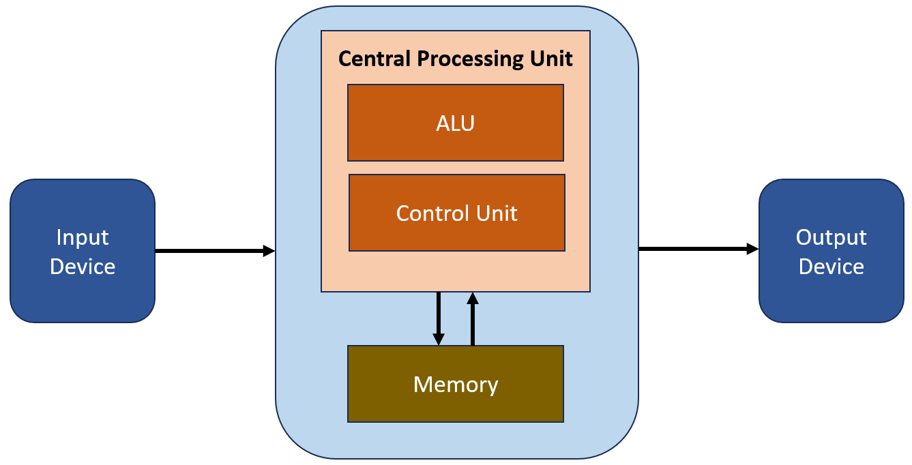
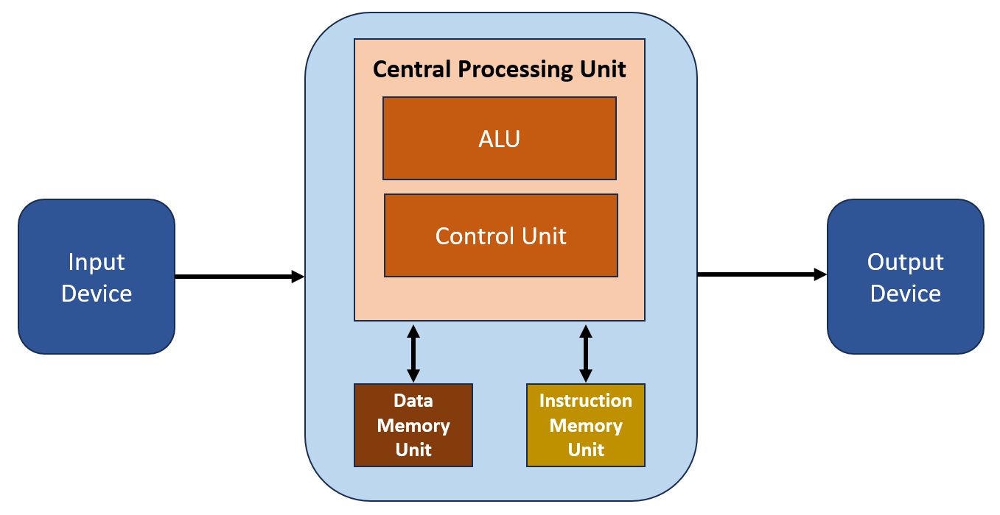
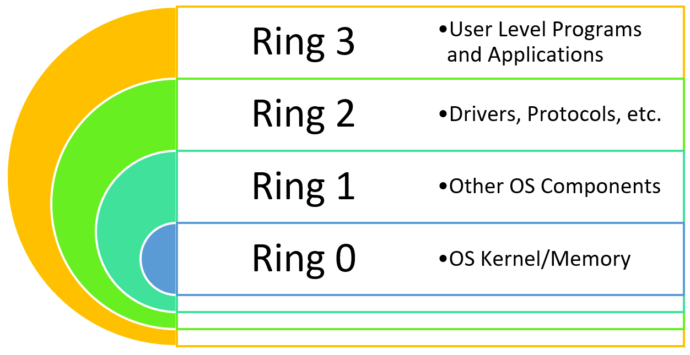

- Les systèmes informatiques modernes reposent sur plusieurs **modèles architecturaux** qui définissent notamment :
    - organisation CPU / mémoire ;
    - circulation des données et instructions ;
    - jeu d’instructions ;
    - séparation des privilèges.
### Architecture de Von Neumann

- L'architecture de Von Neumann est un modèle d'architecture informatique qui établit les principes de conception de base des ordinateurs modernes.
- Ce modèle de base a jeté les fondations de la conception des ordinateurs modernes et est encore largement utilisé aujourd'hui.
- Modèle fondamental proposé en **1945**.
- Selon ce modèle, une architecture informatique de base se compose : 
    - d'une unité de traitement centrale (**CPU**) ;
    - d'une structure de mémoire qui collecte les données ;
    - périphériques d’entrée/sortie ;
    - bus permettant les communications.

```
Input / Output
      ↕
     CPU
      ↕
    Memory
```

#### CPU — Central Processing Unit

- Le CPU est l'unité de traitement centrale de l'architecture de Von Neumann et des systèmes informatiques.
- Lit les instructions depuis la mémoire.
- Les interprète et traite les données.
- Il comprend deux composants fondamentaux :

```
CPU
├─ ALU → Arithmetic Logic Unit
└─ CU  → Control Unit
```

- **ALU** → opérations arithmétiques et logiques.
- **CU** → contrôle et coordination de l’exécution.

{ width="600" }
#### Memory

- Dans l’architecture Von Neumann :
    - **instructions et données utilisent la même mémoire** ;
    - La mémoire sert à la fois pour les instructions et les données, permettant le stockage simultané des programmes et des données ;
    - le CPU lit et écrit dans cette mémoire.

```
Memory
├─ Instructions
└─ Data
```

- C’est la caractéristique principale à retenir pour la comparaison avec Harvard.
#### Instruction Set

- Ensemble des instructions que le processeur peut comprendre et exécuter.
- Ces instructions sont lues depuis la mémoire, interprétées et exécutées par le processeur.

Exemples conceptuels :

```
LOAD
STORE
ADD
SUB
JUMP
```

```
Memory → Fetch Instruction → Decode → Execute
```

#### Data Bus & Address Bus

- **Data Bus** → permet de transporter les données à l'intérieur de l'ordinateur.
- **Address Bus** → transporte les adresses, et les instructions, indiquant où lire/écrire en mémoire.

```
Data Bus    → quoi ?
Address Bus → où ?
```


{ width="600" }
#### Input / Output Devices

- Permettent au système de communiquer avec l’extérieur :
    - keyboard ;
    - mouse ;
    - monitor ;
    - printer ;
    - périphériques externes.
### Architecture Harvard

- L'architecture Harvard, tout comme l'architecture de Von Neumann, est un modèle qui définit l'architecture informatique de base.
- Bien qu'elle soit basée sur l'architecture de Von Neumann en termes de conception, elle propose quelques améliorations.
- L'architecture Harvard a favorisé le développement d'un modèle plus rapide et plus efficace grâce à ses améliorations par rapport à l'architecture de Von Neumann.
- La principale différence avec Von Neumann est la **séparation entre mémoire des instructions et mémoire des données**. Les grandes différences sont : 

{ width="600" }
#### Memory Management

- L'architecture Harvard propose une structure dans laquelle les données et les instructions sont stockées dans des mémoires physiques séparées.
- Elle facilite un accès rapide à diverses données grâce à deux mémoires distinctes : la mémoire de données et la mémoire d'instructions.

```
Von Neumann
→ Instructions + Data = même mémoire

Harvard
→ Instruction Memory ≠ Data Memory
```

→ chaque type peut avoir son propre chemin d’accès.
#### Speed et Performance

- Les différentes structures de mémoire proposées dans le cadre de l'architecture Harvard permettent de traiter simultanément les instructions et les données, ce qui augmente la vitesse du processeur.
- Cette séparation permet :
    - accès simultané aux instructions et aux données ;
    - réduction de certains conflits d’accès mémoire ;
    - meilleures performances dans certains systèmes.

> Complément : beaucoup de processeurs modernes utilisent une **Modified Harvard Architecture** : espace mémoire globalement unifié, mais caches séparés pour instructions et données (`I-Cache` / `D-Cache`).

#### Parallel Processing

- L'architecture Harvard propose des chemins et des unités de traitement séparés pour les instructions et les données.
- Cela facilite le traitement parallèle et permet au processeur de fonctionner plus rapidement.
#### Von Neumann vs Harvard

|                           | Von Neumann            | Harvard                             |
| ------------------------- | ---------------------- | ----------------------------------- |
| Mémoire instructions/data | Commune                | Séparée                             |
| Bus / chemins             | Souvent partagés       | Séparés                             |
| Accès simultané           | Plus limité            | Plus facile                         |
| Complexité                | Plus simple            | Plus complexe                       |
| Performance potentielle   | Limitée par le partage | Plus élevée dans certains workloads |


```
Von Neumann → shared instructions/data path
Harvard     → separate instructions/data paths
```

### Instruction Set Architecture — ISA

- Une **ISA** définit définit les instructions des systèmes informatiques, leur fonctionnalité et leur mode de fonctionnement
- Elle détermine l'interaction entre le processeur (CPU) et le logiciel :
    - instructions disponibles ;
    - registres ;
    - types de données ;
    - modes d’adressage ;
    - comportement des instructions.

```
Software
   ↓
  ISA
   ↓
CPU Hardware
```

> L’ISA n’est pas une alternative à Von Neumann ou Harvard : elle décrit surtout **ce que le processeur expose au logiciel**. C'est une approche architecturale qui modélise le traitement des jeux d'instructions au sein des architectures basées sur elles.

- Deux grandes familles classiques :

```
ISA
├─ CISC
└─ RISC
```

#### CISC — Complex Instruction Set Computer

- L'architecture CISC (Ordinateur à jeu d'instructions complexe) Offre plus de généralité et de flexibilité dans le traitement d'une grande variété d'instructions.
- Architecture est utilisée dans les processeurs des ordinateurs modernes à usage général :
    - (**Intel x86**, etc.).
- Jeu d’instructions riche et complexe.
- Une instruction peut effectuer plusieurs opérations.
##### Caractéristiques

- Jeu d'instruction complexe : emploie un jeu d'instructions contenant un large éventail d'instructions complexes, qui englobent de multiples opérations et exécutent diverses tâches en une seule instruction.
- Utilisation réduite des registres : utilisent généralement moins de registres de processeur et certaines des instructions opèrent en mémoire. Cela peut entraîner des accès fréquents à la mémoire.
- Modes d'adressage complexes : peuvent avoir des modes d'adressage complexes, rendant l'accès à la mémoire plus flexible et complexe.
- Dépendances de haut niveau : peuvent être interdépendantes, nécessitant un traitement séquentiel des instructions. Cela peut parfois amener les processeurs à prendre plus de temps.
- Exemple conceptuel :

```
Instruction complexe
→ Load
→ Calculate
→ Store
```

#### RISC — Reduced Instruction Set Computer

- L'architecture RISC (Ordinateur à jeu d'instructions réduit) est particulièrement privilégiée pour les ordinateurs à haute performance et les appareils mobiles. Exemples :
    - **ARM** ;
    - **PowerPC**.
- Jeu d’instructions plus simple et généralement plus régulier.
- Les opérations utilisent fortement les **registers**.
##### Caractéristiques

- instructions simples : utilise un jeu d'instructions limité et simple. Chaque instruction est conçue pour effectuer une opération de base.
- davantage de registres : utilisent généralement plus de registres de processeur et opèrent les instructions sur ces registres. Cela réduit l'accès à la mémoire.
- modes d’adressage plus simples : ont des modes d'accès à la mémoire simples et directs, ce qui rend l'accès à la mémoire plus rapide et plus cohérent.
- moins de dépendances : ne dépendent généralement pas les unes des autres, et les processeurs peuvent traiter les instructions de manière plus indépendante.

```
RISC
→ simple instructions
→ register-oriented
→ predictable execution
```

#### CISC vs RISC

|CISC|RISC|
|---|---|
|Instructions plus complexes|Instructions plus simples|
|Nombreux modes d’adressage|Modes plus simples|
|Peut opérer directement en mémoire|Beaucoup d’opérations via registres|
|Exemple : x86-64|Exemple : ARM|

> Aujourd’hui, la frontière est moins stricte : les processeurs modernes combinent de nombreuses optimisations internes. Un CPU x86 peut par exemple traduire certaines instructions complexes en **micro-operations** plus simples.
### Architecture en anneaux - Protection Ring Architecture

- Les **Protection Rings** séparent le code selon son niveau de privilège.
- Plus le numéro est proche de `0`, plus les privilèges sont élevés.

{ width="600" }
#### Ring 0

- Niveau le plus privilégié.
- Généralement utilisé par :
    - kernel ;
    - composants noyau ;
    - drivers exécutés en kernel mode.
- Peut accéder directement à :
    - mémoire ;
    - CPU ;
    - périphériques ;
    - ressources système critiques.

```
Ring 0
→ Kernel Mode
→ Full privileges
```

- Une compromission en Ring 0 est donc particulièrement critique.
#### Rings 1 & 2

- Ils existent dans l’architecture x86 mais sont **rarement utilisés par les OS modernes généralistes**.
- Windows et Linux utilisent principalement :

```
Ring 0 → Kernel
Ring 3 → User applications
```

> ⚠️ Le cours inverse/confond ici certains rôles : **Ring 3 est bien un niveau de privilège matériel x86 et correspond normalement au user mode**. Les Rings 1 et 2 sont généralement inutilisés dans Windows/Linux modernes. Le passage indiquant que Ring 2 contient les applications et que Ring 3 « n’est pas réellement un anneau matériel » est donc incorrect.
#### Ring 3

- Niveau où s’exécutent généralement les **applications utilisateur**.
- Les programmes n’accèdent pas directement aux ressources privilégiées.

```
Application
   ↓
Ring 3
   ↓ System Call
Kernel
   ↓
Ring 0
```

- Pour effectuer une opération privilégiée, une application doit passer par les mécanismes contrôlés du système d’exploitation.
#### Intérêt sécurité des Rings

- La séparation des privilèges limite ce qu’un programme compromis peut faire.

```
Malware en Ring 3
→ accès limité

Privilege Escalation
→ Ring 0
→ contrôle beaucoup plus important du système
```

- Un processus utilisateur compromis **ne peut pas simplement accéder au kernel** : il doit exploiter une vulnérabilité, obtenir des privilèges supplémentaires ou utiliser une interface autorisée.


## À retenir

```
Von Neumann
→ Instructions + Data dans la même mémoire

Harvard
→ Instructions et Data séparées
```


```
ISA
→ interface CPU ↔ software

CISC → instructions plus complexes
RISC → instructions plus simples
```


```
Protection Rings

Ring 0 → Kernel / highest privilege
Ring 3 → User Mode / lowest privilege
```


Le point sécurité essentiel est la **séparation des privilèges** : une application utilisateur s’exécute normalement dans un contexte limité, tandis que le kernel dispose d’un accès beaucoup plus puissant au système.
