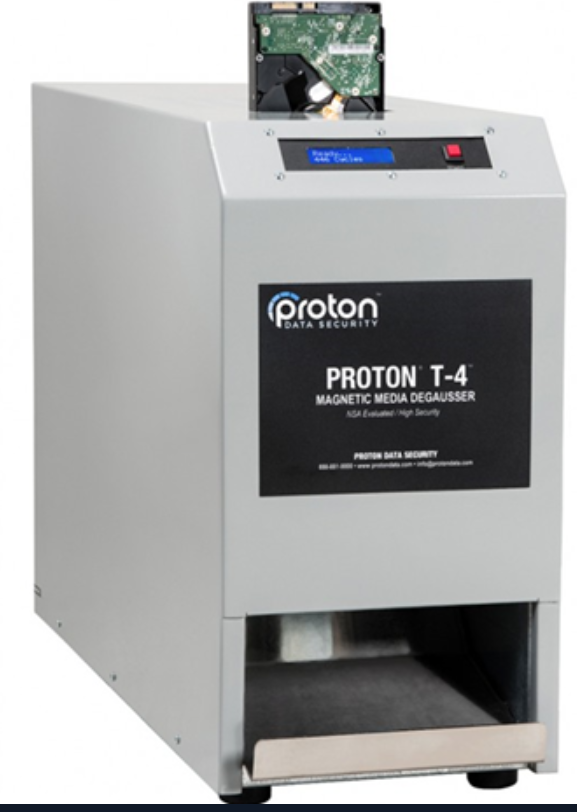
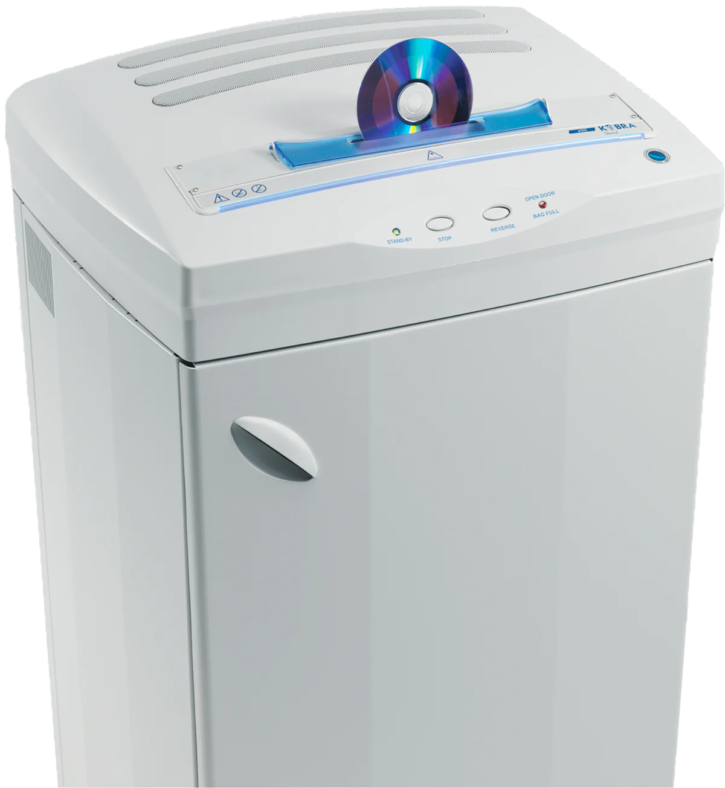

- Lorsqu'une donnée est supprimée, elle peut parfois rester partiellement ou totalement récupérable sur le support.
- Deux concepts sont donc importants :
	- Data Remanence -> persistance de données après suppression ;
	- Data Sanitization -> suppression sécurisée et permanente des données sensibles.

```
Delete ≠ Data Gone

Data Remanence
→ données encore récupérables

Data Sanitization
→ rendre les données irrécupérables
```

## Mémoire volatile

- Les mémoires volatiles comme : 
	- RAM ;
	- Cache ;
- Perdent normalement leur contenu lorsque l'alimentation est coupée.
	- Cependant, il existe une attaque spécifique : **Cold boot Attack**
### Cold boot attack

- Exploite le fait que les données présentes en RAM ne disparaissent pas toujours instantanément après coupure d'alimentation.
- Le refroidissement de la mémoire peut ralentir la disparition des données et permettre leur extraction.
- Principe :

```
System running
→ sensitive data in RAM
→ RAM cooled
→ power removed / RAM moved
→ memory contents extracted
```


- Pendant l’exécution d’un système, certaines données sensibles peuvent être présentes temporairement en mémoire, parfois sous une forme directement exploitable :
	- clés cryptographiques ;
	- credentials ;
	- secrets applicatifs ;
	- données déchiffrées.

> ⚠️ Le cours simplifie en parlant de données « gelées » dans la RAM. Le refroidissement **ralentit la dégradation électrique des bits**, il ne fige pas littéralement les données.
#### Protections

- éteindre complètement les systèmes lorsqu’ils se trouvent dans un environnement physiquement non sécurisé ;
- utiliser des protections mémoire adaptées sur les systèmes critiques.

Compléments utiles :

- full shutdown plutôt que sleep ;
- Secure Boot ;
- full-disk encryption ;
- limitation de l’accès physique ;
- memory encryption lorsque le hardware le supporte.

> Le chiffrement de disque ne protège pas forcément les clés déjà chargées dans la RAM lorsque le système fonctionne.
## Mémoire non volatile

- Les HDD, SSD, Flash, EEPROM, EFROM, ROM... peuvent conserver des données sans alimentation.
- Pour les assainir :
	- Clear / Delete ;
	- Overwrite ;
	- Degauss ;
	- Destroy.
### Suppression / Reformatage

- Une suppression classique ou un formatage peut simplement retirer les références logiques aux données.
- Les données peuvent donc rester récupérables avec des outils spécialisés.
### Overwriting - Réécriture

- Consiste à écraser les données avec : 
	- 0 ;
	- 1 ;
	- valeurs aléatoires.
- Le cours cite des outils comme :
	- BitRaser ;
	- BitWiper ;
	- CCleaner ;
	- DBAN.

> ⚠️ L’overwriting fonctionne bien sur les **HDD**, mais est moins fiable sur les **SSD/Flash** à cause du wear leveling et des blocs remappés. Pour ces supports, il vaut mieux utiliser les commandes de **secure erase / sanitize** prévues par le constructeur ou le standard du périphérique.
### Degaussing - Démagnétisation

- Détruit ou neutralise les données en perturbant le champ magnétique du support.
- Adapté aux supports magnétiques comme :
	- HDD ;
	- Bandes magnétiques.
- Avantages :
	- très efficace ;
	- utile même lorsqu’un disque n’est plus accessible logiciellement.
- Inconvénient :
	- le support peut devenir inutilisable.

> Le degaussing **ne fonctionne pas sur SSD/Flash**, car ces supports ne stockent pas les données magnétiquement.
{ width="300" }
## Destruction physique

- Pour les données très sensibles ou lorsque le support est inutilisable, la destruction physique peut être nécessaire.
- Cas typiques :
	- disque défectueux ;
	- secure erase impossible ;
	- support destiné à ne jamais être réutilisé ;
	- données de très haute sensibilité.
- Supports concernés :
	- - HDD ;
	- SSD ;
	- Flash ;
	- ROM ;
	- EPROM / EEPROM ;
	- supports optiques.

{ width="300" }
### ROM / EPROM / EEPROM

- **ROM** → données souvent fixes ou difficilement modifiables.
- **EPROM** → peut être effacée avec un mécanisme spécifique, historiquement UV.
- **EEPROM** → peut être effacée/reprogrammée électriquement.

Le cours souligne que, pour certains supports où l’effacement fiable est difficile ou impossible, la **destruction physique** reste la méthode la plus sûre.
## Supports optiques

- Les CD/DVD et autres supports optiques ont des capacités d'effacement limitées selon leur type.
- Pour des données critiques, la destruction physique est souvent privilégiée. 

{ width="300" }
## NIST & Sanitization
Pour choisir une méthode d’assainissement, il faut tenir compte :

- du type de support ;
- de la sensibilité des données ;
- de la possibilité de réutiliser le support ;
- des exigences réglementaires.

Une classification utile est :

```
Clear
→ suppression logique / overwrite adapté

Purge
→ méthode plus forte : secure erase, degauss, crypto erase...

Destroy
→ destruction physique du support
```

> Cette classification est notamment utilisée dans les bonnes pratiques **NIST SP 800-88**.
## Crypto Erase
Complément particulièrement utile pour SSD et stockage chiffré :

- si toutes les données sont chiffrées avec une clé forte ;
- détruire la clé peut rendre les données restantes inutilisables.

```
Encrypted Data
+
Destroy Encryption Key
→ Crypto Erase
```

→ très rapide, à condition que le chiffrement et la gestion des clés soient correctement implémentés.
## Papier
{ width="400" }

## Comparaison des méthodes

|Méthode|HDD|SSD / Flash|Réutilisable ?|
|---|---|---|---|
|Delete / Format|⚠️ insuffisant|⚠️ insuffisant|Oui|
|Overwrite|Oui|Pas toujours fiable|Oui|
|Secure Erase / Sanitize|Oui|Oui|Oui|
|Degaussing|Oui|Non|Souvent non|
|Crypto Erase|Si chiffré|Si chiffré|Oui|
|Physical Destruction|Oui|Oui|Non|
