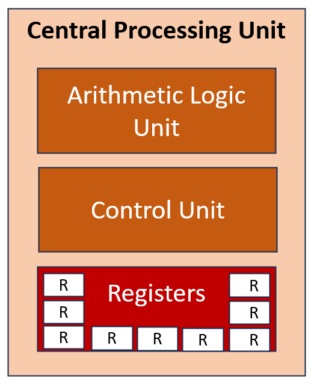
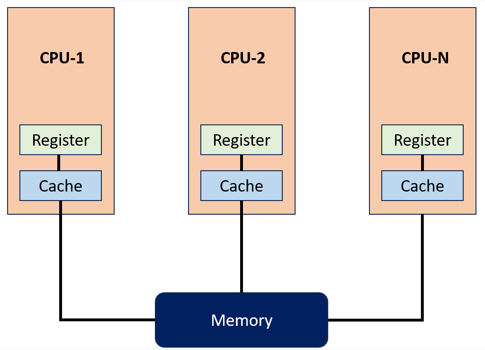

## Microprocesseur / CPU et structure— Central Processing Unit

- Le **CPU** est l’unité centrale chargée d’exécuter directement les calculs complexes qui permettent aux systèmes informatiques d'accomplir les tâches pour lesquelles ils sont prévus.
- Bien que les CPU soient des structures assez complexes, 3 composants forment leur structure de base :
    - **ALU** ;
    - Unité de contrôle / **Control Unit (CU)** ;
    - Registres / **Registers**.

```
CPU
├─ ALU
├─ Control Unit
└─ Registers
```


{ width="300" }

> ⚠️ Un **CPU** et un **microprocesseur** sont souvent assimilés dans les PC modernes, mais ce ne sont pas strictement des synonymes : un microprocesseur est une implémentation du CPU sur un circuit intégré.
### ALU — Arithmetic Logic Unit / Unité Arithmétique et Logique

- Sous-système d'un processeur qui effectue les opérations mathématiques et logiques de base.
- L'élément de base de tous les processeurs, de ceux qui effectuent les opérations les plus simples aux systèmes informatiques les plus complexes.
- L'ALU se compose de deux parties principales :
	- **Arithmetic Unit** - Unité arithmétique : Effectue des opérations arithmétiques telles que l'addition, la soustraction, la multiplication et la division.
	- **Logic Unit** - : Effectue des opérations logiques comme : AND, OR, NOT, XOR

→ l’ALU constitue une partie essentielle de l’exécution des instructions.
### CU - Control Unit / Unité de Contrôle

- La CU récupère les instructions de la mémoire, les envoie à l'ALU et retransmet les résultats à la mémoire pendant le fonctionnement du processeur.
- En résumé, elle agit comme un pont entre le CPU et la mémoire.

```
Fetch
→ Decode
→ Execute
```

- Responsabilités principales :
	- `Lecture et interprétation des instructions` :  La CU reçoit les instructions de la mémoire et les interprète. Cela implique de déterminer la fonction de l'instruction.
	- `Exécution des instructions :` La CU envoie les instructions à l'ALU. L'ALU les exécute et renvoie les résultats à la CU.
	- `Ordonnancement des instructions :` La CU met les instructions en ordre. Cela garantit qu'elles sont exécutées dans le bon ordre.
	- `Interruption des instructions :` La CU peut interrompre les instructions. Cela permet au CPU d'exécuter une autre tâche.

> La CU ne « renvoie » pas systématiquement elle-même chaque résultat en mémoire : elle **contrôle et coordonne** les unités qui réalisent les opérations.
### Registers — Registres

- Petites zones de mémoire **très rapides**, directement intégrées au CPU.
- Ils contiennent les données et les adresses que le CPU utilise pour exécuter les instructions.
- Utilisées pour conserver temporairement :
    - données ;
    - adresses ;
    - résultats intermédiaires ;
    - informations nécessaires à l’exécution.

```
Registers
→ très petits
→ très rapides
→ directement accessibles par le CPU
```

- Ils réduisent le nombre d’accès nécessaires à la RAM.
- Exemples courants de registres selon l’architecture :
	- registres généraux ;
	- **Program Counter / Instruction Pointer** ;
	- **Stack Pointer** ;
	- registres de flags/status.

> ⚠️ Dire qu’un CPU 32 bits possède uniquement des registres de 32 bits est une simplification. La taille des registres dépend de l’ISA et du type de registre.
## Types d’Exécution du CPU
Les systèmes peuvent organiser l’exécution des tâches de plusieurs manières :

```
Multiprocessing
Multitasking
Multiprogramming
Multithreading
```

### Multiprocessing — Multitraitement
{ width="500" }

- Utilisation de **plusieurs processeurs ou plusieurs unités de traitement** (coeurs) pour exécuter plusieurs travaux.
- Permet une véritable exécution parallèle si plusieurs CPU/cores sont disponibles.

```
CPU/Core 1 → Task A
CPU/Core 2 → Task B
CPU/Core 3 → Task C
```

- Avantages :
	- parallélisme ;
	- meilleures performances ;
	- meilleure capacité à traiter plusieurs workloads simultanément.
- Aujourd’hui, les processeurs multicœurs rendent ce modèle très courant.
- en pratique moderne, le terme _multiprocessing_ peut aussi désigner l'utilisation de **plusieurs unités d'exécution CPU**, donc plusieurs cœurs. Il faut distinguer trois niveaux :

|Terme|Exemple|Physiquement|
|---|---|---|
|**CPU / socket**|2 × AMD EPYC|2 processeurs physiques|
|**Core / cœur**|8 cœurs par CPU|plusieurs cœurs dans un même processeur|
|**Thread logique**|SMT / Hyper-Threading|plusieurs CPU logiques par cœur|

- Cas 1 — plusieurs processeurs physiques : Historiquement, le multiprocessing ressemblait surtout à ça :
	- Deux processeurs physiques travaillent en parallèle. C'est ce qu'on appelle typiquement un système **multiprocesseur**, souvent avec une architecture **SMP** (_Symmetric Multiprocessing_).

```
Carte mère
 ├── CPU 1
 │    └── Core
 └── CPU 2
      └── Core
```

- Cas 2 — un seul CPU avec plusieurs cœurs : Aujourd'hui, beaucoup de machines sont plutôt :
	- Il n'y a qu'**un seul processeur physique**, mais quatre cœurs capables d'exécuter du travail en parallèle.
	- Du point de vue du système d'exploitation, cela permet quand même du **multiprocessing parallèle**.
	- C'est pourquoi l'expression « plusieurs processeurs » est un peu ambiguë.

```
CPU physique
 ├── Core 0
 ├── Core 1
 ├── Core 2
 └── Core 3
```

- Et avec **Hyper-Threading** / **SMT**. Ça peut encore se compliquer :

```
1 CPU physique
│
├── Core 0
│   ├── Thread logique 0
│   └── Thread logique 1
│
├── Core 1
│   ├── Thread logique 2
│   └── Thread logique 3
│
├── Core 2
│   ├── Thread logique 4
│   └── Thread logique 5
│
└── Core 3
    ├── Thread logique 6
    └── Thread logique 7
```

- Donc la machine peut avoir :
	- **1 socket CPU**
	- **4 cœurs physiques**
	- **2 threads par cœur**
	- donc **8 CPU logiques**
### Multitasking — Multitâche

- Capacité d’un OS à faire progresser **plusieurs tâches/processus** de façon concurrente.
- Chaque processus possède généralement son propre :
	- espace mémoire virtuel ;
	- contexte d’exécution ;
	- ressources.
		- ce qui entraîne une augmentation des besoins en mémoire.
- Exemple :

```
Word
Excel
Browser
Media Player
```

- Sur un seul cœur :

```
Task A
→ Task B
→ Task C
→ Task A
```

- Le scheduler attribue de courts intervalles de CPU à chaque tâche, créant l’impression de simultanéité.

> ⚠️ Le multitasking n’est pas limité à **un seul cœur**. Sur un système multicœur, plusieurs tâches peuvent aussi être exécutées réellement en parallèle.
### Multiprogramming — Multiprogrammation

- Technique consistant à conserver **plusieurs programmes en mémoire** afin que le CPU puisse en exécuter un autre lorsqu’un programme attend une ressource, notamment une opération I/O.
- Exemple :

```
Program A → attend le disque
              ↓
CPU exécute Program B
```

- Objectif principal :

```
Garder le CPU occupé
→ améliorer l'utilisation des ressources
```

- Historiquement très utilisée dans les systèmes mainframe et batch.

> ⚠️ La différence avec le multitasking n’est pas simplement « mainframe vs PC » ou « application spécifique vs OS courant ». Le **multiprogramming** vise surtout à maximiser l’utilisation du CPU, tandis que le **multitasking** ajoute généralement une logique de partage du temps et de réactivité pour plusieurs tâches.
### Multithreading
{ width="500" }

- Le multithreading, au-delà de l'exécution parallèle de multiples processus ou tâches, est le concept d'exécuter en parallèle plusieurs opérations au sein d'une même tâche.
- Un **processus** peut contenir plusieurs **threads**.
- Les threads représentent différents flux d’exécution au sein de la même application.

```
Process
├─ Thread 1
├─ Thread 2
└─ Thread 3
```

- Exemple avec un traitement de texte :

```
Thread 1 → saisie utilisateur
Thread 2 → spell checking
Thread 3 → autosave
```

- Les threads d’un même processus partagent généralement :
	- espace mémoire ;
	- code ;
	- certaines ressources.
- Mais disposent notamment de leur propre :
	- stack ;
	- état d’exécution ;
	- registres CPU lorsqu’ils sont planifiés.

> ⚠️ Le multithreading permet la **concurrence** ; il devient réellement parallèle lorsque plusieurs threads sont exécutés simultanément sur plusieurs cores.
## Process vs Thread

|Process|Thread|
|---|---|
|Instance d’un programme|Flux d’exécution dans un processus|
|Espace mémoire généralement isolé|Partage la mémoire du processus|
|Plus lourd à créer|Plus léger|
|Communication plus contrôlée|Partage de données plus direct|

```
Process
→ container de ressources

Thread
→ unité d'exécution
```

## Multitasking vs Multiprocessing vs Multithreading

| Concept              | Principe                                                         |
| -------------------- | ---------------------------------------------------------------- |
| **Multitasking**     | Plusieurs tâches progressent dans le temps                       |
| **Multiprocessing**  | Plusieurs CPU/cores exécutent plusieurs travaux                  |
| **Multiprogramming** | Plusieurs programmes en mémoire pour maximiser l’utilisation CPU |
| **Multithreading**   | Plusieurs flux d’exécution dans un même processus                |

```
Multitasking
→ plusieurs tâches

Multiprocessing
→ plusieurs unités de calcul

Multithreading
→ plusieurs threads dans un process
```

## À retenir

```
CPU
├─ ALU → calculs / logique
├─ CU  → coordination de l'exécution
└─ Registers → stockage ultra-rapide
```


```
Fetch
→ Decode
→ Execute
```


```
Multiprocessing → parallélisme entre CPU/cores
Multitasking    → plusieurs tâches concurrentes
Multiprogramming → maintenir le CPU occupé
Multithreading  → plusieurs threads dans un processus
```


Le point important est de distinguer **concurrence** et **parallélisme** : plusieurs tâches peuvent progresser de façon concurrente sans forcément être exécutées exactement au même instant.
