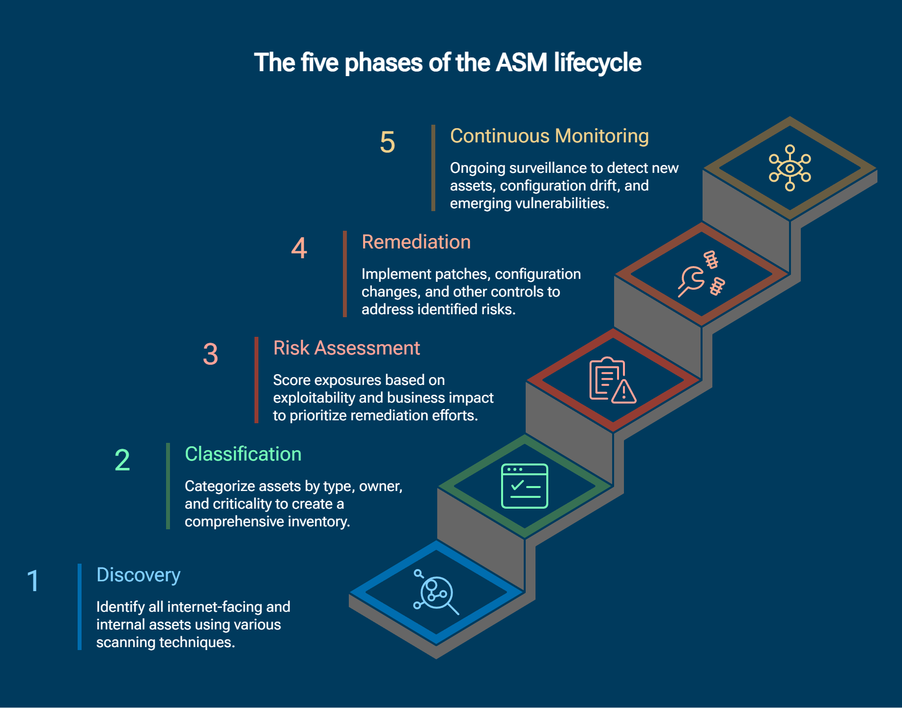

- **ASM — Attack Surface Management** consiste à identifier, évaluer, réduire et surveiller en continu les éléments exposés pouvant être exploités par un attaquant.
- Le processus varie selon l’organisation, mais repose généralement sur plusieurs étapes principales.
- La surface d’attaque est la somme de tous les points qu’un attaquant est susceptible d’exploiter pour accéder aux systèmes et données d’une entreprise. Elle englobe :
	- Les applications : toute application logicielle accessible en dehors de l’entreprise (applis web, applis mobiles, API, etc.).
	- Les sites web : tous les sites web hébergés par l’entreprise, y compris les sites publics, internes et d’e-commerce.
	- Les réseaux : tout réseau que l’entreprise utilise pour connecter ses équipements et systèmes, y compris Internet, les réseaux cloud et les réseaux privés.
	- Les équipements : tout équipement connecté aux réseaux de l’entreprise (ordinateurs portables, smartphones, serveurs, IoT, etc.).
	- L’infrastructure cloud : toute infrastructure cloud qu’utilise l’entreprise, y compris les clouds privés, publics et hybrides.

{ width="500" }
## Types / périmètres de surfaces d’attaque

- L’ASM peut couvrir plusieurs **périmètres d’exposition**, selon les types d’assets observés et leur position dans l’environnement.
- L’objectif reste le même :

```
Discover
→ Understand Exposure
→ Assess Risk
→ Reduce Attack Surface
```


| Type                                                                     | Définition                                                                                        | Assets / éléments concernés                                                                                                                                                                 |
| ------------------------------------------------------------------------ | ------------------------------------------------------------------------------------------------- | ------------------------------------------------------------------------------------------------------------------------------------------------------------------------------------------- |
| ASM Externe -          **EASM — External Attack Surface Management**     | Gestion de la surface visible depuis Internet                                                     | Inclut les sites web, l’infrastructure cloud publique et les comptes de réseaux sociaux. Domaines, sous-domaines, IP publiques, websites, APIs, services exposés, cloud public, certificats |
| ASM Interne -            **IASM — Internal Attack Surface Management**   | Gestion de la surface d’attaque des ressources internes                                           | Inclut les équipements, les applications et les réseaux internes. Endpoints, serveurs, Active Directory, applications internes, VLAN, services et ports internes                            |
| ASM des assets cyber - **CAASM — Cyber Asset Attack Surface Management** | Consolidation et corrélation des informations sur les cyber-assets afin d’obtenir une vue unifiée | Inclut les logiciels, les données et la propriété intellectuelle. Endpoints, servers, cloud assets, identities, security tools, vulnerability data                                          |
| **OSASM : Open-Source / Software Supply Chain**                          | Gestion des risques provenant des composants logiciels tiers et open source                       | libraries, frameworks, packages, dependencies, containers                                                                                                                                   |
### EASM — External Attack Surface Management

- Se concentre sur **ce qu’un attaquant externe peut découvrir depuis Internet**.

```
Internet
→ Domains
→ IPs
→ Services
→ Applications
→ Cloud Resources
```


Exemples :

- domaine oublié ;
- sous-domaine exposé ;
- VPN gateway ;
- RDP/SSH accessible ;
- API publique ;
- bucket cloud mal configuré ;
- certificat révélant un hostname ;
- application Shadow IT.
#### Objectif

```
What can an external attacker see?
```

→ identifier et réduire les expositions accessibles **sans accès préalable au réseau interne**.
### IASM — Internal Attack Surface Management

- Se concentre sur les actifs et chemins d’attaque présents **à l’intérieur de l’organisation**.

Exemples :

```
Endpoints
Servers
Active Directory
Internal Applications
Network Segments
Databases
Internal Services
```


L’IASM cherche notamment à identifier :

- systèmes vulnérables ;
- ports/services inutiles ;
- mauvaises configurations ;
- privilèges excessifs ;
- segmentation insuffisante ;
- chemins de lateral movement.

```
Initial Compromise
→ Internal Exposure
→ Lateral Movement
→ Critical Asset
```


> EASM regarde principalement **l’exposition avant compromission**, tandis que l’IASM aide aussi à comprendre ce qu’un attaquant pourrait atteindre **après avoir obtenu un premier accès**.
### CAASM — Cyber Asset Attack Surface Management

- **CAASM** vise surtout à obtenir une **vue centralisée et cohérente des cyber-assets** en agrégeant les informations provenant de plusieurs outils.

```
EDR
Vulnerability Scanner
CMDB
Cloud
IAM
Network Tools
      ↓
    CAASM
      ↓
Unified Asset View
```


Il permet notamment de répondre à :

```
What assets exist?
Who owns them?
Are they managed?
Are they vulnerable?
Which security controls cover them?
```

#### Intérêt

- détecter les assets inconnus ;
- identifier les gaps de couverture ;
- corréler asset + vulnerability + identity + security controls ;
- améliorer la qualité de l’inventaire.

> ⚠️ **CAASM n’est pas vraiment une “surface d’attaque” distincte au même titre que EASM/IASM**. C’est plutôt une capacité/approche d’ASM centrée sur la **visibilité et la consolidation des assets**.
### Open Source & Software Supply Chain

- `OSASM` correspond davantage à la gestion de la surface d’attaque introduite par les **composants logiciels tiers et open source**.

Exemples :

```
Application
├─ Library A
├─ Framework B
├─ Package C
└─ Container Image
```


Risques :

- dépendance vulnérable ;
- package obsolète ;
- dependency confusion ;
- package malveillant ;
- composant abandonné ;
- vulnérabilité transitive.

Les mécanismes les plus utilisés sont plutôt :

```
SCA
→ Software Composition Analysis

SBOM
→ Software Bill of Materials
```

#### SCA

- détecte les dépendances utilisées ;
- identifie les versions ;
- compare avec les CVE connues ;
- signale les composants vulnérables.
#### SBOM

- fournit l’inventaire des composants constituant un logiciel.

```
Application
→ SBOM
→ Components / Versions / Dependencies
```

### Vue globale

```
Attack Surface Management
│
├─ EASM
│  → exposition externe / Internet
│
├─ IASM
│  → exposition interne
│
├─ CAASM
│  → visibilité et corrélation des cyber-assets
│
└─ Software Supply Chain
   → dependencies / open source / third-party code
```


La distinction utile à retenir est donc :

```
EASM
→ What can attackers see from outside?

IASM
→ What can attackers reach inside?

CAASM
→ What cyber-assets do we actually have and how are they covered?

SCA / SBOM
→ What third-party components are inside our software?
```

## Les 5 étapes d’une stratégie de Gestion de la Surface d’Attaque — ASM

- Le cycle peut être résumé en **5 étapes fondamentales** :

```
1. Discovery & Mapping
        ↓
2. Classification & Risk Assessment
        ↓
3. Prioritization
        ↓
4. Remediation
        ↓
5. Continuous Monitoring
        ↺
```


> L’ASM est un **cycle continu** : la surveillance peut révéler de nouveaux actifs ou risques, ce qui relance le processus depuis la découverte.
### 1. Découverte & cartographie des actifs — Discovery & Mapping

- Identifier **tout ce qui constitue la surface d’attaque** de l’organisation.
- Nous devons d'abord savoir ce qu'il faut protéger du point de vue de la cybersécurité.
- Nous dressons une liste de tous les actifs (serveurs, équipements réseau, applications, bases de données, appareils IoT, etc.) lors de l'étape de découverte des actifs.
- Inclure les actifs :
    - internes ;
    - Internet-facing ;
    - cloud ;
    - SaaS ;
    - applications ;
    - APIs ;
    - serveurs ;
    - endpoints ;
    - network devices ;
    - domaines / sous-domaines ;
    - IoT ;
    - services exposés.

```
Asset Discovery
→ What do we own?
→ What is exposed?
→ What did we not know existed?
```


- L’objectif est d’obtenir un **inventaire aussi complet que possible** et de cartographier :
    - actifs ;
    - services ;
    - dépendances ;
    - points d’exposition.
#### Shadow IT

- La découverte doit également identifier les actifs :
    - inconnus ;
    - oubliés ;
    - non gérés ;
    - créés sans validation IT.

```
Unknown Asset
→ Unmanaged
→ Unpatched
→ Potential Entry Point
```

> Un actif que l’équipe sécurité ne connaît pas ne peut pas être correctement protégé.
### 2. Classification & Évaluation du risque — Classification & Risk Assessment

- Une fois les actifs découverts, ils doivent être **classifiés et analysés**.
- La classification permet de déterminer :
    - propriétaire ;
    - fonction ;
    - criticité métier ;
    - sensibilité des données ;
    - exposition réseau.

```
Asset
→ Owner
→ Business Function
→ Criticality
→ Exposure
```


Ensuite, analyser les risques associés :

- CVE ;
- software versions ;
- mauvaises configurations ;
- ports/services exposés ;
- credentials faibles ;
- permissions excessives ;
- technologies EOL/EOS ;
- absence de protections ;
- chemins d’attaque potentiels.
#### Évaluation contextuelle

- Une vulnérabilité ne doit pas être évaluée uniquement avec son score CVSS.

Il faut également considérer :

```
Risk
≈ Vulnerability
+ Exploitability
+ Exposure
+ Business Impact
+ Asset Criticality
```


Exemple :

```
CVSS 9.8
+
Internet-facing
+
Known Exploit
+
Critical Server
→ Very High Priority Risk
```

> **Vulnerability ≠ Risk** : le risque dépend aussi du contexte dans lequel la vulnérabilité existe.
### 3. Priorisation — Prioritization

- Tous les risques ne peuvent pas forcément être corrigés immédiatement.
- Il faut déterminer **ce qui doit être traité en premier**.

Critères importants :

- severity ;
- exploitability ;
- active exploitation ;
- exploit public ;
- Internet exposure ;
- business criticality ;
- données accessibles ;
- impact potentiel ;
- présence de compensating controls.

```
Detected Risks
→ Context
→ Ranking
→ Remediation Priority
```

#### Objectif

- Concentrer les ressources sur les risques les plus importants :

```
Critical + Exploitable + Exposed
→ Fix First
```

plutôt que :

```
High CVSS only
→ Automatically Fix First
```

> Une vulnérabilité moyenne sur un serveur directement exposé à Internet peut être plus urgente qu’une vulnérabilité critique sur un système isolé.
### 4. Remédiation — Remediation

- Corriger ou réduire les risques identifiés et priorisés.

Les actions peuvent inclure :

- patcher ;
- reconfigurer ;
- mettre à jour ;
- fermer un port ;
- désactiver un service ;
- supprimer une application ;
- réduire des permissions ;
- segmenter un système ;
- révoquer des credentials ;
- appliquer un compensating control ;
- retirer complètement un actif.

```
Risk Identified
→ Fix / Mitigate / Remove
→ Exposure ↓
```

#### Réduction de la surface d’attaque

- La remédiation ne consiste pas uniquement à patcher.

Exemple :

```
Unused Service
→ Disable

Unused Port
→ Close

Unused Application
→ Remove

Obsolete Server
→ Decommission
```

→ moins de composants exposés = moins de possibilités d’attaque.
#### Ownership

- Identifier clairement :
    - propriétaire de l’actif ;
    - équipe responsable ;
    - action à réaliser ;
    - délai de remédiation.

```
Finding
→ Owner
→ Action
→ Deadline
→ Verification
```

### 5. Surveillance continue — Continuous Monitoring

- La surface d’attaque change constamment.
- Il faut donc surveiller en continu :
    - nouveaux actifs ;
    - nouveaux services ;
    - nouvelles vulnérabilités ;
    - configuration drift ;
    - changements DNS ;
    - nouvelles expositions Internet ;
    - nouveaux cloud resources ;
    - changements de permissions.

```
Environment Changes
→ Detect
→ Reassess
→ Reprioritize
→ Remediate
```

#### Configuration Drift

- Un système correctement sécurisé aujourd’hui peut devenir vulnérable après :
    - changement de configuration ;
    - nouvelle application ;
    - ouverture de port ;
    - ajout d’un compte ;
    - changement d’architecture.

```
Secure Baseline
→ Change
→ Drift
→ New Exposure
```

#### Après remédiation

- Il faut également vérifier que la correction est réellement efficace :

```
Remediation
→ Rescan
→ Validate
→ Risk Reduced?
```


Puis le cycle recommence :

```
Continuous Monitoring
        ↓
New Asset / New Risk
        ↓
Discovery
        ↓
Assessment
        ↓
Prioritization
        ↓
Remediation
        ↺
```

### Automatisation — élément transversal

- L’automatisation intervient dans l’ensemble du cycle.

```
Discovery
Assessment
Prioritization
Remediation
Monitoring
      ↑
  Automation
```


Elle peut automatiser :

- asset discovery ;
- vulnerability scanning ;
- exposure detection ;
- risk scoring ;
- alerting ;
- ticket creation ;
- rescan après correction ;
- reporting.
### Résumé

```
1. Discovery & Mapping
→ Qu'est-ce que nous possédons et qu'est-ce qui est exposé ?

2. Classification & Risk Assessment
→ Quelles faiblesses existent et quel risque représentent-elles ?

3. Prioritization
→ Que devons-nous traiter en premier ?

4. Remediation
→ Comment supprimons-nous ou réduisons-nous le risque ?

5. Continuous Monitoring
→ Qu'est-ce qui a changé et quels nouveaux risques apparaissent ?
```

## Pourquoi l'ASM est important ?

- Lors de la phase de **Reconnaissance** de la Cyber Kill Chain, l’attaquant cherche à identifier :
    - systèmes exposés ;
    - services ;
    - technologies ;
    - vulnérabilités ;
    - points d’entrée potentiels.

```
Attacker Recon
→ Discover Attack Surface
→ Identify Weakness
→ Select Target
```

- Plus la surface exposée est grande, plus il existe de possibilités d’attaque.

```
Attack Surface ↑
→ Opportunities for Attack ↑
→ Cyber Risk ↑
```

> L’objectif de l’ASM est donc aussi de **voir son environnement comme un attaquant pourrait le voir**, notamment pour les actifs exposés publiquement.
## Avantages de l'ASM
### Réduction du risque de cyberattaque

- Identifier les vulnérabilités et situations à risque avant qu’un attaquant ne les exploite.
- Réduire les points d’entrée inutiles.
- Améliorer la visibilité sur les actifs.

```
Find Weakness First
→ Remediate
→ Attacker Opportunity ↓
```

### Réduction des pertes de données et financières

- Une meilleure visibilité et une réduction des faiblesses peuvent limiter :
    - data breaches ;
    - interruption de services ;
    - pertes financières ;
    - coûts de remediation.
### Protection de la réputation

- Une cyberattaque peut affecter :
    - confiance des clients ;
    - réputation ;
    - relations commerciales ;
    - revenus à long terme.
### Confiance des clients et partenaires

- Une organisation capable de démontrer une gestion rigoureuse de sa surface d’attaque renforce la confiance de ses :
    - clients ;
    - fournisseurs ;
    - partenaires.
## Outils et techniques ASM
### Analyse des systèmes et applications

- Scanner l’ensemble de l’environnement afin d’identifier :
    - assets ;
    - applications ;
    - vulnérabilités ;
    - situations à risque.
- Les scans peuvent être :
    - automatisés ;
    - manuels.
- L’objectif est de ne laisser **aucun segment ou endpoint hors périmètre**.

```
Asset Discovery
+
Vulnerability Scanning
→ Visibility
```

#### Asset Discovery Tools

- Détectent les systèmes, réseaux, applications et services existants.
#### Vulnerability Scanners

- Recherchent automatiquement :
    - CVE ;
    - configurations faibles ;
    - versions vulnérables ;
    - services exposés.

 **Asset Discovery ≠ Vulnerability Scanning**

 - Asset Discovery → _Qu’est-ce qui existe ?_
- Vulnerability Scanning → _Qu’est-ce qui est vulnérable ?_
### Réduction des actifs

- Vous devez identifier et arrêter les actifs au sein de votre organisation qui présentent des risques potentiels, tels que les ordinateurs, serveurs, logiciels ou services inutiles ou non utilisés.
- Cela, en plus de réduire la surface exposée aux cyberattaques, contribuera à diminuer les coûts de maintenance et de sécurité de l'organisation.
- Identifier les systèmes ou logiciels :
    - inutilisés ;
    - obsolètes ;
    - redondants ;
    - non nécessaires.

Puis :

```
Unused Asset
→ Decommission
→ Attack Surface ↓
```

-> Cela peut également réduire les coûts de maintenance et de sécurité.

### Désactivation des services inutiles

- Désactiver :
    - network services inutiles ;
    - ports ouverts sans justification ;
    - fonctions non utilisées.

```
Unused Service
→ Disable

Unused Port
→ Close
```

→ réduit les possibilités d’exploitation à distance.
### Désinstallation des applications inutiles

- Supprimer les applications :
    - inutilisées ;
    - non maintenues ;
    - obsolètes ;
    - non autorisées.

Une application non utilisée reste malgré tout :

```
Installed Software
→ Code
→ Vulnerabilities
→ Attack Surface
```

### Surveillance et évaluation continues

- Revoir régulièrement :
    - assets ;
    - services ;
    - applications ;
    - nouvelles vulnérabilités ;
    - bulletins de sécurité éditeurs.

```
Vendor Advisory
→ New Vulnerability
→ Affected Asset?
→ Prioritize Remediation
```

### Network Analysis & Discovery Tools

- Les outils d’analyse réseau permettent d’observer :
    - trafic ;
    - communications ;
    - anomalies ;
    - comportements suspects ;
    - mouvements d’un attaquant.

Ils complètent les scanners de vulnérabilités :

```
Vulnerability Scanner
→ Known Weaknesses

Network Monitoring
→ Suspicious Behavior
```

- C’est particulièrement important contre des menaces non encore connues, comme une éventuelle **Zero-Day**.

> Un système peut être totalement patché et pourtant être compromis via une vulnérabilité inconnue ou un comportement non prévu.
### Threat Intelligence

- Les outils de **Threat Intelligence** fournissent des informations sur :
    - threat actors ;
    - campagnes ;
    - nouvelles vulnérabilités ;
    - IoC ;
    - TTP ;
    - tendances d’attaque.

```
Global Threat Intelligence
+
Internal Telemetry
→ Better Detection Context
```

Exemples d’utilisation :

- IP connue comme malveillante ;
- domaine C2 ;
- hash malware ;
- vulnérabilité activement exploitée.
### Firewall & Security Tool Logs

- Les logs des firewalls et autres outils de sécurité donnent une visibilité sur :
    - connexions entrantes ;
    - connexions sortantes ;
    - flux bloqués ;
    - communications externes ;
    - tentatives de reconnaissance.

```
Internet
↕
Firewall Logs
↕
Internal Network
```

Ils peuvent aider à détecter :

- scans ;
- brute force ;
- communications C2 ;
- lateral movement ;
- exfiltration.
### Sensibilisation du personnel

- Les employés font eux aussi partie de la surface d’attaque.
- Les enquêtes et formations permettent d’évaluer et améliorer :
    - awareness ;
    - reconnaissance du phishing ;
    - bonnes pratiques ;
    - signalement des incidents.

```
Technology
+
Processes
+
People
→ Attack Surface Management
```

## Outils open-source

- OWASP AMASS
- Nuclei
- GreenBone Community Edition
