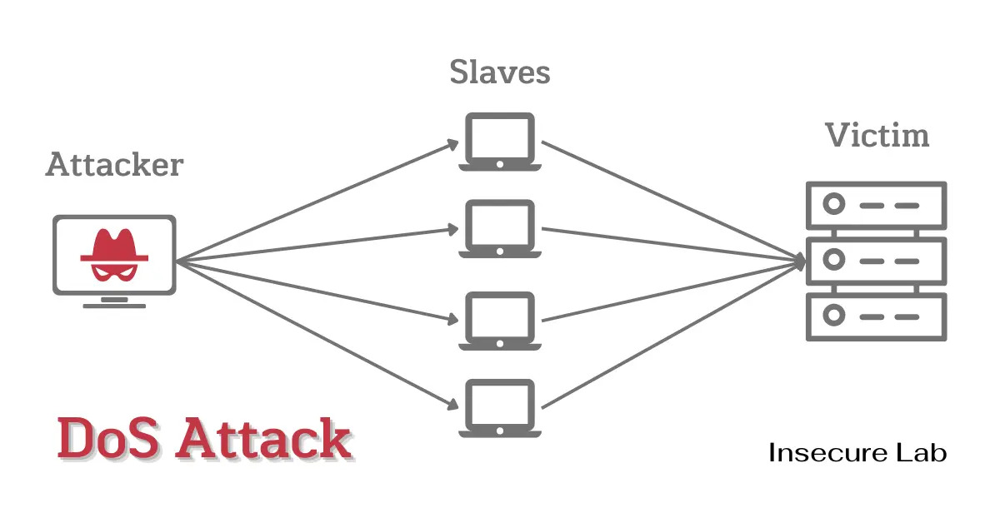
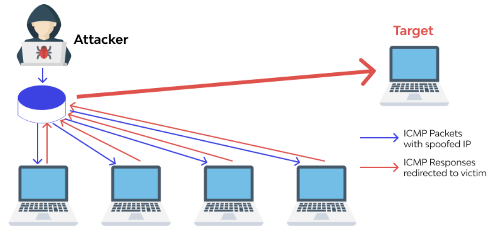

- Vise principalement la disponibilité, l'intégrité ou la confidentialité des communications. 
## Déni de Service - Denial of Service (DoS)
{ width="600" }

- Saturer une machine/service avec tellement de requêtes qu'il ne peut plus répondre aux utilisateurs légit.
- Attaquant → énormément de requêtes → serveur saturé → service indisponible
- Peut viser :
	- Bande passante ;
	- CPU / RAM ;
	- Tables de connexion ;
	- Application / service spécifique.
- Ex : Flood d'un serveur Web empêchant les users legit d'accéder au site.
## Déni de Service Distribué - Destributed Denial of Service (DDoS)
{ width="600" }

- Même objectif qu'un DoS, mais l'attaque provient de nombreuses machines distribués, ce qui lui permet de générer un grand volume de requêtes.
- Les machines compromises sont souvent appelées bots/zombies et forment un botnet.
- Types DDoS :

| Type                 | Objectif                                                                 |
| -------------------- | ------------------------------------------------------------------------ |
| **Network-based**    | Saturer bande passante ou équipements réseau                             |
| **Application DDoS** | Saturer une application/service avec des requêtes légitimes en apparence |
| **OT/ICS DoS**       | Perturber équipements/services nécessaires à des processus industriels   |

- Smurf Attack : Ancienne attaque DDoS basée sur ICMP :
	1. L'attaque envoie des requêtes ICMP avec IP source spoofée = IP victime.
	2. Plusieurs machines répondent.
	3. Toutes les réponses arrivent vers la victime -> amplification/saturation.

## Spoofing - Usurpation

- Falsifier une identité/source pour faire croire que les données viennent d'un autre système.

|Type|Principe|
|---|---|
|**IP Spoofing**|Modifier l’IP source d’un paquet|
|**MAC Spoofing**|Modifier l’adresse MAC source|
|**Email Spoofing**|Falsifier l’adresse `From:` d’un email|

- Souvent utilisé pour contourner certains contrôles basés uniquement sur une identité réseau :
	- ACL autorise 192.168.1.10 → attaquant falsifie cette IP
	- Wi-Fi autorise MAC AA:BB:CC... → attaquant reprend cette MAC
- Outils :
    - macchanger : modifier la MAC locale :
        
        - `r` → MAC aléatoire.
            
            ```
            sudo macchanger -r eth0
            ```
            
        - MAC spécifique :
            
            ```powershell
            sudo macchanger -m AA:BB:CC:DD:EE:FF eth0
            ```
            
    - hping : génération de paquets TCP/IP personnalisés :
        
        ```powershell
        sudo hping2 -S -p 80 -c 3 -s 12345 <target>
        
        # -S : SYN
        # -p 80 : port destination
        # -c 3 : 3 paquets
        #-s 12345 : port source
        ```
        
    - Nemesis : crafting/injection de paquets ARP, TCP, UDP, ICMP, etc.
        
        ```powershell
        sudo nemesis arp -r -d eth0 -S 192.168.1.1 -D 192.168.1.2 -h 0A:0B:0C:0D:0E:0F -m 10.0.0.1
        ```


## Eavesdropping / Sniffing

- Eavesdropping, connue aussi sous le nom de sniffing : intercepter/capturer le trafic réseau pour analyser des paquets. 
- Peut exposer : 
	- credentials ;
	- cookie/session tokens ;
	- données personnelles ;
	- info bancaires ;
	- protocoles non chiffrés.
- Les switchs filtrent généralement le trafic et n'envoient les données qu'au port de destination. Un attaquant peut tenter de contourner cela via :
	- MAC flooding : remplir table CAM/MAC du switch avec de fausses entrées ;
	- ARP spoofing / MITM ;
	- accès à un port miroir / SPAN.
- Outils : 
	- Wireshark (graphique) / Tshark (CLI) : analyse de paquets. 
	- tcpdump : capture CLI .
        
        ```powershell
        sudo tcpdump -i eth0 -w output.pcap
        ```

	- airodump-ng : capture du trafic Wi-Fi. 
	
        ```powershell
        sudo airodump-ng wlan0 -w wepfile
        ```


## Attaque par rejeu - Replay attack

- Une attaque par rejeu consiste à capturer une communication, la conserver et la retransmettre plus tard. L'attaquant peut modifier le trafic avant de le rejouer, ou simplement l'utiliser pour générer du trafic supp.

Victime → paquet valide → serveur
             ↓
          capturé
             ↓
Attaquant → rejoue le paquet → serveur

- Exemple historique Wi-Fi : sur **WEP**, rejouer des paquets permettait de générer davantage de trafic/IV afin d’accélérer la récupération de la clé.
- Outils
	- `tcpreplay`Rejouer une capture réseau :
		
		```
		tcpreplay -i eth0 captured_traffic.pcap
		```

	- `aireplay-ng` permet des opérations similaires sur Wi-Fi :
		
		```
		aireplay-ng -0 5 -a 00:14:6C:7E:40:80 wlan0
		```


Ici `-0` correspond à l’envoi de trames de **deauthentication**, donc ce n’est pas exactement un exemple générique de “rejouer une capture”.

- Protection contre Replay
	- Les protocoles modernes utilisent notamment :
		- nonces ;
		- timestamps ;
		- sequence numbers ;
		- tokens à durée de vie limitée ;
		- mécanismes anti-replay.

## Man-in-the-Middle (MiTM)

- MiTM/ ON-Path : l'attaquant se place entre deux systèmes qui pensent communiquer directement.
- L'attaquant peut :
	- écouter le trafic ;
	- capturer des données ;
	- modifier les messages ;
	- rediriger les communications ;
	- voler les sessions.
- Exemples de techniques :
	- ARP spoofing ;
	- rogue Wi-Fi / Evil Twin ;
	- DNS spoofing ;
	- proxy malveillant.
## Man-in-the-Browser (MiTB)

- Variante où un trojan/module malveillant est présent dans le navigateur.
- Peut intercepter/modifier les informations avant leur chiffrement TLS ou après déchiffrement dans le navigateur. Donc même une connexion HTTPS peut ne pas suffire si **l’endpoint lui-même est compromis**.
