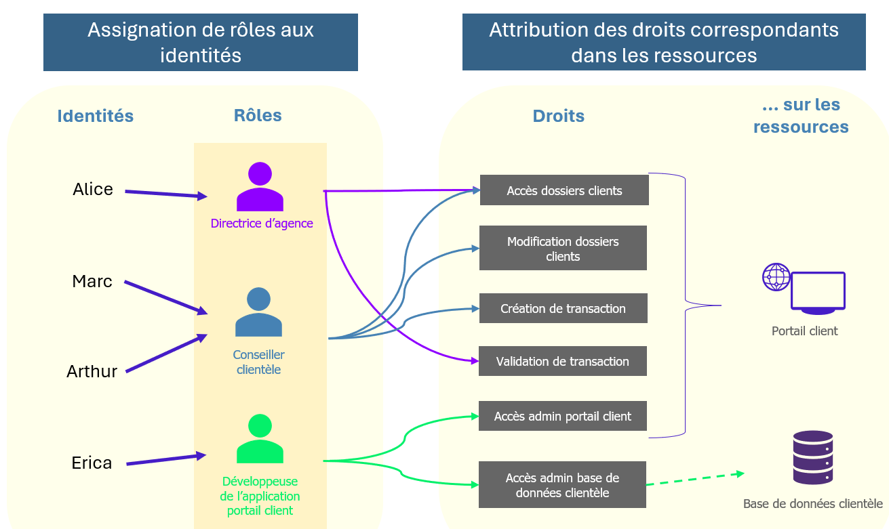
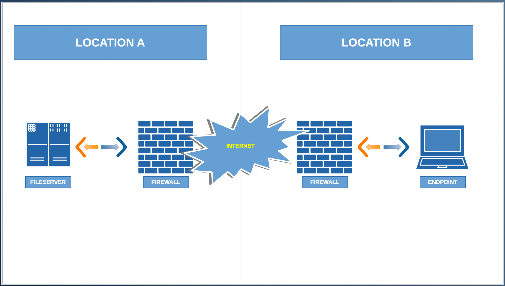

## Principe de sécurité : Contrôle d'accès

- Le **contrôle d’accès** détermine :
    - qui peut accéder à une ressource ;
    - à quelles ressources ;
    - avec quels droits ;
    - dans quelles conditions.
- Un mauvais design peut permettre à des utilisateurs non autorisés d’accéder à :
    - données sensibles ;
    - applications ;
    - systèmes ;
    - ressources réseau.

```
Subject
→ Access Control
→ Resource
→ Allow / Deny
```

- Le contrôle d’accès protège contre :
    - menaces externes ;
    - menaces internes.
- Il contribue également à :
    - respecter le **Least Privilege** ;
    - protéger la confidentialité ;
    - appliquer les security policies ;
    - faciliter les audits et la conformité.
### Modèles de contrôle d'accès
Deux approches principales abordées ici :

```
RBAC
→ accès basé sur le rôle

ABAC
→ accès basé sur les attributs
```

### RBAC — Role-Based Access Control

- **RBAC** attribue les permissions en fonction du **rôle** d’un utilisateur.
- Le contrôle d'accès basé sur les rôles (RBAC) est un modèle de contrôle d'accès qui gère efficacement les permissions d'accès d'un utilisateur ou d'un groupe à un système en attribuant des rôles et en les associant à des permissions spécifiques.
- Les utilisateurs reçoivent un ou plusieurs rôles, et les rôles possèdent les permissions nécessaires.

```
User
→ Role
→ Permissions
→ Resource
```

Exemple :

```
Alice
→ Accountant
→ Read / Modify Accounting Data
```

- RBAC permet de gérer efficacement les droits de plusieurs utilisateurs ayant les mêmes responsabilités.
- Il est largement utilisé pour :
    - simplifier l’administration ;
    - appliquer le Least Privilege ;
    - réduire les permissions attribuées individuellement.

{ width="550" }
#### Définition des rôles

- Identifier les fonctions présentes dans l’organisation.
- Chaque rôle représente un ensemble de permissions associé à une fonction.

Exemples :

```
Manager
Employee
Customer
Administrator
```

- Les permissions doivent correspondre aux responsabilités réelles du rôle.
#### Affectation des utilisateurs aux rôles

- Chaque utilisateur est affecté au rôle correspondant à ses besoins métier.
- Les permissions ne sont ensuite pas nécessairement attribuées directement à chaque user.

```
User A ─┐
User B ─┼→ Finance Role → Finance Permissions
User C ─┘
```

→ facilite fortement l’administration des accès.
#### Définition des permissions
Pour chaque rôle, déterminer :

- opérations autorisées ;
- données accessibles ;
- applications accessibles ;
- systèmes concernés ;
- network resources / segments accessibles.

Exemple :

```
Employee
→ Read documents

Manager
→ Read + Modify documents
```

#### Application du contrôle d'accès

- Lorsqu’un utilisateur tente d’accéder à une ressource :
    - son identité est vérifiée ;
    - son rôle est identifié ;
    - les permissions associées sont évaluées ;
    - l’accès est autorisé ou refusé.

```
Authenticated User
→ Role
→ Permission Check
→ Allow / Deny
```

Le contrôle peut être appliqué à différents niveaux :

- login ;
- application ;
- database ;
- filesystem ;
- API ;
- network resource.
#### Avantages du RBAC

- gestion simplifiée des permissions ;
- meilleure organisation des rôles ;
- réduction des accès non autorisés ;
- application plus simple du Least Privilege ;
- amélioration de la traçabilité ;
- facilite audit et conformité.

> Le principal risque est le **Role Explosion** : créer trop de rôles très spécifiques peut rendre RBAC difficile à administrer.
### ABAC — Attribute-Based Access Control

- **ABAC** prend une décision d’accès à partir de plusieurs **attributs**.
- Ces attributs peuvent concerner :
    - user ;
    - resource ;
    - device ;
    - environnement ;
    - contexte de connexion.

```
Attributes
+
Policy
→ Access Decision
```

Exemples d’attributs :

- role ;
- department ;
- location ;
- time ;
- device type ;
- device security status ;
- resource sensitivity.

{ width="550" }
#### Exemple ABAC
Policy :

```
ALLOW document modification IF:

Role = Administrator
AND
Device = Compliant
AND
Location = Corporate Network
```


Un même utilisateur peut donc :

```
Admin + Managed Device + Office
→ ALLOW

Admin + Unmanaged Device + Public Wi-Fi
→ DENY
```

→ la décision dépend du **contexte**, pas uniquement du rôle.
#### Contrôle d'accès granulaire

- ABAC permet un contrôle plus fin que RBAC.

Exemple :

```
Finance User
+
Working Hours
+
Managed Device
+
Corporate Network
→ Access Financial Database
```

Les règles peuvent donc tenir compte du :

- `who` ;
- `what` ;
- `where` ;
- `when` ;
- `how`.
#### Meilleure gestion & audit plus clair

- L'ABAC permet un audit plus clair des politiques de contrôle d'accès.
- Particulièrement important pour les organisations qui doivent assurer la conformité avec les réglementations.
#### Accès basé sur le statut de sécurité

- ABAC peut adapter les droits selon le niveau de sécurité du contexte.

Exemples :

```
Device compliant
→ Access allowed

Device compromised
→ Access denied
```

ou :

```
Trusted Location
→ Full Access

Unknown Location
→ Restricted Access / MFA
```

Cette logique est particulièrement adaptée aux approches modernes comme **Zero Trust** et **Conditional Access**.
#### Mise en œuvre ABAC
##### Déterminer les attributs
Identifier les attributs utiles à la décision :

- rôle ;
- département ;
- localisation ;
- type de device ;
- niveau de sécurité ;
- horaire ;
- sensibilité de la ressource.
##### Définir les politiques

- Les policies combinent les attributs.

Exemple :

```
Permit modification IF
Role = Administrator
AND
Device = Secure
```

##### Implémenter les policies

- Les règles sont ensuite appliquées par le système IAM, l’application ou le service concerné.
- La décision est évaluée dynamiquement lors de la demande d’accès.

```
Access Request
→ Evaluate Attributes
→ Evaluate Policy
→ Permit / Deny
```

#### Avantages de l'ABAC

- contrôle très granulaire ;
- prise en compte du contexte ;
- policies dynamiques ;
- adapté aux environnements complexes ;
- permet d’intégrer l’état de sécurité du device ;
- utile pour les exigences réglementaires.
#### Limites

- conception plus complexe ;
- nombre élevé d’attributs et de règles ;
- troubleshooting plus difficile ;
- nécessite une bonne gouvernance des policies.
### RBAC vs ABAC

|RBAC|ABAC|
|---|---|---|
|Décision basée sur|Rôle|Attributs + contexte|
|Exemple|`Finance → Read`|`Finance + Trusted Device + Office Hours → Read`|
|Complexité|Faible / moyenne|Plus élevée|
|Granularité|Bonne|Très élevée|
|Gestion|Simple|Plus complexe|
|Contexte dynamique|Limité|Oui|

```
RBAC
→ Who are you in the organization?

ABAC
→ Who are you + What + Where + When + How?
```

### Relation entre RBAC et ABAC

- Les deux modèles ne sont pas forcément exclusifs.
- Un environnement peut utiliser :

```
RBAC
→ rôle de base

+
ABAC
→ conditions supplémentaires
```


Exemple :

```
Role = Network Admin
AND
Device = Managed
AND
Location = Corporate Network
→ SSH Access Allowed
```


Le principe central est que le contrôle d’accès doit garantir que **chaque identité ne puisse accéder qu’aux ressources nécessaires, avec les droits appropriés et éventuellement selon le contexte de la demande**.

## Données Statiques et Dynamiques

- Pour sécuriser les données, il est utile de distinguer :
    - les **données statiques / Data at Rest** ;
    - les **données dynamiques / Data in Transit**.
- Ces deux états nécessitent des mesures de protection différentes.

```
Data at Rest
→ données stockées

Data in Transit
→ données en déplacement
```

### Données statiques — Data at Rest

- Données stockées quelque part et en attente d’utilisation.
- Exemples :
    - fichiers sur disque ;
    - données stockées sur serveur ;
    - données en base de données ;
    - sauvegardes.

```
File on Disk
→ Data at Rest
```

Une donnée reste **statique** tant qu’elle est stockée et n’est pas en cours de transmission.
### Données dynamiques — Data in Transit

- Données qui se déplacent d’un système ou emplacement à un autre.
- Exemples :
    - téléchargement d’un fichier depuis Internet ;
    - transfert depuis un file server ;
    - échange entre deux sites.

```
Server A
→ Network / Internet
→ Client B

= Data in Transit
```


- Une même donnée peut donc changer d’état :

```
File stored on Server
→ Data at Rest

Download starts
→ Data in Transit

File stored on Client
→ Data at Rest
```

#### Exemple : transfert entre deux sites
{ width="500" }
Supposons :

```
Location A
→ File Server
→ invoices.pdf

Location B
→ User Endpoint
```

Même si l’environnement dispose déjà de :

- firewall rules ;
- RBAC ;
- strong password policy ;
- 2FA ;

- le fichier doit encore être protégé **pendant son transit** entre les deux emplacements.

Le problème :

```
A
→ systèmes intermédiaires
→ Internet
→ B
```

- L’organisation ne contrôle pas nécessairement tous les systèmes traversés.

→ il faut donc transformer les données avant leur départ pour qu’elles soient illisibles par un tiers, puis les restaurer à destination.

```
Plaintext
→ Encryption
→ Transmission
→ Decryption
→ Plaintext
```

### Protection des Données Dynamiques

- Objectif : protéger les données pendant leur **transfert et leur partage**.
- Principaux besoins :
    - confidentialité ;
    - intégrité ;
    - disponibilité/accessibilité.
#### Chiffrement des données — Data Encryption

- Le chiffrement est l’une des principales protections pour les données dynamiques.
- Les données sont rendues illisibles avant ou pendant leur transmission.

```
Readable Data
→ Encryption
→ Unreadable Data
→ Transmission
```

→ empêche un tiers non autorisé de comprendre les données interceptées.
#### Communication sécurisée des données

- Utiliser des **canaux de communication sécurisés**.
- Ces canaux permettent :
    - transfert chiffré ;
    - authentification ;
    - vérification de l’échange.

Le cours cite notamment :

```
SSL / TLS
```


Principe : 

```
Client
→ Secure Channel
→ Server
```

#### Intégration des données

- Pendant le processus d'intégration des données, nous devons nous assurer que les données sont transférées et vérifiées de manière sécurisée.

Les données peuvent transiter entre différents :

- systèmes ;
- applications ;
- services.

Les points d’intégration doivent être protégés avec :

- authentification ;
- autorisation ;
- vérification du transfert ;
- contrôle contre les accès non autorisés.

```
Application A
→ Secure Integration
→ Application B
```

#### Limitation du stockage

- Ne pas conserver inutilement des données qui n’ont plus de raison d’être stockées.
- Appliquer une politique de **retention** adaptée.
- Purger régulièrement les données devenues inutiles.
- Pendant leur conservation :
    - stockage sécurisé ;
    - accès restreint.

```
Collect
→ Use
→ Retain only if needed
→ Purge
```

#### Contrôle et surveillance des données

- Surveiller :
    - flux de données ;
    - partage de données ;
    - accès non autorisés ;
    - potentielles violations.

```
Data Flow
→ Monitoring
→ Suspicious Activity?
→ Detection / Response
```

La surveillance permet de détecter plus rapidement un incident et d’y répondre.
### Protection des Données Statiques
Les données stockées doivent également être protégées par plusieurs mécanismes complémentaires.
#### Chiffrement des données

- Les données statiques doivent être chiffrées pour limiter l’accès en cas de compromission du support.
- Le chiffrement peut être appliqué au niveau :
    - disque ;
    - système de stockage ;
    - base de données.

```
Stored Data
→ Encryption
→ Protected Data at Rest
```

#### Contrôles d’accès

- Restreindre l’accès aux données aux seuls utilisateurs autorisés.
- Appliquer :
    - rôles ;
    - permissions ;
    - restrictions ;
    - authorization controls.

```
User
→ Access Control
→ Data

Need Access?
├─ Yes → Allow
└─ No  → Deny
```

→ application du **Least Privilege**.
#### Sauvegarde et récupération

- Effectuer des sauvegardes régulières des données statiques.
- Prévoir un processus de récupération.
- Les sauvegardes doivent elles-mêmes être protégées.

```
Production Data
→ Backup
→ Secure Storage
→ Recovery if needed
```

### Sécurité du stockage
Les zones de stockage doivent être protégées à la fois :

#### Physiquement

- datacenters sécurisés ;
- server rooms ;
- contrôle d’accès ;
- caméras ;
- alarmes.
#### Logiquement / électroniquement

- chiffrement ;
- firewall ;
- security tools ;
- intrusion detection systems.
### Monitoring & Incident Response

- Surveiller l’état de sécurité des données.
- Détecter les comportements anormaux ou inhabituels.
- Utiliser notamment :
    - logs ;
    - SIEM ;
    - mécanismes de monitoring.

```
Logs
→ SIEM
→ Detection
→ Alert
→ Incident Response
```

### Suppression et destruction

- Les données statiques doivent également être supprimées ou détruites de manière sécurisée lorsqu’elles ne sont plus nécessaires.

```
Data no longer needed
→ Secure Deletion / Destruction
```

### Data at Rest vs Data in Transit

|                       | Data at Rest                          | Data in Transit                           |
| --------------------- | ------------------------------------- | ----------------------------------------- |
| État                  | Stockée                               | En déplacement                            |
| Exemple               | fichier sur disque                    | fichier téléchargé                        |
| Risque principal      | accès au stockage                     | interception pendant le transfert         |
| Protection principale | chiffrement + access control          | chiffrement + secure communication        |
| Autres contrôles      | backup, monitoring, physical security | monitoring, authentication, authorization |

```
At Rest
→ Protect Storage

In Transit
→ Protect Communication
```


Le point central est qu’une même donnée peut passer de **statique à dynamique puis redevenir statique** ; les protections doivent donc suivre son état tout au long de son cycle de vie.
