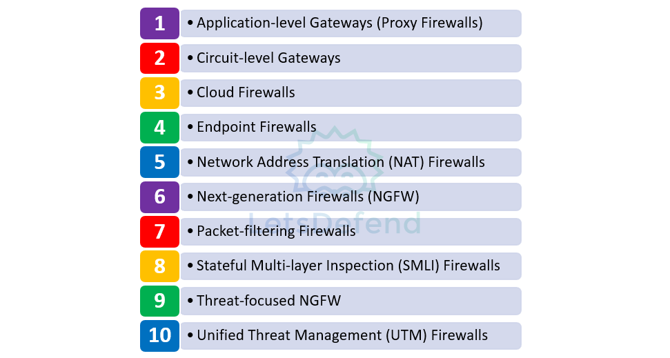
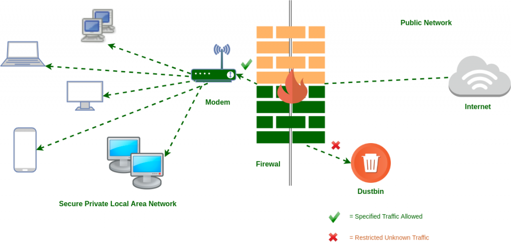

## Firewall

- Matériel ou logiciel qui **surveille le trafic réseau entrant/sortant** et applique des règles pour :
    - autoriser ;
    - bloquer ;
    - journaliser les communications.
- Il constitue un point de contrôle entre différentes zones réseau.

```
Traffic → Firewall Rules → Allow / Deny
```

## Types de pare-feu

{ width="600" }

| Type                                           | Principe                                                                                                                                                                                               |
| ---------------------------------------------- | ------------------------------------------------------------------------------------------------------------------------------------------------------------------------------------------------------ |
| **Application-level Gateway / Proxy Firewall** | Analyse le trafic au niveau **applicatif** (du modèle OSI) et agit comme intermédiaire entre client et serveur                                                                                         |
| **Circuit-level Gateway**                      | Vérifie principalement les **connexions/sessions**, notamment TCP, avec peu d’analyse applicative                                                                                                      |
| **Cloud Firewall / FWaaS**                     | Firewall fourni comme **service cloud**, facilement scalable selon la charge                                                                                                                           |
| **Endpoint / Host-based Firewall**             | Installé directement sur l’hôte, filtre son trafic entrant/sortant. Par exemple, le « Windows Defender Firewall ».                                                                                     |
| **NAT Firewall**                               | Utilise la NAT pour masquer les IP internes et contrôler certains flux                                                                                                                                 |
| **NGFW — Next-Generation Firewall**            | Combine filtrage classique + **DPI** et fonctions avancées de détection, conçu pour bloquer les menaces externes, les attaques de logiciels malveillants (malware) et les méthodes d'attaque avancées. |
| **Packet Filtering Firewall**                  | Filtre selon IP, ports, protocole et règles simples                                                                                                                                                    |
| **SMLI / Stateful Inspection**                 | Suit l’**état des connexions** et vérifie notamment les sessions TCP                                                                                                                                   |
| **Threat-focused NGFW**                        | NGFW enrichi de fonctions avancées de détection/réponse aux menaces                                                                                                                                    |
| **UTM — Unified Threat Management**            | Regroupe firewall stateful + antivirus + IPS et autres fonctions de sécurité                                                                                                                           |
## Fonctionnement d’un Firewall

- Le firewall applique une suite de **règles** au trafic.
- Une règle peut se baser sur :
	- IP source ;
	- IP destination ;
	- port source ;
	- port destination ;
	- protocole ;
	- interface / zone ;
	- parfois utilisateur, application ou contenu.
- Exemple :

```
Source: VLAN Users
Destination: VLAN Finance
Port: ANY
Action: DENY
```

→ permet notamment de faire de la **segmentation réseau**.

```
Département A ─X→ Département B
```

### Ordre des règles

- **Complément important :**
- Les règles sont généralement évaluées selon un ordre défini.

```
Rule 1 → Match ? appliquer
Rule 2 → Match ? appliquer
...
Default deny / implicit deny
```

→ une règle mal placée peut rendre une autre règle inutile ou autoriser trop de trafic.
## Firewall & Segmentation

- Le firewall peut séparer plusieurs zones :

```
Internet
   ↓
Firewall
 ├─ LAN
 ├─ DMZ
 └─ Servers
```

- Objectif :
	- limiter les communications inutiles ;
	- réduire le lateral movement ;
	- limiter l’impact d’une compromission.
## Logs Firewall

- Informations typiques :

|Champ|Utilité|
|---|---|
|**Date / Time**|Quand le flux a été observé|
|**Source IP**|Origine|
|**Destination IP**|Cible|
|**Source Port**|Port source|
|**Destination Port**|Service ciblé|
|**Action**|Allow / Deny / Drop|
|**Packets Sent**|Paquets envoyés|
|**Packets Received**|Paquets reçus|

- Exemple :

```
SRC=10.0.0.25
DST=8.8.8.8
DPT=53
PROTO=UDP
ACTION=ALLOW
```

## Positionnement
{ width="600" }
### Firewall périmétrique

- Typiquement placé entre le réseau interne et Internet :

```
Internet
   ↓
Firewall
   ↓
IDS / IPS
   ↓
Internal Network
```

→ filtre le trafic avant son entrée dans le réseau interne.
### Host Firewall

```
Network
   ↓
Host Firewall
   ↓
Endpoint
```

→ protège directement une machine particulière.

> Le positionnement réel peut varier : firewall, IDS/IPS, DMZ et autres équipements sont organisés selon l’architecture et les besoins de visibilité/filtrage.
