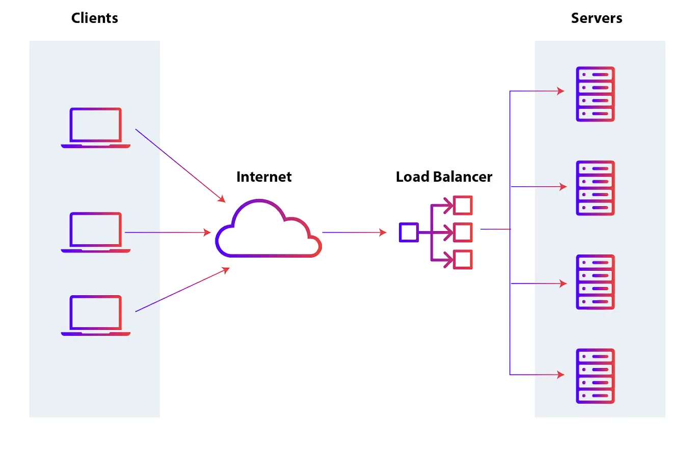

## Load Balancer

- Matériel ou logiciel placé **devant plusieurs serveurs** pour répartir le trafic de manière équilibrée.
- Objectif :
    - éviter la surcharge d’un serveur ;
    - améliorer les performances ;
    - maintenir la disponibilité du service.

```
Clients
   ↓
Load Balancer
 ├─ Server 1
 ├─ Server 2
 └─ Server 3
```

## Avantages

- répartit la charge entre plusieurs serveurs ;
- évite qu’un serveur unique soit surchargé ;
- améliore les performances et les temps de réponse ;
- augmente la **disponibilité** ;
- permet de continuer à servir les utilisateurs si un serveur devient indisponible ;
- facilite la montée en charge.

```
Sans Load Balancer
→ Server 1 saturé
→ délai / perte d'accès

Avec Load Balancer
→ trafic réparti
→ ressources mieux utilisées
```

## Fonctionnement

- Le Load Balancer reçoit les connexions puis sélectionne le serveur le plus approprié selon un **algorithme de répartition**.
- Algorithmes courants :

|Algorithme|Principe|
|---|---|
|**Round Robin**|Distribue les requêtes successivement entre les serveurs|
|**Weighted Round Robin**|Même principe mais certains serveurs reçoivent plus de trafic selon leur capacité|
|**Least Connections**|Choisit le serveur ayant le moins de connexions actives|
|**IP Hash**|Utilise notamment l’IP client pour déterminer le serveur cible|

{ width="600" }
## Health Checks

- Complément important :
	- Le Load Balancer vérifie généralement que les serveurs sont **disponibles et fonctionnels**.
- Si un serveur ne répond plus :

```
Server 2 DOWN
→ retiré temporairement du pool
→ trafic envoyé vers Server 1 / Server 3
```

→ permet d’assurer la continuité de service.
## Haute disponibilité / Scalabilité

- Le Load Balancer facilite :
### Horizontal Scaling

```
2 serveurs
→ trafic augmente
→ ajout d'un 3e / 4e serveur
```

→ on augmente la capacité en ajoutant des instances.
### Availability

```
Server 1 tombe
→ autres serveurs continuent à répondre
```

Le Load Balancer contribue donc surtout à la **résilience et disponibilité**.
## Importance pour la sécurité

- Dans la sécurité, son apport principal concerne la **Availability** de la triade CIA :

```
CIA
├─ Confidentiality
├─ Integrity
└─ Availability ← Load Balancer
```

- réduit le risque qu’une surcharge d’un serveur unique rende le service indisponible ;
- permet de répartir un trafic important ;
- évite certains Single Points of Failure si l’architecture elle-même est redondante.
### DoS / DDoS

- Un Load Balancer peut aider à absorber/répartir une partie d’un trafic important :

```
DDoS Traffic
     ↓
Load Balancer
 ├→ Server 1
 ├→ Server 2
 └→ Server 3
```


> ⚠️ Il **ne constitue pas à lui seul une protection DDoS**. Une attaque suffisamment importante peut saturer le Load Balancer, la connexion Internet ou l’ensemble du backend.

- Pour le DDoS, on utilise aussi :
	- rate limiting ;
	- CDN / Anycast ;
	- anti-DDoS / scrubbing service ;
	- firewall / WAF ;
	- capacité réseau distribuée.
## Session Persistence / Sticky Sessions

- Complément utile pour les applications Web :
- Certaines applications nécessitent qu’un utilisateur retourne vers le **même serveur** pendant sa session.

```
User A → Server 2
User A → Server 2
User A → Server 2
```

→ appelé **Session Persistence / Sticky Session**.

- Sinon, une requête suivante pourrait arriver sur un serveur ne possédant pas l’état de session attendu.
