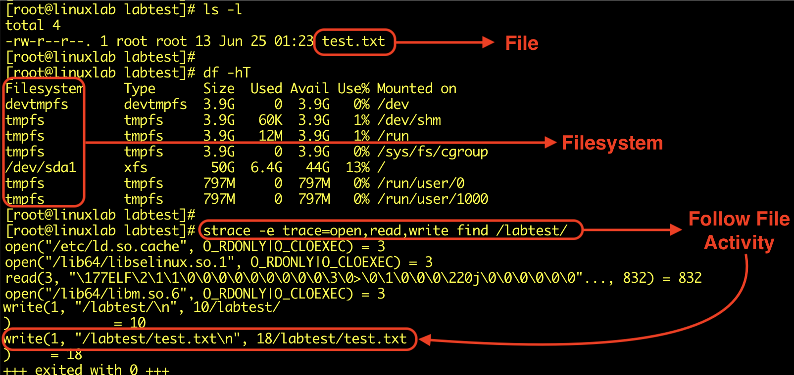

## Gestion des fichiers — File Management

- Le système d’exploitation gère le **stockage, l’organisation, l’accès, la protection et la suppression des données**.
- Il fournit les mécanismes permettant aux utilisateurs et applications de manipuler les fichiers de façon structurée.
### File

- Un **fichier** est une unité où les informations sont stockées et nommées de manière structurée.
- Exemples :
    - documents ;
    - exécutables ;
    - bases de données ;
    - fichiers multimédias ;
    - fichiers de configuration ;
    - logs.
- Un fichier possède généralement des **métadonnées** :

```
Filename
Size
Owner
Permissions
Timestamps
Location
```

### Système de fichiers - Filesystem

- C'est le système qui assure l'organisation et le stockage des fichiers.
- Les systèmes de fichiers incluent le partitionnement des fichiers en volumes, la création de répertoires, le contrôle des droits d'accès et le placement des données sur des supports de stockage physiques.
- Le **filesystem** définit comment les fichiers et répertoires sont :
    - organisés ;
    - stockés ;
    - retrouvés ;
    - protégés sur un support.
- Exemples :

|OS / environnement|Filesystem|
|---|---|
|Windows|NTFS, ReFS|
|Linux|ext4, XFS, Btrfs|
|macOS|APFS|

### File Naming

- Le nom et le chemin permettent d’identifier un fichier.

Exemple Windows :

```
C:\Users\Alice\Documents\report.txt
```

Exemple Linux :

```
/home/alice/documents/report.txt
```

- Les conventions et restrictions de nommage varient selon l’OS et le filesystem.
### File Access

- Les opérations courantes sont :

```
Read
Write
Modify
Delete
Execute
```

- L’OS contrôle si un utilisateur ou un processus est autorisé à réaliser ces opérations.

→ important en sécurité : un malware possède les **droits du contexte dans lequel il s’exécute**, sauf s’il obtient des privilèges supplémentaires.
### Directories

- Les **directories / folders** regroupent les fichiers dans une structure hiérarchique.
- Les systèmes de fichiers utilisent des répertoires pour organiser et gérer les fichiers.

```
/
├── home
├── etc
└── var
    └── log
```

ou :

```
C:\
├── Windows
├── Program Files
└── Users
```

→ facilite l’organisation et permet aussi d’appliquer certains contrôles d’accès à des ensembles de fichiers.
### File Security

- L’OS protège les fichiers grâce aux **permissions et mécanismes de contrôle d’accès**.
- Exemples :

```
Windows → ACL / NTFS Permissions
Linux   → Owner / Group / rwx / ACL
```

- Principes importants :
	- **Least Privilege** ;
	- limiter les droits d’écriture ;
	- protéger les fichiers sensibles ;
	- éviter les permissions excessives ;
	- journaliser les accès critiques lorsque nécessaire.

```
User autorisé
→ Read

User non autorisé
→ Access Denied
```

### File Backup

- Les sauvegardes permettent :
    - de limiter les pertes de données ;
    - de récupérer après corruption/suppression ;
    - de soutenir le **disaster recovery**.

> Le système d’exploitation peut fournir des mécanismes ou outils de sauvegarde, mais dans une entreprise, le backup est généralement géré par une **solution dédiée** et une politique globale de sauvegarde.
### Disk Management

- Cela inclut les processus par lesquels les fichiers sont gérés sur des supports de stockage physiques.
- La gestion des disques comprend notamment :
	- partitions ;
	- volumes ;
	- allocation d’espace ;
	- formatage ;
	- montage des filesystems ;
	- gestion du stockage ;
	- récupération selon les outils disponibles.

```
Physical Disk
→ Partition / Volume
→ Filesystem
→ Files
```


{ width="600" }

## Gestion du réseau — Network Management

- L’OS fournit les mécanismes permettant au système de **communiquer sur le réseau**.
- Il permet notamment de configurer, surveiller et sécuriser les interfaces et services réseau.

{ width="600" }
### Gestion du réseau - Network Configuration

- Configuration possible au niveau d’un hôte :
	- adresse IP ;
	- subnet mask / prefix ;
	- default gateway ;
	- DNS ;
	- interfaces réseau ;
	- routes ;
	- parfois VLANs selon l’environnement.

```
Host
→ IP Address
→ Subnet
→ Gateway
→ DNS
→ Network
```


> ⚠️ La **topologie globale du réseau** et la configuration des switches/routers relèvent surtout de l’administration réseau. L’OS gère principalement la configuration réseau de l’hôte sur lequel il fonctionne.
### Network Security

- Le système peut participer à la sécurité réseau via :
	- host firewall ;
	- authentification ;
	- autorisation ;
	- chiffrement ;
	- contrôle des services exposés.
- Exemples :

```
Windows Defender Firewall
Linux nftables / iptables
SSH
TLS
```

- Objectif :

```
Allow required traffic
+
Block unnecessary traffic
```

→ réduire la surface d’attaque réseau du système.
### Network Monitoring & Performance

- Surveiller :
    - connexions actives ;
    - interfaces ;
    - utilisation de bande passante ;
    - erreurs réseau ;
    - latence ;
    - services en écoute.
- Exemples d’outils :

```
Windows → ipconfig, netstat, Get-NetTCPConnection
Linux   → ip, ss, ping, traceroute
```

- En sécurité, ces informations permettent notamment d’identifier :
	- port inhabituel en écoute ;
	- connexion vers une IP suspecte ;
	- communication C2 ;
	- trafic anormal.
### Network Services Management

- L’environnement réseau peut fournir différents services :

|Service|Fonction|
|---|---|
|**DNS**|Résolution nom ↔ IP|
|**DHCP**|Attribution automatique de configuration IP|
|**File Sharing**|Partage de fichiers sur le réseau|
|**Web Server**|Hébergement de services HTTP/HTTPS|
|**SSH / RDP**|Administration distante|

- Leur sécurité nécessite :

```
Configure
→ Patch
→ Restrict Access
→ Monitor
```

### Network Troubleshooting

- L’OS fournit des outils permettant de diagnostiquer :
	- perte de connectivité ;
	- mauvaise configuration IP ;
	- problèmes DNS ;
	- routes incorrectes ;
	- ports bloqués ;
	- services indisponibles.
- Workflow simple :

```
Interface UP ?
→ IP correcte ?
→ Gateway joignable ?
→ DNS fonctionne ?
→ Port/service accessible ?
```

### Network Backup & Recovery

- Le cours inclut également la sauvegarde et la récupération dans la gestion réseau.
- Cela peut concerner :
	- données accessibles sur le réseau ;
	- configurations ;
	- serveurs ;
	- services critiques.

> En pratique, la sauvegarde de la **configuration des équipements réseau** et le disaster recovery sont souvent gérés via des outils spécialisés plutôt que directement par l’OS.
## Intérêt en sécurité

- La gestion des fichiers et du réseau fournit deux sources majeures d’artefacts lors d’une investigation :

```
Filesystem
→ fichiers créés/modifiés
→ malware
→ persistence
→ logs

Network
→ connexions
→ ports
→ destinations
→ C2 / exfiltration
```

- Un analyste IR / Threat Hunter doit donc pouvoir répondre à deux questions simples :

```
Qu'est-ce qui a changé sur le système ?
Avec quoi le système a-t-il communiqué ?
```
