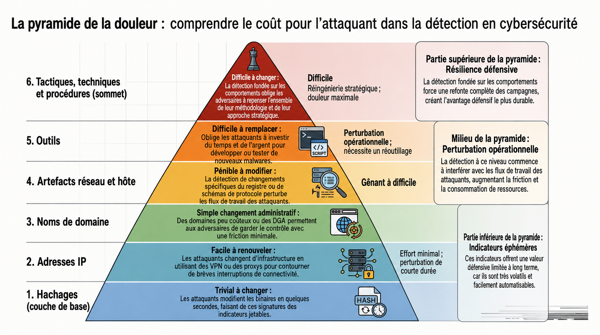
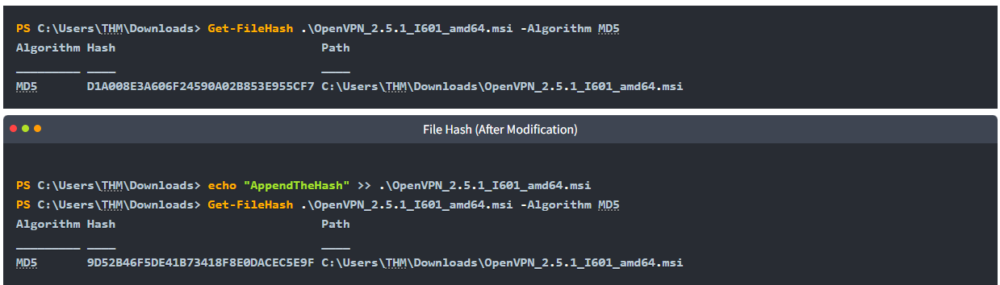
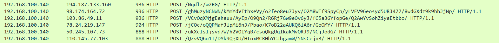

Moyen qui va évaluer la difficulté pour un attaquant de modifier un IoC

{ width="600" }
## Hash values (empreintes de fichiers) — trivial

- Valeur numérique fixe qui identifie de façon condensée un fichier ou une donnée, produite par un algo de hachage, plus petit changement dans le fichier, le hash changera du tout au tout.
- Algorithmes :
    - MD5 : Très répandu historiquement mais plus sûr : collisions connues.
    - SHA-1 : Déprécié par le NIST
    - SHA-2 (ex : 256) : Recommandé comme alternative aujourd’hui.
- Utilité : Recherche et classification, sources publiques, usage opérationnel.
- Limite : Modifier un seul bit du fichier change hash, l’attaquant peut aisément créer une variante si on ne s’appuie que sur les hashs.
- Outils : Virustotal, MetaDefender…
- Commandes :
    - **Get-FileHash fichier.ext -Algorithm MD5**



## IP addresses

- IP identifie un appareil sur un réseau
- Attaquant peut facilement la changer : Nouvelle IP publique, proxys, VPS, utilisation de machine compro…
- Bloquer/Filtrer IP sur firewall donne un gain immédiat mais peu durable.
- Technique qui complique : Fast Flux
    - Technique DNS employée par botnets pour masquer l’infrastructure C2. https://unit42.paloaltonetworks.com/fast-flux-101/
    - Principe : Un même nom de domaine pointe vers beaucoup d’adresses IP qui changent très souvent. Les IP sont souvent des machines compro faisant office de proxies.
    - But : Rendre C2 / site malveillant résilient et difficile à détecter.
    - Conséquence : Bloquer IP individuelles devient inefficace.

## Domain names

- Associer nom humainement lisible à une adresse IP
- Plus compliqué qu’une IP, doit acheter/maintenir domaine, configurer DNS? potentiellement payer/renouveler, gérer certificats. Même si fournisseurs DNS proposent API et process automatisés.
- Techniques :
    - Punnycode / IDN homograph attack
        - Attaquants créent domaines qui ressemblent à des légit en utilisant caractères Unicode (ex : [adıdas.de](http://xn--addas-o4a.de/)) ; convertis en ASCII ces domaines deviennent du Punycode comme [adıdas.de](http://xn--addas-o4a.de/). A première vue URL semble legit visuellement, mais c’ets un leurre.
    - URL shorteners :
        - Attaquants cachent destination réelle derrière des services de raccourcissement. Astuce défensive simple : Certains raccourcisseurs ajoutent ajoute après l’URL dans le navigateur, la page de dest.
    - Analyse en sandbox (any.run) :
        - Exécutent échantillon et montrent les échanges DNS… Pour ne pas avoir à visiter directement.

## Network/Host artifacts

*(ex : clés de registre, chemins, mutex, patterns réseau)*

- Compliqué pour l’attaquant d’agir sur ces aspects
- Process d’exécution suspect de Word


- Event suspects qui suivent l’ouverture d’une application


- Fichier déposé / modifié par l’attaquant


- Requête HTTP qui peuvent être détectés avec Wireshark ou Tshark



- tshark --Y http.request -T fields -e http.host -e http.user_agent -r analysis_file.pcap


  

## Tools (outils ou binaires employés par l’attaquant)

- A ce niveau ça devient coûteux car doit recréer outils, réapprendre, réinvestir.
- Leviers principaux : Signature AV, règles de détection. YARA, Marketplaces (MalwareBazaar, Malshare) pour obtenir échantillons et indicateurs, Fuzzy hashing (SSDEEP) peut faire de la similarité entre variantes, utile quand les hashes classiques changent.
- Sources / Plateformes :
    - MalwareBazaar, Malshare : sources pour récupérer échantillons connus. Toujours manipuler en environnement isolé (VM/sandbox hors réseau de prod).
    - SOC Prime Threat Detection Marketplace : règles de détection partagées (Sigma, YARA, signatures) — utile pour récupérer règles et les adapter.
    - *VirusTotal / Any.run : pour enrichissement et visualisation comportementale (HTTP requests, DNS, connexions) sans exécuter toi-même le sample.
    - **YARA** = Recherche de patterns dans les **fichiers** (statique).
    - **SIGMA** = Recherche de patterns dans les **logs/événements** (SIEM).

## TTPs (Tactics, Techniques, Procedures)

- Décrit comportement global d’un attaquant, pas juste un indicateur technique.
    - Tactics : Le pourquoi : Objectif de l’adversaire (obtenir un accès initial, élever ses privilèges, exfiltrer des données…)
    - Techniques : Le comment général : Méthode employée (hameçonnage, exploitation de vulnérabilité, vol d’identifiants…)
    - Procedures : Le comment précis : L’exécution concrète (Pièce jointe Excel avec macro malveillante envoyée via email)
        
        ```jsx
		Tactic : Credential Access
		Technique : Pass-the-Hash (MITRE T1550.002)
		Procedure : L’attaquant utilise mimikatz pour extraire un hash NTLM et se connecter à un autre poste via psexec.
		```
