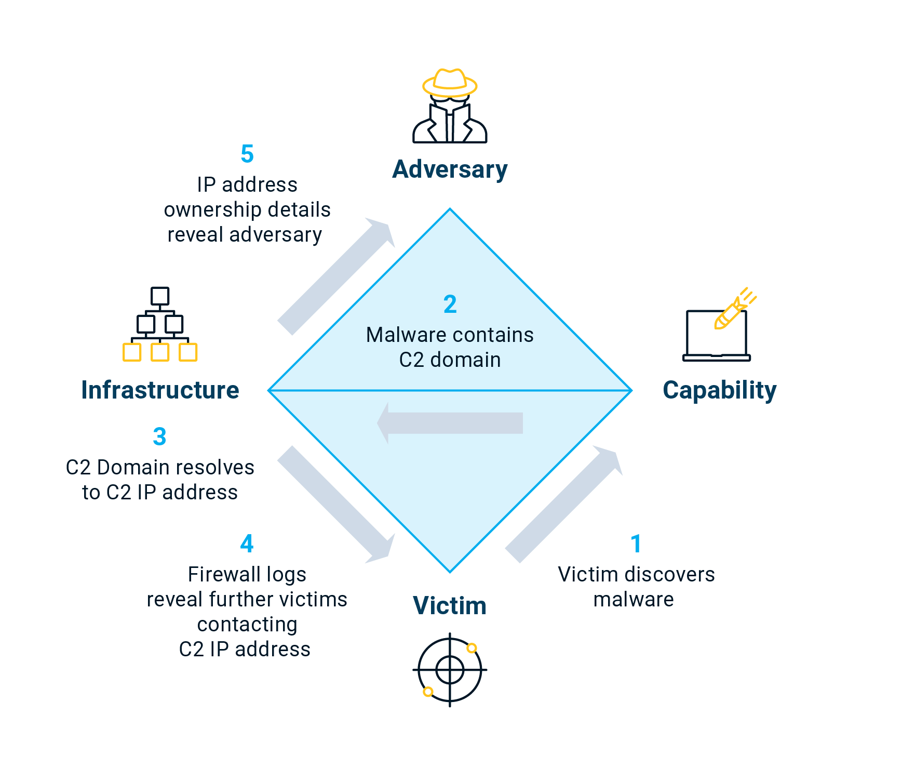

Représente l’unité fondamentale d’une activité malveillante à travers quatre éléments principaux reliés en forme de diamant. Chaque attaque peut être décrite par ces quatre points interconnectés, qui expliquent qui fait quoi, comment et contre qui.

## Adversary (Attaquant)

L’acteur malveillant à l’origine de l’attaque

- Adversary Operator : Personne réalisation concrètement l’attaque.
- Adversary Customer : Commanditaire ou bénéficiaire de l’attaque (Entreprise, État, groupe criminel…)
- Exemple : Groupe APT chinois (Customer) mandate des opérateurs pour compro une société FR d’aéronautique afin de voler de la PI.

## Victime (Cible)

Entité visée par l’adversaire : Une organisation, individu, domaine, IP…

- Victim Persona : Personne ou organisations ciblées (RH, dirigeants…)
- Victim Assets : Systèmes, serveurs, mail, réseaux exploités…
- Ex : Employée du service financier reçoit mail piégé, elle devient la victim persona, son ordi et son adresse mail sont les victim assets

## Capability (Outils et techniques)

Moyens techniques utilisés par l’adversaire pour exécuter l’attaque, reflètent TTP.

- Capability Capacity : Ensemble des vuln et expositions exploitables.
- Adversary Arsenal : Ensemble des capacités de l’adversaire.
- Ex : Exploits, malwares, rootkits, scripts, techniques d’hameçonnage, brute force, obfuscation

## Infrastructure (Moyens de déploiement)

Ressources logiques ou physiques utilisées pour livrer, héberger ou contrôler les capacités.

- Type 1 : Infra directement contrôlée par l’adversaire (Son propre serveur C2)
- Type 2 : Infra intermédiaire (serveurs compro, domaines legits piratés)
- Ex : Serveur C2, domaines de phishing, emails mailveillants, USB infecté…

## Meta-features (informations supplémentaires)

Éléments contextualisant un événement pour l’analyse et la corrélation :

|Meta-feature|Description|Exemple|
|---|---|---|
|**Timestamp**|Date et heure de l’événement|2025-10-09 02:10:12|
|**Phase**|Étape dans la kill chain|Exploitation, Exfiltration|
|**Result**|Succès, échec, inconnu|"Integrity compromised"|
|**Direction**|Sens de l’attaque|Infrastructure → Victim|
|**Methodology**|Type d’attaque|Phishing, DDoS, Breach|
|**Resources**|Moyens nécessaires à l’attaque|Serveurs, argent, accès réseau|

## Axes complémentaires

- Composant Social-Politique : Décrit l’intention & motivation de l’adversaire
    - Gai financier, espionnage industriel ou étatique, hacktivisme…
- Composant technologique : Décrit la relation entre la capacité et l’infrastructure
    - Comment les outils (capabilities) interagissent avec les serveurs ou vecteurs techniques (infrastructures), met en évidence les méthodes d’attaque spécifiques.
