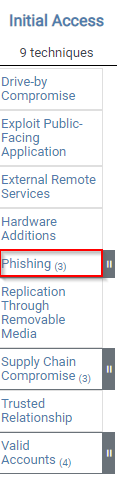
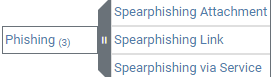
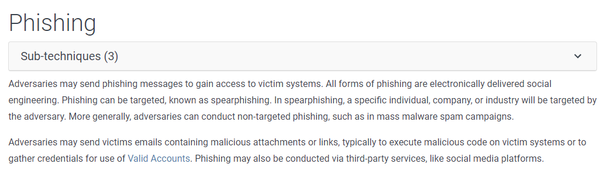

Organisation à but non lucratif qui créée des projets liés à la cybersécurité :

- Terminology :

|Terme|Signification|
|---|---|
|**APT** (_Advanced Persistent Threat_)|Groupe organisé (souvent étatique) menant des attaques prolongées et ciblées.|
|**TTPs**|Décrit comportement global d’un attaquant, pas juste un indicateur technique.   - _T_**actic** → objectif de l’adversaire   - **Technique** → méthode pour atteindre l’objectif   - **Procedure** → manière concrète d’exécuter la technique|

## ATT&CK Framework & NAVIGATOR : Décrit les attaques

Base de connaissance sur les tactiques et techniques des cyberattaquants, décrit TTP.

- For Enterprise contient 14 catégories (de reconnaissance à impact), chaque catégories contient la technique pour parvenir à sa tactique

- Sous chaque tactique → Plusieurs techniques, parfois déclinées en sous-techniques.

- Chaque fiche technique détaille : Description, Procedure Examples, détection, mitigation, liens avec des groupes et logiciels

### Navigator

Permet de visualiser et d’annoter les matrices, utiles pour individualiser en fonction de soihttps://mitre-attack.github.io/attack-navigator//#layerURL=https%3A%2F%2Fattack.mitre.org%2Fgroups%2FG0008%2FG0008-enterprise-layer.json

  

## CAR (Cyber Analytics Repository) : Explique comment les détecter

Un référentiel d’**analyses de détection** basé sur le modèle ATT&CK. CAR complète ATT&CK qui décrit les attaques, CAR explique comment les détecter. https://car.mitre.org/

- Fournit des éléments divers :
	- Pseudocodes décrivant requêtes de détection (Splunk, EQL…)
	- Références vers TTPs
	- Implémentations selon OS et outils.

  

## ENGAGE : Planifier et mener opérations d’engagement adversaire

- Cyber Denial : Empêcher l’adversaire d’agir
- Cyber Deception : Le tromper volontairement
- Catégories principales (Engage Matrix) :

|Catégorie|Description|
|---|---|
|**Prepare**|Actions préliminaires menant à l’objectif|
|**Expose**|Identifier l’adversaire via la tromperie|
|**Affect**|Actions qui perturbent ses opérations|
|**Elicit**|Recueillir des infos sur son mode opératoire|
|**Understand**|Analyser les résultats obtenus|

- **Engage Matrix Explorer** → permet d’explorer ces interactions.

## D3FEND : Base de connaissance des contre-mesures cyber

- Chaque artefact contient

|   |   |
|---|---|
|**Catégorie**|**Description**|
|Definition|Information sur ce qu’est la technique|
|How it works|Comment cette technique fonctionne|
|Consideration|Chose à penser lors de l’implémentation|
|Example|Comment utiliser la technique|

## ATT&CK Emulation Plans : Simuler attaques réelles

## ATT&CK & Threat Intelligence : Faire lien TTP et posture défensive
