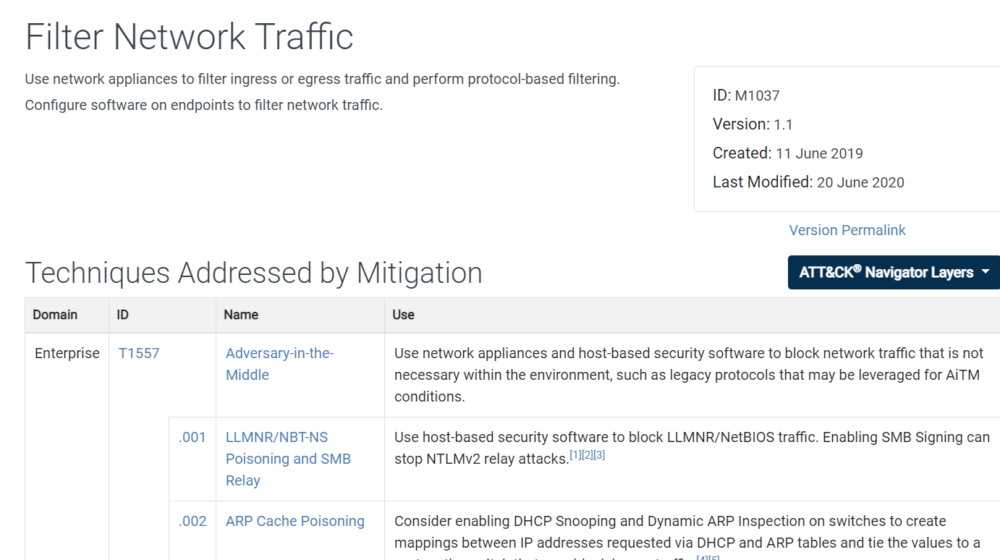

## Mitigation = mesure de réduction du risque

- Une **Mitigation** décrit une mesure défensive permettant de réduire, empêcher ou limiter l’efficacité d’une technique ATT&CK.
- Chaque mitigation possède :
    - un **ID unique** ;
    - un **nom** ;
    - une **description** ;
    - les techniques auxquelles elle peut s’appliquer.

```
Technique = ce que fait l’attaquant
Mitigation = ce que le défenseur peut faire pour réduire ce risque
```




Exemple :

```
Technique
T1003 - OS Credential Dumping
        ↓
Mitigation
Credential protections / restriction d’accès
```


---

## Types de Mitigations

Comme les autres composants ATT&CK, elles sont regroupées selon les matrices :

|Matrix|Mitigations adaptées à|
|---|---|
|`Enterprise Mitigations`: https://attack.mitre.org/mitigations/enterprise/|SI d’entreprise : endpoints, serveurs, cloud, réseau…|
|`Mobile Mitigations`: https://attack.mitre.org/mitigations/mobile/|Android / iOS|
|`ICS Mitigations`: https://attack.mitre.org/mitigations/ics/|Systèmes industriels|


Le nombre de mitigations évolue avec les mises à jour MITRE.

> Les chiffres du cours (`43`, `11`, `51`) sont datés : inutile de les mémoriser.

---

## Identifiants

Les mitigations possèdent généralement un ID du type :

```
Mxxxx
```


Exemple :

```
M1032 - Multi-factor Authentication
```


Comme pour les techniques, l’ID facilite le mapping dans :

- rapports SOC ;
- Purple Team ;
- Threat Modeling ;
- audits ;
- plans de remédiation.

---

## Exemples de mitigations courantes

|Mitigation|But|Exemple|
|---|---|---|
|**Multi-factor Authentication**|Réduire l’impact du vol de credentials|MFA sur VPN, comptes admin, cloud|
|**Least Privilege**|Limiter les privilèges disponibles|Retirer les droits admin inutiles|
|**Network Segmentation**|Limiter le mouvement latéral|VLAN, firewall interne, segmentation AD|
|**Application Control**|Empêcher l’exécution de programmes non autorisés|AppLocker, WDAC|
|**Disable or Remove Feature/Program**|Réduire la surface d’attaque|Désactiver SMBv1, macros inutiles|
|**Privileged Account Management**|Protéger les comptes sensibles|Comptes admin dédiés, PAM|
|**User Training**|Réduire les attaques basées sur l’humain|Sensibilisation phishing|
|**Update Software**|Corriger des vulnérabilités connues|Patch management|

---

## Relation Technique ↔ Mitigation

Une technique peut avoir plusieurs mitigations.

Exemple :

```
Initial Access
→ Phishing
```


Mitigations possibles :

```
User Training
MFA
Email Filtering
Disable/Restrict Macros
```


Autre exemple :

```
Lateral Movement
→ Remote Services
```


Mitigations possibles :

```
Network Segmentation
MFA
Least Privilege
Restrict Remote Services
```


Donc :

```
1 Technique → plusieurs Mitigations possibles
1 Mitigation → peut réduire plusieurs Techniques
```


---

## Mitigation ≠ Detection

Point important :

- **Mitigation** = réduire / empêcher l’attaque.
- **Detection** = détecter que l’attaque est en train de se produire ou s’est produite.

Exemple :

```
PowerShell malveillant
```


Mitigation :

```
Application Control / restriction PowerShell
```


Detection :

```
Logs PowerShell
EDR
Process creation
Command-line monitoring
```


Les deux sont complémentaires.

---

## À retenir

```
Tactic        → Pourquoi ?
Technique     → Comment ?
Sub-Technique → Comment précisément ?
Procedure     → Exemple concret observé
Mitigation    → Comment réduire / empêcher la technique
```


Exemple complet :

```
Credential Access
        ↓
T1003 - OS Credential Dumping
        ↓
T1003.001 - LSASS Memory
        ↓
Procedure : dump de LSASS
        ↓
Mitigation : protections credentials,
restriction des privilèges, Credential Guard...
```


MITRE ATT&CK ne sert donc pas uniquement à décrire les attaques : il permet aussi de relier les comportements adverses à des **mesures défensives concrètes**.
