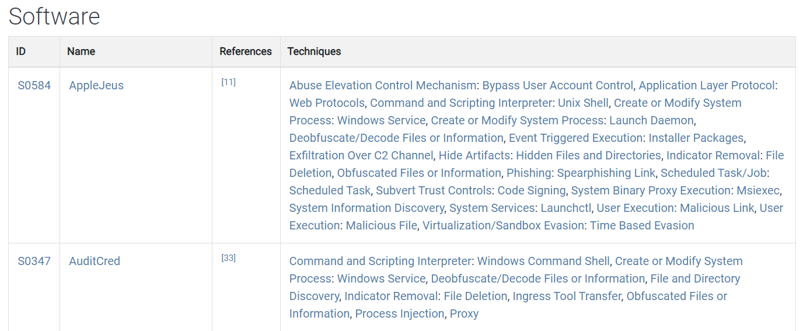

## Group = ensemble d’activités adverses attribuées à un même acteur

`Groups`: https://attack.mitre.org/groups/


- Dans MITRE ATT&CK, un **Group** représente un ensemble d’activités d’intrusion associées à un même acteur / groupe suivi par la communauté CTI.
- Souvent lié à des **APT (Advanced Persistent Threats)**, mais tous les groupes ATT&CK ne sont pas forcément des acteurs étatiques.
- Motivations possibles :
	- espionnage ;
	- gain financier ;
	- sabotage ;
	- influence ;
	- objectifs militaires / géopolitiques.

```
Group = QUI mène l’attaque
Technique = COMMENT il opère
```


> Une attribution n’est jamais parfaite : plusieurs sociétés de sécurité peuvent suivre le même acteur sous des noms différents.

---

## Informations présentes dans MITRE

Chaque groupe possède notamment :

|Élément|Description|
|---|---|
|**Group ID**|Identifiant unique MITRE, ex : `Gxxxx`|
|**Name**|Nom principal utilisé par MITRE|
|**Aliases**|Autres noms donnés au même acteur par différents vendors|
|**Description**|Origine, motivations, activités connues|
|**Techniques**|Techniques / sub-techniques ATT&CK observées|
|**Software**|Malware et outils associés au groupe|
|**References**|Rapports CTI servant de sources|

Exemple conceptuel :




```
Lazarus Group
    ↓
Techniques utilisées
    ├── Phishing
    ├── PowerShell
    ├── Credential Dumping
    └── Exfiltration
    ↓
Software associé
    ├── Malware A
    └── Tool B
```


---

## Group ID

Les groupes possèdent un identifiant de type :

```
Gxxxx
```


Comme pour les Techniques (`Txxxx`) ou Mitigations (`Mxxxx`), cela permet d’utiliser une référence stable dans :

- rapports SOC ;
- Threat Intelligence ;
- Threat Hunting ;
- Purple Team ;
- mapping ATT&CK.

---

## Aliases

Un même acteur peut avoir plusieurs noms selon les éditeurs de sécurité.

Exemple générique :

```
Même acteur
├── Nom utilisé par Microsoft
├── Nom utilisé par Mandiant
├── Nom utilisé par CrowdStrike
└── Nom retenu par MITRE
```


Très important en CTI : deux noms différents ne signifient pas forcément deux groupes différents.

---

## Techniques utilisées par un groupe

MITRE associe aux groupes les techniques observées dans des campagnes réelles.

Exemple :

```
Group
  ↓
Credential Access
  ↓
T1003 - OS Credential Dumping
  ↓
Procedure : utilisation observée d’un outil pour dumper des credentials
```


Cela permet de construire le **profil ATT&CK** d’un threat actor.

Utilités :

- comprendre son mode opératoire ;
- anticiper les techniques probables ;
- vérifier si les détections SOC couvrent ces techniques ;
- faire du threat hunting ciblé.

---

## Groups ≠ attribution certaine

Point important :

```
Comportement similaire ≠ preuve que c’est le même groupe
```


L’attribution repose souvent sur plusieurs indices :

- infrastructure utilisée ;
- malware ;
- TTP ;
- horaires d’activité ;
- victimes ciblées ;
- langues / artefacts ;
- renseignement externe.

Les attaquants peuvent également copier les techniques d’autres groupes pour brouiller l’attribution.

---

## Groups vs Software vs Techniques

```
Group      → QUI ?
Software   → AVEC QUOI ?
Technique  → COMMENT ?
Tactic     → POURQUOI ?
```


Exemple :

```
Group
  ↓
utilise
  ↓
Software / Malware
  ↓
pour appliquer
  ↓
Technique / Sub-Technique
  ↓
afin d’atteindre
  ↓
Tactic
```


---

## À retenir

- Les **Groups** représentent des acteurs / ensembles d’activités adverses suivis par MITRE.
- ID de type `Gxxxx`.
- Un groupe peut posséder plusieurs **aliases**.
- MITRE documente les :
	- techniques utilisées ;
	- outils/malwares associés ;
	- procédures observées ;
	- références CTI.
- Permet de construire une **attack map / profil ATT&CK** d’un acteur.
- Attribution ≠ certitude absolue.
- Le nombre de groupes évolue régulièrement → inutile de mémoriser le chiffre donné dans le cours.
