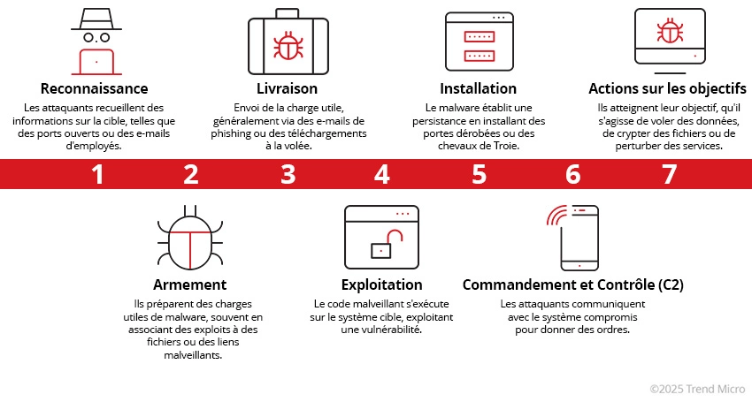

## 1. Reconnaissance

But de l’attaquant : collecter des infos publiques ou directement interagir pour construire un profil ciblé (employés, technos exposées, emails, sous-domaines…).

- Objectif concret : augmenter la connaissance de la cible pour identifier :
	- Phase de recherche et de planning pour l’attaque. Récup des info sur la cible pour se préparer aux étapes suivante. Peut inclure des info sur l’infra, les employées, les process business, techno exposées.
	- Attack Surface : ensemble des éléments potentiellement attaquables (hosts, services, users, applications...)
	- Attack Vector : chemin/méthode précise permettant d'exploiter cette surface (phishing, vuln web, service exposé...)
- OSINT : Collecter depuis : Moteur de recherche, magazine et média en ligne, réseaux sociaux, forum et blog, base de donnée publiques, WHOIS et donnée technique.
- Reco passive : Pas d’interaction directe : WHOIS lookups, social media scrapping, data breach. 
	- Web archives (Wayback Machine) : retrouver anciennes pages, endpoints, fichiers ou technos qui ne sont plus visibles sur le site actuel.
	- Identifier : 
		- Plages IP appartenant à l'orga ;
		- Fournisseurs / partenaires ;
		- Anciennes fuites de données ;
		- Techno et versions publiquement visibles ;
		- Adresses emails / structure des usernames.
- Reco active : Génère directement du trafic vers l'infrastructure cible -> Plus facilement détectable / loggables
	- Ex :
		- Social engineering ;
		- Port scanning ;
		- Banner grabbing ;
		- Service / version détection ;
		- Vulnerability scanning ;
		- Requêtes directes vers serveur Web
	- Identifier : IP -> Port -> Service -> Version -> Vuln potentielle
- Point de vue Blue Team / SOC : Reco est difficile à empêcher, surtout lorsqu'elle utilise des sources publiques. Objectif est donc de réduire l'information exposée et détecter la reconnaissance active.
	- Réaliser réguliérement :
		- External pentest / Attack Surface Assessment ;
		- Recherches OSINT de sa propre organisation ;
		- Surveillance des leaks via Threat Intell.
	- Réduire : 
		- Documents internes accessibles publiquement ;
		- Metadata inutiles ;
		- Versions de logiciels exposées ;
		- Services internet non nécessaires.
	- Détecter : 
		- Scans de ports ;
		- Nombreuses requêtes sur différents endpoints ;
		- Enumération répétée ;
		- Reconnaissance de services.
	- Maintenir les services exposés à jour pour éviter qu'une vulnérabilité découverte pendant la reco soit directement exploitable.
## 2. Armement (Weaponization)

But : Préparation de l'arsenal, transformer l’info en charge actionable (maldoc, exploit pack, payload), mais pas encore d'interaction avec la cible.

- A partir des infos de Reconnaissance, il choisit/assemble : 
	- Exploit adapté à une vulnérabilité identifiée ;
	- Payload / malware ;
	- Document malveillant ;
	- Infrastructure nécessaire ;
	- Techniques d'évasion adaptées aux défenses supposées.
- Exploit vs Payload : 
	- Exploit : code/méthode permettant d'exploiter une vuln.
	- Payload : code exécuté après l'exploitation pour obtenir l'effet désiré.

| Outil / ressource      | Usage                                                                 |
| ---------------------- | --------------------------------------------------------------------- |
| **Metasploit**         | Framework contenant exploits, modules post-exploitation, payloads…    |
| **MSFVenom**           | Génération/formatage de payloads                                      |
| **Exploit-DB**         | Recherche d’exploits publics pour vulnérabilités connues              |
| **Fuzzer (ex: AFL++)** | Découverte de bugs/crashs pouvant mener à de nouvelles vulnérabilités |

- Evasion / Obfuscation : 
	- Une partie importnate de Weaponization peut consister à rendre le payload plus difficile à détecter / analyser
- Point de vue Defender / SOC : L'armement se déroule généralement hors de l'infra de la victime, donc impossible à observer directement dans la majorité des cas.
	- Le défenseur agit surtout en anticipation :
		- patch management ;
		- réduction de la surface d'attaque ;
		- analyse des nouvelles vulns ;
		- Threat Intell sur les outils/malwares utilisés par les adversaires ;
		- tester si EDR/AV détectent les techniques attendues ;

## 3. Livraison (Delivery)

Acheminer le payload à la cible. phishing (spear), watering-hole, USB drops, OAuth consent frauds, liens raccourcis.

- Le payload est déjà préparé à l'étape précédente (Weaponization), ici on cherche seulement à le faire parvenir.
- Principaux vecteurs de Delivery :

| Vecteur      | Exemple                              |
| ------------ | ------------------------------------ |
| Email        | `.docx`, `.zip`, lien phishing       |
| Web          | Fake update/installer, watering hole |
| Social       | DM avec lien/fichier                 |
| Physique     | USB drop                             |
| Accès direct | Upload sur serveur déjà compromis    |

- Point de vue Defender / SOC :
	- Contrôle utiles :
		- Email Security Gateway ;
		- Sandbox des PJ ;
		- URL rewriting / URL scanning ;
		- AV / EDR ;
		- Filtrage Web / DNS ;
		- Firewall ;
		- Blocage des macros non fiables ;
		- Contrôles des périphériques USB ;
		- User awareness / phishing training.
	- A rechercher : 
		- DL depuis domaine récent/suspect ;
		- Fichier avec .ext trompeuse ;
		- Archive protégée par MDP ;
		- Document Office provenant d'internet ;
		- Exécutable lancé depuis / USB / Downloads / Temps ;
		- URL raccourcie ou redirection multiple.

## 4. Exploitation

But : exécuter le code, tirer parti d’une vulnérabilité (CVE connue ou 0-day), exécuter macro, drive-by.

- C'est le moment où le contenu livré devient réellement actif.
- Peut nécessiter : 
	- Vuln logicielle / OS ;
	- Vuln matérielle ;
	- Mauvaise configuration ;
	- Action utilisateur (ouvrir un document, activer une macro, lancer un .exe)
- Exploit /=/ Exploitation : 
	- Exploit : code ou méthode permettant de tirer parti d'une vulnérabilité.
	- Exploitation : phase pendant laquelle cette faiblesse est effectivement utilisée.
- Point de vue Defender / SOC : 
	- A cette phase, les contrôles importants sont classiques : EDR/AV, Patch management, Vuln management, IDP/IPS, application control, sandboxing...
	- A surveiller : 
		- Process creation ;
		- Parent / Child process ;
		- Exploit alert ;
		- PowerShell / CMD lancés par Office ;
		- Connexion réseau juste après ouverture d'un fichier.

## 5. Installation

But : installer composants nécessaires à la compromission sur le système cible. (backdoor, webshell, services, run keys, scheduled tasks).

- Installer ou modifier des composants sur la machine compromise pour maintenir / renforcer l'accès.
- Persistence : Si l'accès initial dépend d'une vulnérabilité (CVE) -> patch demain -> accès perdu, donc attaquant cherche un autre mécanisme : 
	- Scheduled Task ;
	- Installer web shell sur webservers : Script malicieux utilisé pour maintenir un accès sur le système compromis.
	- Installer backdoor : Attaquant peut utiliser Meterpreter pour installer backdoor sur la victime.
	- Créer ou modifier service.
	- Ajouter une entrée dans les “run keys” pour le payload dans l’éditeur de registre.
	- DLL / autorun.
- Dropper / Loader / Payload : 
	- Dropper : dépose un ou plusieurs fichiers malveillants sur la machine.
	- Loader : charge/exécute un payload, parfois directement en mémoire.
	- Payload : composant qui réalise l'action finale.
- Backdoor / Webshell :
	- Backdoor : mécanisme permettant de revenir sur le système sans repasser par le vecteur initial.
	- Webshell : script malveillant placé sur un serveur Web permettant d'exécuter des commandes à distance.
- Defense Evasion : Pendant l'installation, l'attaquant cherche généralement aussi à rester discret : 
	- Masquer fichiers/process ;
	- Utiliser noms ressemblant à des binaires Windows ;
	- Modifier exclusion AV ;
	- Désactiver protections ; 
	- Supprimer certaines traces ;
	- Utiliser LOLBins.
- Point de vue Defender / Threat Hunting : Si l'attaquant atteint cette étape, il à déjà exécuté quelque chose sur la machine, il faut donc chercher les changements post-compromission : 
	- Nouveaux services, scheduled tasks, clés Run modifiées, comptes crées, règles firewall ajoutées, fichiers dans Startup, nouveaux fichiers dans webroot ;
	- Exécutables déplosés dans : 
		- `%TEMP%`
		- `%APPDATA%`
		- `%ProgramData%`
		- `C:\Users\Public`
	- Signature / Application Control : Recommande d'autoriser uniquement les exécutables signés : AppLocker / Windows Defender Application Control (WDAC)

## 6. Command & Control (C2)

But : Canal de communication entre l'attaquant et le système compromis (beaconing, exfiltration).

- Machine compromise pourra communiquer vers un serveur externe mis en place par un attaquant. Après cela établit, attaquant aura contrôle total sur la machine de la victime.
- Callback / Beaconing :
	- Très souvent ce n'est pas l'attaquant qui initie une connexion entrante vers la victime, le malware contacte lui-même le C2 : traverse plus facilement NAT/Firewall, trafic sortant souvent moins filtré, peut se mélanger au trafic légitime.
	- Beaconing : un implant peut contacter périodiquement son C2 pour demander "As-tu une commande pour moi ?", cette periodicité est appelée beaconing, Pour éviter d'être détectés, certains implants utilisent du jitter (rend périodicité moins évidente)/
- Canal C2 les plus communs :
	- HTTP sur le port 80 et HTTPS sur le port 443, permet à l’attaquant de se noyer dans la masse et passer Firewall.
	- DNS : Machine infectée va faire constamment des requêtes DNS au serveur DNS contrôlé par l’attaquant, connu sous DNS Tunneling

| Canal                  | Pourquoi utilisé                                                     |
| ---------------------- | -------------------------------------------------------------------- |
| **HTTP/HTTPS**         | Se mélange au trafic Web normal ; `80/443` souvent autorisés         |
| **DNS**                | DNS presque toujours disponible ; possibilité de tunneling           |
| **TCP/UDP custom**     | Protocole spécifique au malware                                      |
| **Cloud/API légitime** | Discord, Telegram, GitHub, stockage cloud… pour masquer le trafic    |
| **SMB**                | Peut servir à la communication entre machines compromises en interne |

- Reverse Shell vs C2 implant : 
	- Reverse shell : la victime ouvre une connexion vers l'attaquant et lui fournit directement un shell.
	- C2 implant / agent : programme plus complet qui communique périodiquement avec une infra C2. 
		- Frameworks courants : Metasploit (Meterpreter), Sliver, Mythic, Havoc.
- Infrastructure C2 : 
	- L'attaquant peut utiliser plusieurs couches : Victime -> Redirector / Proxy -> C2 réel. Redirector évite d'exposer directement le serveur principal de l'attaquant.
	- Infra possible : VPS, domaine dédié, domaine compromis, proxy/redirector, service cloud légit.
- Point de vue Defender / SOC : Phase où Network Security Monitoring devient particulièrement importante.
	- A rechercher : 
		- Connexion périodiques vers la même IP/domaine ;
		- Domaine récemment crée ou très rare ;
		- Machine qui contacte une IP connue comme C2 ;
		- Trafic externe inhabituel depuis un serveur ;
		- Processus inhabituel initiant une co réseau
- Egress filtreing : Complément important côté défense : 
	- Contrôler connexions sortantes, pas uniquement entrantes ;
	- Limiter les machines pouvant accéder directement à internet ;
	- Imposer proxy / DNS interne ;
	- Bloquer destinations malveillantes via Threat Intell.

## 7. Actions sur l’objectif

But : Phase où l’adversaire utilise l'accès obtenu pour atteindre son objectif réel (vol de credentials, exfiltration, sabotage, chiffrement).

| Objectif                   | Exemple                                       |
| -------------------------- | --------------------------------------------- |
| **Espionnage**             | Vol de documents, emails, secrets industriels |
| **Financier**              | Ransomware, fraude, extorsion                 |
| **Sabotage**               | Suppression de données, arrêt de services     |
| **Exfiltration**           | Vol massif de fichiers / bases de données     |
| **Manipulation**           | Modification de données ou transactions       |
| **Expansion de l’attaque** | Compromettre d’autres machines / comptes      |
| **Destruction**            | Wiper, corruption de systèmes                 |

- Collection vs Exfiltration vs Impact : 
	- Collection : rassembler les données intéressantes.
	- Exfiltration : Faire sortir les données de l'environnement.
	- Impact : Perturber, chiffrer, supprimer ou modifier les systèmes/données.
- Compression / Staging : 
	- Data compression : sert surtout à préparer les données.
	- Staging : Regroupement temporaire des données avant exfiltration.
- Exfiltration : 
	- Méthodes courantes : HTTPS, cloud storage, FTP/SFTP, SMB vers un autre hôte compromis, C2, DNS tunneling, services légit détournés. 
- Point de vue Defender / SOC : A ce stade, l'objectif principal est de limiter les dégâts et empêcher l'attaquant d'atteindre complétement son objectif. 
	- Contrôles importants : 
		- Network Security Monitoring, EDR, DLP, segmentation réseau, contrôle des accès aux fichiers / DB, monitoring des comptes privilégiés, détection d'archives massives, contrôle du trafic sortant, sauvegardes protégées / offline, incident response rapide.
	- A surveiller : 
		- Gros volume sortant inhabituel ;
		- Upload vers domaine rare ;
		- Archives créées juste avant transfert ;
		- Trafic nocturne inhabituel ;
		- Workstation envoyant plusieurs Go vers Internet.
- DLP : Data Loss Prevention : Permet de détecter / empêcher la sortie de données sensibles. 
- Least Privilege / Segmentation : 
	- Limiter les droits réduit l'impact : segmentation, PAM, séparation des comptes admins, ACL correctes.
