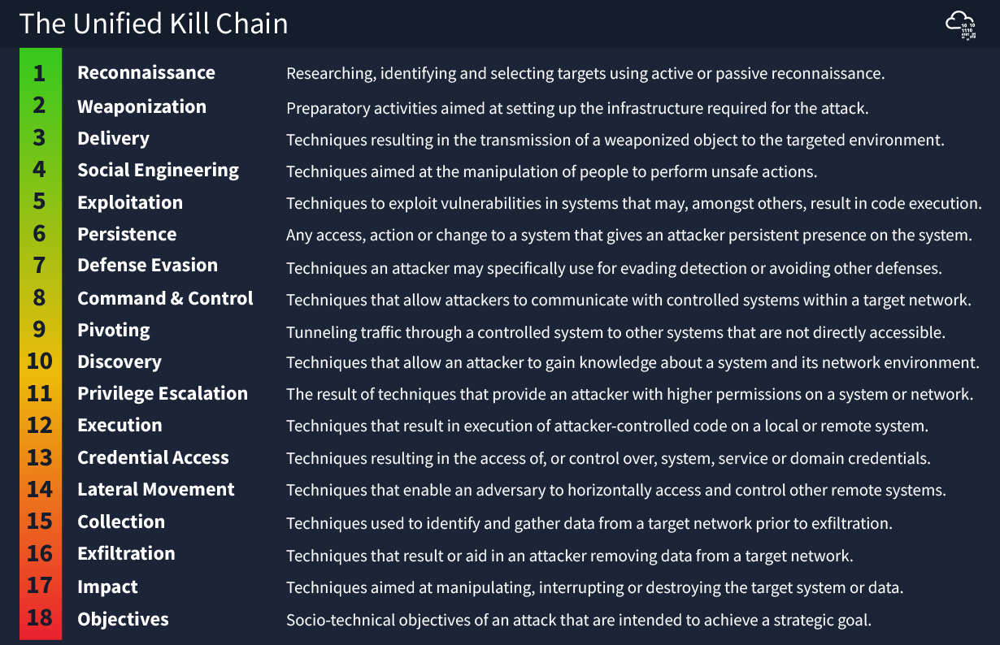

Intéressante car plus moderne (2017 update en 2022) et prend en compte les nouvelles tendances.

La UKC regroupe **18 phases**, organisées en **3 macro-phases** :

1. **In** → Gagner un accès initial (Initial Foothold)
2. **Through** → Se propager et consolider sa position (Network Propagation)
3. **Out** → Atteindre les objectifs (Actions on Objectives)

## Phase 1 - In - Initial foothold

Obtenir premier point d’entrée dans la cible
### 1. Reconnaissance (MITRE : TA0043)

- Collecte d’information sur la cible (OSINT, scans, services, emails…)
- Passive (WHOIS, Linkedin…) & Active (Port scanning)
- Sert à identifier des vulnérabilités exploitables, employés ou creds exposés

### 2. Weaponization (TA0001)

- Préparation de l’attaque : Création ou acquisition d’outils malveillants.
- Exemple : Configurer C2, générer payload…

### 3. Social Engineering (TA0001)

- Manipulation humaine pour obtenir un accès.
- Exemples : phishing, spear-phishing, faux sites de login, appels téléphoniques d’ingénierie sociale.

### 4️⃣ Exploitation (TA0002)

- Exploitation technique d’une faille (logicielle ou humaine).
- Exemples : exécution de code via une vulnérabilité web, macros malveillantes, injections, exploits 0-day.

### 5️⃣ Persistence (TA0003)

- Maintenir un accès même après un redémarrage ou un nettoyage.
- Exemples : création de services Windows, modification de clés de registre, installation d’un web shell.

### 6️⃣ Defence Evasion (TA0005)

- Techniques pour **éviter la détection** par les antivirus, EDR, ou IDS.
- Exemples : obfuscation, chiffrement, timestomping, désactivation de logs.

### 7️⃣ Command & Control (TA0011)

- Mise en place d’un **canal de communication** entre l’attaquant et la machine compromise.
- Exemples : C2 via HTTP/HTTPS, DNS tunneling, ou protocoles chiffrés personnalisés.

### 8️⃣ Pivoting (TA0008)

- Utiliser une machine compromise comme **base d’opérations** pour atteindre d’autres systèmes internes.
- Exemples : SSH tunneling, proxychains, RDP vers d’autres hôtes internes.

  

## Phase 2 - Through (Propagation réseau)

Étendre l’accès dans le réseau et accroître les privilèges.
### 9️⃣ Pivoting (TA0008)

- Utiliser un point d’entrée pour attaquer d’autres segments du réseau (intranet, serveurs internes).

### 🔟 Discovery (TA0007)

- Identifier les systèmes, utilisateurs, services et configurations internes.
- Exemples : `net view`, `ipconfig /all`, `whoami`, `Get-ADUser`.

### 1️⃣1️⃣ Privilege Escalation (TA0004)

- Obtenir des droits supérieurs (Admin, Root).
- Exemples : exploitation de vulnérabilités locales, abus de services, jetons, ou permissions faibles.

### 1️⃣2️⃣ Execution (TA0002)

- Exécuter du code malveillant sur le système.
- Exemples : scripts PowerShell, scheduled tasks, injection de processus.

### 1️⃣3️⃣ Credential Access (TA0006)

- Vol de mots de passe, hash, tokens ou cookies.
- Exemples : keylogging, Mimikatz, LSASS dump, vol de sessions RDP.

### 1️⃣4️⃣ Lateral Movement (TA0008)

- Déplacement d’un système à un autre pour étendre le contrôle.
- Exemples : Pass-the-Hash, RDP, SMB exploitation.

## Phase 3 - Out - (Actions sur objectifs)

Réaliser les buts de l’attaque (vol, destruction, rançon, etc.).
### 1️⃣5️⃣ Collection (TA0009)

- Rassembler les données sensibles.
- Exemples : documents, bases de données, historiques de navigation, emails.

### 1️⃣6️⃣ Exfiltration (TA0010)

- Extraire les données du réseau vers l’extérieur.
- Exemples : transfert via C2, FTP, cloud, ou dissimulation dans un flux chiffré.

### 1️⃣7️⃣ Impact (TA0040)

- Dégrader ou détruire les ressources du système.
- Exemples : ransomware, effacement de disques, DDoS, sabotage, défacement.

### 1️⃣8️⃣ Objectives

- Réalisation finale de la mission de l’adversaire.
- Exemples : gain financier (ransomware), espionnage, sabotage, atteinte à la réputation

|**Macro-phase**|**Objectif**|**Phases principales**|
|---|---|---|
|**IN**|Gagner un accès initial|Recon, Weaponization, Social Eng., Exploit, Persistence, Defence Evasion, C2, Pivoting|
|**THROUGH**|Se propager dans le réseau|Discovery, Priv. Escalation, Execution, Credential Access, Lateral Movement|
|**OUT**|Atteindre les objectifs finaux|Collection, Exfiltration, Impact, Objectives|
