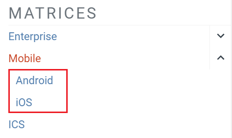
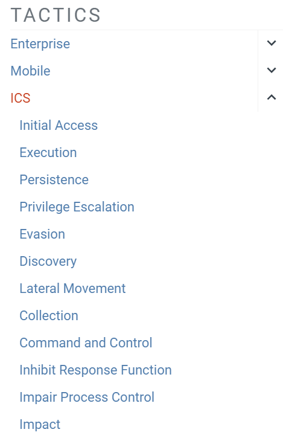
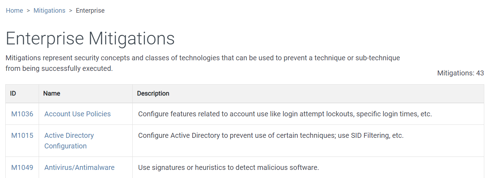
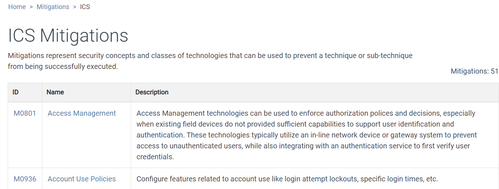
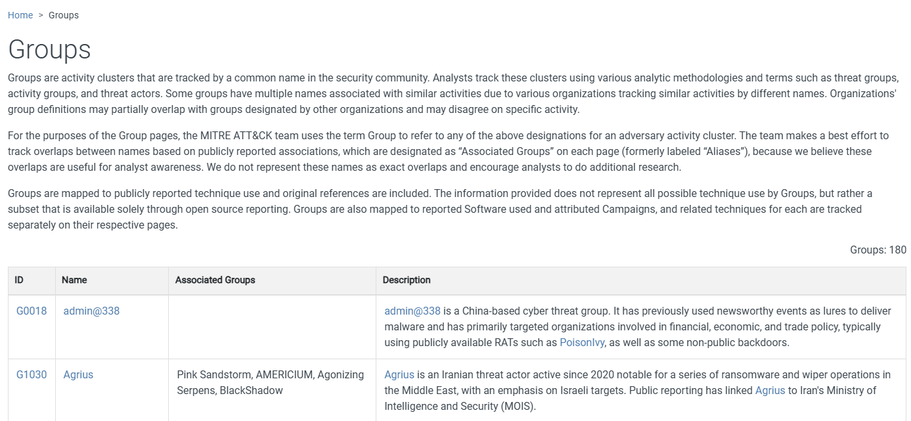

- **Tactics** = le _pourquoi_ / objectif de l’attaquant
- **Techniques** = le _comment_
- **Sub-techniques** = variante plus précise d’une technique
- **Procedures** = implémentation concrète observée chez un threat actor / malware
- **Groups** = groupes d’attaquants
- **Software** = malwares / outils
- **Mitigations** = moyens de réduction du risque
- **Data Sources / Detection** = ce qu’on peut surveiller pour détecter la technique

## Qu’est-ce qu’une Matrix ?

- Une **Matrix ATT&CK** est une représentation visuelle des comportements et méthodes utilisés par les attaquants.
- Elle permet de classifier les actions adverses selon :
	- leur **objectif** → Tactic
	- la **méthode utilisée** → Technique / Sub-technique
- Utilisée pour :
	- comprendre une attaque ;
	- mapper le comportement d’un threat actor / malware ;
	- analyser la couverture de détection d’un SOC ;
	- identifier des gaps de sécurité.

Structure générale :

```
Tactics (colonnes)
    ↓
Techniques
    ↓
Sub-techniques
```

> ATT&CK n’est pas forcément une chronologie stricte : un attaquant peut utiliser plusieurs techniques/tactiques dans différents ordres.

---

### Types de matrices

MITRE ATT&CK distingue principalement 3 matrices :

|Matrix|Cible|
|---|---|
|**Enterprise**|SI d’entreprise : endpoints, serveurs, cloud, réseau…|
|**Mobile**|Appareils mobiles Android / iOS|
|**ICS**|Industrial Control Systems / environnements industriels|

---

### Enterprise Matrix

`Enterprise Matrix`: https://attack.mitre.org/matrices/enterprise/


- Matrice principale et la plus riche.
- Conçue pour représenter les comportements adverses rencontrés dans les environnements d’entreprise.
- Couvre notamment 7 sous-matrices :
	- Windows
	- Linux
	- macOS
	- Cloud
	- équipements réseau
	- containers
	- PRE (activités précédant ou préparant certaines phases d’attaque)


Exemples de scénarios :

```
Phishing
Credential Dumping
PowerShell
Persistence
Lateral Movement
Exfiltration
```

---

### Mobile Matrix

`Mobile Matrix`: https://attack.mitre.org/matrices/mobile/


- Orientée sécurité des smartphones/tablettes.
- Plateformes principales, 2 sous-matrices :
	- `Android`
	- `iOS`



Contient des techniques propres aux mobiles :

- collecte SMS / contacts ;
- accès localisation ;
- abus de permissions ;
- interception de communications ;
- persistance via applications malveillantes.

Moins volumineuse que la matrice Enterprise.

---

### ICS Matrix

`ICS Matrix`: https://attack.mitre.org/matrices/ics/


**ICS = Industrial Control Systems**

Concerne les environnements industriels :

- automates / PLC ;
- systèmes SCADA ;
- infrastructures énergétiques ;
- chaînes de production ;
- systèmes de contrôle industriels.

Les attaques ICS peuvent viser non seulement :

```
Confidentialité / données
```

mais aussi :

```
Disponibilité
Contrôle physique
Sécurité des personnes / équipements
```

Exemples :

- arrêt d’un processus industriel ;
- modification des paramètres d’un automate ;
- perte de contrôle d’un équipement ;
- sabotage.

---

### À retenir

```
Enterprise → SI d’entreprise
Mobile     → Android / iOS
ICS        → systèmes industriels
```

La Matrix est surtout une **cartographie des comportements adverses** :

```
Tactic → objectif de l’attaquant
Technique → méthode utilisée
Sub-technique → méthode plus précise
```

Exemple :

```
Credential Access
      ↓
OS Credential Dumping
      ↓
LSASS Memory
```

→ On part de l’objectif général pour aller vers la méthode précise utilisée par l’attaquant.

  

## MITRE ATT&CK — Tactics

### Tactic = objectif de l’attaquant


- Une **Tactic** représente le **but / pourquoi** derrière une action adverse.
- Dans la Matrix, les tactics sont les **colonnes tout en haut**.
- Elles regroupent les techniques permettant d’atteindre un même objectif.

```
Tactic     = Pourquoi ?
Technique  = Comment ?
```

Exemple :

```
Credential Access           → objectif : obtenir des identifiants
    ↓
OS Credential Dumping       → technique utilisée
    ↓
LSASS Memory                → sub-technique précise
```

> Les tactics ATT&CK ne représentent **pas forcément des étapes chronologiques**.
> 
> Un attaquant peut revenir sur une tactic, en sauter certaines ou en utiliser plusieurs en parallèle.

---

### Enterprise Tactics

`Enterprise Tactics`: https://attack.mitre.org/tactics/enterprise/


La matrice Enterprise possède **14 tactics** :

|Tactic|Objectif|Exemple|
|---|---|---|
|**Reconnaissance**|Collecter des informations sur la cible avant l’attaque.|OSINT, découverte de sous-domaines, recherche d’employés|
|**Resource Development**|Préparer l’infrastructure et les ressources nécessaires à l’attaque.|Création d’un domaine, VPS, infrastructure C2|
|**Initial Access**|Obtenir un premier accès dans l’environnement cible.|Phishing, exploitation d’un service exposé, compte compromis|
|**Execution**|Exécuter du code ou des commandes sur la cible.|PowerShell, macro Office, script|
|**Persistence**|Maintenir l’accès malgré reboot/logout.|Scheduled Task, clé `Run`, service malveillant|
|**Privilege Escalation**|Obtenir des privilèges plus élevés.|User → Administrator/SYSTEM via service mal configuré|
|**Defense Evasion**|Contourner ou éviter les protections/détections.|Obfuscation, désactivation AV, suppression de logs|
|**Credential Access**|Récupérer des identifiants ou secrets.|Dump LSASS, SAM, Kerberos tickets|
|**Discovery**|Cartographier et comprendre l’environnement compromis.|`whoami`, `hostname`, `ipconfig`, `net user`|
|**Lateral Movement**|Se déplacer vers d’autres machines du réseau.|RDP, SMB, WinRM, PsExec|
|**Collection**|Rassembler les données intéressantes.|Documents, screenshots, archives ZIP|
|**Command and Control**|Communiquer avec les systèmes compromis.|HTTPS, DNS, TCP, cloud services|
|**Exfiltration**|Faire sortir les données de l’environnement cible.|HTTPS, FTP/SFTP, cloud, DNS tunneling|
|**Impact**|Perturber, détruire ou modifier systèmes/données.|Ransomware, suppression de données, sabotage|

---

### Mobile Tactics

`Mobile Tactics`: https://attack.mitre.org/tactics/mobile/


Mobile reprend une grande partie des tactics Enterprise :

```
Initial Access
Execution
Persistence
Privilege Escalation
Defense Evasion
Credential Access
Discovery
Lateral Movement
Collection
Command and Control
Exfiltration
Impact
```

Avec également des tactics spécifiques aux appareils mobiles :

- **Network Effects**
- **Remote Service Effects**

---

### ICS Tactics

`ICS Tactics`: https://attack.mitre.org/tactics/ics/



ICS reprend aussi plusieurs tactics classiques, mais ajoute des objectifs spécifiques aux systèmes industriels :

- **Inhibit Response Function**
	- empêcher les mécanismes de sécurité/réponse de fonctionner.
- **Impair Process Control**
	- dégrader ou modifier le contrôle d’un processus industriel.
- **Impact**
	- provoquer un effet réel sur la production / infrastructure.

Exemple :

```
Attaquant
   ↓
Accès au réseau industriel
   ↓
Manipulation PLC
   ↓
Altération du procédé physique
```

---

### À retenir

```
Tactic = objectif / WHY
Technique = méthode / HOW
Sub-technique = méthode plus précise
```

Exemple complet :

```
Credential Access
        ↓
OS Credential Dumping
        ↓
LSASS Memory
```

Et la chaîne Enterprise peut grossièrement se visualiser comme :

```
Recon
  ↓
Resource Development
  ↓
Initial Access
  ↓
Execution
  ↓
Persistence / PrivEsc / Defense Evasion
  ↓
Credential Access / Discovery
  ↓
Lateral Movement
  ↓
Collection
  ↓
C2 / Exfiltration
  ↓
Impact
```

Mais **ATT&CK n’est pas une kill chain stricte** : cet ordre sert seulement à visualiser un scénario plausible.

  

## MITRE ATT&CK — Techniques, Sub-Techniques & Procedures

### Technique / Sub-Technique


Les **Tactics** donnent l’objectif de l’attaquant, tandis que les **Techniques** décrivent **comment il atteint cet objectif**.

```
Tactic        = Pourquoi ?
Technique     = Comment ?
Sub-Technique = Comment, précisément ?
Procedure     = Comment cela a été réellement utilisé ?
```

Exemple :

```
Credential Access
        ↓
OS Credential Dumping
        ↓
LSASS Memory
```

- Une **Technique** représente une méthode générale utilisée par l’attaquant.
- Une **Sub-Technique** décrit une variante / implémentation plus précise.
- Toutes les techniques ne possèdent pas forcément de sub-techniques.
- Une même technique peut parfois être liée à **plusieurs tactics**, selon l'objectif pour lequel elle est utilisée.

---

### Identifiants ATT&CK

Chaque technique possède un ID unique :

```
T1003 = OS Credential Dumping
```

Les sub-techniques reprennent l’ID de la technique avec un suffixe :

```
T1003.001 = LSASS Memory
T1003.002 = Security Account Manager
T1003.003 = NTDS
```

Très utile dans :

- règles SIEM / EDR ;
- rapports SOC ;
- Threat Intelligence ;
- pentest / Purple Team ;
- mapping de détection.

Exemple :

```
Alert: accès suspect à LSASS
→ MITRE ATT&CK T1003.001
```

---

### Structure dans la Matrix


Dans la matrice :

```
Tactic
 ├── Technique
 │    ├── Sub-Technique
 │    ├── Sub-Technique
 │    └── Sub-Technique
 └── Technique
```

Les techniques disposant de sub-techniques peuvent être développées dans l’interface ATT&CK pour afficher les variantes associées.

Exemple :

```
Credential Access
    ↓
OS Credential Dumping (T1003)
    ├── LSASS Memory (T1003.001)
    ├── SAM (T1003.002)
    └── NTDS (T1003.003)
```

---

### Types de Techniques

Les techniques sont organisées selon les différentes matrices :

|Matrix|Techniques adaptées à|
|---|---|
|`Enterprise Techniques and Sub-techniques`: https://attack.mitre.org/techniques/enterprise/|Windows, Linux, macOS, Cloud, Network, Containers…|
|`Mobile Techniques and Sub-techniques`: https://attack.mitre.org/techniques/mobile/|Android / iOS|
|`ICS Techniques and Sub-techniques`: https://attack.mitre.org/techniques/ics/|Systèmes et processus industriels|

Le nombre de techniques/sub-techniques **évolue régulièrement** avec les mises à jour ATT&CK.

> Les chiffres donnés dans le cours (`193 techniques`, `401 sub-techniques`, etc.) datent de 2023 : inutile de les mémoriser. Le plus important est de comprendre leur organisation.

---

### Procedure


Une **Procedure** est un exemple concret d’utilisation d’une technique ou sub-technique observé dans le monde réel.

Elle peut préciser :

- quel groupe d’attaquants l’a utilisée ;
- quel malware / outil a été utilisé ;
- quelles commandes ou méthodes ont été observées ;
- comment la technique a été implémentée.

Exemple :

```
Tactic
Credential Access
      ↓
Technique
OS Credential Dumping (T1003)
      ↓
Sub-Technique
LSASS Memory (T1003.001)
      ↓
Procedure
Un malware / threat actor utilise Mimikatz
pour récupérer des credentials depuis LSASS
```

Donc :

```
Technique = concept général
Procedure = utilisation réelle et concrète de ce concept
```

Une procedure **n’est pas une nouvelle technique ATT&CK** : c’est un exemple documenté de son utilisation.

---

### Exemple complet

```
Tactic
Credential Access
        ↓
Technique
T1003 - OS Credential Dumping
        ↓
Sub-Technique
T1003.001 - LSASS Memory
        ↓
Procedure
Un attaquant utilise un outil de credential dumping
pour récupérer des secrets présents dans la mémoire LSASS.
```

Autre exemple :

```
Tactic
Execution
        ↓
Technique
T1059 - Command and Scripting Interpreter
        ↓
Sub-Technique
T1059.001 - PowerShell
        ↓
Procedure
Utilisation de PowerShell pour exécuter
un script/payload sur la machine compromise.
```

---

### À retenir

```
Tactic        → objectif de l'attaquant
Technique     → méthode utilisée
Sub-Technique → méthode plus précise
Procedure     → exemple concret observé
```

Avec les IDs :

```
Technique     → Txxxx
Sub-Technique → Txxxx.xxx
```

Exemple à connaître :

```
Credential Access
→ T1003 OS Credential Dumping
→ T1003.001 LSASS Memory
→ utilisation concrète d'un outil pour extraire les credentials de LSASS
```

MITRE permet donc de passer d'une **vision générale de l'objectif** jusqu'à la **méthode réellement observée sur le terrain**.

## MITRE ATT&CK — Mitigations

### Mitigation = mesure de réduction du risque

- Une **Mitigation** décrit une mesure défensive permettant de réduire, empêcher ou limiter l’efficacité d’une technique ATT&CK.
- Chaque mitigation possède :
	- un **ID unique** ;
	- un **nom** ;
	- une **description** ;
	- les techniques auxquelles elle peut s’appliquer.

```
Technique = ce que fait l’attaquant
Mitigation = ce que le défenseur peut faire pour réduire ce risque
```


Exemple :

```
Technique
T1003 - OS Credential Dumping
        ↓
Mitigation
Credential protections / restriction d’accès
```

---

### Types de Mitigations

Comme les autres composants ATT&CK, elles sont regroupées selon les matrices :

|Matrix|Mitigations adaptées à|
|---|---|
|`Enterprise Mitigations`: https://attack.mitre.org/mitigations/enterprise/|SI d’entreprise : endpoints, serveurs, cloud, réseau…|
|`Mobile Mitigations`: https://attack.mitre.org/mitigations/mobile/|Android / iOS|
|`ICS Mitigations`: https://attack.mitre.org/mitigations/ics/|Systèmes industriels|






Le nombre de mitigations évolue avec les mises à jour MITRE.

> Les chiffres du cours (`43`, `11`, `51`) sont datés : inutile de les mémoriser.

---

### Identifiants

Les mitigations possèdent généralement un ID du type :

```
Mxxxx
```

Exemple :

```
M1032 - Multi-factor Authentication
```

Comme pour les techniques, l’ID facilite le mapping dans :

- rapports SOC ;
- Purple Team ;
- Threat Modeling ;
- audits ;
- plans de remédiation.

---

### Exemples de mitigations courantes

|Mitigation|But|Exemple|
|---|---|---|
|**Multi-factor Authentication**|Réduire l’impact du vol de credentials|MFA sur VPN, comptes admin, cloud|
|**Least Privilege**|Limiter les privilèges disponibles|Retirer les droits admin inutiles|
|**Network Segmentation**|Limiter le mouvement latéral|VLAN, firewall interne, segmentation AD|
|**Application Control**|Empêcher l’exécution de programmes non autorisés|AppLocker, WDAC|
|**Disable or Remove Feature/Program**|Réduire la surface d’attaque|Désactiver SMBv1, macros inutiles|
|**Privileged Account Management**|Protéger les comptes sensibles|Comptes admin dédiés, PAM|
|**User Training**|Réduire les attaques basées sur l’humain|Sensibilisation phishing|
|**Update Software**|Corriger des vulnérabilités connues|Patch management|

---

### Relation Technique ↔ Mitigation

Une technique peut avoir plusieurs mitigations.

Exemple :

```
Initial Access
→ Phishing
```

Mitigations possibles :

```
User Training
MFA
Email Filtering
Disable/Restrict Macros
```

Autre exemple :

```
Lateral Movement
→ Remote Services
```

Mitigations possibles :

```
Network Segmentation
MFA
Least Privilege
Restrict Remote Services
```

Donc :

```
1 Technique → plusieurs Mitigations possibles
1 Mitigation → peut réduire plusieurs Techniques
```

---

### Mitigation ≠ Detection

Point important :

- **Mitigation** = réduire / empêcher l’attaque.
- **Detection** = détecter que l’attaque est en train de se produire ou s’est produite.

Exemple :

```
PowerShell malveillant
```

Mitigation :

```
Application Control / restriction PowerShell
```

Detection :

```
Logs PowerShell
EDR
Process creation
Command-line monitoring
```

Les deux sont complémentaires.

---

### À retenir

```
Tactic        → Pourquoi ?
Technique     → Comment ?
Sub-Technique → Comment précisément ?
Procedure     → Exemple concret observé
Mitigation    → Comment réduire / empêcher la technique
```

Exemple complet :

```
Credential Access
        ↓
T1003 - OS Credential Dumping
        ↓
T1003.001 - LSASS Memory
        ↓
Procedure : dump de LSASS
        ↓
Mitigation : protections credentials,
restriction des privilèges, Credential Guard...
```

MITRE ATT&CK ne sert donc pas uniquement à décrire les attaques : il permet aussi de relier les comportements adverses à des **mesures défensives concrètes**.

## MITRE ATT&CK — Groups [APT, Threat Actors, Attribution]

### Group = ensemble d’activités adverses attribuées à un même acteur

`Groups`: https://attack.mitre.org/groups/



- Dans MITRE ATT&CK, un **Group** représente un ensemble d’activités d’intrusion associées à un même acteur / groupe suivi par la communauté CTI.
- Souvent lié à des **APT (Advanced Persistent Threats)**, mais tous les groupes ATT&CK ne sont pas forcément des acteurs étatiques.
- Motivations possibles :
	- espionnage ;
	- gain financier ;
	- sabotage ;
	- influence ;
	- objectifs militaires / géopolitiques.

```
Group = QUI mène l’attaque
Technique = COMMENT il opère
```

> Une attribution n’est jamais parfaite : plusieurs sociétés de sécurité peuvent suivre le même acteur sous des noms différents.

---

### Informations présentes dans MITRE

Chaque groupe possède notamment :

|Élément|Description|
|---|---|
|**Group ID**|Identifiant unique MITRE, ex : `Gxxxx`|
|**Name**|Nom principal utilisé par MITRE|
|**Aliases**|Autres noms donnés au même acteur par différents vendors|
|**Description**|Origine, motivations, activités connues|
|**Techniques**|Techniques / sub-techniques ATT&CK observées|
|**Software**|Malware et outils associés au groupe|
|**References**|Rapports CTI servant de sources|

Exemple conceptuel :


```
Lazarus Group
    ↓
Techniques utilisées
    ├── Phishing
    ├── PowerShell
    ├── Credential Dumping
    └── Exfiltration
    ↓
Software associé
    ├── Malware A
    └── Tool B
```

---

### Group ID

Les groupes possèdent un identifiant de type :

```
Gxxxx
```

Comme pour les Techniques (`Txxxx`) ou Mitigations (`Mxxxx`), cela permet d’utiliser une référence stable dans :

- rapports SOC ;
- Threat Intelligence ;
- Threat Hunting ;
- Purple Team ;
- mapping ATT&CK.

---

### Aliases

Un même acteur peut avoir plusieurs noms selon les éditeurs de sécurité.

Exemple générique :

```
Même acteur
├── Nom utilisé par Microsoft
├── Nom utilisé par Mandiant
├── Nom utilisé par CrowdStrike
└── Nom retenu par MITRE
```

Très important en CTI : deux noms différents ne signifient pas forcément deux groupes différents.

---

### Techniques utilisées par un groupe

MITRE associe aux groupes les techniques observées dans des campagnes réelles.

Exemple :

```
Group
  ↓
Credential Access
  ↓
T1003 - OS Credential Dumping
  ↓
Procedure : utilisation observée d’un outil pour dumper des credentials
```

Cela permet de construire le **profil ATT&CK** d’un threat actor.

Utilités :

- comprendre son mode opératoire ;
- anticiper les techniques probables ;
- vérifier si les détections SOC couvrent ces techniques ;
- faire du threat hunting ciblé.

---

### Groups ≠ attribution certaine

Point important :

```
Comportement similaire ≠ preuve que c’est le même groupe
```

L’attribution repose souvent sur plusieurs indices :

- infrastructure utilisée ;
- malware ;
- TTP ;
- horaires d’activité ;
- victimes ciblées ;
- langues / artefacts ;
- renseignement externe.

Les attaquants peuvent également copier les techniques d’autres groupes pour brouiller l’attribution.

---

### Groups vs Software vs Techniques

```
Group      → QUI ?
Software   → AVEC QUOI ?
Technique  → COMMENT ?
Tactic     → POURQUOI ?
```

Exemple :

```
Group
  ↓
utilise
  ↓
Software / Malware
  ↓
pour appliquer
  ↓
Technique / Sub-Technique
  ↓
afin d’atteindre
  ↓
Tactic
```

---

### À retenir

- Les **Groups** représentent des acteurs / ensembles d’activités adverses suivis par MITRE.
- ID de type `Gxxxx`.
- Un groupe peut posséder plusieurs **aliases**.
- MITRE documente les :
	- techniques utilisées ;
	- outils/malwares associés ;
	- procédures observées ;
	- références CTI.
- Permet de construire une **attack map / profil ATT&CK** d’un acteur.
- Attribution ≠ certitude absolue.
- Le nombre de groupes évolue régulièrement → inutile de mémoriser le chiffre donné dans le cours.

## MITRE ATT&CK — Software [Malware, Tools]

`Software`: https://attack.mitre.org/software/


### Software = outil utilisé pendant l’attaque

- Dans MITRE ATT&CK, **Software** regroupe les programmes observés dans les opérations adverses.
- Cela inclut :
	- **Malware** : RAT, backdoor, ransomware, downloader…
	- **Tools** : outils légitimes ou offensifs utilisés par les attaquants.
- Un software peut être associé à :
	- un ou plusieurs **Groups** ;
	- plusieurs **Techniques / Sub-Techniques** ;
	- plusieurs plateformes.

```
Group      → QUI ?
Software   → AVEC QUOI ?
Technique  → COMMENT ?
Tactic     → POURQUOI ?
```

> Un Software ATT&CK n’est pas forcément malveillant par nature.
> 
> Des outils légitimes comme des utilitaires d’administration peuvent être détournés par des attaquants.

---

### Informations présentes

Chaque entrée Software contient généralement :

|Élément|Description|
|---|---|
|**Software ID**|Identifiant unique `Sxxxx`|
|**Name**|Nom du malware / outil|
|**Aliases**|Autres noms connus|
|**Description**|Fonctionnement et contexte d’utilisation|
|**Techniques**|Techniques ATT&CK réalisées avec ce logiciel|
|**Groups**|Threat actors ayant utilisé le logiciel|
|**Platforms**|Windows, Linux, macOS…|
|**References**|Rapports CTI / sources|

Exemple :


```
Sxxxx - Malware / Tool
    ↓
utilisé par
    ↓
Gxxxx - Threat Group
    ↓
réalise
    ↓
Txxxx - Technique
```

---

### Malware vs Tool

MITRE distingue généralement :

- **Malware**
	- développé dans un but malveillant ;
	- ex : RAT, infostealer, ransomware, backdoor.
- **Tool**
	- logiciel pouvant être légitime mais utilisé offensivement ;
	- ex : outils d’administration, credential dumping, remote execution.

Exemple :

```
PsExec
→ outil légitime d’administration
→ peut être utilisé pour mouvement latéral / exécution distante
```

Donc :

```
Présence d’un outil ATT&CK ≠ preuve automatique d’une compromission
```

Il faut toujours regarder le **contexte d’utilisation**.

---

### Techniques associées

La page d’un software indique les techniques qu’il peut réaliser.

Exemple conceptuel :

```
Malware / Tool
├── Command and Scripting Interpreter
├── Process Discovery
├── Credential Dumping
├── File and Directory Discovery
└── Command and Control
```

Cela permet de construire rapidement le **profil ATT&CK du logiciel**.

Utilité SOC / CTI :

- comprendre ce que fait un malware ;
- anticiper ses actions suivantes ;
- rechercher ses techniques dans les logs ;
- vérifier si les détections existantes couvrent ses TTP.

---

### Relation Group ↔ Software

Un même software peut être utilisé par plusieurs groupes :

```
Software X
├── Group A
├── Group B
└── Group C
```

Et un même groupe utilise généralement plusieurs logiciels :

```
Group A
├── RAT
├── Credential Dumper
├── Remote Administration Tool
└── Custom Malware
```

Donc :

```
1 Group → plusieurs Software
1 Software → plusieurs Groups possibles
```

---

### Exemple avec un RAT

Un RAT (**Remote Access Trojan**) peut permettre :

```
Execution
Discovery
Credential Access
Collection
Command & Control
```

MITRE relie alors le logiciel aux techniques précises observées dans les campagnes réelles.

---

### À retenir

```
Group        → acteur / threat group
Software     → malware ou outil utilisé
Technique    → comportement réalisé
Procedure    → exemple concret d’utilisation
```

IDs ATT&CK :

```
Group      → Gxxxx
Software   → Sxxxx
Technique  → Txxxx
Mitigation → Mxxxx
```

La section **Software** permet donc de répondre à deux questions importantes :

```
Quelles techniques ce malware / outil peut-il réaliser ?
Quels groupes l’ont utilisé ?
```

Le nombre de logiciels référencés évolue régulièrement → inutile de mémoriser le chiffre donné dans le cours.


#### Navigator

Permet de visualiser et d’annoter les matrices, utiles pour individualiser en fonction de soihttps://mitre-attack.github.io/attack-navigator//#layerURL=https%3A%2F%2Fattack.mitre.org%2Fgroups%2FG0008%2FG0008-enterprise-layer.json


  

#### CAR (Cyber Analytics Repository) : Explique comment les détecter

Un référentiel d’**analyses de détection** basé sur le modèle ATT&CK. CAR complète ATT&CK qui décrit les attaques, CAR explique comment les détecter. https://car.mitre.org/

- Fournit des éléments divers :
	- Pseudocodes décrivant requêtes de détection (Splunk, EQL…)
	- Références vers TTPs
	- Implémentations selon OS et outils.


  

#### ENGAGE : Planifier et mener opérations d’engagement adversaire

- Cyber Denial : Empêcher l’adversaire d’agir
- Cyber Deception : Le tromper volontairement
- Catégories principales (Engage Matrix) :

|Catégorie|Description|
|---|---|
|**Prepare**|Actions préliminaires menant à l’objectif|
|**Expose**|Identifier l’adversaire via la tromperie|
|**Affect**|Actions qui perturbent ses opérations|
|**Elicit**|Recueillir des infos sur son mode opératoire|
|**Understand**|Analyser les résultats obtenus|


- **Engage Matrix Explorer** → permet d’explorer ces interactions.

#### D3FEND : Base de connaissance des contre-mesures cyber

- Chaque artefact contient

|   |   |
|---|---|
|**Catégorie**|**Description**|
|Definition|Information sur ce qu’est la technique|
|How it works|Comment cette technique fonctionne|
|Consideration|Chose à penser lors de l’implémentation|
|Example|Comment utiliser la technique|

#### ATT&CK Emulation Plans : Simuler attaques réelles

#### ATT&CK & Threat Intelligence : Faire lien TTP et posture défensive
