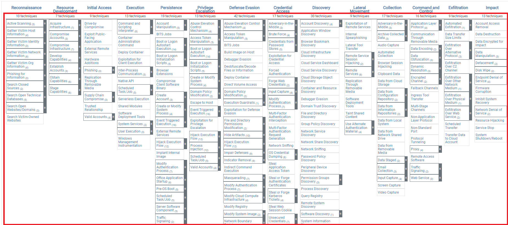

## Technique / Sub-Technique



Les **Tactics** donnent l’objectif de l’attaquant, tandis que les **Techniques** décrivent **comment il atteint cet objectif**.

```
Tactic        = Pourquoi ?
Technique     = Comment ?
Sub-Technique = Comment, précisément ?
Procedure     = Comment cela a été réellement utilisé ?
```


Exemple :

```
Credential Access
        ↓
OS Credential Dumping
        ↓
LSASS Memory
```


- Une **Technique** représente une méthode générale utilisée par l’attaquant.
- Une **Sub-Technique** décrit une variante / implémentation plus précise.
- Toutes les techniques ne possèdent pas forcément de sub-techniques.
- Une même technique peut parfois être liée à **plusieurs tactics**, selon l'objectif pour lequel elle est utilisée.

---

## Identifiants ATT&CK

Chaque technique possède un ID unique :

```
T1003 = OS Credential Dumping
```


Les sub-techniques reprennent l’ID de la technique avec un suffixe :

```
T1003.001 = LSASS Memory
T1003.002 = Security Account Manager
T1003.003 = NTDS
```


Très utile dans :

- règles SIEM / EDR ;
- rapports SOC ;
- Threat Intelligence ;
- pentest / Purple Team ;
- mapping de détection.

Exemple :

```
Alert: accès suspect à LSASS
→ MITRE ATT&CK T1003.001
```


---

## Structure dans la Matrix


Dans la matrice :

```
Tactic
 ├── Technique
 │    ├── Sub-Technique
 │    ├── Sub-Technique
 │    └── Sub-Technique
 └── Technique
```


Les techniques disposant de sub-techniques peuvent être développées dans l’interface ATT&CK pour afficher les variantes associées.

Exemple :

```
Credential Access
    ↓
OS Credential Dumping (T1003)
    ├── LSASS Memory (T1003.001)
    ├── SAM (T1003.002)
    └── NTDS (T1003.003)
```


---

## Types de Techniques

Les techniques sont organisées selon les différentes matrices :

|Matrix|Techniques adaptées à|
|---|---|
|`Enterprise Techniques and Sub-techniques`: https://attack.mitre.org/techniques/enterprise/|Windows, Linux, macOS, Cloud, Network, Containers…|
|`Mobile Techniques and Sub-techniques`: https://attack.mitre.org/techniques/mobile/|Android / iOS|
|`ICS Techniques and Sub-techniques`: https://attack.mitre.org/techniques/ics/|Systèmes et processus industriels|

Le nombre de techniques/sub-techniques **évolue régulièrement** avec les mises à jour ATT&CK.

> Les chiffres donnés dans le cours (`193 techniques`, `401 sub-techniques`, etc.) datent de 2023 : inutile de les mémoriser. Le plus important est de comprendre leur organisation.

---

## Procedure


Une **Procedure** est un exemple concret d’utilisation d’une technique ou sub-technique observé dans le monde réel.

Elle peut préciser :

- quel groupe d’attaquants l’a utilisée ;
- quel malware / outil a été utilisé ;
- quelles commandes ou méthodes ont été observées ;
- comment la technique a été implémentée.

Exemple :

```
Tactic
Credential Access
      ↓
Technique
OS Credential Dumping (T1003)
      ↓
Sub-Technique
LSASS Memory (T1003.001)
      ↓
Procedure
Un malware / threat actor utilise Mimikatz
pour récupérer des credentials depuis LSASS
```


Donc :

```
Technique = concept général
Procedure = utilisation réelle et concrète de ce concept
```


Une procedure **n’est pas une nouvelle technique ATT&CK** : c’est un exemple documenté de son utilisation.

---

## Exemple complet

```
Tactic
Credential Access
        ↓
Technique
T1003 - OS Credential Dumping
        ↓
Sub-Technique
T1003.001 - LSASS Memory
        ↓
Procedure
Un attaquant utilise un outil de credential dumping
pour récupérer des secrets présents dans la mémoire LSASS.
```


Autre exemple :

```
Tactic
Execution
        ↓
Technique
T1059 - Command and Scripting Interpreter
        ↓
Sub-Technique
T1059.001 - PowerShell
        ↓
Procedure
Utilisation de PowerShell pour exécuter
un script/payload sur la machine compromise.
```


---

## À retenir

```
Tactic        → objectif de l'attaquant
Technique     → méthode utilisée
Sub-Technique → méthode plus précise
Procedure     → exemple concret observé
```


Avec les IDs :

```
Technique     → Txxxx
Sub-Technique → Txxxx.xxx
```


Exemple à connaître :

```
Credential Access
→ T1003 OS Credential Dumping
→ T1003.001 LSASS Memory
→ utilisation concrète d'un outil pour extraire les credentials de LSASS
```


MITRE permet donc de passer d'une **vision générale de l'objectif** jusqu'à la **méthode réellement observée sur le terrain**.
