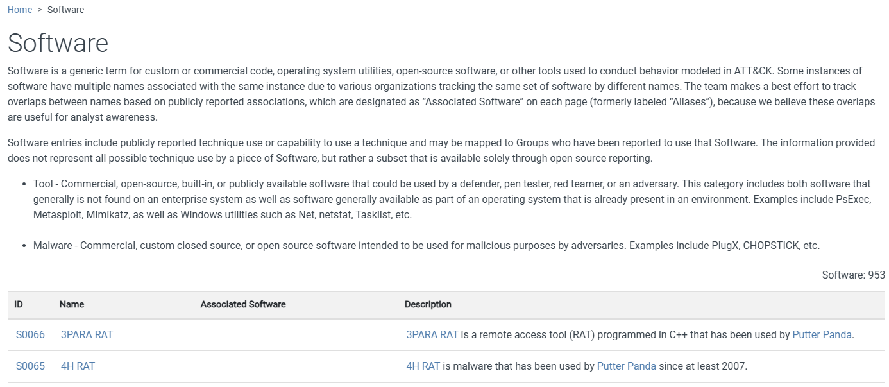
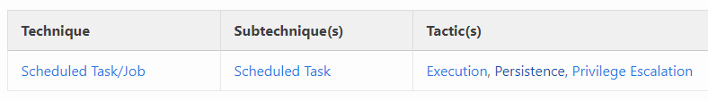
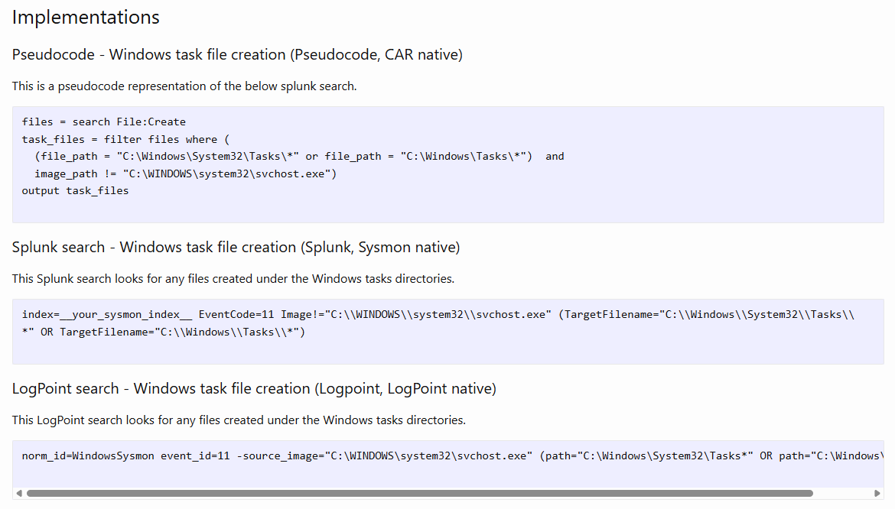

`Software`: https://attack.mitre.org/software/



## Software = outil utilisé pendant l’attaque

- Dans MITRE ATT&CK, **Software** regroupe les programmes observés dans les opérations adverses.
- Cela inclut :
	- **Malware** : RAT, backdoor, ransomware, downloader…
	- **Tools** : outils légitimes ou offensifs utilisés par les attaquants.
- Un software peut être associé à :
	- un ou plusieurs **Groups** ;
	- plusieurs **Techniques / Sub-Techniques** ;
	- plusieurs plateformes.

```
Group      → QUI ?
Software   → AVEC QUOI ?
Technique  → COMMENT ?
Tactic     → POURQUOI ?
```


> Un Software ATT&CK n’est pas forcément malveillant par nature.
> 
> Des outils légitimes comme des utilitaires d’administration peuvent être détournés par des attaquants.

---

## Informations présentes

Chaque entrée Software contient généralement :

|Élément|Description|
|---|---|
|**Software ID**|Identifiant unique `Sxxxx`|
|**Name**|Nom du malware / outil|
|**Aliases**|Autres noms connus|
|**Description**|Fonctionnement et contexte d’utilisation|
|**Techniques**|Techniques ATT&CK réalisées avec ce logiciel|
|**Groups**|Threat actors ayant utilisé le logiciel|
|**Platforms**|Windows, Linux, macOS…|
|**References**|Rapports CTI / sources|

Exemple :


```
Sxxxx - Malware / Tool
    ↓
utilisé par
    ↓
Gxxxx - Threat Group
    ↓
réalise
    ↓
Txxxx - Technique
```


---

## Malware vs Tool

MITRE distingue généralement :

- **Malware**
	- développé dans un but malveillant ;
	- ex : RAT, infostealer, ransomware, backdoor.
- **Tool**
	- logiciel pouvant être légitime mais utilisé offensivement ;
	- ex : outils d’administration, credential dumping, remote execution.

Exemple :

```
PsExec
→ outil légitime d’administration
→ peut être utilisé pour mouvement latéral / exécution distante
```


Donc :

```
Présence d’un outil ATT&CK ≠ preuve automatique d’une compromission
```


Il faut toujours regarder le **contexte d’utilisation**.

---

## Techniques associées

La page d’un software indique les techniques qu’il peut réaliser.

Exemple conceptuel :

```
Malware / Tool
├── Command and Scripting Interpreter
├── Process Discovery
├── Credential Dumping
├── File and Directory Discovery
└── Command and Control
```


Cela permet de construire rapidement le **profil ATT&CK du logiciel**.

Utilité SOC / CTI :

- comprendre ce que fait un malware ;
- anticiper ses actions suivantes ;
- rechercher ses techniques dans les logs ;
- vérifier si les détections existantes couvrent ses TTP.

---

## Relation Group ↔ Software

Un même software peut être utilisé par plusieurs groupes :

```
Software X
├── Group A
├── Group B
└── Group C
```


Et un même groupe utilise généralement plusieurs logiciels :

```
Group A
├── RAT
├── Credential Dumper
├── Remote Administration Tool
└── Custom Malware
```


Donc :

```
1 Group → plusieurs Software
1 Software → plusieurs Groups possibles
```


---

## Exemple avec un RAT

Un RAT (**Remote Access Trojan**) peut permettre :

```
Execution
Discovery
Credential Access
Collection
Command & Control
```


MITRE relie alors le logiciel aux techniques précises observées dans les campagnes réelles.

---

## À retenir

```
Group        → acteur / threat group
Software     → malware ou outil utilisé
Technique    → comportement réalisé
Procedure    → exemple concret d’utilisation
```


IDs ATT&CK :

```
Group      → Gxxxx
Software   → Sxxxx
Technique  → Txxxx
Mitigation → Mxxxx
```


La section **Software** permet donc de répondre à deux questions importantes :

```
Quelles techniques ce malware / outil peut-il réaliser ?
Quels groupes l’ont utilisé ?
```


Le nombre de logiciels référencés évolue régulièrement → inutile de mémoriser le chiffre donné dans le cours.


### Navigator

Permet de visualiser et d’annoter les matrices, utiles pour individualiser en fonction de soihttps://mitre-attack.github.io/attack-navigator//#layerURL=https%3A%2F%2Fattack.mitre.org%2Fgroups%2FG0008%2FG0008-enterprise-layer.json


  

### CAR (Cyber Analytics Repository) : Explique comment les détecter

Un référentiel d’**analyses de détection** basé sur le modèle ATT&CK. CAR complète ATT&CK qui décrit les attaques, CAR explique comment les détecter. https://car.mitre.org/

- Fournit des éléments divers :
	- Pseudocodes décrivant requêtes de détection (Splunk, EQL…)
	- Références vers TTPs
	- Implémentations selon OS et outils.






  

### ENGAGE : Planifier et mener opérations d’engagement adversaire

- Cyber Denial : Empêcher l’adversaire d’agir
- Cyber Deception : Le tromper volontairement
- Catégories principales (Engage Matrix) :

|Catégorie|Description|
|---|---|
|**Prepare**|Actions préliminaires menant à l’objectif|
|**Expose**|Identifier l’adversaire via la tromperie|
|**Affect**|Actions qui perturbent ses opérations|
|**Elicit**|Recueillir des infos sur son mode opératoire|
|**Understand**|Analyser les résultats obtenus|


- **Engage Matrix Explorer** → permet d’explorer ces interactions.

### D3FEND : Base de connaissance des contre-mesures cyber

- Chaque artefact contient

|   |   |
|---|---|
|**Catégorie**|**Description**|
|Definition|Information sur ce qu’est la technique|
|How it works|Comment cette technique fonctionne|
|Consideration|Chose à penser lors de l’implémentation|
|Example|Comment utiliser la technique|

### ATT&CK Emulation Plans : Simuler attaques réelles

### ATT&CK & Threat Intelligence : Faire lien TTP et posture défensive
