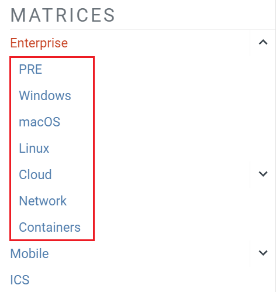
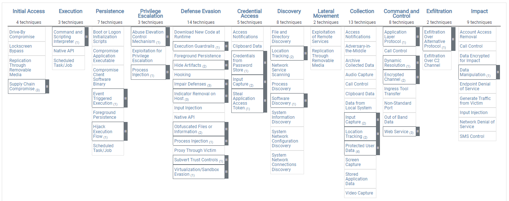

- Une **Matrix ATT&CK** est une représentation visuelle des comportements et méthodes utilisés par les attaquants.
- Elle permet de classifier les actions adverses selon :
	- leur **objectif** → Tactic
	- la **méthode utilisée** → Technique / Sub-technique
- Utilisée pour :
	- comprendre une attaque ;
	- mapper le comportement d’un threat actor / malware ;
	- analyser la couverture de détection d’un SOC ;
	- identifier des gaps de sécurité.

Structure générale :

```
Tactics (colonnes)
    ↓
Techniques
    ↓
Sub-techniques
```


> ATT&CK n’est pas forcément une chronologie stricte : un attaquant peut utiliser plusieurs techniques/tactiques dans différents ordres.

---

## Types de matrices

MITRE ATT&CK distingue principalement 3 matrices :

|Matrix|Cible|
|---|---|
|**Enterprise**|SI d’entreprise : endpoints, serveurs, cloud, réseau…|
|**Mobile**|Appareils mobiles Android / iOS|
|**ICS**|Industrial Control Systems / environnements industriels|

---

## Enterprise Matrix

`Enterprise Matrix`: https://attack.mitre.org/matrices/enterprise/


- Matrice principale et la plus riche.
- Conçue pour représenter les comportements adverses rencontrés dans les environnements d’entreprise.
- Couvre notamment 7 sous-matrices :
	- Windows
	- Linux
	- macOS
	- Cloud
	- équipements réseau
	- containers
	- PRE (activités précédant ou préparant certaines phases d’attaque)



Exemples de scénarios :

```
Phishing
Credential Dumping
PowerShell
Persistence
Lateral Movement
Exfiltration
```


---

## Mobile Matrix

`Mobile Matrix`: https://attack.mitre.org/matrices/mobile/



- Orientée sécurité des smartphones/tablettes.
- Plateformes principales, 2 sous-matrices :
	- `Android`
	- `iOS`


Contient des techniques propres aux mobiles :

- collecte SMS / contacts ;
- accès localisation ;
- abus de permissions ;
- interception de communications ;
- persistance via applications malveillantes.

Moins volumineuse que la matrice Enterprise.

---

## ICS Matrix

`ICS Matrix`: https://attack.mitre.org/matrices/ics/


**ICS = Industrial Control Systems**

Concerne les environnements industriels :

- automates / PLC ;
- systèmes SCADA ;
- infrastructures énergétiques ;
- chaînes de production ;
- systèmes de contrôle industriels.

Les attaques ICS peuvent viser non seulement :

```
Confidentialité / données
```


mais aussi :

```
Disponibilité
Contrôle physique
Sécurité des personnes / équipements
```


Exemples :

- arrêt d’un processus industriel ;
- modification des paramètres d’un automate ;
- perte de contrôle d’un équipement ;
- sabotage.

---

## À retenir

```
Enterprise → SI d’entreprise
Mobile     → Android / iOS
ICS        → systèmes industriels
```


La Matrix est surtout une **cartographie des comportements adverses** :

```
Tactic → objectif de l’attaquant
Technique → méthode utilisée
Sub-technique → méthode plus précise
```


Exemple :

```
Credential Access
      ↓
OS Credential Dumping
      ↓
LSASS Memory
```


→ On part de l’objectif général pour aller vers la méthode précise utilisée par l’attaquant.
