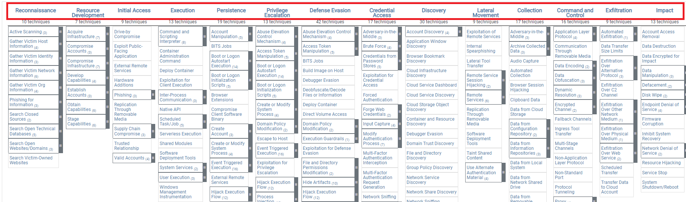
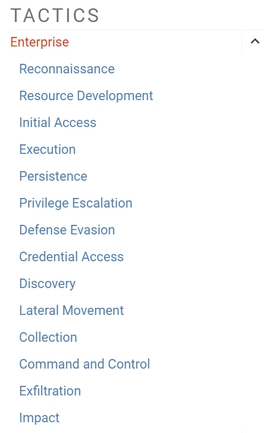
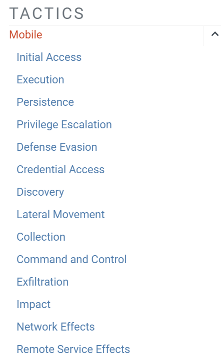

## Tactic = objectif de l’attaquant



- Une **Tactic** représente le **but / pourquoi** derrière une action adverse.
- Dans la Matrix, les tactics sont les **colonnes tout en haut**.
- Elles regroupent les techniques permettant d’atteindre un même objectif.

```
Tactic     = Pourquoi ?
Technique  = Comment ?
```


Exemple :

```
Credential Access           → objectif : obtenir des identifiants
    ↓
OS Credential Dumping       → technique utilisée
    ↓
LSASS Memory                → sub-technique précise
```


> Les tactics ATT&CK ne représentent **pas forcément des étapes chronologiques**.
> 
> Un attaquant peut revenir sur une tactic, en sauter certaines ou en utiliser plusieurs en parallèle.

---

## Enterprise Tactics

`Enterprise Tactics`: https://attack.mitre.org/tactics/enterprise/



La matrice Enterprise possède **14 tactics** :

|Tactic|Objectif|Exemple|
|---|---|---|
|**Reconnaissance**|Collecter des informations sur la cible avant l’attaque.|OSINT, découverte de sous-domaines, recherche d’employés|
|**Resource Development**|Préparer l’infrastructure et les ressources nécessaires à l’attaque.|Création d’un domaine, VPS, infrastructure C2|
|**Initial Access**|Obtenir un premier accès dans l’environnement cible.|Phishing, exploitation d’un service exposé, compte compromis|
|**Execution**|Exécuter du code ou des commandes sur la cible.|PowerShell, macro Office, script|
|**Persistence**|Maintenir l’accès malgré reboot/logout.|Scheduled Task, clé `Run`, service malveillant|
|**Privilege Escalation**|Obtenir des privilèges plus élevés.|User → Administrator/SYSTEM via service mal configuré|
|**Defense Evasion**|Contourner ou éviter les protections/détections.|Obfuscation, désactivation AV, suppression de logs|
|**Credential Access**|Récupérer des identifiants ou secrets.|Dump LSASS, SAM, Kerberos tickets|
|**Discovery**|Cartographier et comprendre l’environnement compromis.|`whoami`, `hostname`, `ipconfig`, `net user`|
|**Lateral Movement**|Se déplacer vers d’autres machines du réseau.|RDP, SMB, WinRM, PsExec|
|**Collection**|Rassembler les données intéressantes.|Documents, screenshots, archives ZIP|
|**Command and Control**|Communiquer avec les systèmes compromis.|HTTPS, DNS, TCP, cloud services|
|**Exfiltration**|Faire sortir les données de l’environnement cible.|HTTPS, FTP/SFTP, cloud, DNS tunneling|
|**Impact**|Perturber, détruire ou modifier systèmes/données.|Ransomware, suppression de données, sabotage|

---

## Mobile Tactics

`Mobile Tactics`: https://attack.mitre.org/tactics/mobile/



Mobile reprend une grande partie des tactics Enterprise :

```
Initial Access
Execution
Persistence
Privilege Escalation
Defense Evasion
Credential Access
Discovery
Lateral Movement
Collection
Command and Control
Exfiltration
Impact
```


Avec également des tactics spécifiques aux appareils mobiles :

- **Network Effects**
- **Remote Service Effects**

---

## ICS Tactics

`ICS Tactics`: https://attack.mitre.org/tactics/ics/


ICS reprend aussi plusieurs tactics classiques, mais ajoute des objectifs spécifiques aux systèmes industriels :

- **Inhibit Response Function**
	- empêcher les mécanismes de sécurité/réponse de fonctionner.
- **Impair Process Control**
	- dégrader ou modifier le contrôle d’un processus industriel.
- **Impact**
	- provoquer un effet réel sur la production / infrastructure.

Exemple :

```
Attaquant
   ↓
Accès au réseau industriel
   ↓
Manipulation PLC
   ↓
Altération du procédé physique
```


---

## À retenir

```
Tactic = objectif / WHY
Technique = méthode / HOW
Sub-technique = méthode plus précise
```


Exemple complet :

```
Credential Access
        ↓
OS Credential Dumping
        ↓
LSASS Memory
```


Et la chaîne Enterprise peut grossièrement se visualiser comme :

```
Recon
  ↓
Resource Development
  ↓
Initial Access
  ↓
Execution
  ↓
Persistence / PrivEsc / Defense Evasion
  ↓
Credential Access / Discovery
  ↓
Lateral Movement
  ↓
Collection
  ↓
C2 / Exfiltration
  ↓
Impact
```


Mais **ATT&CK n’est pas une kill chain stricte** : cet ordre sert seulement à visualiser un scénario plausible.
