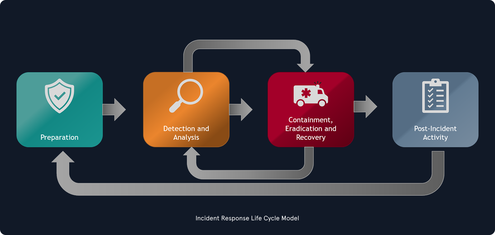

## Définition et portée de la gestion des incidents

- **Incident Handling — IH** désigne la capacité d’une organisation à gérer et répondre de manière structurée aux incidents de sécurité.
- Même avec des mesures préventives, une organisation doit être capable de réagir lorsqu’un incident affecte :
    - confidentialité ;
    - intégrité ;
    - disponibilité.
- Cette capacité peut être :
    - interne ;
    - externalisée auprès d’un prestataire ;
    - hybride.
- La gestion des incidents est un ensemble de procédures clairement définies pour gérer et répondre aux incidents de sécurité, permettant de : 
    - identifier ;
    - analyser ;
    - contenir ;
    - éradiquer ;
    - récupérer ;
    - documenter les incidents.
### Cycle de vie

```
Preparation
    ↓
Detection & Analysis
    ↓
Containment
    ↓
Eradication
    ↓
Recovery
    ↓
Post-Incident Activity
    ↺
```

{ width="550" }

- Le processus est **itératif** :
    - les enseignements tirés d’un incident améliorent la préparation future.
- L’objectif final est de restaurer les opérations normales aussi rapidement et efficacement que possible.

> Un événement suspect peut devoir être traité **comme un incident jusqu’à preuve du contraire**, car sa nature réelle n’est parfois visible qu’après investigation initiale.
## Événement vs Incident
### Événement — Event

- Un **événement** est une action qui se produit dans un système ou un réseau.

Exemples :

- Un utilisateur envoie un e-mail.
- Un clic de souris.
- Un pare-feu autorise une demande de connexion.

→ un événement n’est **pas forcément malveillant ou problématique**.
### Incident

- Un **incident** est un événement ayant une conséquence négative.

Exemples :

- panne système ;
- accès non autorisé ;
- perte de disponibilité ;
- catastrophe naturelle ;
- panne électrique.
### Incident de sécurité informatique

- Il n’existe pas une définition universelle unique.
- Dans le cours, un incident de sécurité est considéré comme un événement dirigé contre un système avec une intention claire de causer un préjudice.

Exemples :

- vol de données ;
- vol de fonds ;
- accès non autorisé ;
- installation de malware ;
- utilisation d’outils d’accès à distance.

```
Event
→ activité observée

Incident
→ conséquence négative

Security Incident
→ événement malveillant ou compromission nécessitant une réponse
```

## Portée de la gestion des incidents

- La gestion des incidents ne concerne pas uniquement les intrusions.

Elle couvre aussi :

- insider threat ;
- availability issues ;
- perte de propriété intellectuelle ;
- compromission de données ;
- incidents techniques ;
- incidents physiques ou environnementaux.

```
Incident Handling
≠ seulement intrusion réseau
```

## Valeur de la gestion des incidents

- Les incidents peuvent toucher :
    - quelques endpoints ;
    - un système critique ;
    - une grande partie de l’environnement.
- Une équipe spécialisée permet d’appliquer une réponse :
    - structurée ;
    - cohérente ;
    - documentée ;
    - reproductible.

Objectifs :

```
Incident
→ Investigation
→ Remediation
→ Minimize Impact
```

La réponse cherche notamment à limiter :

- vol d’informations ;
- interruption de service ;
- propagation ;
- impact métier.
## Priorisation des incidents

- Tous les incidents n’ont pas la même criticité.

Il faut évaluer :

- gravité ;
- impact ;
- nombre de systèmes concernés ;
- données touchées ;
- criticité métier ;
- urgence.

```
High Severity
→ Immediate Response
→ More Resources

Lower Severity
→ Initial Investigation
→ Confirm / Reject Incident
```

## Équipe de réponse aux incidents

- L’équipe de gestion des incidents est souvent appelée **Incident Response Team**.
- Elle peut être dirigée par :
    - SOC Manager ;
    - CISO / RSSI ;
    - CIO / DSI ;
    - prestataire tiers de confiance.
### Incident Manager

- Coordonne les activités de réponse.
- Doit pouvoir :
    - obtenir les informations nécessaires ;
    - mobiliser d’autres équipes ;
    - suivre l’avancement ;
    - centraliser la communication.

```
Incident Manager
→ Coordination
→ Communication
→ Tracking
→ Decision Support
```

- Il agit comme **point de communication unique** pendant l’incident.
