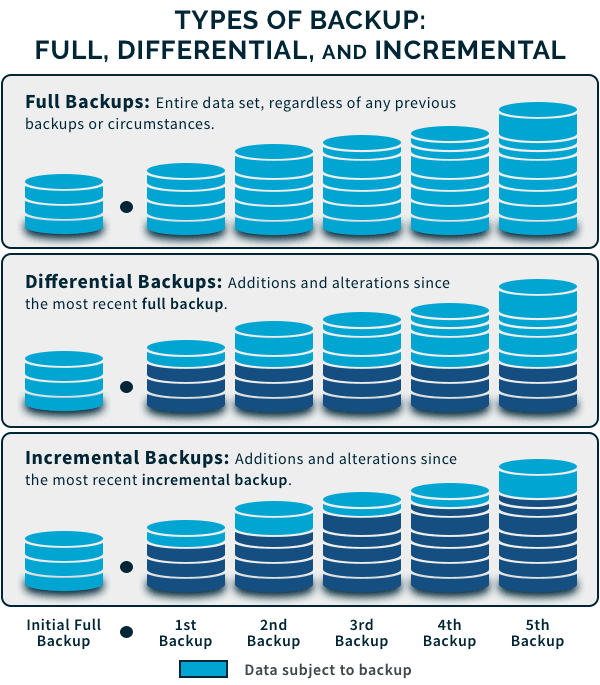

## Types de sauvegarde

- Le type de sauvegarde détermine **quelles données sont copiées** et donc :
    - temps de sauvegarde ;
    - espace nécessaire ;
    - vitesse de restauration ;
    - dépendances entre backups.

{ width="400" }
### Full Backup — Sauvegarde complète

- Copie **toutes les données sélectionnées**.
- Type le plus simple à restaurer.
- Inconvénients :
    - plus long à créer ;
    - consomme davantage d’espace.

```
Full Backup
→ A + B + C + D + E
```

- Avantages :
    - restauration simple ;
    - peu de dépendances.
### Incremental Backup — Sauvegarde incrémentielle

- Copie uniquement les données modifiées **depuis la dernière sauvegarde**, qu’elle soit complète ou incrémentielle.
- Exemple :

```
Lundi    → Full
Mardi    → changements depuis lundi
Mercredi → changements depuis mardi
Jeudi    → changements depuis mercredi
```

- Avantages :
    - sauvegarde rapide ;
    - faible consommation de stockage.
- Inconvénient :
    - restauration plus complexe.
- Pour restaurer jeudi :

```
Full
+ Incremental mardi
+ Incremental mercredi
+ Incremental jeudi
```

→ si un élément de la chaîne est perdu/corrompu, la restauration peut être compromise.
### Differential Backup — Sauvegarde différentielle

- Copie toutes les modifications effectuées **depuis la dernière Full Backup**.
- Exemple :

```
Lundi    → Full
Mardi    → changements depuis lundi
Mercredi → changements depuis lundi
Jeudi    → changements depuis lundi
```

- Pour restaurer jeudi :

```
Full lundi
+ Differential jeudi
```

- Avantage :
    - restauration plus rapide/simple qu’avec une longue chaîne incrémentielle.
- Inconvénient :
    - les sauvegardes différentielles grossissent au fil du temps jusqu’à la prochaine Full.
### Full vs Incremental vs Differential

|Type|Données copiées|Stockage|Restore|
|---|---|---|---|
|**Full**|Toutes les données|Élevé|Simple|
|**Incremental**|Depuis le dernier backup|Faible|Plus complexe|
|**Differential**|Depuis la dernière Full|Moyen → élevé|Plus simple que l’incrémental|

```
Incremental
→ optimise surtout le backup

Differential
→ compromis entre backup et restore
```


### Mirror Backup — Sauvegarde miroir

- Maintient une copie presque identique de la source.
- Les changements peuvent être répliqués rapidement, voire en temps réel.

```
Source   ↔   Mirror
```

- Avantage :
    - accès/reprise rapide.
- Problème :

```
Delete source
→ Delete mirror

Corruption source
→ Corruption mirror
```


> ⚠️ Une réplication/mirror **ne remplace pas une véritable sauvegarde historique**. Un ransomware, une suppression accidentelle ou une corruption peuvent être répliqués sur la copie.
### Snapshot

- Un **snapshot** représente l’état d’un système, volume ou VM à un instant donné.

```
System
   ↓
Snapshot @ 14:00
```

- Utilisé notamment pour :
    - virtualisation ;
    - stockage ;
    - bases de données ;
    - rollback rapide.
- Avantages :
    - création rapide ;
    - restauration rapide selon la technologie.

> ⚠️ Un snapshot n’est pas nécessairement une sauvegarde indépendante. Il peut dépendre du même stockage que les données originales : si ce stockage est détruit, les snapshots peuvent disparaître avec lui.

```
Snapshot → point de restauration rapide
Backup   → copie indépendante à privilégier pour la résilience
```

## Supports de sauvegarde — Backup Media

- Le **support** correspond à l’endroit ou au média sur lequel les backups sont stockés.
- Le choix dépend notamment de :
    - capacité ;
    - coût ;
    - vitesse ;
    - disponibilité ;
    - sécurité ;
    - durée de conservation.
### Bandes magnétiques — Tape / LTO

- Toujours utilisées dans de grandes infrastructures.
- Très adaptées aux gros volumes et à l’archivage.
- Avantages :
    - coût par To relativement faible ;
    - longue conservation ;
    - peut être physiquement **offline / air-gapped**.
- Inconvénients :
    - accès séquentiel ;
    - restauration plus lente qu’avec du stockage disque.

```
Tape
→ grande capacité
→ archivage
→ offline possible
```

### Disques durs externes

- Solution simple pour petites structures ou utilisateurs individuels.
- Accès relativement rapide.
- Risques :
    - panne matérielle ;
    - vol ;
    - dommage physique ;
    - corruption ;
    - ransomware si le disque reste connecté.

```
External HDD
→ utile
→ mais à déconnecter/protéger lorsqu'il n'est pas utilisé
```

### NAS — Network Attached Storage

- Stockage accessible via le réseau.
- Utilisé comme espace centralisé de fichiers ou comme cible de backup.

```
Servers / Clients
      ↓
     NAS
```

- Avantages :
    - centralisation ;
    - facilité d’administration ;
    - capacité évolutive.

> Un NAS accessible avec les mêmes credentials/réseaux que la production peut également être compromis par un attaquant.
### SAN — Storage Area Network

- Infrastructure de stockage dédiée, généralement utilisée dans les datacenters.
- Fournit du stockage en mode **bloc** avec de hautes performances.
- Utilisé notamment pour :
    - serveurs ;
    - virtualisation ;
    - bases de données ;
    - grandes infrastructures.

```
Servers
   ↓
SAN Fabric
   ↓
Storage Arrays
```

- haute performance ;
- grande capacité ;
- infrastructure plus complexe et coûteuse.

> NAS et SAN sont des **technologies de stockage**, pas automatiquement des solutions de backup. Leur sécurité dépend de la manière dont les sauvegardes y sont organisées et protégées.
### Cloud Storage

- Sauvegardes stockées chez un fournisseur cloud.
- Permet d’éviter de maintenir toute l’infrastructure de stockage localement.
- Avantages :
    - scalable ;
    - accessible hors site ;
    - facilité d’augmentation de capacité ;
    - services d’immutabilité disponibles selon le fournisseur.
- Points à surveiller :
    - IAM / permissions ;
    - MFA ;
    - chiffrement ;
    - coûts de stockage/restauration ;
    - localisation des données ;
    - confidentialité ;
    - politique de rétention.

```
Cloud Backup
→ Offsite
→ Scalable
→ nécessite IAM + chiffrement + contrôle des accès
```

## Stratégie hybride

- Combiner plusieurs supports réduit le risque de **Single Point of Failure**.
- Exemple :

```
Production
   ↓
Local Backup / NAS
   ↓
Cloud / Offsite
   ↓
Offline / Immutable Copy
```

- Cela permet d’obtenir :
    - restauration locale rapide ;
    - protection hors site ;
    - meilleure résistance au ransomware/destruction physique.
