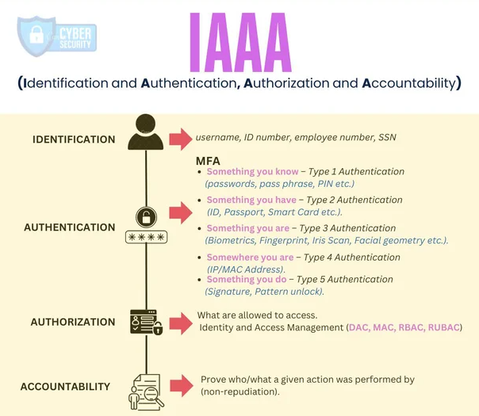
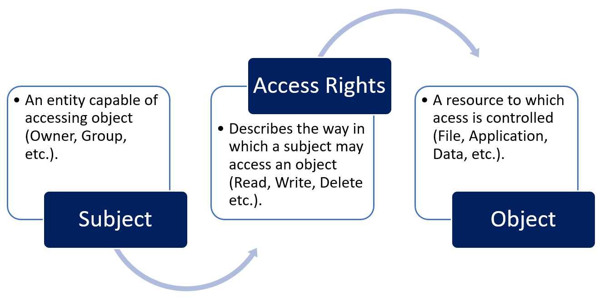
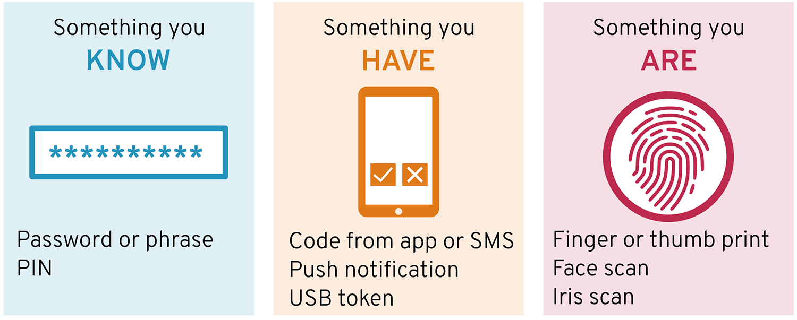
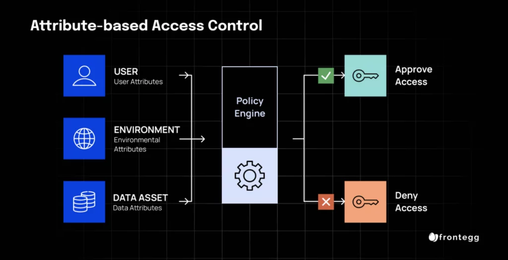

## Définitions et concepts de base
### Concept IAAA
**IAAA** regroupe les principales étapes d’un processus de contrôle d’accès :

- **Identification** ;
- **Authentication** ;
- **Authorization** ;
- **Accounting / Audit**.

{ width="550" }
#### Identification

- Consiste à **déclarer ou établir une identité**.
- Elle ne prouve pas encore que l’entité est réellement celle qu’elle prétend être.

Exemples :

- username ;
- email address ;
- employee ID ;
- account identifier.

```
User
→ "Je suis Alice"
→ Identification
```

> Une empreinte digitale ou une reconnaissance faciale est généralement plutôt utilisée comme **facteur d’authentification biométrique** que comme simple mécanisme d’identification.
#### Authentication

- Vérifie que l’identité déclarée appartient bien à l’utilisateur ou à l’entité.
- Utilise des **credentials / authentication factors**.

Exemples :

- password ;
- PIN ;
- security token ;
- certificate ;
- biométrie.

```
Identity claimed
+
Valid Credential
→ Authentication
```

> ⚠️ L’authentification répond à **« Es-tu bien qui tu prétends être ? »**, pas à **« As-tu le droit d’accéder à cette ressource ? »**. Ce second point relève de l’**Authorization**.
#### Authorization

- Détermine **ce qu’un utilisateur authentifié peut faire**.
- Repose notamment sur :
    - rôles ;
    - groupes ;
    - privilèges ;
    - permissions ;
    - access policies.

Exemple :

```
Authenticated User
→ File
→ Read allowed
→ Write denied
```

Un utilisateur standard peut par exemple avoir `Read`, tandis qu’un administrateur dispose de `Modify`.
#### Accounting / Audit

- Enregistre et suit les activités réalisées par les utilisateurs ou systèmes.
- Sert notamment à :
    - audit ;
    - incident response ;
    - troubleshooting ;
    - conformité ;
    - parfois facturation.

Éléments typiques :

- logs ;
- timestamps ;
- audit trails ;
- source IP ;
- actions réalisées.

```
User Action
→ Logged
→ Timestamped
→ Auditable
```

### Résumé IAAA

```
Identification
→ Qui prétends-tu être ?

Authentication
→ Peux-tu le prouver ?

Authorization
→ Que peux-tu faire ?

Accounting
→ Qu'as-tu fait ?
```

Ces quatre fonctions constituent une base importante des mécanismes de **Identity & Access Management — IAM**.
### Parties du contrôle d’accès
Un processus de contrôle d’accès comprend généralement :

```
Subject
→ Access Rights
→ Object
```

#### Subject

- Le **Subject** est l’entité qui demande l’accès à une ressource.
- Il peut s’agir :
    - d’un utilisateur ;
    - d’un device ;
    - d’une application ;
    - d’un service ;
    - d’un process.

Exemples :

- employee ;
- customer ;
- partner ;
- system process.

Un subject possède généralement :

- une identité unique ;
- des rôles ;
- des groupes ;
- des attributs.

Certains attributs peuvent influencer la décision d’accès :

- location ;
- time ;
- device state ;
- department ;
- group membership.
#### Object

- L’**Object** est la ressource à laquelle le subject tente d’accéder.

Exemples :

- file ;
- folder ;
- database ;
- application ;
- API ;
- server ;
- VM ;
- network resource.

```
Subject
→ requests access
→ Object
```

Les objets sont protégés par des contrôles définissant :

- qui peut y accéder ;
- quelles actions sont permises ;
- sous quelles conditions.
#### Droits d'accès - Access Rights

- Les **Access Rights** correspondent aux permissions ou privilèges accordés/refusés à un subject sur un object.

Principaux droits :

|Droit|Fonction|
|---|---|
|**Read**|Lire / consulter une ressource|
|**Write**|Écrire ou mettre à jour des données|
|**Execute**|Exécuter un programme/script|
|**Delete**|Supprimer un objet|
|**Create**|Créer un nouvel objet|
|**Modify**|Modifier propriétés ou contenu|

Les droits peuvent dépendre de :

- identity ;
- role ;
- group membership ;
- security policy ;
- contextual attributes.

```
Subject
+
Object
+
Access Rights
→ Access Decision
```

{ width="550" }
### Cycle de vie - Access Provisioning Lifecycle

- L’**Access Provisioning Lifecycle** correspond à la gestion des accès pendant tout le cycle de vie d’un utilisateur dans l’organisation.

Il couvre :

```
Demande - Request
→ Approbation - Approval
→ Provisionnement - Provisioning
→ Surveillance de l'utilisation - Monitoring
→ Révision des comptes - Review
→ Modification
→ Revocation
```

#### Demande - Request

- Le processus commence par la demande d'un utilisateur pour accéder à des ressources spécifiques.
- Elle peut être liée à :
    - onboarding ;
    - changement de poste ;
    - nouveau projet ;
    - besoin d’accès à une application ou ressource.
#### Approval

- Une fois la demande soumise, elle passe par un processus d'approbation où les approbateurs désignés examinent et autorisent la demande d'accès.

Objectif :

```
Access Request
→ Business Need?
→ Approved / Rejected
```

#### Provisioning

- Après approbation, les droits d'accès sont provisionnés pour l'utilisateur conformément à la demande approuvée.
- Le provisionnement consiste à accorder les permissions, les privilèges et les rôles nécessaires à l'utilisateur pour accéder aux ressources demandées.

Cela peut inclure :

- création de compte ;
- ajout à un groupe ;
- attribution de rôle ;
- permissions ;
- privileges.
#### Usage Monitoring

- Les activités et patterns d’accès doivent être surveillés.
- Une fois l'accès provisionné, les activités des utilisateurs et les schémas d'accès sont surveillés pour garantir la conformité avec les politiques de sécurité.
- Objectifs :
    - détecter les usages anormaux ;
    - vérifier le respect des policies ;
    - répondre aux exigences réglementaires.

Exemples :

- accès depuis une localisation inhabituelle ;
- utilisation excessive d’un privilège ;
- accès à une ressource inattendue.
#### Account Review / Access Review

- Les accès doivent être réévalués périodiquement.
- Périodiquement, les droits d'accès sont examinés et recertifiés pour s'assurer que les utilisateurs ont toujours besoin de l'accès qui leur a été accordé.
- Vérifier que les utilisateurs ont toujours besoin de leurs privilèges.

```
Existing Access
→ Still Required?
├─ Yes → Keep
└─ No  → Remove
```

Cette étape est aussi appelée **Access Recertification**.

Objectif principal :

- limiter le **Privilege Creep** : accumulation progressive de droits devenus inutiles.
#### Modification

- Les droits d'accès peuvent devoir être modifiés au fil du temps en raison de changements dans les rôles, les responsabilités ou les affectations de projet des utilisateurs.
- Les modifications peuvent consister à accorder des accès supplémentaires, à révoquer des accès inutiles ou à mettre à jour les privilèges d'accès existants.
#### Account Revocation

- Les droits doivent être retirés rapidement lorsqu’ils ne sont plus nécessaires.

Cas typiques :

- départ de l’entreprise ;
- changement de poste ;
- fin de mission ;
- fin de contrat ;
- compte dormant.

```
User Leaves
→ Disable Account
→ Revoke Access
→ Remove Tokens / Sessions
```

Une révocation tardive peut laisser des **orphaned / dormant accounts** exploitables par un attaquant.
### Facteurs d’authentification

- Les facteurs d’authentification permettent de vérifier l’identité d’une entité.
- Trois facteurs classiques :

```
Something You Know
Something You Have
Something You Are
```

{ width="600" }
#### Something You Know

- Information connue de l’utilisateur.

Exemples :

- password ;
- PIN ;
- passphrase.

```
Something You Know
→ Password / PIN
```

Limite principale :

- peut être deviné ;
- volé ;
- phishé ;
- réutilisé.
#### Something You Have

- Objet physique ou logique possédé par l’utilisateur.

Exemples :

- smart card ;
- hardware token ;
- phone ;
- security key.

```
Something You Have
→ Smart Card / Token / Security Key
```

Une smart card peut contenir :

- certificat ;
- private key ;
- autres éléments cryptographiques.
#### Something You Are

- Caractéristique biométrique de la personne.

Exemples :

- fingerprint ;
- face ;
- iris ;
- retina ;
- voice ;
- palm geometry.

```
Something You Are
→ Biometrics
```


> La biométrie est difficile à modifier après compromission : contrairement à un password, on ne peut pas simplement « changer » son empreinte digitale.

#### Facteurs d’authentification supplémentaires
##### Somewhere You Are

- Utilise la **localisation** ou le contexte géographique comme signal.

Exemples :

- IP address ;
- country ;
- network location ;
- GPS ;
- trusted office network.

```
Login
→ Expected Country?
→ Trusted Network?
→ Risk Evaluation
```


> La localisation est généralement utilisée comme **contextual / risk signal** plutôt que comme facteur d’authentification autonome fort.
##### Something You Do

- Repose sur le comportement de l’utilisateur.

Exemples :

- typing rhythm ;
- mouse movement ;
- touchscreen behavior ;
- gesture patterns.

```
User Behavior
→ Behavioral Profile
→ Compare
→ Normal / Suspicious
```

On parle souvent de **Behavioral Biometrics**.

## Principe de sécurité : Contrôle d'accès

- Le **contrôle d’accès** détermine :
    - qui peut accéder à une ressource ;
    - à quelles ressources ;
    - avec quels droits ;
    - dans quelles conditions.
- Un mauvais design peut permettre à des utilisateurs non autorisés d’accéder à :
    - données sensibles ;
    - applications ;
    - systèmes ;
    - ressources réseau.

```
Subject
→ Access Control
→ Resource
→ Allow / Deny
```

- Le contrôle d’accès protège contre :
    - menaces externes ;
    - menaces internes.
- Il contribue également à :
    - respecter le **Least Privilege** ;
    - protéger la confidentialité ;
    - appliquer les security policies ;
    - faciliter les audits et la conformité.
### Modèles de contrôle d'accès
Deux approches principales abordées ici :

```
RBAC
→ accès basé sur le rôle

ABAC
→ accès basé sur les attributs
```

### RBAC — Role-Based Access Control

- **RBAC** attribue les permissions en fonction du **rôle** d’un utilisateur.
- Le contrôle d'accès basé sur les rôles (RBAC) est un modèle de contrôle d'accès qui gère efficacement les permissions d'accès d'un utilisateur ou d'un groupe à un système en attribuant des rôles et en les associant à des permissions spécifiques.
- Les utilisateurs reçoivent un ou plusieurs rôles, et les rôles possèdent les permissions nécessaires.

```
User
→ Role
→ Permissions
→ Resource
```

Exemple :

```
Alice
→ Accountant
→ Read / Modify Accounting Data
```

- RBAC permet de gérer efficacement les droits de plusieurs utilisateurs ayant les mêmes responsabilités.
- Il est largement utilisé pour :
    - simplifier l’administration ;
    - appliquer le Least Privilege ;
    - réduire les permissions attribuées individuellement.

{ width="550" }
#### Définition des rôles

- Identifier les fonctions présentes dans l’organisation.
- Chaque rôle représente un ensemble de permissions associé à une fonction.

Exemples :

```
Manager
Employee
Customer
Administrator
```

- Les permissions doivent correspondre aux responsabilités réelles du rôle.
#### Affectation des utilisateurs aux rôles

- Chaque utilisateur est affecté au rôle correspondant à ses besoins métier.
- Les permissions ne sont ensuite pas nécessairement attribuées directement à chaque user.

```
User A ─┐
User B ─┼→ Finance Role → Finance Permissions
User C ─┘
```

→ facilite fortement l’administration des accès.
#### Définition des permissions
Pour chaque rôle, déterminer :

- opérations autorisées ;
- données accessibles ;
- applications accessibles ;
- systèmes concernés ;
- network resources / segments accessibles.

Exemple :

```
Employee
→ Read documents

Manager
→ Read + Modify documents
```

#### Application du contrôle d'accès

- Lorsqu’un utilisateur tente d’accéder à une ressource :
    - son identité est vérifiée ;
    - son rôle est identifié ;
    - les permissions associées sont évaluées ;
    - l’accès est autorisé ou refusé.

```
Authenticated User
→ Role
→ Permission Check
→ Allow / Deny
```

Le contrôle peut être appliqué à différents niveaux :

- login ;
- application ;
- database ;
- filesystem ;
- API ;
- network resource.
#### Avantages du RBAC

- gestion simplifiée des permissions ;
- meilleure organisation des rôles ;
- réduction des accès non autorisés ;
- application plus simple du Least Privilege ;
- amélioration de la traçabilité ;
- facilite audit et conformité.

> Le principal risque est le **Role Explosion** : créer trop de rôles très spécifiques peut rendre RBAC difficile à administrer.
### ABAC — Attribute-Based Access Control

- **ABAC** prend une décision d’accès à partir de plusieurs **attributs**.
- Ces attributs peuvent concerner :
    - user ;
    - resource ;
    - device ;
    - environnement ;
    - contexte de connexion.

```
Attributes
+
Policy
→ Access Decision
```

Exemples d’attributs :

- role ;
- department ;
- location ;
- time ;
- device type ;
- device security status ;
- resource sensitivity.

{ width="550" }
#### Exemple ABAC
Policy :

```
ALLOW document modification IF:

Role = Administrator
AND
Device = Compliant
AND
Location = Corporate Network
```


Un même utilisateur peut donc :

```
Admin + Managed Device + Office
→ ALLOW

Admin + Unmanaged Device + Public Wi-Fi
→ DENY
```

→ la décision dépend du **contexte**, pas uniquement du rôle.
#### Contrôle d'accès granulaire

- ABAC permet un contrôle plus fin que RBAC.

Exemple :

```
Finance User
+
Working Hours
+
Managed Device
+
Corporate Network
→ Access Financial Database
```

Les règles peuvent donc tenir compte du :

- `who` ;
- `what` ;
- `where` ;
- `when` ;
- `how`.
#### Meilleure gestion & audit plus clair

- L'ABAC permet un audit plus clair des politiques de contrôle d'accès.
- Particulièrement important pour les organisations qui doivent assurer la conformité avec les réglementations.
#### Accès basé sur le statut de sécurité

- ABAC peut adapter les droits selon le niveau de sécurité du contexte.

Exemples :

```
Device compliant
→ Access allowed

Device compromised
→ Access denied
```

ou :

```
Trusted Location
→ Full Access

Unknown Location
→ Restricted Access / MFA
```

Cette logique est particulièrement adaptée aux approches modernes comme **Zero Trust** et **Conditional Access**.
#### Mise en œuvre ABAC
##### Déterminer les attributs
Identifier les attributs utiles à la décision :

- rôle ;
- département ;
- localisation ;
- type de device ;
- niveau de sécurité ;
- horaire ;
- sensibilité de la ressource.
##### Définir les politiques

- Les policies combinent les attributs.

Exemple :

```
Permit modification IF
Role = Administrator
AND
Device = Secure
```

##### Implémenter les policies

- Les règles sont ensuite appliquées par le système IAM, l’application ou le service concerné.
- La décision est évaluée dynamiquement lors de la demande d’accès.

```
Access Request
→ Evaluate Attributes
→ Evaluate Policy
→ Permit / Deny
```

#### Avantages de l'ABAC

- contrôle très granulaire ;
- prise en compte du contexte ;
- policies dynamiques ;
- adapté aux environnements complexes ;
- permet d’intégrer l’état de sécurité du device ;
- utile pour les exigences réglementaires.
#### Limites

- conception plus complexe ;
- nombre élevé d’attributs et de règles ;
- troubleshooting plus difficile ;
- nécessite une bonne gouvernance des policies.
### RBAC vs ABAC

|RBAC|ABAC|
|---|---|---|
|Décision basée sur|Rôle|Attributs + contexte|
|Exemple|`Finance → Read`|`Finance + Trusted Device + Office Hours → Read`|
|Complexité|Faible / moyenne|Plus élevée|
|Granularité|Bonne|Très élevée|
|Gestion|Simple|Plus complexe|
|Contexte dynamique|Limité|Oui|

```
RBAC
→ Who are you in the organization?

ABAC
→ Who are you + What + Where + When + How?
```

### Relation entre RBAC et ABAC

- Les deux modèles ne sont pas forcément exclusifs.
- Un environnement peut utiliser :

```
RBAC
→ rôle de base

+
ABAC
→ conditions supplémentaires
```


Exemple :

```
Role = Network Admin
AND
Device = Managed
AND
Location = Corporate Network
→ SSH Access Allowed
```


Le principe central est que le contrôle d’accès doit garantir que **chaque identité ne puisse accéder qu’aux ressources nécessaires, avec les droits appropriés et éventuellement selon le contexte de la demande**.
