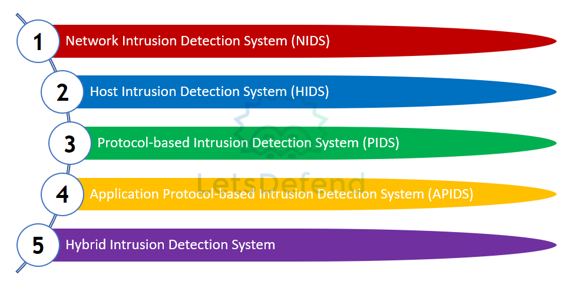
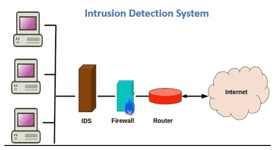
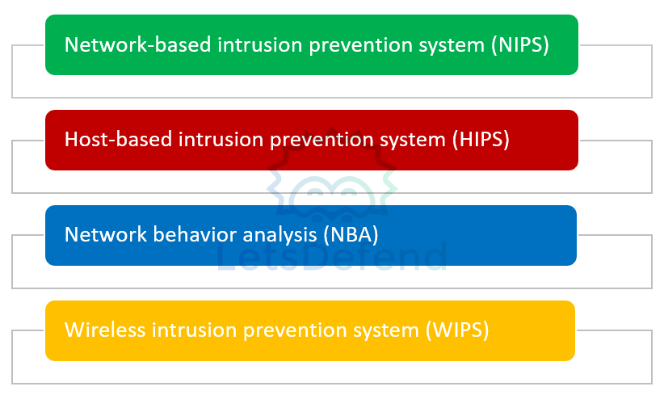
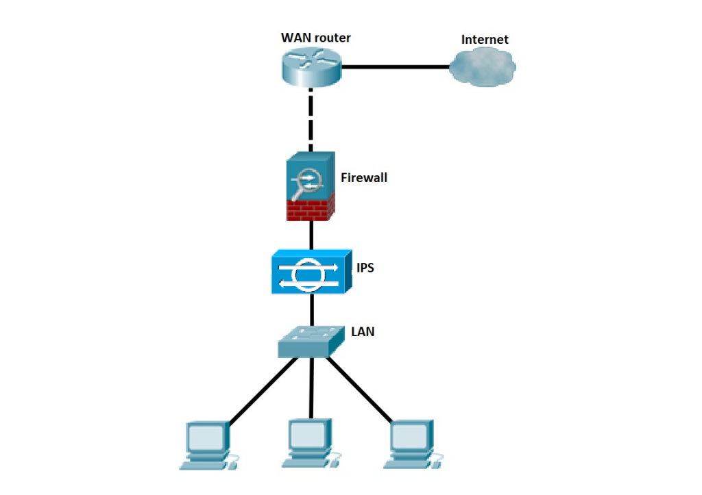

### IDS — Intrusion Detection System

- Matériel ou logiciel qui **surveille un réseau ou un hôte pour détecter des comportements malveillants / violations de sécurité**.
- Lorsqu'une activité suspecte est détectée :
    - génère une alerte ;
    - informe l'administrateur / analyste ;
    - peut transmettre l'événement au **SIEM**.
- Un IDS est principalement **passif** : il détecte et alerte, mais ne bloque généralement pas directement l'attaque.

```
IDS → Detect + Alert
IPS → Detect + Block/Prevent
```

### Types d'IDS
{ width="600" }

|Type|Principe|
|---|---|
|**NIDS — Network IDS**|Surveille le **trafic réseau** afin de détecter des comportements/paquets suspects|
|**HIDS — Host IDS**|Surveille l'activité d'un **hôte spécifique**|
|**PIDS — Protocol-based IDS**|Analyse les communications selon le fonctionnement attendu d'un **protocole particulier**|
|**APIDS — Application Protocol-based IDS**|Analyse les protocoles/communications propres à une **application**|
|**Hybrid IDS**|Combine au moins deux approches de détection|

#### NIDS

- Analyse le trafic traversant une partie du réseau.
- Peut détecter :
    - scans ;
    - exploitation ;
    - signatures malveillantes ;
    - comportements réseau anormaux.
- Doit avoir une bonne visibilité sur le trafic à surveiller.
#### HIDS

- Fonctionne directement sur un endpoint/server.
- Peut surveiller :
    - logs ;
    - processus ;
    - fichiers et modifications ;
    - intégrité système ;
    - connexions réseau locales.

> Le cours le présente surtout comme analysant les paquets entrants/sortants, mais un **HIDS surveille plus largement l'activité de l'hôte**, pas uniquement son trafic réseau.

### Méthodes de détection

- La qualité d'un IDS dépend fortement de ses **règles/signatures et méthodes de détection**.
- Deux problèmes classiques :

```
Attaque non détectée
→ False Negative

Activité normale détectée comme attaque
→ False Positive
```

→ Les règles doivent être **tuned / ajustées** selon l'environnement afin de limiter le bruit sans manquer les vraies attaques.
### Fonctionnement

```
Trafic / activité hôte
        ↓
       IDS
        ↓
Règles / signatures / détection
        ↓
      Alerte
        ↓
Analyste / SIEM
```

- L'analyste examine ensuite le contexte pour déterminer si l'événement correspond réellement à une attaque.
### Positionnement d'un IDS

- L'emplacement de l'équipement IDS dans le réseau peut varier en fonction de son type.

{ width="600" }
#### NIDS

- Le NIDS doit être placé là où il peut **observer le trafic intéressant**.
- Exemples :

```
Internet
   ↓
Firewall
   ↓
[ NIDS ]
   ↓
LAN
```

- ou via un :
	- **SPAN / Mirror Port** sur un switch ;
	- **Network TAP**.

> Un NIDS n'a pas forcément besoin que le trafic « traverse » physiquement l'IDS : il peut recevoir une **copie du trafic** via SPAN/TAP.

- Points fréquents de surveillance :
	- périmètre Internet ;
	- DMZ ;
	- segments critiques ;
	- trafic inter-VLAN.
#### HIDS

- Installé directement sur les machines à protéger :
    - servers ;
    - endpoints ;
    - systèmes critiques.

```
Server
 └─ HIDS Agent
```


### Outils / solutions

|Outil|Utilisation principale|
|---|---|
|**Snort**|NIDS / IPS basé notamment sur des règles/signatures|
|**Suricata**|NIDS / IPS, analyse réseau et protocoles|
|**Zeek (Bro)**|Network Security Monitoring / analyse détaillée du trafic|
|**OSSEC**|HIDS : logs, intégrité fichiers, détection hôte|
|**Fail2Ban**|Analyse certains logs et peut bannir automatiquement des IP après comportements suspects|

> **Zeek** est davantage une plateforme de **Network Security Monitoring** qu'un IDS classique à signatures.  
> **Fail2Ban** est plutôt un mécanisme de détection + réaction basé sur les logs qu'un IDS traditionnel.

## Système de prévention d'intrusion — IPS

### IPS — Intrusion Prevention System

- Matériel ou logiciel qui **surveille un réseau ou un hôte, détecte les violations de sécurité et prend automatiquement une action pour les empêcher**.
- Contrairement à un IDS, l’IPS ne se contente pas d’alerter : il peut **bloquer l’activité malveillante**.

```
IDS → Detect + Alert
IPS → Detect + Prevent/Block
```

### Types d’IPS
{ width="600" }

|Type|Principe|
|---|---|
|**NIPS — Network IPS**|Surveille le trafic réseau et bloque les activités malveillantes|
|**HIPS — Host IPS**|Surveille et protège un **hôte spécifique**|
|**NBA — Network Behavior Analysis**|Détecte les flux réseau inhabituels, notamment certains DoS|
|**WIPS — Wireless IPS**|Surveille le trafic et les comportements suspects sur les réseaux Wi-Fi|
### Positionnement de l’IPS

- La position dépend de son type et de la zone à protéger.

{ width="600" }
#### NIPS

- Un NIPS doit pouvoir **agir directement sur le trafic** qu’il surveille.
- **Complément :** il est donc généralement placé **inline** :

```
Internet
   ↓
Firewall
   ↓
[ IPS ]
   ↓
LAN
```

Le trafic traverse l’IPS, ce qui lui permet de le bloquer directement.

#### HIPS

- installé directement sur l’endpoint/server à protéger.

```
Server
 └─ HIPS Agent
```


#### WIPS

- positionné au niveau de l’infrastructure Wi-Fi pour surveiller les activités wireless.
