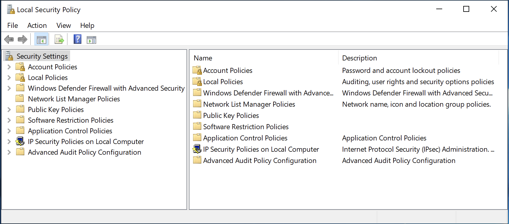
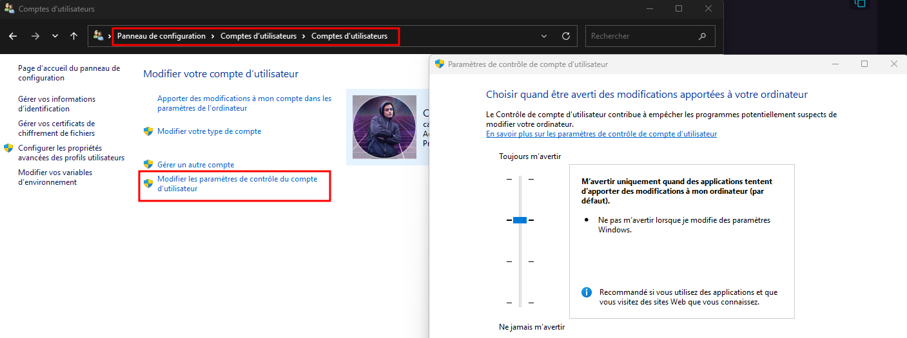

- Windows fournit plusieurs mécanismes natifs de sécurité, notamment **UAC**, Windows Defender, Windows Firewall, les contrôles d’accès du système de fichiers et BitLocker.

```
Local Security Policy
→ sécurité d'une machine

Group Policy / GPO
→ configuration centralisée

UAC
→ contrôle de l'élévation de privilèges
```

## Local Security Policy (secpol.msc)

- **Local Security Policy** permet de gérer les paramètres de sécurité d’un ordinateur Windows individuel.
- Accessible via PowerShell, MMC notamment avec :

```
secpol.msc
```

Elle permet de configurer entre autres :

- password policies ;
- account policies ;
- attributions de droits d'utilisateur ;
- audit policies ;
- security options ;
- certains paramètres UAC.

Exemple :

```
Account Policies
→ Password Policy
→ Minimum password length
→ Password history
```

- Une mauvaise configuration peut réduire la sécurité ou provoquer des dysfonctionnements, donc les changements doivent être contrôlés.

{ width="500" }
## Stratégie de groupe (gpedit.msc)

- Une **Group Policy** permet d’appliquer des configurations aux :
	- ordinateurs ;
	- utilisateurs.
- Cet outil est souvent utilisé pour contrôler de manière centralisée les paramètres sur plusieurs ordinateurs d'un réseau.
- Elle peut gérer :
	- paramètres de sécurité ;
	- Windows Update ;
	- firewall ;
	- network settings ;
	- applications autorisées/interdites ;
	- scripts startup/shutdown ;
	- Windows Defender ;
	- paramètres utilisateur.
### `gpedit.msc` vs Group Policy Management

```
gpedit.msc
→ Local Group Policy Editor
→ politique de la machine locale

Group Policy Management (GPMC)
→ création/gestion de GPO Active Directory
→ plusieurs machines/utilisateurs du domaine
```

> ⚠️ Le cours mélange légèrement les deux : `gpedit.msc` sert principalement à éditer la **Local Group Policy**, tandis que les GPO de domaine sont normalement gérées via **Group Policy Management Console — GPMC**.
### Création d’une GPO de domaine
Dans Group Policy Management :

```
Domain / OU
→ Create a GPO and Link it here
→ Name
→ Edit
```

Une GPO contient deux grandes sections.
#### Computer Configuration

- Paramètres appliqués aux **machines**.
- Peut définir :
    - services ;
    - security settings ;
    - réseau ;
    - firewall ;
    - paramètres système.

```
Computer
→ démarre / actualise les policies
→ Computer Configuration appliquée
```

#### User Configuration

- Paramètres associés à l’**utilisateur**.
- Peut gérer :
    - desktop ;
    - applications ;
    - paramètres réseau ;
    - expérience utilisateur.

```
User
→ logon / policy refresh
→ User Configuration appliquée
```

### Local Policy vs Domain GPO

- Dans un environnement Active Directory, plusieurs politiques peuvent s’appliquer au même système.

Ordre conceptuel classique :

```
L → Local
S → Site
D → Domain
OU → Organizational Unit
```

→ **LSDOU**.
Les politiques de domaine/OU peuvent donc imposer une configuration différente de celle définie localement.
## UAC — User Account Control

- **UAC** contrôle les opérations nécessitant des privilèges administrateur.
- Lorsqu’une application demande une élévation, Windows affiche un prompt permettant d’autoriser ou refuser l’opération.

```
Application
→ privileged operation
→ UAC
→ Approve / Deny
```

### Administrateur

- Un utilisateur déjà membre des administrateurs reçoit généralement un **consent prompt** :

```
Do you want to allow this app...?
→ Yes / No
```

### Utilisateur standard

- Un utilisateur standard doit généralement fournir les **credentials d’un administrateur**.

```
Standard User
→ elevation requested
→ Admin credentials required
```

### Pourquoi UAC ?

- UAC limite l’utilisation automatique des privilèges administrateur.

Exemple :

```
Malicious Application
→ veut modifier une zone système
→ elevation nécessaire
→ UAC prompt
```

Cela réduit notamment le risque qu’une application réalise silencieusement certaines modifications privilégiées.

> **UAC ≠ sandbox / antivirus** : il s’agit principalement d’un mécanisme de **séparation et d’élévation de privilèges**.

{ width="600" }
### Niveaux UAC
Windows propose quatre niveaux principaux.
#### Always Notify

- Niveau le plus strict.
- Notification lorsqu’une application **ou l’utilisateur** tente d’effectuer certaines modifications nécessitant une élévation.
- Utilise le **Secure Desktop**.

```
Always Notify
→ maximum prompts
→ highest UAC visibility
```

#### Notify me only when apps try to make changes — Default

- Niveau par défaut.
- Prompt lorsqu’une application tente une modification nécessitant une élévation.
- Les actions initiées directement par l’utilisateur peuvent être traitées différemment selon le paramètre.
- Utilise normalement le **Secure Desktop**.

> ⚠️ Le cours indique que le niveau par défaut ne diminue pas le bureau. C’est inversé : le niveau **par défaut utilise normalement le Secure Desktop**, qui assombrit le reste de l’écran.
#### Notify me only when apps try to make changes — Do not dim desktop

- Même logique générale, mais le prompt apparaît **sans Secure Desktop**.

```
UAC Prompt
→ desktop reste interactif/non assombri
```

→ légèrement moins sécurisé car d’autres processus peuvent davantage interagir avec le desktop normal.
#### Never Notify

- Aucun prompt UAC.
- Niveau le moins protecteur.

```
Never Notify
→ UAC prompts disabled
→ security ↓
```

Il est déconseillé de désactiver UAC sans raison spécifique.
### Secure Desktop
Lorsqu’UAC utilise le **Secure Desktop** :

```
Normal Desktop
→ dimmed / inaccessible

UAC Prompt
→ displayed on secure desktop
```

Objectif :

- réduire les possibilités pour une application non privilégiée :
    - d’interagir avec le prompt ;
    - de simuler certains clics ;
    - de manipuler son interface.
## À retenir

```
secpol.msc
→ Local Security Policy
→ paramètres de sécurité locaux
```


```
gpedit.msc
→ Local Group Policy

GPMC
→ GPO Active Directory
→ administration centralisée
```


```
GPO
├─ Computer Configuration
└─ User Configuration
```


```
UAC
→ contrôle l'élévation de privilèges
→ Consent Prompt / Credential Prompt
→ Secure Desktop
```


Le point clé est de distinguer les trois rôles : **Local Security Policy configure la sécurité locale, les GPO permettent d’imposer des configurations à grande échelle, et UAC contrôle l’utilisation des privilèges administrateur.**
