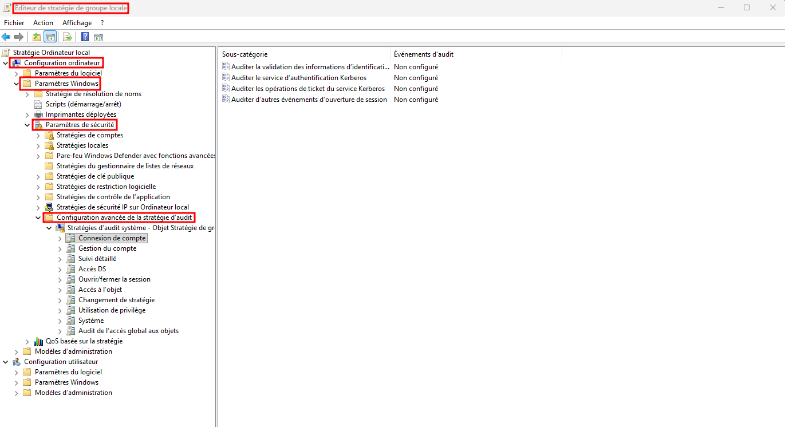
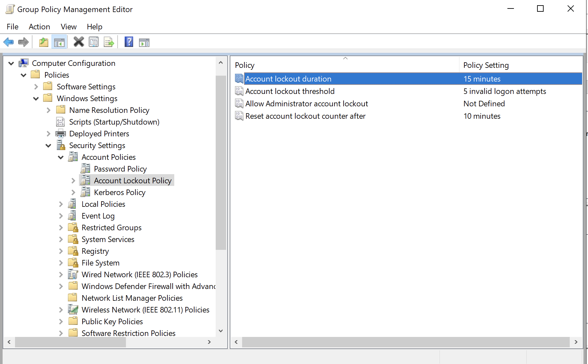
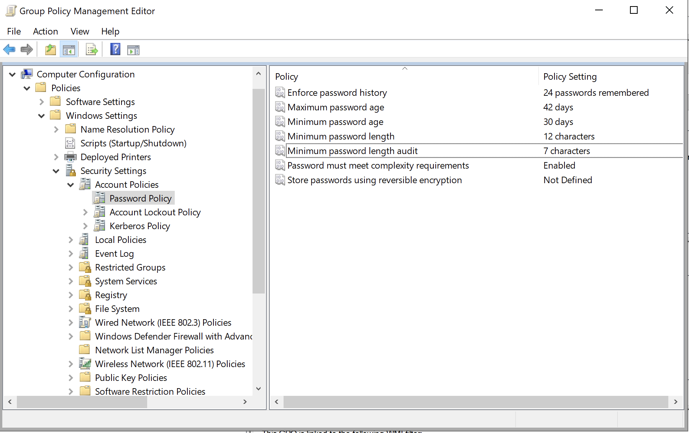
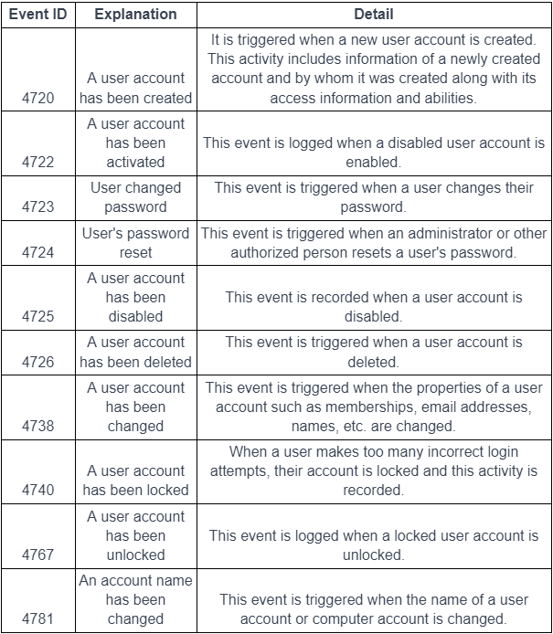
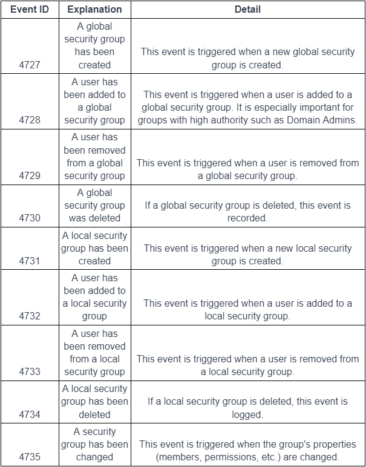
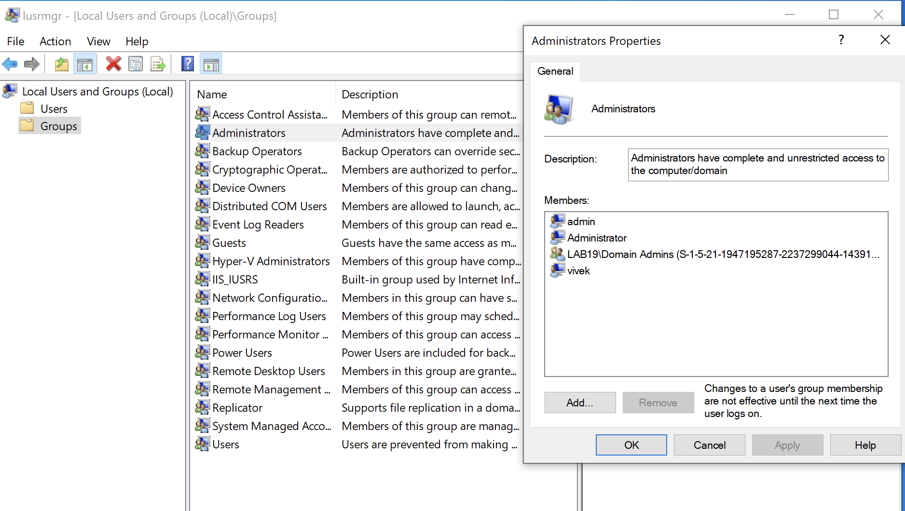
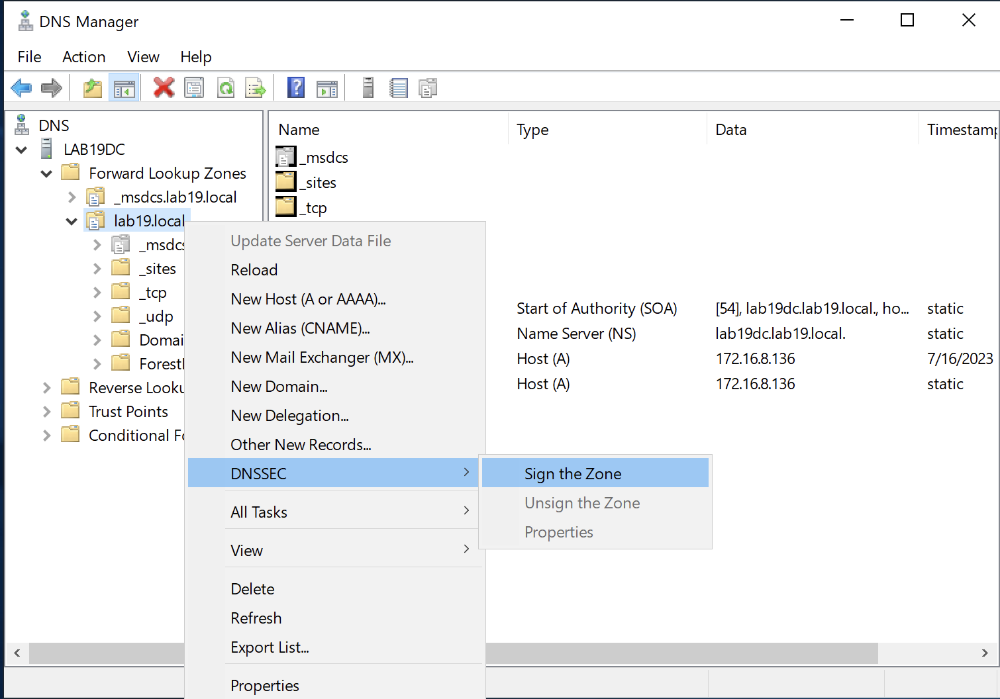
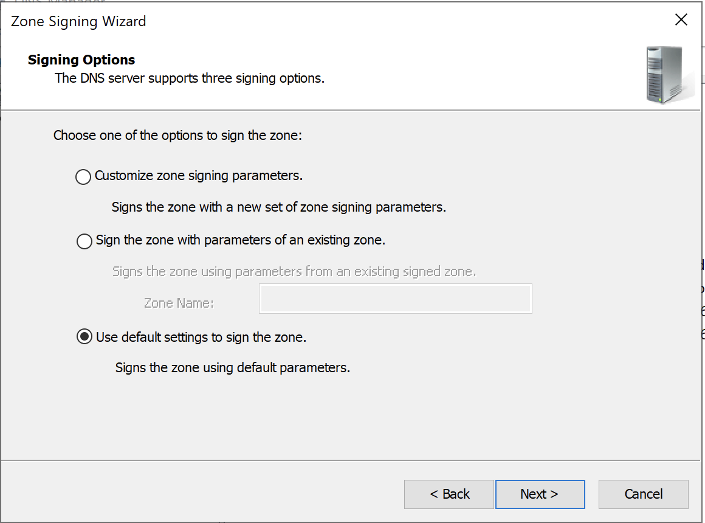
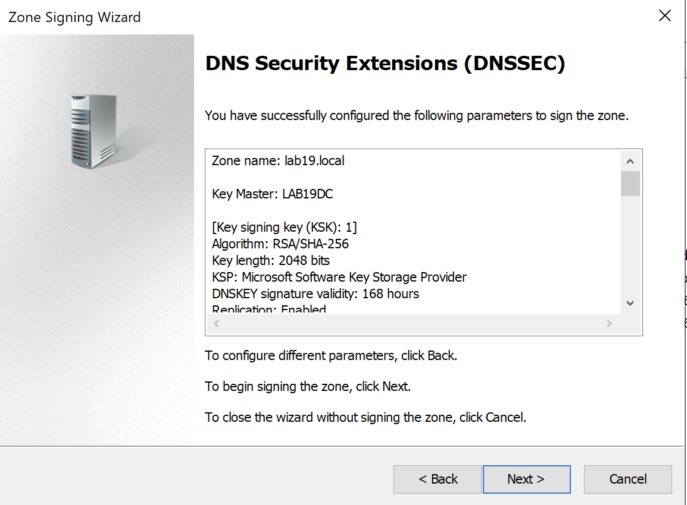
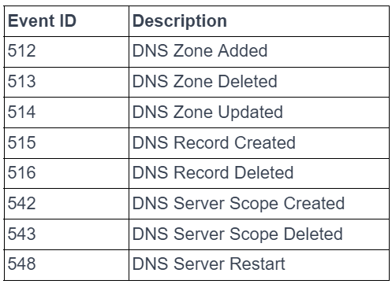

- Active Directory est un service d'annuaire Microsoft utilisé pour centraliser la gestion des identités, groupes, ordinateurs et ressources dans un environnement Windows.
## Gestion centralisée des identités

- Gestion centralisée des comptes utilisateurs et credentials.
- Une même identité peut être utilisée pour accéder à plusieurs ressources du domaine.
- Permet d’appliquer plus facilement :
    - password policies ;
    - autorisations ;
    - contrôles de sécurité.
## Gestion centralisée des ressources

- facilite la configuration et la mise à jour régulières des ressources ainsi que le contrôle des droits d'accès.
- AD permet de gérer notamment :
    - utilisateurs ;
    - groupes ;
    - ordinateurs ;
    - serveurs ;
    - shared folders ;
    - imprimantes ;
    - autres ressources réseau.
## Stratégie de groupe

- Les stratégies de groupe sont utilisées pour gérer de manière centralisée les paramètres de configuration des utilisateurs et des ordinateurs.
- Ces stratégies incluent des paramètres de sécurité, des paramètres de bureau, des paramètres d'application, et plus encore.
## Group Policy — GPO

- Les **Group Policies** permettent de configurer centralement les utilisateurs et ordinateurs du domaine.
- Elles peuvent gérer :
    - paramètres de sécurité ;
    - configuration système ;
    - desktop settings ;
    - paramètres applicatifs.

```
Active Directory
      ↓
     GPO
      ↓
Users / Computers
→ configuration homogène
```

## Concepts de base AD

| Concept    | Rôle                                                                        |
| ---------- | --------------------------------------------------------------------------- |
| **Domain** | Unité logique contenant utilisateurs, ordinateurs, groupes et autres objets |
| **OU**     | Regrouper et gérer les objets au sein du domaine de manière plus organisée. |
| **Group**  | Regroupement logique permettant notamment d’attribuer des permissions       |
| **Object** | Élément stocké dans AD : user, computer, group, printer, OU…                |

### Objet

- Éléments de base dans Active Directory. Les utilisateurs, les ordinateurs, les imprimantes, les groupes, les OU et d'autres objets constituent les blocs de construction de la base de données dans Active Directory.
### Domain

- Le domaine est utilisé comme l'unité de gestion de base d'un réseau.
- Les comptes d'utilisateurs, les groupes, les comptes d'ordinateurs et d'autres objets se trouvent dans le domaine, qui fournit une authentification et un contrôle d'accès communs.
- Fournit notamment un cadre commun pour :
    - authentification ;
    - gestion ;
    - contrôle d’accès.
### Organizational Unit — OU

- L'unité d'organisation (Organizational Unit ou OU) est utilisée pour regrouper et gérer les objets au sein du domaine de manière plus organisée.
- Utile pour :
    - délégation d’administration ;
    - organisation logique ;
    - application de GPO.

> **OU ≠ Security Group** : une OU sert surtout à organiser/déléguer/appliquer des GPO, tandis qu’un groupe sert notamment à attribuer des permissions.
### Groupes

- Les groupes sont utilisés pour regrouper logiquement des utilisateurs ou des ordinateurs.
- Le regroupement d'utilisateurs par caractéristiques ou fonctions similaires facilite la gestion des droits d'accès et des autorisations.
## Comptes par défaut — Default Accounts

- Certains comptes sont créés automatiquement, par exemple :
    - `Administrator` ;
    - `Guest`.
- Leur existence et leur nom étant prévisibles, ils représentent des cibles évidentes pour les attaquants.

Bonnes pratiques :

- désactiver les comptes inutiles ;
- contrôler régulièrement leurs privilèges ;
- ne pas les utiliser pour les tâches quotidiennes ;
- surveiller leurs activités ;
- utiliser des comptes nominatifs lorsque possible.

```
Default Account
→ Known identity
→ High-value target
→ Restrict + Monitor
```

> Un nom de compte connu n’est pas en lui-même une vulnérabilité : le problème vient surtout de **privilèges élevés, credentials faibles, mauvaise surveillance ou utilisation permanente**.
## Groupes privilégiés
Les groupes comme :

```
Domain Admins
Enterprise Admins
```

disposent de privilèges extrêmement élevés sur l’environnement AD.

- Les comptes ordinaires ne doivent pas y appartenir.
- Leur nombre de membres doit être **minimal**.
- L’accès privilégié doit idéalement être accordé seulement lorsque nécessaire.

```
Standard User
      X
Domain Admins

Privileged Admin
→ accès uniquement si nécessaire
```

> ⚠️ Le compte `Administrator` intégré ne doit pas être considéré comme une exception à utiliser quotidiennement. Il doit lui aussi être fortement protégé et réservé aux usages réellement nécessaires.
### Just-In-Time Privilege

- Le cours recommande d’ajouter temporairement un compte à `Domain Admins`, puis de le retirer une fois l’opération terminée.
- Conceptuellement :

```
Need Admin Privilege
→ Grant temporarily
→ Perform task
→ Remove privilege
```

→ approche proche du **Just-In-Time (JIT)**.
## Séparer compte utilisateur et compte administrateur

- Pourquoi utiliser plusieurs comptes ? 
    - Séparation des privilèges ;
    - Limitation des attaques ;
    - Sécurité des données et du système.
- Un administrateur devrait posséder au minimum :

```
Account 1 → tâches quotidiennes
Account 2 → tâches administratives
```

### Compte utilisateur standard
Utilisé pour :

- email ;
- Web ;
- bureautique ;
- tâches quotidiennes.
### Compte administratif
Utilisé seulement pour :

- administration système ;
- installation/configuration ;
- opérations nécessitant des privilèges élevés.

Pourquoi ?

```
Daily Account compromised
→ privilèges limités

Admin Account compromised
→ impact potentiellement très élevé
```

→ la séparation réduit l’exposition des credentials privilégiés.
## Stratégie d’audit — Audit Policy

- Les **Audit Policies** déterminent quels événements Windows sont enregistrés.
- Dans un domaine, elles peuvent être déployées via GPO sur les endpoints et serveurs.
- Chemin cité : « Configuration de l'ordinateur -> Stratégies -> Paramètres Windows -> Paramètres de sécurité -> Configuration avancée de la stratégie d'audit »

{ width="550" }

| Catégorie              | Sous-catégorie                  | Audit             |
| ---------------------- | ------------------------------- | ----------------- |
| **Account Logon**      | Credential Validation           | Success + Failure |
| **Account Management** | Application Group Management    | Success + Failure |
|                        | Computer Account Management     | Success + Failure |
|                        | Other Account Management Events | Success + Failure |
|                        | Security Group Management       | Success + Failure |
|                        | User Account Management         | Success + Failure |
| **Detailed Tracking**  | PnP Activity                    | Success           |
|                        | Process Creation                | Success           |
| **Logon/Logoff**       | Account Lockout                 | Success + Failure |
|                        | Group Membership                | Success           |
|                        | Logoff                          | Success           |
|                        | Logon                           | Success + Failure |
|                        | Other Logon/Logoff Events       | Success + Failure |
|                        | Special Logon                   | Success           |
| **Object Access**      | Removable Storage               | Success + Failure |
| **Policy Change**      | Audit Policy Change             | Success + Failure |
|                        | Authentication Policy Change    | Success           |
|                        | Authorization Policy Change     | Success           |
| **Privilege Use**      | Sensitive Privilege Use         | Success + Failure |
| **System**             | IPsec Driver                    | Success + Failure |
|                        | Other System Events             | Success + Failure |
|                        | Security State Change           | Success           |
|                        | Security System Extension       | Success + Failure |
|                        | System Integrity                | Success + Failure |
### Process Creation

- L’audit de création de processus est particulièrement intéressant pour le SOC :

```
User
→ launches powershell.exe
→ Process Creation Event
→ Security Log
→ SIEM / Detection
```

- Complément utile : sur Windows, l’Event ID fréquemment exploité est :

```
4688 → A new process has been created
```

- Avec une configuration adaptée, la **command line** peut également être enregistrée.
## Windows LAPS

- **Windows LAPS — Local Administrator Password Solution** automatise la gestion des mots de passe des comptes administrateur locaux.
- Permet :
    - Simplifier gestion des MDP ;
    - Améliorer la sécurité des MDP ;
    - Prévenir les attaques.
- Problème classique sans LAPS :

```
PC01 → local Administrator / SamePassword
PC02 → local Administrator / SamePassword
PC03 → local Administrator / SamePassword
```

- Si le password est compromis :

```
→ lateral movement facilité
```


- Avec LAPS :

```
PC01 → RandomPassword-A
PC02 → RandomPassword-B
PC03 → RandomPassword-C
```

→ chaque machine possède idéalement un secret distinct.
### Avantages et bonnes pratiques

- gestion centralisée ;
- génération de passwords forts ;
- rotation automatique ;
- limitation de la réutilisation ;
- réduction du risque lié aux mots de passe locaux statiques.

```
Unique Password
+
Automatic Rotation
+
Restricted Retrieval
→ Local Admin Risk ↓
```

#### Point important
Le password LAPS doit être :

- accessible uniquement aux comptes autorisés ;
- protégé par les ACL appropriées ;
- audité lors de sa consultation.

> Les logs doivent tracer les **rotations et accès au secret**, pas exposer le mot de passe en clair.
## Password Policy dans Active Directory
Une politique de mot de passe peut définir :

- longueur minimale ;
- complexité ;
- historique ;
- durée de vie ;
- account lockout après échecs répétés.

```
Password Policy
├─ Minimum Length
├─ Complexity
├─ Password History
├─ Maximum Age
└─ Account Lockout
```

### Complexité
Le cours recommande de combiner :

- uppercase ;
- lowercase ;
- numbers ;
- symbols.

> En pratique, une **longueur suffisante** et le blocage des mots de passe faibles/compromis sont souvent plus importants qu’une complexité artificielle excessive.
### Password History

- Empêche l’utilisateur de réutiliser immédiatement ses anciens passwords.

```
Password1
→ Password2
→ Password3

X Password1
```

### Stratégie de verrouillage de compte - Account Lockout

- Une **Account Lockout Policy** verrouille temporairement un compte après un certain nombre de tentatives d’authentification échouées.
- Objectif principal : limiter les attaques de type **brute force** et rendre les tentatives répétées plus coûteuses pour l’attaquant.

```
Failed Login × N
→ Account Lockout
→ accès temporairement bloqué
```

Avantages :

- ralentit les attaques par mot de passe ;
- empêche les tentatives illimitées ;
- les verrouillages répétés peuvent servir d’**indicateur d’attaque**.

> ⚠️ **Nuance hors cours :** une lockout policy protège surtout contre les attaques nécessitant des essais de password. Elle n’empêche pas directement un **Pass-the-Hash**, puisque celui-ci réutilise un hash NTLM déjà compromis plutôt que de deviner le mot de passe.

→ peut réduire l’efficacité du brute force online, mais les seuils doivent être configurés pour éviter de faciliter un **DoS par verrouillage de comptes**.
{ width="550" }
#### Étapes de création d'une stratégie de mot de passe dans Active Directory

- Ouvrez les Outils d'administration Active Directory et sélectionnez Gestion des stratégies de groupe.
- Pour gérer les mots de passe, accédez aux Stratégies de mot de passe.
- Créez une nouvelle stratégie de mot de passe et nommez-la.
- Spécifiez le niveau de complexité que vous exigez dans la stratégie de mot de passe. Par exemple, l'utilisation de lettres majuscules, de lettres minuscules, de chiffres et de symboles.
- Spécifiez la période de validité du mot de passe. Le mot de passe sera alors désactivé et l'utilisateur aura besoin de l'aide d'un administrateur pour le réactiver. Cela garantit que le mot de passe est changé régulièrement.
- Spécifiez le nombre minimum de fois que les utilisateurs doivent se souvenir de leurs mots de passe précédents. Cela empêche la réutilisation d'anciens mots de passe.
- Définissez des limites de temps ou le verrouillage des comptes à la suite de tentatives de saisie de mots de passe incorrects.

{ width="550" }

## SAW — Secure Admin Workstation

- Une **Secure Admin Workstation** est une machine dédiée exclusivement aux opérations administratives utilisant des comptes privilégiés.

```
Daily Workstation
→ Web / Email / Office

SAW
→ Administration uniquement
→ Privileged Accounts
```

- Objectif : empêcher que des credentials administratifs soient exposés sur une workstation utilisée pour des activités plus risquées comme le Web ou les emails.
### Caractéristiques d’une SAW
#### Environnement isolé

- Séparé des usages utilisateur classiques.
- Réseau et configuration adaptés aux opérations administratives.
#### Pas d’accès Internet

- Ne pas utiliser la SAW pour :
    - consulter ses emails ;
    - naviguer sur Internet ;
    - effectuer des tâches quotidiennes.
#### Authentification forte

- Comptes privilégiés fortement protégés.
- Utilisation de :
    - passwords robustes ;
    - MFA lorsque possible.
#### Applications minimales

- Installer uniquement les outils nécessaires à l’administration.
- Supprimer les logiciels inutiles afin de réduire l’**Attack Surface**.
#### Patching

- OS et applications maintenus à jour.
- Correctifs de sécurité appliqués régulièrement.

```
SAW
→ Isolated
→ No Web / Email
→ MFA
→ Minimal Software
→ Fully Patched
```

### Avantages d’une SAW

- réduit l’exposition des comptes privilégiés ;
- diminue le risque de malware/ransomware ;
- facilite le contrôle des opérations administratives ;
- améliore la surveillance des activités privilégiées.
## Support du système d’exploitation

- Utiliser des versions Windows encore **supportées** est essentiel.
- Un OS **End-of-Life / End-of-Support** ne recevant plus de security patches augmente fortement le risque.
## Gestion des comptes de service

- Les **Service Accounts** sont utilisés par des applications, services ou systèmes pour fonctionner automatiquement.
- Ils représentent une cible importante car ils peuvent :
    - disposer de privilèges élevés ;
    - avoir des passwords rarement modifiés ;
    - accéder à plusieurs ressources.
### Bonnes pratiques
#### Un compte par service

```
Service A → Account A
Service B → Account B
```

→ éviter les comptes partagés entre plusieurs services, garantit l'isolement.
Cela facilite :

- isolation ;
- auditing ;
- révocation ;
- limitation de l’impact d’une compromission.
#### Least Privilege

- Un compte de service ne doit posséder que les droits indispensables.

```
Service Account
→ Required Resources Only
→ Required Permissions Only
```

#### Gestion des credentials

- Utiliser des secrets forts.
- Automatiser leur rotation lorsque possible.
- Préférer des mécanismes de **managed service accounts** lorsqu’ils sont disponibles.
#### Restreindre le réseau

- Limiter les systèmes auxquels le compte peut accéder.
- Bloquer les communications inutiles.
#### Monitoring
Surveiller :

- authentifications inhabituelles ;
- nouvelles machines sources ;
- horaires anormaux ;
- accès inhabituels ;
- modifications de privilèges.
#### Patch Management

- Maintenir à jour les systèmes et applications exécutant ces comptes.
## Surveillance des modifications utilisateurs / groupes

- Les modifications AD importantes doivent être auditées :

```
User Created
User Deleted
Password Changed / Reset
Group Membership Changed
Privilege Changed
```

- Les Domain Controllers enregistrent ces opérations dans leurs **Event Logs**.
- Cependant, dans les réseaux à grande échelle, la surveillance manuelle de ces journaux d'événements peut être difficile et prendre beaucoup de temps, il est important d'avoir un SIEM :

```
Domain Controller Logs
        ↓
       SIEM
        ↓
Correlation / Alerting
```

Le SIEM facilite :

- centralisation ;
- analyse ;
- détection d’anomalies ;
- génération d’alertes.
### Événements sensibles

- Exemples particulièrement importants à surveiller :

```
New User Created
→ vérifier légitimité

User added to privileged group
→ High Priority

Account Disabled / Deleted
→ vérifier origine

Password Reset
→ vérifier initiateur
```

- Le changement d’appartenance à des groupes comme :

```
Domain Admins
Enterprise Admins
Administrators
```

-> doit recevoir une attention particulière.
#### Tableau user
{ width="400" }
#### Tableau group
{ width="400" }
### Contrôle de l'appartenance au groupe d'admin. locaux

- Un membre du groupe local **Administrators** possède des privilèges élevés sur la machine.
- Il peut notamment :
    - installer des logiciels ;
    - modifier la configuration ;
    - gérer les comptes ;
    - désactiver certaines protections ;
    - accéder à des données locales sensibles.

```
Standard User
      X
Local Administrators
```

Les utilisateurs standards ne devraient pas disposer de droits admin locaux sans nécessité métier.
{ width="550" }
#### Risque des Local Admin Rights

- Une compromission d’un compte administrateur local peut permettre à l’attaquant de :

```
Execute as Admin
→ Disable Security Controls
→ Dump Credentials
→ Establish Persistence
→ Attempt Lateral Movement
```

→ supprimer les droits locaux inutiles réduit donc fortement l’impact potentiel d’une compromission.
#### Gestion centralisée

- Le cours recommande de contrôler les appartenances au groupe `Administrators` via des mécanismes centralisés, notamment **Group Policy**.

```
GPO
→ Local Administrators Membership
→ Centralized Enforcement
```

Sinon, une modification locale peut réintroduire des privilèges qui avaient été supprimés manuellement.
## Sécurité DNS sous Windows

- Le **DNS — Domain Name System** traduit les noms de domaine en adresses IP.
- Sous Windows Server, le rôle DNS est souvent étroitement intégré à **Active Directory**.
- Sa compromission peut permettre :
    - redirection vers des sites malveillants ;
    - empoisonnement / usurpation DNS ;
    - interruption de service ;
    - modification des enregistrements ;
    - collecte d’informations sur l’infrastructure.

```
Client
→ Query DNS
→ DNS Server
→ IP Address
→ Target Service
```

### Restriction des transferts de zones

- Une **zone DNS** contient les enregistrements associés à un espace de noms.
- Exemples :

```
A
AAAA
CNAME
MX
NS
TXT
PTR
```

-> Les transferts de zone permettent de synchroniser les données entre serveurs DNS.
#### AXFR — Full Zone Transfer

- Copie **l’ensemble de la zone DNS**.

```
Primary DNS
→ AXFR
→ Secondary DNS
```

Utilisé notamment lors :

- de l’initialisation d’un serveur secondaire ;
- d’une synchronisation complète ;
- lorsque le serveur de sauvegarde est complétement redémarré.
#### IXFR — Incremental Zone Transfer

- Transmet seulement les **modifications** depuis la dernière version connue.

```
Zone v10
→ modifications
→ IXFR
→ Zone v11
```

Avantages :

- moins de trafic ;
- synchronisation plus efficace.
##### Risque de sécurité

- Si un transfert de zone est autorisé à n’importe qui :

```
Attacker
→ AXFR
→ récupération de nombreux DNS records
```

L’attaquant peut découvrir :

- tous les enregistrements du serveur DNS ;
- hostnames ;
- serveurs internes ;
- mail servers ;
- noms de services ;
- informations utiles pour la reconnaissance.

→ limiter les transferts aux **serveurs DNS secondaires autorisés**.
Sous Windows Server :

```
DNS Manager
→ Zone Properties
→ Zone Transfers
→ Allow zone transfers
→ Only to the following servers
```


**Complément :** un zone transfer sert surtout à la **réplication entre serveurs DNS autoritatifs** ; ce n’est pas en lui-même un mécanisme de load balancing.
### DNSSEC
**DNSSEC — Domain Name System Security Extensions** permet de vérifier :

- l’**authenticité** des données DNS ;
- leur **intégrité**.

Il repose sur des **signatures cryptographiques**.

```
DNS Record
+
Digital Signature
→ Validation
```

Objectif :

```
Réponse DNS reçue
→ provient-elle bien de la chaîne de confiance attendue ?
→ a-t-elle été modifiée ?
```

DNSSEC aide notamment à limiter certains scénarios de :

- DNS spoofing ;
- DNS cache poisoning.

{ width="400" }
{ width="400" }
{ width="400" }
#### Limites de DNSSEC

- DNSSEC peut être complexe à mettre en œuvre et à gérer, et utiliser plus de ressources système. Par conséquent, une mise en œuvre de DNSSEC doit être soigneusement planifiée et gérée.
- configuration plus complexe ;
- gestion des clés/signatures ;
- consommation supplémentaire de ressources ;
- maintenance nécessaire.

> **Complément : DNSSEC ne chiffre pas les requêtes DNS.** Il apporte principalement **authenticité + intégrité**, pas la confidentialité du trafic.

```
DNSSEC
→ Authenticity
→ Integrity

DNSSEC ≠ Encryption
```

### Surveillance du serveur DNS

- Windows Server fournit des événements DNS dans :

```
Event Viewer
→ Applications and Services Logs
→ Microsoft
→ Windows
→ DNS-Server
→ Audit
```

La surveillance permet de détecter :

- modifications de zones ;
- changements d’enregistrements ;
- activités administratives anormales ;
- comportements pouvant indiquer un détournement DNS.

{ width="400" }
#### DNS Hijacking

- Le **DNS Hijacking** consiste à détourner le mécanisme de résolution DNS afin de rediriger les utilisateurs vers une destination contrôlée par l’attaquant.
- Exemple :

```
DNS Record légitime
example.com → 10.0.0.10

Attaquant modifie le record
example.com → 10.0.0.99
```

→ les clients suivent ensuite la résolution falsifiée.

- Cela peut provenir notamment d’une modification :
    - des DNS records ;
    - de la configuration DNS ;
    - du serveur utilisé pour la résolution.
## Sécurité du DHCP Windows

- **DHCP — Dynamic Host Configuration Protocol** attribue automatiquement aux clients leur configuration réseau :
    - adresse IP ;
    - masque/prefix ;
    - default gateway ;
    - DNS ;
    - autres options DHCP.
- Un serveur DHCP compromis ou malveillant peut fournir une configuration falsifiée et rediriger une partie du trafic réseau.

```
Client
→ DHCP Server
→ IP + Gateway + DNS
→ Network Access
```

### Risques liés au DHCP
Principales menaces :

- **Rogue DHCP** → serveur DHCP non autorisé ;
- **DHCP Spoofing** → réponses DHCP falsifiées ;
- **DHCP Starvation** → épuisement du pool d’adresses ;
- accès réseau par un équipement non autorisé ;
- modification frauduleuse de la gateway ou du DNS.

Exemple :

```
Rogue DHCP
→ Gateway = Attacker
→ DNS = Attacker
→ trafic potentiellement redirigé/intercepté
```
