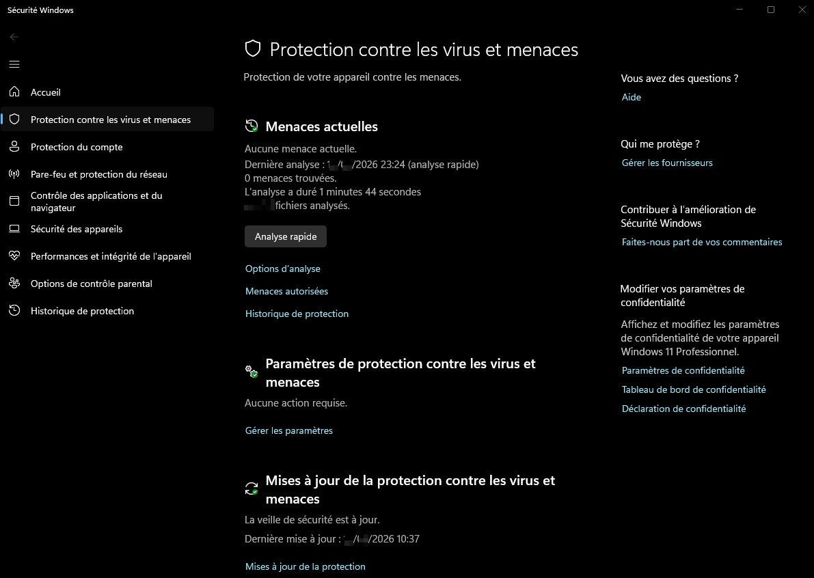
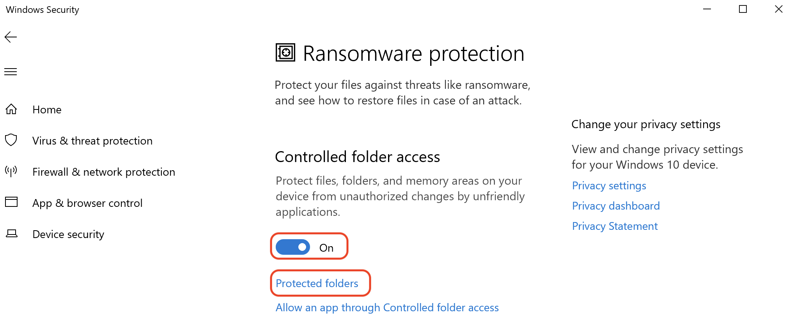
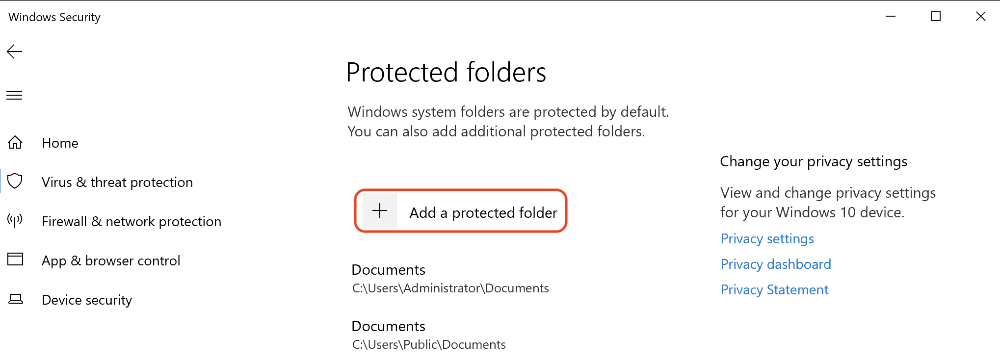

- Windows intègre plusieurs mécanismes complémentaires pour protéger les endpoints :

```
Microsoft Defender Antivirus
→ prévention / détection de malware

Windows Defender Firewall
→ contrôle du trafic réseau

Microsoft Defender for Endpoint
→ EDR / gestion et investigation avancées
```

- Ces protections doivent rester **à jour**, car de nouvelles signatures, modèles de détection et vulnérabilités apparaissent régulièrement.

> Un antivirus ne remplace pas le firewall, l’EDR, le patch management ou le least privilege : ces contrôles se complètent.
## Microsoft Defender Antivirus

- **Microsoft Defender Antivirus** est l’antivirus intégré à Windows.
- Il peut notamment :
	- analyser les fichiers ;
	- détecter malware, spyware et autres menaces ;
	- mettre en quarantaine des fichiers ;
	- supprimer certaines menaces ;
	- surveiller les activités en temps réel ;
	- utiliser des renseignements de sécurité locaux et cloud.

Dans Windows Security :

```
Windows Security
→ Virus & threat protection
```

On peut notamment consulter :

- dernier scan ;
- menaces détectées ;
- historique de protection ;
- état des protections ;
- mises à jour de sécurité.

{ width="500" }
### Real-Time Protection

- La **Real-Time Protection** surveille continuellement :
	- fichiers ouverts/créés ;
	- programmes exécutés ;
	- activités système pertinentes.

```
File / Process
→ Defender inspection
→ Malicious?
   ├─ No  → Allow
   └─ Yes → Block / Quarantine
```

- Elle constitue une protection importante contre l’exécution de malware.
### Cloud-Delivered Protection

- La **Cloud-Delivered Protection** permet au client Defender de consulter les services cloud Microsoft afin d’obtenir rapidement des informations sur des fichiers ou comportements inconnus.

```
Unknown File
→ Local Defender
→ Microsoft Cloud
→ Reputation / Analysis
→ Verdict
```

Avantages :

- détection plus rapide des nouvelles menaces ;
- réputation cloud ;
- analyse complémentaire ;
- meilleure réaction aux menaces encore peu connues.
### Automatic Sample Submission

- Defender peut envoyer automatiquement des **échantillons suspects** à Microsoft pour analyse.
- Cette fonctionnalité fonctionne en complément de la protection cloud.

```
Suspicious Sample
→ Microsoft analysis
→ New detection intelligence
```

Certaines organisations peuvent limiter cette fonctionnalité pour des raisons de :

- confidentialité ;
- réglementation ;
- sensibilité des fichiers.

> Cela doit être géré par politique plutôt que désactivé arbitrairement.
## Windows Defender Firewall

- Le firewall Windows contrôle le trafic réseau selon des règles.
- Il peut filtrer :
	- inbound ;
	- outbound ;
	- protocoles ;
	- ports ;
	- applications ;
	- profils réseau.

```
Network Traffic
→ Windows Firewall
→ Rule Evaluation
→ Allow / Block
```

> Le firewall ne protège pas seulement contre « Internet » : il peut également filtrer le trafic provenant du **LAN, d’autres segments réseau ou de machines compromises internes**.
## Protection contre les ransomwares

- Windows Security fournit notamment **Controlled Folder Access** pour réduire les modifications non autorisées de fichiers importants.

```
Application
→ attempts to modify protected folder
→ Trusted?
   ├─ Yes → Allow
   └─ No  → Block
```

- Selon la configuration/version, cette protection peut devoir être activée explicitement.
### Controlled Folder Access

- Cette fonctionnalité protège certains dossiers contre les modifications effectuées par des applications non approuvées.
- Dossiers typiques :
	- Documents ;
	- Pictures ;
	- Videos ;
	- autres dossiers ajoutés manuellement.

Objectif principal :

```
Ransomware
→ tries to encrypt Documents
→ Controlled Folder Access
→ modification blocked
```

Une application légitime bloquée peut être ajoutée à la liste des applications autorisées.

> ⚠️ Il faut éviter de créer trop d’exceptions : une allowlist trop permissive réduit fortement l’efficacité de la protection.

{ width="500" }
{ width="500" }
