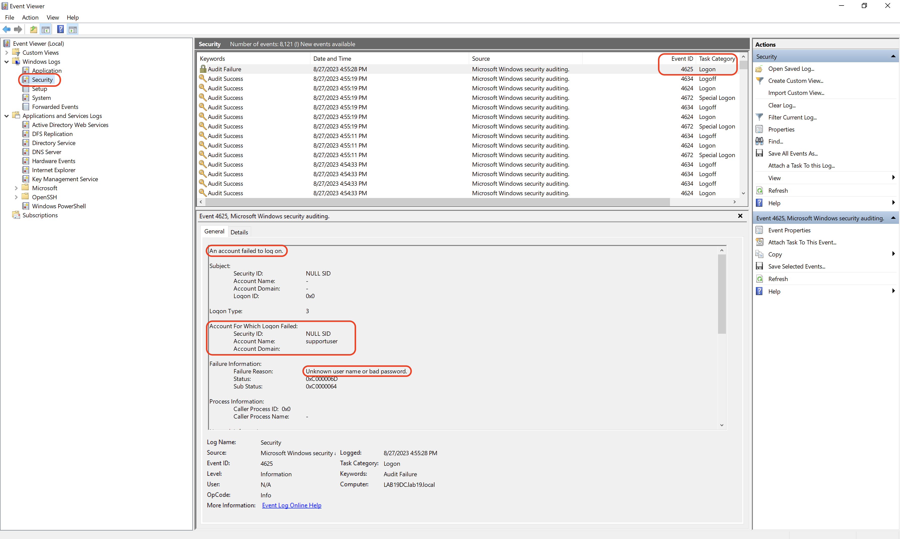
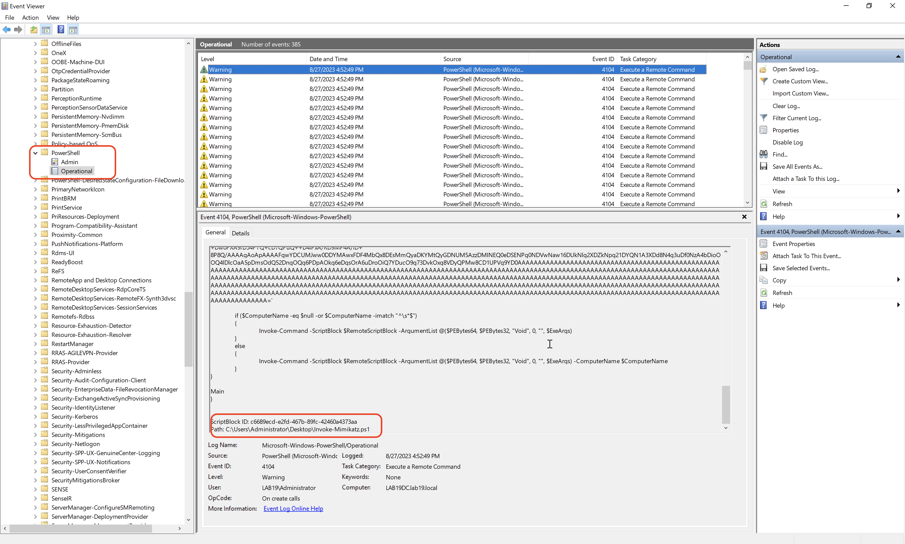
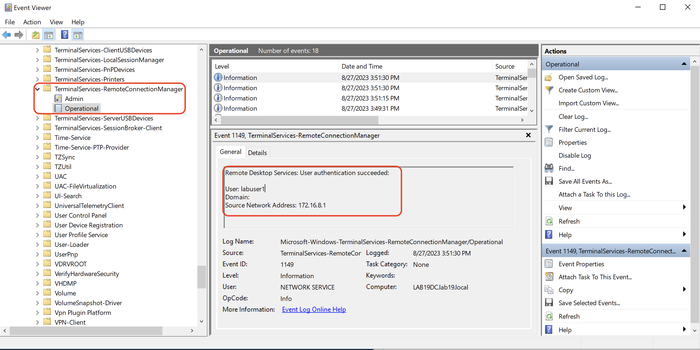

- La journalisation Windows permet d’enregistrer les activités du système, des applications et des utilisateurs afin de faciliter :
	- troubleshooting ;
	- monitoring ;
	- détection d’incidents ;
	- investigation ;
	- audit / conformité.

```
Windows Events
→ Collect
→ Store
→ Analyze
→ Detect / Investigate
```

## Principaux journaux Windows
### Application

- Ces journaux surveillent et enregistrent les activités des applications s'exécutant sur un système. C'est particulièrement utile pour détecter les erreurs et les plantages d'applications.
- événements générés par les applications ;
- erreurs ;
- crashs ;
- problèmes applicatifs.
### Security

- C'est essentiel pour surveiller les activités non autorisées sur un système et détecter les failles de sécurité (security breaches) potentielles.
- authentifications réussies/échouées ;
- accès aux ressources ;
- événements d’audit ;
- activités liées à la sécurité.
### System

- C'est important pour surveiller la santé globale et les performances du système d'exploitation.
- événements liés à Windows et ses composants ;
- erreurs système ;
- warnings ;
- problèmes de services ou drivers.

```
Application → apps
Security    → sécurité / audit
System      → OS / services / drivers
```

## Composants du moteur de journalisation Windows
### Windows Event Log Service

- collecte et stocke les événements générés par Windows et les applications ;
- gère les journaux d’événements.
### Event Viewer
L’**Observateur d’événements** permet de :

- visualiser les logs ;
- filtrer les événements ;
- analyser leurs détails ;
- rechercher des Event IDs spécifiques.

```
eventvwr.msc
```

### Windows Logs

- Les Journaux Windows stockent des informations sur un certain nombre de catégories telles que :

```
Application
Security
Setup
System
Forwarded Events
```

-> Ils sont utilisés pour détecter les erreurs, surveiller les menaces de sécurité et analyser les performances du système.
### Applications and Services Logs

- logs plus spécifiques à des composants, applications et services Windows ;
- Ces informations sont utilisées pour détecter les erreurs liées à une application ou à un service particulier ;
- souvent très utiles pour l’investigation détaillée.

Exemples :

```
Microsoft
└─ Windows
   ├─ PowerShell
   ├─ Defender
   ├─ TerminalServices
   └─ DNS-Server
```

### Subscriptions

- Les **Event Subscriptions** permettent de collecter des événements provenant de plusieurs machines distantes.
- Cela peut être utilisé avec **Windows Event Forwarding — WEF** :

```
Endpoints
   ↓
Windows Event Forwarding
   ↓
Collector
   ↓
SIEM
```

## Politique de journalisation
### Choisir les événements à enregistrer
Une journalisation trop faible peut faire perdre des informations importantes, tandis qu’une journalisation excessive génère énormément de bruit et de stockage.
Pour la sécurité, il est notamment pertinent de journaliser :

- login success/failure ;
- changements de privilèges ;
- changements de comptes/groupes ;
- process creation ;
- accès à des ressources sensibles.

> Sous Windows, la journalisation de sécurité repose surtout sur les **Audit Policies / Advanced Audit Policies**, pas uniquement sur des niveaux génériques comme `Error` ou `Information`.
### Stockage des logs
Les logs peuvent grossir rapidement sur les systèmes actifs.
Il faut prévoir :

- capacité disque suffisante ;
- taille maximale adaptée ;
- politique de rétention ;
- alertes sur l’espace disponible.

```
High Event Volume
→ Log Growth
→ Disk Full
→ Events potentially lost
```

### Archivage
Les anciens logs peuvent être nécessaires pour :

- incident response ;
- forensic ;
- audit ;
- conformité.

Ils doivent donc être archivés selon une politique de rétention définie.

```
Current Logs
→ Archive
→ Retention
→ Investigation later
```

### Protection des journaux
Les logs peuvent contenir :

- usernames ;
- IP ;
- command lines ;
- chemins de fichiers ;
- activités administratives ;
- parfois des données sensibles.

Il faut donc appliquer :

- ACL ;
- RBAC ;
- least privilege ;
- stockage protégé ;
- accès limité aux personnes autorisées.

> Un attaquant privilégié peut chercher à **effacer ou modifier les logs** pour masquer son activité. Leur centralisation hors de l’endpoint réduit ce risque.
### Centralisation via SIEM
Un **SIEM** permet de centraliser et corréler les événements de plusieurs sources.

```
Windows
Firewall
EDR
DNS
AD
PowerShell
   ↓
  SIEM
   ↓
Correlation
Detection
Alerting
Investigation
```

### Alertes automatiques
Certains événements doivent déclencher rapidement une alerte :

```
Suspicious Admin Login
→ Alert

Privilege Change
→ Alert

Security Control Disabled
→ Alert
```

Les SIEM permettent de créer des **use cases / detection rules** basés sur les Event IDs et leur contexte.

> Un Event ID seul n’indique pas forcément une attaque : il faut souvent corréler **user + host + time + process + source IP + contexte**.
### Revue régulière
Même avec des alertes automatiques, une revue périodique des logs reste utile pour :

- repérer des anomalies lentes ;
- détecter des patterns ;
- valider les règles SIEM ;
- identifier des événements non couverts.
## Journaux essentiels pour les violations de sécurité
### Journaux de sécurité - Security Logs

- Les **Security Logs** sont essentiels pour détecter les signes d’une compromission.
- Ils peuvent aider à identifier :
	- activités anormales ;
	- multiples password failures ;
	- accès inhabituels ;
	- changements de comptes ;
	- élévations de privilèges ;
	- corréler les menaces ;
	- modifications de sécurité.

```
Multiple Failed Logons
→ possible brute force

Successful Logon after failures
→ possible compromise
```

{ width="600" }
#### Event IDs utiles
Quelques événements Windows souvent surveillés :

```
4624 → Successful logon
4625 → Failed logon
4688 → Process created
4720 → User account created
4728 → Member added to global security group
4732 → Member added to local security group
1102 → Security audit log cleared
```


> Ce sont des exemples courants ; leur disponibilité dépend des **Audit Policies** activées.
### Journaux PowerShell

- PowerShell est largement utilisé pour :
	- administration ;
	- automatisation ;
	- configuration ;
	- mais aussi par des attaquants.
- Ses logs sont donc très importants en investigation.
- Ils peuvent fournir des informations sur :
	- journaux d'exécution de commandes ;
	- commandes exécutées ;
	- scripts ;
	- utilisateur ;
	- modules chargés ;
	- exécution distante ;
	- paramètres ;
	- certaines sorties.

{ width="600" }
#### Logs PowerShell importants
Complément utile :

```
Microsoft-Windows-PowerShell/Operational
```

Fonctionnalités intéressantes :

- **Script Block Logging**
- **Module Logging**
- **Transcription**

Event ID très connu :

```
4104 → Script Block Logging
```

→ peut contenir le contenu de commandes/scripts PowerShell exécutés.

> Ces fonctionnalités doivent être activées/configurées pour fournir une visibilité maximale.

### Remote Desktop / RDP Logs
Les journaux **TerminalServices / Remote Desktop Services** permettent de suivre l’usage de RDP.
Ils peuvent fournir :

- tentatives d'accès non autorisé ;
- utilisateur ;
- source IP ;
- connexion réussie/échouée ;
- ouverture/fermeture de session ;
- erreurs ;
- informations de session ;
- changements de configuration.

```
Remote IP
→ RDP Attempt
→ User
→ Success / Failure
```

Utilité SOC :

```
RDP Login
+ Unknown External IP
+ Privileged User
→ suspicious
```

{ width="600" }
#### Sources utiles pour RDP

- On peut notamment retrouver des événements sous :

```
Microsoft-Windows-TerminalServices-
  LocalSessionManager
  RemoteConnectionManager
```

- Les Security Logs peuvent également fournir du contexte supplémentaire sur les authentifications.
## Protection contre la suppression des traces
Un attaquant ayant obtenu des privilèges élevés peut tenter :

```
Compromise
→ Perform actions
→ Clear logs
→ Hide evidence
```

D’où l’intérêt de :

- centraliser rapidement les événements ;
- limiter les droits sur les logs ;
- alerter sur leur suppression ;
- conserver des copies hors de l’endpoint.

Exemple particulièrement sensible :

```
Event ID 1102
→ Security audit log was cleared
```
