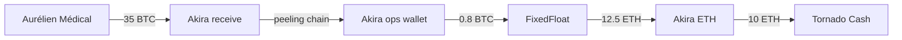

Les visualisations sont la **forme finale** des analyses. Elles transforment des données complexes en compréhension humaine. Ce chapitre couvre les outils dédiés.

## 21.1 Maltego

**Maltego** est l’outil de référence en OSINT investigative pour la visualisation de relations entre entités.

**Capacités pour crypto** :

- **Connecteurs blockchain** via plugins (Maltego CTAS, Maltego Crypto, autres).
- Visualisation de graphes multi-source : crypto + OSINT classique + autres.
- Transforms : enrichissement automatique d’une entité (« voici toutes les transactions de cette adresse »).
- Export pour rapports.

**Forces** :

- **Multi-sources** : combiner crypto avec données OSINT classiques (registres, social media, etc.).
- Communauté active, plugins variés.
- Format reconnu, échange entre analystes.

**Limites** :

- Pas de clustering crypto natif (utilise les données passées via connecteurs).
- Performance limitée pour grands graphes.
- Coût (Pro tier).

**Cas d’usage** : enquêtes mêlant crypto et OSINT classique. Très utilisé en LEA et CTI privé.

## 21.2 Gephi

**Gephi** est un outil open source d’analyse de réseau.

**Capacités** :

- Import de graphes en multiples formats (CSV, GEXF, GraphML).
- Algorithmes d’analyse réseau : centralité, communautés, modularité.
- Visualisation customisable.
- Export images haute qualité.

**Forces** :

- Gratuit et open source.
- Excellent pour analyses **statistiques** de graphes.
- Permet de détecter automatiquement des communautés (clusters au sens statistique) dans les flux.

**Limites** :

- Courbe d’apprentissage forte.
- Pas conçu spécifiquement pour crypto (pas de connecteurs natifs).
- Workflow d’import / export à automatiser via scripts.

**Cas d’usage** : analyse macro de grands graphes (« quels sont les clusters de communauté dans cet écosystème de wallets ? »).

## 21.3 Graphistry

**Graphistry** : visualisation GPU pour très grands graphes (>100 k nœuds). Cloud SaaS ou self-hosted.

**Forces** :

- Performance sur graphes massifs.
- Interface moderne.
- API pour intégration.

**Limites** :

- Coût.
- Apprentissage spécifique.

**Cas d’usage** : enquêtes massives, ecosystem-level analysis.

## 21.4 Mermaid (Markdown)

**Mermaid** : syntaxe pour graphes simples intégrables dans Markdown.

**Exemple** :

**Forces** :

- Intégration native dans rapports Markdown / GitLab / GitHub.
- Lisibilité du code.
- Versionnable en texte.

**Limites** :

- Très basique visuellement.
- Pas pour graphes >20 nœuds.

**Cas d’usage** : graphes simples illustratifs dans rapports techniques.

## 21.5 Excalidraw / drawio

**Excalidraw** et **drawio** sont des outils de dessin diagram interactifs.

**Forces** :

- Gratuits.
- Dessin manuel facile et propre.
- Export multiple formats.
- Excellents pour graphes finaux soignés (rapport exécutif).

**Limites** :

- Manuel — pas de génération automatique depuis données.
- Pas pour grands graphes.

**Cas d’usage** : graphes synthétiques niveau 3/4 pour rapports.

## 21.6 Cytoscape

**Cytoscape** : alternative à Gephi, JavaScript-based. Customisable. Bon pour intégration dans dashboards web.

## 21.7 Outils de visualisation intégrés (Reactor, TRM)

Les outils pro (Ch.20) ont leurs **propres visualisations** intégrées. Pour usage interne, suffisent souvent.

**Forces** : intégration native, données déjà clustérisées.

**Limites** : exports parfois rigides, dépendance plateforme.

**Bonne pratique** : utiliser visualisations Reactor/TRM pour analyse en cours, **exporter** vers Maltego/Excalidraw/drawio pour rapports finaux soignés.

## 21.8 Quand visualiser, quand ne pas

**Visualiser** :

- Pour rapports formels.
- Pour briefings de décideurs.
- Pour comprendre soi-même un flux complexe.
- Pour partager avec des pairs (analystes, autorités).

**Ne pas visualiser** :

- Pour analyses en cours, où le journal Markdown + tableau suffit.
- Pour très petits cas (3 adresses, 2 transactions).
- Quand le graphe serait illisible (10 000 nœuds non abstrait).

## 21.9 Le graphe pour rapport exécutif

Pour direction / haut management :

- Maximum 5-15 nœuds.
- Niveau 3 (entités) ou 4 (phases).
- Couleurs simples avec légende.
- Annotations textuelles claires.
- Période et source documentées.

Pour audience technique (analystes pairs, autorités) :

- Plus de détail acceptable.
- Niveau 2 (clusters) jusqu’à 20-50 nœuds.
- Détail technique conservé.

Pour annexe technique :

- Détail complet.
- Niveau 1 (adresses) si nécessaire.
- Tout le graphe d’investigation.

## 21.10 Fil rouge — MIXSHADOW : visualisations finales

> **🔗 MIXSHADOW — Épisode 14 : graphes finaux du rapport**
> 
> Pour le rapport final MIXSHADOW (semaine 8), Sarah produit **trois graphes** :
> 
> **Graphe 1 — Vue exécutive (Excalidraw)** :
> 
> - 10 nœuds : Aurélien Médical → Akira receive → Akira BTC ops → FixedFloat → Tornado Cash → exchange non-KYC X → Hubs TRON → Multiple destinations.
> - 4 phases annotées : Réception / Layering Bitcoin / Conversion-Anonymisation / Dispersion Stablecoins.
> - Couleurs claires, légende.
> - Une page A4.
> 
> **Graphe 2 — Vue opérationnelle (Maltego)** :
> 
> - ~50 nœuds : adresses principales et clusters.
> - Niveau 2/3.
> - Annotations sur niveaux de confiance.
> - Pour briefing DGSI et coordination Europol.
> 
> **Graphe 3 — Vue technique complète (Reactor export)** :
> 
> - Toutes les adresses (~250).
> - Niveau 1.
> - Annexe technique du rapport.
> - Format détaillé pour analystes pairs vérification.
> 
> Les trois graphes sont produits avant la rédaction finale du rapport. Ils servent de **support de réflexion** (Sarah valide sa compréhension en visualisant) puis de **livrables**.
> 
> Au passage, Sarah découvre **deux insights** en construisant le graphe Maltego :
> 
> 1. Une connexion qu’elle n’avait pas vue auparavant : un des Hubs TRON connecte (via une transaction de 5000 USDT) à un cluster déjà documenté dans la base Athéna comme lié à un autre groupe ransomware (Black Basta). Hypothèse : possible **service de blanchiment partagé** entre Akira et Black Basta. Insight majeur — alimente un dossier transversal.
> 1. Un timing remarquable : Akira a fait **trois mouvements** post-paiement en l’espace de 4 heures (peeling, FixedFloat, Tornado), mais ensuite **aucun mouvement** pendant 11 jours. Hypothèse : possible **délai d’observation** par Akira pour vérifier qu’aucune autorité n’a tracé. Pattern OPSEC documenté.
> 
> Ces insights sont intégrés dans le rapport et alimentent les recommandations.

-----
