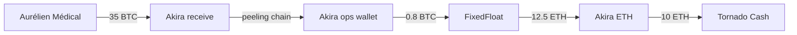

> **Ce que cette partie apprend.** Choisir et utiliser les bons outils pour l’enquête crypto. Outils gratuits et leurs limites, outils professionnels (Chainalysis, TRM Labs, Elliptic) et leurs walkthroughs concrets, outils de visualisation, qualification des sources de labels, gestion de la chaîne de preuve, et construction d’un workflow d’enquête reproductible.
> 
> **Ce qu’elle ne couvre pas.** Catalogue exhaustif d’outils (référence : Annexe G). Détails de fonctionnalités secondaires. Outils trop spécialisés pour l’usage courant.
> 
> **Ce que vous saurez faire après cette partie.** Construire une investigation outillée avec les bons choix selon enjeu, budget et contexte. Utiliser Chainalysis Reactor ou TRM Labs avec efficacité. Visualiser un graphe d’enquête lisible. Maintenir une chaîne de preuve crypto solide.

-----

## Chapitre 19 — Outils gratuits et explorateurs avancés

Avant de souscrire à Chainalysis ou TRM Labs (50-500 k USD/an), beaucoup d’enquêtes peuvent être menées avec des **outils gratuits**. Ce chapitre cartographie l’arsenal gratuit du crypto-forensique.

### 19.1 Les explorateurs blockchain (rappel et approfondissement)

Déjà couverts Ch.11. En usage avancé :

**Mempool.space** :

- API gratuite généreuse pour scripts.
- Fonctionnalités avancées : visualisation des UTXO, estimateur de frais, vue mempool en temps réel.
- Parfait pour Bitcoin.

**Etherscan.io** :

- API gratuite (5 calls/sec gratuit, plus en payant).
- Recherche avancée : filtrage transactions par range de blocs, par méthode appelée.
- Watch list pour monitoring d’adresses.

**Tronscan, Solscan, BscScan, etc.** : équivalents par chaîne.

**Blockchair.com** : multi-chain, recherche cross-chain pratique.

### 19.2 OXT.me — l’outil Bitcoin avancé gratuit

**OXT** (OpenX Tools) est un outil communautaire dédié à l’analyse Bitcoin avancée. Maintenu par Samourai Wallet historiquement, accessible via oxt.me.

**Capacités** :

- Analyse de peeling chains.
- Reconstitution de clusters par heuristiques.
- Visualisation de graphes Bitcoin.
- Statistiques transactionnelles avancées.
- Détection de patterns (CoinJoin, consolidation, etc.).

**Cas d’usage** : analyse fine d’une chaîne de transactions, validation de clustering, exploration d’historique.

**Limites** : Bitcoin uniquement, interface technique, pas de support client.

### 19.3 Breadcrumbs.app

**Breadcrumbs** propose une interface graphique pour exploration de flux. Tier gratuit limité (en transactions explorées par jour) ; tier payant pour usage intensif.

**Capacités** :

- Visualisation interactive de flux blockchain.
- Multi-chain (BTC, ETH, principales).
- Suivi simple de chemins (« où vont ces fonds ? »).
- Export pour rapports.

**Cas d’usage** : visualisation rapide d’un flux pour rapport ou démo.

**Limites** : moins puissant que Chainalysis Reactor mais plus accessible.

### 19.4 Arkham Intelligence (accès public)

**Arkham Intelligence** est une plateforme de blockchain intelligence. Une partie est en accès **public gratuit** (recherche d’adresses, vue de wallets attribués) ; les fonctionnalités avancées sont en abonnement.

**Capacités gratuites** :

- Recherche d’adresses avec attributions publiques (« Vitalik Buterin », « Justin Sun », et milliers d’entités).
- Vue d’ensemble des holdings d’une adresse multi-chain.
- Information sur transactions notables.

**Pour l’enquêteur** : excellent pour vérifier rapidement si une adresse est connue publiquement. Complémentaire d’Etherscan.

### 19.5 DeBank

**DeBank** : portfolio explorer multi-chain pour adresses Ethereum/EVM. Gratuit en consultation.

**Capacités** :

- Vue portfolio d’une adresse (tokens détenus, valeurs USD).
- Activité DeFi (positions sur protocoles).
- Historique de transactions DeFi décodé.

**Cas d’usage** : pour adresse Ethereum identifiée, comprendre rapidement « combien vaut ce wallet et où est l’argent ».

### 19.6 Dune Analytics

**Dune Analytics** : plateforme de dashboards SQL sur données blockchain. Tier gratuit pour consultation, payant pour création/édition avancée.

**Capacités** :

- Dashboards créés par communauté pour des sujets spécifiques (volumes ransomware, flux Tornado Cash, exchanges activity, etc.).
- Recherche libre via SQL pour analystes techniques.
- Visualisations préconfigurées.

**Cas d’usage** : recherche de patterns macro (« qui sont les plus gros utilisateurs de tel mixer ? »), benchmarks sectoriels.

### 19.7 Token Sniffer / GoPlus

Outils d’**analyse de tokens** pour détection de honeypots, rug pulls, tokens malveillants.

**Capacités** :

- Vérification automatique du code d’un token (présence de blacklist, fonctions cachées, taxes anormales).
- Score de risque.
- Détection de patterns connus de fraude.

**Cas d’usage** : pour enquête sur un token suspect (rug pull, scam), valider rapidement la malveillance.

### 19.8 Revoke.cash

**Revoke.cash** : outil pour utilisateurs (révoquer approvals abusifs), mais aussi pour enquêteurs (consulter approvals d’une adresse).

**Capacités** :

- Liste des approvals actifs d’une adresse Ethereum (ou EVM).
- Identifie les approvals « illimités » (potentiellement dangereux).
- Permet la révocation pour les utilisateurs (transaction signée).

**Cas d’usage enquêteur** : pour adresse drainée, comprendre **quel contrat** la victime a approuvé. Identifier le drainer.

### 19.9 Chainabuse

**Chainabuse** : plateforme communautaire de signalement d’arnaques crypto.

**Capacités** :

- Recherche d’adresses signalées comme frauduleuses.
- Détails des arnaques (catégorie, date, victimes).
- Contribution communautaire.

**Cas d’usage** : pour adresse potentiellement liée à fraude, vérifier si déjà signalée. Économise du travail (« cette adresse est déjà documentée comme scam, voici les détails »).

### 19.10 Outils de sécurité et leak research

**Etherscan / Tronscan watch lists** : créer des alertes sur adresses (notifications par email).

**Whale Alert** : suivi public des grosses transactions on-chain (Twitter/X, alertes API). Utile pour macro-trends mais pas pour enquête fine.

**ZachXBT et chercheurs publics** : suivre Twitter/X pour annonces de nouvelles attributions, hacks, scams.

**OnChainScores** : scoring de risque communautaire pour adresses Ethereum.

### 19.11 Scripts custom Python

Pour usages avancés, **scripts Python** sont incontournables.

**Bibliothèques** :

- **`web3.py`** : interactions Ethereum (lecture transactions, smart contracts).
- **`tronpy`** : équivalent TRON.
- **`python-bitcoinlib`** : Bitcoin.
- **`requests`** + APIs explorateurs : pour analyses sur mesure.
- **`pandas`** : manipulation de données.
- **`networkx`** : graphes d’analyse.

**Cas d’usage** :

- Pull massif de transactions pour une adresse / cluster.
- Analyse statistique sur des milliers de transactions.
- Automatisation de monitoring (scripts cron).
- Intégration de données blockchain dans pipelines analytiques internes.

**Pour l’analyste pro** : minimum un peu de Python est utile. Permet d’automatiser des tâches répétitives et de produire des analyses sur mesure.

### 19.12 Limites des outils gratuits

Honnêtement :

**Pas de clustering automatique sophistiqué**. Reconstituer manuellement avec heuristiques fonctionne pour petits cas. Pour cas complexes, outils pro nettement supérieurs.

**Labels limités**. Etherscan et autres ont des labels mais bien moins riches que Chainalysis/TRM (qui ont bases propriétaires acquises sur années).

**Pas de scoring de risque automatisé**. Outils gratuits affichent les données ; ils n’évaluent pas le risque (« cette adresse est à 80% risque élevé »).

**Performance sur grosses adresses**. Pour wallet exchange à 100 000 transactions, outils gratuits sont lents.

**Pas de visualisation graphe automatique** (sauf Breadcrumbs limité).

**Pas d’API entreprise**. Pour intégration dans pipelines, outils gratuits sont limités.

**Pour cas complexes** : outils pro indispensables. Pour cas plus simples : outils gratuits suffisent souvent.

### 19.13 Stratégie de mix gratuit / payant

Recommandation pour cabinet en démarrage ou analyste indépendant :

**100% gratuit** (budget zéro) :

- Mempool, Etherscan, Tronscan + autres explorateurs.
- OXT pour Bitcoin avancé.
- DeBank pour Ethereum portfolios.
- Arkham public.
- Chainabuse pour fraude.
- Maltego Community Edition (limité).
- Scripts Python.

**Premier investissement** (~5-30 k USD/an) :

- Breadcrumbs ou tier payant Arkham.
- Maltego Pro avec quelques connecteurs.
- API payantes Etherscan/équivalents.

**Investissement professionnel** (50-200 k USD/an) :

- Une licence Chainalysis Reactor ou TRM Labs.
- Maltego Pro complet.
- Outils d’automatisation (Splunk, Elastic).

**Investissement enterprise** (200-500 k+ USD/an) :

- Chainalysis Reactor + Chainalysis KYT.
- TRM Labs Investigations + Know Your VASP.
- Elliptic Investigator.
- Plateforme CTI complète intégrée.

L’analyste expérimenté **utilise les bons outils pour les bons cas**. Pas besoin de licence Chainalysis pour suivre une simple transaction Bitcoin. Pas judicieux d’utiliser Etherscan seul pour un dossier multi-chaînes complexe à enjeux M USD.

-----

## Chapitre 20 — Outils professionnels : Chainalysis, TRM Labs, Elliptic

Les **outils professionnels de blockchain intelligence** sont les standards de l’industrie. Ils ne sont pas des « explorateurs en mieux » — ce sont des plateformes intégrées avec capacités cluster, label, scoring, visualisation, et workflow. Ce chapitre couvre les trois leaders et leur usage concret.

### 20.1 Le marché des outils pro

**Chainalysis** (US, fondé 2014). Leader historique. Solutions :

- **Reactor** : investigation forensique (l’outil détaillé ici).
- **KYT (Know Your Transaction)** : screening AML temps réel pour exchanges/banques.
- **Crypto Investigations Solution** : suite complète pour LEA (Law Enforcement Agencies).

**TRM Labs** (US, fondé 2018). Concurrent direct. Solutions :

- **Forensics / Investigations** : équivalent Reactor.
- **Know Your VASP** : risk rating sur exchanges et services.
- **Tactical Intelligence** : suite LEA.

**Elliptic** (UK, fondé 2013). Solutions :

- **Investigator** : plateforme forensique.
- **Discovery** : screening AML.
- **Lens** : monitoring DeFi.

**Autres acteurs** : CipherTrace (Mastercard), Crystal (Bitfury), Scorechain, Merkle Science, Coinpath / Bitquery, Glassnode (analytics), Nansen (Ethereum/Solana retail), Spot On Chain.

**Différenciateurs** :

- **Couverture** : nombre de chaînes supportées.
- **Profondeur de labels** : taille de la base label propriétaire.
- **Qualité de clustering** : précision des heuristiques.
- **UX et workflow** : ergonomie pour analystes quotidiens.
- **Prix** : varie de 30 k USD/an (petits tiers) à 500 k+ USD/an (full enterprise).

**Pour l’analyste polyvalent** : maîtriser **au moins un** des trois leaders (Chainalysis ou TRM ou Elliptic) est un standard de la profession. La maîtrise d’un permet apprentissage rapide des autres (logiques similaires).

### 20.2 Chainalysis Reactor : walkthrough

**Reactor** est le produit d’investigation phare de Chainalysis. Référence industrie.

**Interface** :

- **Search bar** : entrée par adresse, TXID, nom d’entité.
- **Graph view** : visualisation interactive des flux.
- **Wallet view** : vue détaillée d’un cluster.
- **Tracking** : suivi de fonds depuis un point de départ.
- **Reports** : génération de rapports.

**Workflow type pour enquête** :

**1. Saisir l’adresse de départ**. Reactor charge le **cluster** auquel elle appartient (basé sur heuristiques + labels propriétaires).

**2. Examiner le cluster** :

- Combien d’adresses dans le cluster.
- Solde total.
- Volume cumulé entrant/sortant.
- **Label propriétaire** si attribué (« Binance », « Tornado Cash », etc.).
- Risk score.

**3. Visualiser les flux**. Reactor affiche un graphe interactif où :

- Les nœuds sont des **clusters** (pas adresses individuelles), simplifiant la vue.
- Les arêtes représentent les flux entre clusters, avec montants agrégés.
- Couleurs encodent les types d’entités (exchange, mixer, sanctioned, unknown).

**4. Drill down**. Cliquer sur un nœud pour voir les adresses du cluster, les transactions, les flux.

**5. Tracking automatisé**. Reactor permet de suivre les flux depuis un point de départ, automatiquement, à travers multiple hops, en identifiant les services traversés. Excellent pour peeling chains et dispersions.

**6. Cross-chain tracking**. Reactor suit les flux à travers les bridges (avec couverture variable selon les bridges supportés).

**7. Export et rapport**. Génère des rapports avec graphes, listes d’adresses, captures pour intégration dans rapport externe.

### 20.3 TRM Labs Investigations : walkthrough

**TRM Labs Investigations** est l’équivalent. Logique similaire avec quelques différences.

**Forces TRM** :

- **Couverture multi-chaînes** souvent saluée.
- **Labels** sur exchanges régulés et VASPs (couplé à Know Your VASP, fort sur compliance).
- **UX** moderne, workflow fluide.
- **Risk rating** intégré, exploitable pour décisions AML.

**Différences avec Chainalysis** :

- Bases label distinctes (chaque vendor a fait sa recherche).
- Heuristiques de clustering avec calibrations différentes.
- UX différente, préférences personnelles.

**Bonne pratique** : **valider croisée** en utilisant TRM en complément de Chainalysis. Si les deux outils convergent sur une attribution / cluster, confiance plus élevée.

### 20.4 Elliptic Investigator : walkthrough

**Elliptic Investigator** complète le trio.

**Forces Elliptic** :

- Solide intégration avec écosystème AML traditionnel.
- Capacités spécifiques DeFi via Elliptic Lens.
- Présence forte UK/Europe.

**Logique similaire** aux deux autres. Workflow : adresse → cluster → flux → labels → rapport.

### 20.5 Limites des outils pro

Ne pas idéaliser. Limites communes :

**Boîtes noires partielles**. Les heuristiques de clustering et les bases label sont propriétaires. L’analyste ne peut pas toujours **vérifier** comment un label a été attribué. Risque : faire confiance aveugle à une « vérité » de l’outil. Discipline : qualifier la source d’un label, croiser quand important.

**Erreurs persistantes**. Tous les outils ont des erreurs (clusters faux, labels obsolètes ou erronés). Réduits dans le temps mais non éliminés. La validation croisée et l’OSINT externe sont sécurisations.

**Couverture incomplète**. Certaines chaînes sont moins bien couvertes (Solana, certaines Layer-2, Cosmos écosystème). Performance varie.

**Lag temporel**. Les outils mettent à jour leurs bases label avec délai. Une adresse récemment attribuée peut ne pas être dans la base au moment de l’enquête.

**Coût**. Peu accessibles aux petites structures, journalistes indépendants, chercheurs académiques.

**Risque de dépendance**. Une organisation 100% dépendante d’un outil unique est vulnérable (changement contractuel, faillite, conflit). Diversifier.

### 20.6 Quand utiliser quoi

**Reactor / TRM / Elliptic** :

- Investigations à enjeu (paiements ransomware, gros vols, dossiers judiciaires).
- Clusters complexes nécessitant heuristiques avancées.
- Cross-chain tracking.
- Labels propriétaires nécessaires.
- Rapports formels.

**Outils gratuits** (Ch.19) :

- Vérifications ponctuelles.
- Analyses de routine.
- Cas simples bien circonscrits.
- Validation croisée.
- Recherche académique sans budget.

**Combinaison** :

- Étude pro pour analyse principale.
- Outils gratuits pour vérifications, captures publiques (les rapports peuvent référer à Mempool/Etherscan, plus accessible que captures Reactor pour le lecteur externe).

### 20.7 Fil rouge — MIXSHADOW : workflow Chainalysis + TRM

> **🔗 MIXSHADOW — Épisode 13 : usage des outils pro**
> 
> Sarah utilise **Chainalysis Reactor** comme outil principal et **TRM Labs Investigations** en validation croisée pour MIXSHADOW.
> 
> **Avantages observés** :
> 
> - **Reactor** identifie le cluster Akira BTC operational comme regroupant ~120 adresses (incluant les hops du peeling chain). Sans Reactor, Sarah avait identifié manuellement 62 adresses ; le cluster en révèle 60+ supplémentaires (extensions du peeling chain ou activités annexes du même opérateur).
> - **TRM** confirme le cluster avec ~115 adresses (légère différence de heuristiques, normale). Convergence sur l’essentiel — confiance élevée que le cluster est bien réel et attribué à un acteur Akira.
> - **Reactor** permet de tracker automatiquement les flux à partir du wallet Akira, en suivant à travers les services (FixedFloat, exchanges non-KYC). Visualisation graphe en quelques clics.
> - **TRM Risk Rating** sur les exchanges traversés : exchange non-KYC X est rated « very high risk », confirmant l’angle d’investigation.
> - **Labels propriétaires** : TRM identifie les Hubs TRON suspects comme « probable laundering service, internal cluster » — confirme l’hypothèse Sarah formulée par patterns. Le service n’est pas publiquement connu mais TRM le suit en interne.
> 
> **Limites observées** :
> 
> - **Solana** : un sous-flux mineur transite par Solana en cours de mission. La couverture Reactor est moins profonde sur Solana, certaines transactions ne sont pas labellisées. Sarah complète manuellement.
> - **Tornado Cash sorties** : aucun outil ne « démixe » Tornado Cash directement. Les capacités d’analyse statistique des sorties sont disponibles mais probabilistes, pas certaines.
> - **Erreur ponctuelle** : sur une transaction, Reactor labelise un destinataire comme « Binance hot wallet » alors qu’investigation manuelle révèle que c’est en fait un autre exchange (Bitstamp). Sarah signale l’erreur à Chainalysis support pour mise à jour. Discipline de validation croisée a évité une erreur dans le rapport.
> 
> Sarah produit ses graphes finaux via Reactor (pour visualisations propres), exporte les listes d’adresses, et complète avec captures Mempool/Etherscan/Tronscan pour les éléments référés dans le rapport.
> 
> Le coût des outils est justifié par le résultat : sans Reactor + TRM, l’enquête serait probablement 3x plus longue, avec couverture 50% inférieure. C’est l’investissement qui rend Athéna compétitif.

-----

## Chapitre 21 — Outils de visualisation

Les visualisations sont la **forme finale** des analyses. Elles transforment des données complexes en compréhension humaine. Ce chapitre couvre les outils dédiés.

### 21.1 Maltego

**Maltego** est l’outil de référence en OSINT investigative pour la visualisation de relations entre entités.

**Capacités pour crypto** :

- **Connecteurs blockchain** via plugins (Maltego CTAS, Maltego Crypto, autres).
- Visualisation de graphes multi-source : crypto + OSINT classique + autres.
- Transforms : enrichissement automatique d’une entité (« voici toutes les transactions de cette adresse »).
- Export pour rapports.

**Forces** :

- **Multi-sources** : combiner crypto avec données OSINT classiques (registres, social media, etc.).
- Communauté active, plugins variés.
- Format reconnu, échange entre analystes.

**Limites** :

- Pas de clustering crypto natif (utilise les données passées via connecteurs).
- Performance limitée pour grands graphes.
- Coût (Pro tier).

**Cas d’usage** : enquêtes mêlant crypto et OSINT classique. Très utilisé en LEA et CTI privé.

### 21.2 Gephi

**Gephi** est un outil open source d’analyse de réseau.

**Capacités** :

- Import de graphes en multiples formats (CSV, GEXF, GraphML).
- Algorithmes d’analyse réseau : centralité, communautés, modularité.
- Visualisation customisable.
- Export images haute qualité.

**Forces** :

- Gratuit et open source.
- Excellent pour analyses **statistiques** de graphes.
- Permet de détecter automatiquement des communautés (clusters au sens statistique) dans les flux.

**Limites** :

- Courbe d’apprentissage forte.
- Pas conçu spécifiquement pour crypto (pas de connecteurs natifs).
- Workflow d’import / export à automatiser via scripts.

**Cas d’usage** : analyse macro de grands graphes (« quels sont les clusters de communauté dans cet écosystème de wallets ? »).

### 21.3 Graphistry

**Graphistry** : visualisation GPU pour très grands graphes (>100 k nœuds). Cloud SaaS ou self-hosted.

**Forces** :

- Performance sur graphes massifs.
- Interface moderne.
- API pour intégration.

**Limites** :

- Coût.
- Apprentissage spécifique.

**Cas d’usage** : enquêtes massives, ecosystem-level analysis.

### 21.4 Mermaid (Markdown)

**Mermaid** : syntaxe pour graphes simples intégrables dans Markdown.

**Exemple** :



**Forces** :

- Intégration native dans rapports Markdown / GitLab / GitHub.
- Lisibilité du code.
- Versionnable en texte.

**Limites** :

- Très basique visuellement.
- Pas pour graphes >20 nœuds.

**Cas d’usage** : graphes simples illustratifs dans rapports techniques.

### 21.5 Excalidraw / drawio

**Excalidraw** et **drawio** sont des outils de dessin diagram interactifs.

**Forces** :

- Gratuits.
- Dessin manuel facile et propre.
- Export multiple formats.
- Excellents pour graphes finaux soignés (rapport exécutif).

**Limites** :

- Manuel — pas de génération automatique depuis données.
- Pas pour grands graphes.

**Cas d’usage** : graphes synthétiques niveau 3/4 pour rapports.

### 21.6 Cytoscape

**Cytoscape** : alternative à Gephi, JavaScript-based. Customisable. Bon pour intégration dans dashboards web.

### 21.7 Outils de visualisation intégrés (Reactor, TRM)

Les outils pro (Ch.20) ont leurs **propres visualisations** intégrées. Pour usage interne, suffisent souvent.

**Forces** : intégration native, données déjà clustérisées.

**Limites** : exports parfois rigides, dépendance plateforme.

**Bonne pratique** : utiliser visualisations Reactor/TRM pour analyse en cours, **exporter** vers Maltego/Excalidraw/drawio pour rapports finaux soignés.

### 21.8 Quand visualiser, quand ne pas

**Visualiser** :

- Pour rapports formels.
- Pour briefings de décideurs.
- Pour comprendre soi-même un flux complexe.
- Pour partager avec des pairs (analystes, autorités).

**Ne pas visualiser** :

- Pour analyses en cours, où le journal Markdown + tableau suffit.
- Pour très petits cas (3 adresses, 2 transactions).
- Quand le graphe serait illisible (10 000 nœuds non abstrait).

### 21.9 Le graphe pour rapport exécutif

Pour direction / haut management :

- Maximum 5-15 nœuds.
- Niveau 3 (entités) ou 4 (phases).
- Couleurs simples avec légende.
- Annotations textuelles claires.
- Période et source documentées.

Pour audience technique (analystes pairs, autorités) :

- Plus de détail acceptable.
- Niveau 2 (clusters) jusqu’à 20-50 nœuds.
- Détail technique conservé.

Pour annexe technique :

- Détail complet.
- Niveau 1 (adresses) si nécessaire.
- Tout le graphe d’investigation.

### 21.10 Fil rouge — MIXSHADOW : visualisations finales

> **🔗 MIXSHADOW — Épisode 14 : graphes finaux du rapport**
> 
> Pour le rapport final MIXSHADOW (semaine 8), Sarah produit **trois graphes** :
> 
> **Graphe 1 — Vue exécutive (Excalidraw)** :
> 
> - 10 nœuds : Aurélien Médical → Akira receive → Akira BTC ops → FixedFloat → Tornado Cash → exchange non-KYC X → Hubs TRON → Multiple destinations.
> - 4 phases annotées : Réception / Layering Bitcoin / Conversion-Anonymisation / Dispersion Stablecoins.
> - Couleurs claires, légende.
> - Une page A4.
> 
> **Graphe 2 — Vue opérationnelle (Maltego)** :
> 
> - ~50 nœuds : adresses principales et clusters.
> - Niveau 2/3.
> - Annotations sur niveaux de confiance.
> - Pour briefing DGSI et coordination Europol.
> 
> **Graphe 3 — Vue technique complète (Reactor export)** :
> 
> - Toutes les adresses (~250).
> - Niveau 1.
> - Annexe technique du rapport.
> - Format détaillé pour analystes pairs vérification.
> 
> Les trois graphes sont produits avant la rédaction finale du rapport. Ils servent de **support de réflexion** (Sarah valide sa compréhension en visualisant) puis de **livrables**.
> 
> Au passage, Sarah découvre **deux insights** en construisant le graphe Maltego :
> 
> 1. Une connexion qu’elle n’avait pas vue auparavant : un des Hubs TRON connecte (via une transaction de 5000 USDT) à un cluster déjà documenté dans la base Athéna comme lié à un autre groupe ransomware (Black Basta). Hypothèse : possible **service de blanchiment partagé** entre Akira et Black Basta. Insight majeur — alimente un dossier transversal.
> 1. Un timing remarquable : Akira a fait **trois mouvements** post-paiement en l’espace de 4 heures (peeling, FixedFloat, Tornado), mais ensuite **aucun mouvement** pendant 11 jours. Hypothèse : possible **délai d’observation** par Akira pour vérifier qu’aucune autorité n’a tracé. Pattern OPSEC documenté.
> 
> Ces insights sont intégrés dans le rapport et alimentent les recommandations.

-----

## Chapitre 22 — Labels publics et qualification des sources

Les **labels** sont les étiquettes qui transforment des adresses anonymes en entités identifiables (« exchange Binance », « Tornado Cash », « Lazarus wallet »). Toute l’enquête en dépend. Mais la qualité varie énormément. Ce chapitre apprend à qualifier les sources et à manipuler les labels avec discernement.

### 22.1 Sources de labels

**Labels Etherscan** (et explorateurs publics) :

- Sourcés par : Etherscan eux-mêmes, contributions communautaires, déclarations d’entités.
- Couverture : exchanges majeurs, smart contracts populaires, certaines adresses notables.
- Qualité : variable. Bonne pour exchanges connus, faible pour acteurs criminels (souvent à jour avec délai).

**Labels Tronscan, Solscan, etc.** :

- Moins riches qu’Etherscan.
- Couvrent les services majeurs sur la chaîne.

**Labels Chainalysis (Reactor, KYT)** :

- Sourcés par : recherche interne Chainalysis, partenariats avec exchanges (KYC information dans certains cas), saisies publiques, OSINT.
- Couverture : très étendue. Centaines de milliers d’entités labellisées.
- Qualité : élevée pour exchanges régulés, moyenne pour acteurs criminels (avec délai pour nouveaux acteurs).

**Labels TRM Labs** :

- Logique similaire à Chainalysis. Bases label distinctes.
- Particulièrement fort sur compliance (Know Your VASP) — exchanges et VASPs dans le monde entier.

**Labels Elliptic** :

- Idem.

**Labels OFAC SDN list** :

- **Source officielle US** : adresses sanctionnées.
- Mise à jour régulière.
- **Référence absolue** pour sanctions : si une adresse y est, elle est officiellement sanctionnée.
- URL : `treasury.gov/ofac/downloads/sdnlist.txt` ou format JSON/XML.

**Labels EU sanctions list** :

- Liste UE des sanctions financières.
- Inclut désormais des adresses crypto.

**Labels saisies / press releases** :

- DOJ, FBI, NCA, Europol, ANSSI, etc. publient parfois des adresses crypto liées à saisies / opérations.
- Officielles, vérifiables.
- Mais limitées dans la couverture (seulement les cas annoncés publiquement).

**Labels par chercheurs publics** :

- ZachXBT (twitter.com/zachxbt) : très actif, attributions souvent reconnues.
- Researchers indépendants.
- Qualité variable selon réputation.

**Labels par communautés** :

- Chainabuse (signalement scams).
- OnChainScores.
- Crypto Scam DB.
- Variable.

**Labels par leaks** :

- Parfois, des leaks (Twitter, Pastebin, dump publics) révèlent des adresses associées à des entités.
- À vérifier avec rigueur.

**Labels par recherche académique** :

- Papers académiques publient parfois listes d’adresses.
- Source crédible, mais peut être obsolète.

### 22.2 Qualification des labels

Tous les labels ne se valent pas. Critères de qualité :

**Source** : qui a produit le label ? Vendor pro (Chainalysis), source officielle (OFAC), chercheur réputé (ZachXBT) ou source anonyme/communautaire.

**Méthode** : sur quelle base l’attribution a été faite ? Preuve directe (saisie), partenariat (KYC), inférence (heuristique), recoupement OSINT.

**Date** : quand le label a été créé ? Un label de 2020 peut être obsolète en 2026 (compromission, vente, transfert de wallet).

**Validation indépendante** : d’autres sources convergent-elles ? Validation croisée multiple.

**Spécificité** : le label est-il précis (« hot wallet 3 de Binance ») ou vague (« exchange ») ? Précision = utilisable pour décisions, vague = orientation seulement.

### 22.3 Échelle de confiance des labels

**Référence absolue** :

- Sanctions OFAC SDN list.
- Sanctions UE / ONU.
- Annonce officielle d’une autorité (FBI press release avec adresses).
- Annonce officielle d’un exchange (« voici notre hot wallet »).

**Très fiable** :

- Labels Chainalysis / TRM / Elliptic « high confidence ».
- Multiple convergence multi-vendor.
- Attribution publique par chercheurs reconnus + validation.

**Fiable** :

- Labels Chainalysis / TRM / Elliptic « medium confidence ».
- Source unique mais réputée.
- Recoupements OSINT cohérents.

**À vérifier** :

- Labels Etherscan communautaires non vérifiés.
- Mentions sur Twitter de chercheurs moins connus.
- Attributions par seul outil sans validation.

**Faible confiance** :

- Mentions sur forums.
- Attributions par sources anonymes.
- Patterns sans label vendor.

### 22.4 Limites communes

**Labels obsolètes**. Une adresse labellisée « Binance » peut avoir été abandonnée par Binance et reprise par d’autres. Les outils mettent à jour avec délai.

**Labels par contagion erronée**. Si un label est attribué à un cluster entier mais qu’une adresse du cluster est en fait différente, le label se propage par erreur.

**Labels marketing**. Certains vendors peuvent labelliser de manière promotionnelle (« voici nos labels exclusifs »). Critique nécessaire.

**Manque de transparence**. Souvent, l’analyste ne peut pas savoir **comment** un label a été attribué. Confiance par défaut + validation croisée.

**Conflits entre vendors**. Chainalysis et TRM peuvent occasionnellement diverger sur un cluster ou un label. Validation croisée et investigation manuelle requise.

### 22.5 Bonnes pratiques

**Ne jamais reposer sur un seul label**. Pour décisions importantes, recoupement minimum.

**Documenter la source**. Dans la fiche, noter explicitement « Label Chainalysis ‘Binance Hot Wallet’ (confidence: high), confirmé TRM ‘Binance Hot 3’ ».

**Vérifier les sanctions OFAC**. Pour toute adresse importante, vérification SDN. C’est gratuit et rapide.

**Mettre à jour**. Les labels évoluent. Lors des phases de revue, re-vérifier.

**Croiser avec OSINT externe**. Pour adresses notables, recherche Twitter/Google peut révéler attributions complémentaires.

**Marquer le doute**. Si un label semble suspect (incohérence avec le pattern observé), noter et investiguer avant d’utiliser.

### 22.6 Le cas spécial : sanctions OFAC

Les **sanctions OFAC** méritent traitement spécial.

**Liste SDN (Specially Designated Nationals)**. Tenue par OFAC (Office of Foreign Assets Control, US Treasury). Inclut :

- Personnes physiques sanctionnées.
- Entités sanctionnées (entreprises, organisations).
- **Adresses crypto sanctionnées**.

**Mise à jour** : régulière, avec annonces officielles.

**Implications légales** : interagir avec une adresse OFAC depuis un US person ou via un VASP US peut constituer **violation des sanctions**. Sanctions sévères. Pour entités EU, le cadre est aussi strict (sanctions UE).

**Cas notables** :

- **Tornado Cash** : sanctionné août 2022. Adresses des smart contracts incluses.
- **Garantex** (exchange) : sanctionné avril 2022.
- **Suex** (exchange) : sanctionné septembre 2021.
- **Bitzlato** : sanctionné janvier 2023.
- **Multiple wallets Lazarus** : sanctionnés depuis 2018-2024.

**Pour l’analyste** : toute adresse pertinente est cross-checked avec SDN list. Outils pro intègrent cette vérification automatiquement. Outils gratuits : vérification manuelle possible via le site OFAC.

### 22.7 Construire sa propre base label

Pour cabinets ou organisations qui investiguent régulièrement, **base label interne** vaut investissement.

**Format type** :

```
| Adresse | Blockchain | Label | Source | Date | Confiance | Notes |
|---|---|---|---|---|---|---|
| bc1q[...] | BTC | Akira receive Aurélien Médical | MIXSHADOW investigation Athéna | 2026-03-14 | High | Adresse fraîche dédiée victime |
| 0xAk1[...] | ETH | Akira ETH wallet (probable) | MIXSHADOW investigation Athéna | 2026-03-19 | Medium | Reçoit fonds via FixedFloat |
| TR[Akira-TRON][...] | TRX | Akira TRON wallet (probable) | MIXSHADOW investigation Athéna | 2026-03-22 | Medium | Reçoit USDT depuis exchange non-KYC X |
```

**Maintenance** : revue trimestrielle, vérification labels obsolètes, ajout de nouvelles attributions.

**Partage** : avec partenaires sectoriels (ISAC, autorités) selon TLP. Contribution à l’écosystème.

-----

## Chapitre 23 — Collecte, conservation et chaîne de preuve crypto

L’enquête ne sert à rien si les preuves ne sont pas **conservées** correctement. Pour rapport, contestation, procédure judiciaire — la **chaîne de preuve** détermine la valeur du travail. Ce chapitre couvre la méthode.

### 23.1 Pourquoi la chaîne de preuve

Trois objectifs :

**Reproductibilité**. Un autre analyste, 6 mois ou 5 ans plus tard, doit pouvoir refaire l’analyse à partir des mêmes données.

**Crédibilité**. En cas de contestation (par l’acteur enquêté, par un tribunal, par un journaliste), l’analyste peut prouver que les données utilisées sont authentiques.

**Valeur juridique**. Pour soutenir une plainte, une réquisition, ou une saisie, les preuves doivent répondre à des standards.

### 23.2 Captures d’écran et documents

**Méthode** :

**Screenshots** :

- Capture **complète** de la page (pas seulement zone d’intérêt).
- URL visible.
- Horodatage de capture (date+heure UTC précis).
- Format PNG ou JPG haute qualité.

**HTML / Source** :

- Sauvegarde du **HTML brut** pour archives permanentes.
- Outils : Hunchly, Save Page WE, wget, scripts custom.
- Permet inspection sans dépendance à site externe (qui peut évoluer).

**PDF** :

- Capture en PDF pour annexes de rapport.
- Format portable.

**Hash** :

- SHA-256 de chaque fichier capturé.
- Permet de **prouver** que le fichier n’a pas été modifié.
- Stocker les hashes dans un journal séparé.

### 23.3 Captures de transactions

Pour chaque transaction d’enquête :

**Capture de la page d’explorateur** :

- Mempool.space, Etherscan, Tronscan, etc.
- Fenêtre complète avec URL.
- Onglets pertinents (Logs ERC-20, Internal Transactions, etc.).

**TXID** :

- Noté dans le journal d’enquête.
- La blockchain est immutable — le TXID est une référence permanente.

**Cross-references** :

- Si même transaction visible sur plusieurs explorateurs, capturer plusieurs vues. Validation croisée.

**Outils pro export** :

- Reactor / TRM / Elliptic permettent exports CSV des transactions analysées.
- Capturer aussi la vue graph dans l’outil.

### 23.4 Captures d’adresses

Pour chaque adresse pertinente :

**Page d’explorateur** :

- Solde actuel.
- Historique transactions (paginer si nécessaire).
- Labels visibles.
- Première et dernière transaction.

**Page outil pro** (si applicable) :

- Vue cluster.
- Labels propriétaires.
- Risk score.

**Captures successives** : pour adresse en surveillance active, captures régulières (quotidiennes) pour tracer l’évolution.

### 23.5 Métadonnées du journal d’enquête

Le journal d’enquête (Markdown) inclut, pour chaque entrée :

- **Date et heure UTC**.
- **Action effectuée**.
- **Source consultée** (URL si applicable).
- **Référence à la capture** (nom de fichier + hash SHA-256).
- **Observation et hypothèse**.

Ce journal est lui-même versionné (Git ou équivalent), avec sauvegardes immutables.

### 23.6 Stockage immutable

**Principe** : les preuves ne doivent pas pouvoir être **modifiées rétroactivement** (par négligence ou par malveillance interne).

**Méthodes** :

**WORM storage (Write Once Read Many)** :

- Solutions enterprise (NetApp, Dell, AWS S3 Object Lock).
- Garantie technique d’immutabilité.
- Standard pour environnements judiciaires sérieux.

**Hashing avec timestamping qualifié** :

- Hash SHA-256 des fichiers.
- Timestamping via service qualifié (e.g. eIDAS qualified timestamping en EU).
- Permet de prouver que le fichier existait à une date précise.

**Blockchain anchoring** :

- Hash des fichiers ancrés dans une blockchain (OpenTimestamps via Bitcoin, par exemple).
- Preuve d’existence à une date.
- Coût marginal.

**Bonne pratique combinée** :

- Hash SHA-256 de chaque preuve.
- Stockage en WORM (ou équivalent).
- Hashes archivés dans un journal cumulatif lui-même WORM.
- Pour cas judiciaires importants : timestamping qualifié.

### 23.7 Chain of custody

Pour preuves potentiellement judiciaires, tenue d’une **chain of custody** explicite.

**Format type** :

```
Pièce de preuve : Capture transaction TXID e3a5...
Date de collecte : 2026-03-14 09:30 UTC
Collecté par : Sarah Marin, Athéna Group
Source : mempool.space
Hash SHA-256 : abc123...
Format : HTML + PNG screenshot
Stockage : Athéna secure storage, path /MIXSHADOW/evidence/tx_e3a5...
Accès : Sarah Marin, directeur Athéna, autorités sur réquisition
Modifications : Aucune (immutable)
Transmission : Transmise à DGSI le 2026-03-15 (capture intégrale + hash)
```

Chaque pièce a sa fiche. Ensemble forme la chain of custody.

### 23.8 Limites des captures

**Captures pas suffisantes pour preuve judiciaire absolue**. Une capture peut être falsifiée. Pour preuves lourdes :

- Hashing + timestamping qualifié.
- Cross-references multiples.
- Données de la blockchain elle-même (TXID, qui est immutable).

**Données dynamiques**. Soldes peuvent évoluer entre capture et utilisation. Toujours noter le timestamp.

**Variations explorateurs**. Les explorateurs peuvent évoluer (UI changes, données enrichies). Capture à un moment T peut différer de capture à T+6 mois.

**Solution robuste** : référer aux **données blockchain elles-mêmes** (TXID, block height) — immutables — plutôt qu’aux représentations dans les explorateurs.

### 23.9 Pour les rapports formels

**Citations de transactions** :

- Format normalisé : « TXID [hash], block [N], date [UTC] ».
- Capture en annexe avec hash.
- Lien stable vers explorateur (si possible).

**Citations d’adresses** :

- Adresse complète.
- Blockchain explicite.
- Capture de page d’explorateur en annexe.

**Citations d’analyses outils pro** :

- « Cluster Reactor ID […] avec [N] adresses, label ‘Akira’ attribué avec confiance high par Chainalysis le [date] ».
- Captures Reactor en annexe.

### 23.10 Fil rouge — MIXSHADOW : chain of custody

> **🔗 MIXSHADOW — Épisode 15 : preuve solide**
> 
> Pour MIXSHADOW, Sarah maintient une chain of custody rigoureuse.
> 
> **Pour chaque transaction Akira** capturée :
> 
> - Capture HTML de la page Mempool.space (ou Etherscan / Tronscan selon chaîne).
> - Screenshot PNG.
> - Capture de la vue Reactor correspondante.
> - Hash SHA-256 de chaque fichier.
> - Entrée dans le journal Markdown daté.
> 
> **Pour chaque rapport hebdomadaire** envoyé à la DGSI :
> 
> - PDF du rapport.
> - Hash SHA-256 du PDF.
> - Annexes incluses (captures principales).
> - Email avec accusé de réception.
> 
> **Stockage** :
> 
> - Tous les fichiers MIXSHADOW dans un répertoire chiffré.
> - Sauvegarde quotidienne sur stockage WORM Athéna.
> - Hashes cumulés dans un fichier `MIXSHADOW_hashes.csv` lui-même hashé.
> - Tâche cron qui ancre le hash global hebdomadaire dans Bitcoin via OpenTimestamps (preuve d’existence à date).
> 
> **Pour le rapport final** (semaine 8) :
> 
> - Toutes les preuves référées sont accompagnées de leur hash dans l’annexe.
> - Méthodologie de collecte décrite (« captures via Hunchly, hashing SHA-256, stockage WORM, anchoring OpenTimestamps »).
> - Permet à la DGSI ou autorité ultérieure (procureur, juge) de vérifier l’intégrité.
> 
> Le coût en temps : ~10% du temps total d’enquête. Cher mais indispensable. Sans cette discipline, le rapport est lu mais non utilisable formellement. Avec, il est exploitable judiciairement.

-----

## Chapitre 24 — Workflow complet d’une enquête crypto

Synthèse de toute la Partie III. Ce chapitre articule le **workflow complet** depuis la réception du mandat jusqu’à la clôture, intégrant méthodes (Partie III), outils (Ch.19-23), et discipline.

### 24.1 Phase 1 — Cadrage et réception du mandat

**Inputs** : demande client / autorité / alerte.

**Actions** :

- **Validation du mandat** : périmètre clair, objectifs réalistes, livrables explicites, délais et budget.
- **Cadre légal** : confirmation du cadre (RGPD, secret professionnel, sanctions, autorisation autorités).
- **Affectation analyste(s)** : compétences, charge de travail, conflits d’intérêt.
- **Setup technique** : environnement d’investigation, outils, accès.
- **Communication initiale** : briefing donneur d’ordre, contacts d’autorités si applicable.

**Livrable** : note de cadrage validée par toutes les parties.

### 24.2 Phase 2 — Collecte initiale

**Inputs** : indices initiaux (adresse, TXID, capture, etc. — Ch.13).

**Actions** :

- **Vérification** des indices (blockchain correcte, transaction existe, etc.).
- **Lecture initiale** : transaction, adresse principale.
- **Constitution fiche d’adresse** initiale.
- **Captures** systématiques (chain of custody).
- **Documentation** dans journal d’enquête.

**Livrable** : journal initial + fiches d’adresses initiales.

### 24.3 Phase 3 — Investigation iterative

**Inputs** : indices initiaux exploités.

**Actions** (cycle itératif, plusieurs semaines) :

- **Suivi des flux** : par étape, en suivant chaque output significatif.
- **Identification des contreparties** : nouvelles adresses, services traversés.
- **Enrichissement** : labels, OSINT externe, recoupement.
- **Hypothèses** : formulation et calibration WEP.
- **Construction du graphe** : extension progressive.
- **Documentation continue** : fiches mises à jour, journal à jour.
- **Priorisation** : quelles branches valent l’effort, lesquelles peuvent être abandonnées.

**Livrable** : graphe d’investigation en évolution, fiches multiples.

### 24.4 Phase 4 — Analyse et synthèse

**Inputs** : graphe et fiches matures.

**Actions** :

- **Identification de patterns** : ransomware, pig butchering, blanchiment, etc.
- **Attribution** : niveau et calibration.
- **Caractérisation des acteurs** : profils, méthodes, infrastructure.
- **Identification des points de coopération** : exchanges KYC, services coopérants.
- **Validation hypothèses** : croisements multiples, validation par pairs.

**Livrable** : analyse synthétique structurée.

### 24.5 Phase 5 — Production du rapport

**Inputs** : analyse complète.

**Actions** :

- **Rédaction** du rapport selon template (Annexe H).
- **Visualisations** : graphes pour rapport.
- **Captures** : annexe technique avec preuves.
- **Recommandations** : actionables et calibrées.
- **Limites** : explicites et calibrées.
- **Revue par pairs** : peer review interne.

**Livrable** : rapport final.

### 24.6 Phase 6 — Restitution et coopération

**Inputs** : rapport final.

**Actions** :

- **Briefing** : présentation orale au mandant et autorités.
- **Q&A** : réponses aux questions et clarifications.
- **Coopération** : transmission aux autorités selon TLP, support à actions ultérieures.
- **Signalement** : si infractions graves découvertes (article 40 CPP).
- **Communication** : selon TLP, partage sectoriel (ISAC) si applicable.

**Livrable** : rapport diffusé + restitutions effectuées.

### 24.7 Phase 7 — Clôture et archivage

**Inputs** : restitution effectuée.

**Actions** :

- **Archivage immutable** : tout le dossier, conformément à la chain of custody.
- **Réflexion post-mortem** : ce qui a fonctionné, ce qui pourrait être amélioré.
- **Capitalisation** : enrichissement de la base interne (labels, patterns, fiches d’acteurs).
- **Communication finale** : remerciements, retours mandant.

**Livrable** : dossier archivé + retours d’expérience.

### 24.8 Surveillance post-clôture

Selon mandat, **surveillance** des adresses identifiées peut continuer après clôture :

- Alertes automatiques sur mouvements futurs.
- Notification du mandant si évolutions significatives.
- Maintien de la base label.

### 24.9 Discipline transversale

À chaque phase, principes communs :

**Documentation continue** : journal à jour, fiches actualisées, captures faites.

**Calibration WEP systématique** : pas d’affirmation sans niveau de confiance.

**Validation croisée** : multiple sources, multiple outils.

**Communication claire** : points d’étape réguliers avec mandant.

**Discipline éthique** : pas d’interaction directe avec wallets cibles, respect du périmètre, pas de prolifération.

**Adaptation** : le workflow est un guide, pas un dogme. Chaque enquête a ses spécificités.

### 24.10 Indicateurs de qualité

Pour évaluer la qualité d’une enquête crypto :

**Couverture** : pourcentage des flux pertinents tracés.

**Calibration** : niveaux de confiance bien justifiés et cohérents.

**Reproductibilité** : un autre analyste peut-il refaire l’analyse à partir des mêmes données ?

**Actionnabilité** : les recommandations sont-elles concrètes et exploitables ?

**Honnêteté** : les limites sont-elles documentées clairement ?

**Délai** : respect des échéances mandat.

**Coût** : budget respecté.

**Satisfaction mandant** : feedback du donneur d’ordre.

### 24.11 Fil rouge — MIXSHADOW : workflow complet

> **🔗 MIXSHADOW — Épisode 16 : bilan workflow**
> 
> À 8 semaines de mission, Sarah a parcouru le workflow complet :
> 
> - **Cadrage** (semaine 1) : note validée par DGSI + Aurélien Médical + Athéna.
> - **Collecte initiale** (semaines 1-2) : indices initiaux exploités, fiche Akira receive établie.
> - **Investigation** (semaines 2-7) : 250 adresses identifiées, 4 chaînes (Bitcoin, Ethereum, TRON, Solana mineur), graphe complet construit.
> - **Analyse** (semaine 6-7) : patterns Akira caractérisés, attribution calibrée, points de coopération identifiés.
> - **Rapport** (semaine 7-8) : rédaction, visualisations, peer review interne, validation directeur Athéna.
> - **Restitution** (semaine 8) : briefing DGSI + Aurélien Médical, transmission Europol via DGSI.
> - **Clôture** (semaine 8) : archivage immutable, retours mandant.
> 
> **Bilan honnête** :
> 
> ✅ **Réussites** :
> 
> - Cartographie complète des flux Akira post-paiement.
> - Identification de **2 hubs de blanchiment** non précédemment documentés (alimentent la base TRM Labs et Chainalysis).
> - **6 adresses TRON** principales transmises à Tether via DGSI pour évaluation de gel.
> - Pattern de blanchiment Akira **documenté** (template réutilisable pour d’autres victimes).
> - Insight sur **service de blanchiment partagé** Akira / Black Basta — alimente dossier transversal.
> - **3 adresses identifiées comme déposées sur Binance** — coopération Binance via DGSI permet identification utilisateur du compte (mais résultat non communiqué à Athéna).
> 
> ⚠️ **Limites** :
> 
> - **Pas de récupération** des fonds.
> - **Attribution civile** non possible en OSINT — relevait des autorités.
> - **Tornado Cash** : analyse statistique des sorties n’a pas permis attribution claire des retraits correspondants.
> - **Plusieurs branches** n’ont pas été suivies en profondeur (priorisation imposée par budget).
> 
> 📊 **Métriques** :
> 
> - Durée : 8 semaines.
> - Charge : Sarah 80% temps + 1 junior 50% temps.
> - Budget : ~80 k EUR (incluant outils, peer review, livrables).
> - Couverture estimée : ~75% des flux Akira post-paiement Aurélien Médical.
> - Calibration : tous les éléments du rapport ont WEP explicite.
> 
> Sarah note pour le retour d’expérience interne Athéna :
> 
> - **Outils pro** (Chainalysis + TRM) ont apporté gain majeur de temps et couverture.
> - **Coordination DGSI** a permis ouvertures (Tether, Binance) impossibles en OSINT pur.
> - **Workflow structuré** a rendu l’enquête lisible et le rapport crédible.
> - **Limites honnêtes** ont préservé la crédibilité d’Athéna (vs un rapport sur-promesses qui se serait effondré à la première vérification).
> 
> Le dossier MIXSHADOW est archivé. Les insights alimentent les enquêtes futures Athéna.

-----
