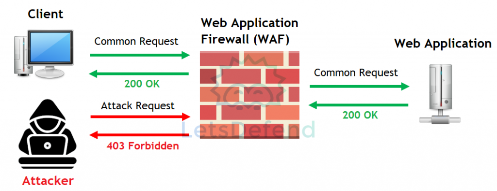

## WAF — Web Application Firewall

- Solution de sécurité placée devant une **application Web** pour surveiller, filtrer et bloquer le trafic HTTP/HTTPS entrant et sortant.
- Fonctionne au **niveau applicatif** et applique des règles spécifiques au trafic Web.

```
Client
  ↓
 WAF
  ↓
Web Application
```

## Types de WAF

|Type|Principe|
|---|---|
|**Network-based WAF**|Appliance matérielle déployée sur le réseau ; performante mais plus coûteuse et nécessitant maintenance/règles|
|**Host-based WAF**|Logiciel installé directement sur le serveur ; très personnalisable mais consomme ses ressources|
|**Cloud-based WAF**|WAF fourni comme service cloud ; déploiement et maintenance simplifiés|
## Fonctionnement
{ width="600" }

- Le WAF intercepte les requêtes HTTP/HTTPS avant qu'elles n'atteignent l'application.
- Ces requêtes, qui appartiennent au protocole HTTP, sont soit autorisées, soit bloquées conformément aux règles.

```
HTTP Request
    ↓
WAF Rules
    ↓
Allow / Block
    ↓
Web Application
```

- Les règles peuvent chercher à identifier des requêtes malveillantes et les bloquer.
- Exemples de menaces Web qu'un WAF peut aider à détecter/bloquer :
    - SQL Injection ;
    - Cross-Site Scripting (XSS) ;
    - path traversal ;
    - requêtes HTTP anormales ;
    - patterns malveillants connus.
## Importance du tuning

- La qualité du WAF dépend fortement de ses règles.

```
Requête légitime bloquée
→ False Positive

Attaque autorisée
→ False Negative
```

→ Les règles doivent être régulièrement **ajustées / tuned** selon l'application.

- Un WAF mal configuré peut :
    - bloquer des utilisateurs légitimes ;
    - laisser passer certaines attaques ;
    - générer trop d'alertes inutiles.
## WAF vs Firewall classique

|Firewall|WAF|
|---|---|
|Filtre principalement IP, ports, protocoles, connexions|Analyse le trafic **HTTP/HTTPS applicatif**|
|Protège le réseau / segments|Protège une application Web|
|Peut bloquer `TCP/443` ou autoriser le service|Peut inspecter ce qui circule à l'intérieur de `HTTPS/HTTP` après terminaison/déchiffrement approprié|

```
Firewall → "Le trafic vers 443 est-il autorisé ?"
WAF      → "La requête HTTP envoyée sur 443 est-elle malveillante ?"
```
