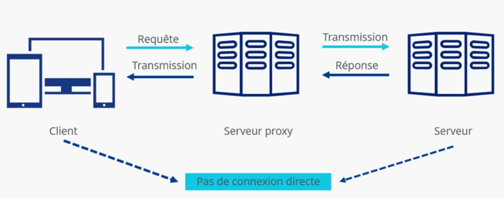

## Proxy Server

- Matériel ou logiciel placé **entre un client et un serveur** pour relayer les communications.
- Selon son rôle, il peut :
    - filtrer le trafic ;
    - masquer l’IP du client ;
    - appliquer des politiques d’accès ;
    - journaliser les communications ;
    - mettre du contenu en cache.

```
Client
  ↓
Proxy
  ↓
Server
```

## Types de Proxy

| Type                      | Principe                                                                                                                                                                                             |
| ------------------------- | ---------------------------------------------------------------------------------------------------------------------------------------------------------------------------------------------------- |
| **Forward Proxy**         | Type de serveur proxy le plus utilisé. Il est utilisé pour diriger les requêtes d'un réseau privé vers Internet via un pare-feu (firewall).                                                          |
| **Transparent Proxy**     | Intercepte le trafic sans configuration explicite côté client                                                                                                                                        |
| **Anonymous Proxy**       | Masque l’adresse IP du client, permet une navigation anonyme sur Internet.                                                                                                                           |
| **High Anonymity Proxy**  | Masque davantage l’identité du client et évite généralement d’indiquer qu’un proxy est utilisé                                                                                                       |
| **Distorting Proxy**      | Tente de cacher son identité en se définissant comme proxy d'un site web. Modifie véritable adresse IP, on tente d'assurer la confidentialité du client.                                             |
| **Data Center Proxy**     | Proxy hébergé en datacenter, non lié à une connexion résidentielle/FAI classique ; rapide mais facilement identifiable                                                                               |
| **Residential Proxy**     | Transmet toutes les requêtes effectuées par le client. Grâce à ce serveur proxy, les publicités indésirables et suspectes peuvent être bloquées. Il est plus sécurisé que les autres serveurs proxy. |
| **Public Proxy**          | Proxy accessible publiquement, souvent gratuit mais généralement moins fiable/sécurisé                                                                                                               |
| **Shared Proxy**          | Même proxy/IP partagé entre plusieurs utilisateurs                                                                                                                                                   |
| **SSL/TLS Proxy**         | Proxy capable de gérer des communications chiffrées                                                                                                                                                  |
| **Rotating Proxy**        | Change régulièrement l’adresse IP de sortie utilisée                                                                                                                                                 |
| **Reverse Proxy**         | Placé **devant des serveurs** pour recevoir les requêtes des clients à leur place                                                                                                                    |
| **Split Proxy**           | Fonction proxy répartie entre plusieurs composants/systèmes                                                                                                                                          |
| **Non-Transparent Proxy** | Envoie toutes les requêtes au pare-feu. Proxy dont l’utilisation est connue/configurée côté client                                                                                                   |
| **Hostile Proxy**         | Proxy malveillant utilisé pour espionner/manipuler le trafic                                                                                                                                         |
| **Intercepting Proxy**    | Intercepte automatiquement le trafic et agit comme proxy/passerelle                                                                                                                                  |
| **Forced Proxy**          | Oblige le trafic concerné à passer par le proxy et ses politiques                                                                                                                                    |
| **Caching Proxy**         | Met en cache les réponses pour éviter de récupérer plusieurs fois le même contenu                                                                                                                    |
| **Web Proxy**             | Proxy spécialisé dans le trafic Web                                                                                                                                                                  |
| **SOCKS Proxy**           | Proxy générique pour différents types de trafic TCP, et selon version UDP. Empêche les composants réseau externes d'obtenir des informations sur le client.                                          |
| **HTTP Proxy**            | Proxy spécialisé dans HTTP/HTTPS                                                                                                                                                                     |
## Fonctionnement
{ width="600" }

```
Client Request
      ↓
Proxy
      ↓
Policy / Filtering / Logging / Cache
      ↓
Destination Server
```

- La destination voit souvent l’**adresse IP du proxy** comme source de la connexion.
## Importance pour un analyste SOC

- Lorsqu’un serveur reçoit du trafic provenant d’un proxy :

```
Client réel → Proxy → Server
```

- Le serveur peut enregistrer :

```
Source IP = Proxy
```

- et non directement l’IP du client. Il faut donc corréler avec les **logs du proxy** pour retrouver l’utilisateur/source d’origine.
- Informations utiles :
	- timestamp ;
	- IP client ;
	- utilisateur authentifié ;
	- destination ;
	- URL ;
	- méthode HTTP ;
	- action `ALLOW/DENY` ;
	- volume de données.
### Headers Proxy

- Dans certains environnements Web, l’IP originale peut être transmise dans des headers comme :

```
X-Forwarded-For: 192.168.1.50
```

ou :

```
Forwarded: for=192.168.1.50
```

> Ces headers ne doivent être considérés comme fiables que lorsqu’ils proviennent d’un **proxy de confiance**, car un client peut parfois les falsifier.
## Proxy et trafic chiffré

- Certains proxies peuvent simplement **relayer** TLS.
- D’autres peuvent effectuer de l’**SSL/TLS inspection** :
    - déchiffrer le trafic ;
    - l’inspecter ;
    - le rechiffrer vers la destination.

```
Client
 ↓ TLS
Proxy
 ↓ inspection
 ↓ TLS
Server
```

→ utile pour la sécurité, mais nécessite une gestion correcte des certificats et soulève des enjeux de confidentialité.
