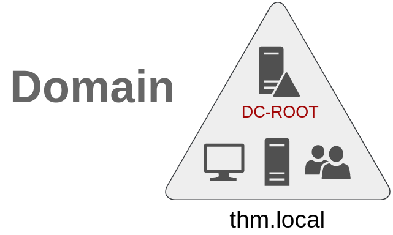
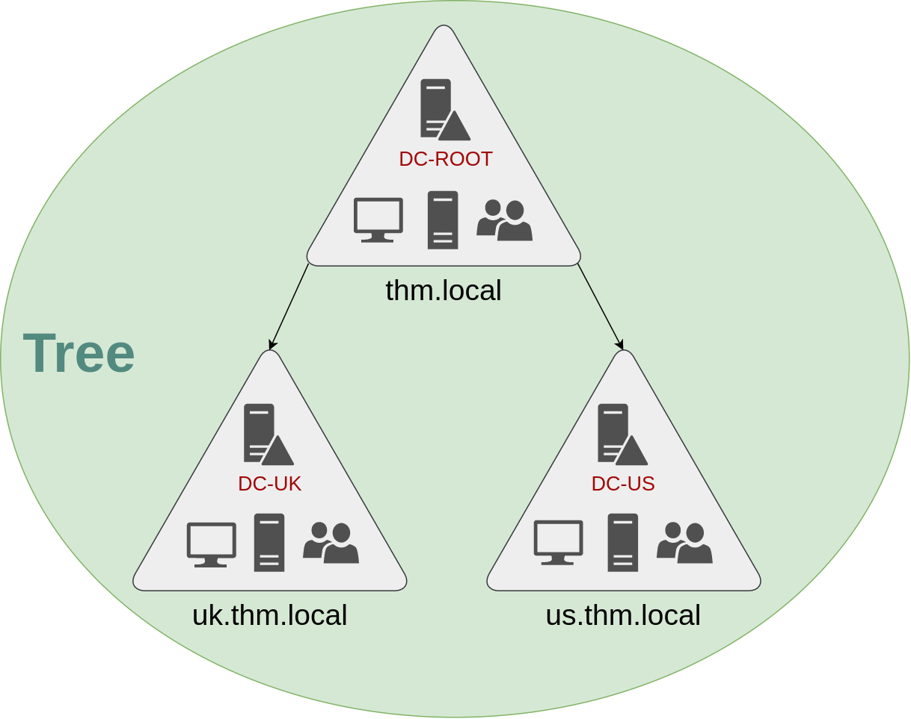
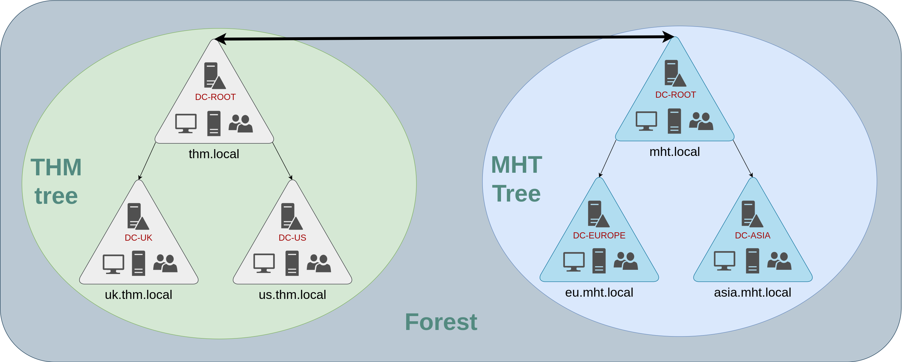
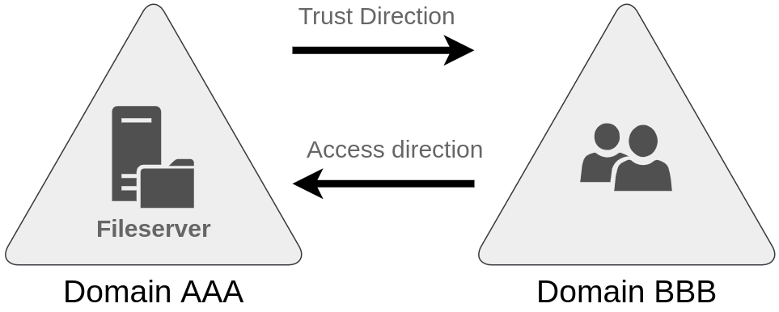

## 2.1 Domaine, arbre, forêt

L'architecture AD est hiérarchique, à trois niveaux.

Un **domaine** est l'unité de base : il regroupe utilisateurs, ordinateurs et serveurs sous un même espace de noms (`meridian.local`), avec une base commune, des politiques communes et des administrateurs communs. Il est géré par un ou plusieurs contrôleurs de domaine qui vérifient les identités et appliquent les politiques.

Un **arbre** (*tree*) relie un domaine racine à ses sous-domaines dans un espace de noms contigu (`thm.local` → `uk.thm.local`, `us.thm.local`). Chaque domaine garde sa gestion propre (ses Domain Admins, ses GPO) ; le groupe **Enterprise Admins** a autorité sur l'ensemble.

Une **forêt** (*forest*) regroupe un ou plusieurs arbres aux espaces de noms distincts (`thm.local` et `mht.local`, par exemple après le rachat d'une entreprise). Tous ses domaines partagent le même **schéma**, la même configuration et le même catalogue global.

| Niveau | Ce qu'il partage | Frontière de… |
|---|---|---|
| Domaine | Base, politiques, administrateurs | Administration et réplication |
| Arbre | Espace de noms contigu | Nommage |
| Forêt | Schéma, configuration, catalogue global | **Sécurité** |

> **À retenir.** La **forêt** est la vraie frontière de sécurité d'AD, pas le domaine : les domaines d'une même forêt se font confiance par construction, et le contrôle d'un domaine enfant ouvre la voie à toute la forêt (§3.5). Séparer deux populations sensibles demande deux forêts.

Les **relations de confiance** (*trusts*) relient domaines ou forêts pour partager des ressources. Une relation de confiance ne donne aucun accès par elle-même : elle rend l'authentification possible, les autorisations restent à configurer (détails au §3.5).

## 2.2 Le contrôleur de domaine (DC)

Le DC est le serveur le plus critique de l'infrastructure. Il héberge :

| Composant | Rôle | Port |
|---|---|---|
| **NTDS.dit** | La base AD : tous les objets, tous les attributs, y compris les secrets des mots de passe | — |
| **LDAP** | Interrogation et modification de l'annuaire | 389 / 636 (LDAPS) |
| **KDC** (Kerberos) | Authentification, délivrance des tickets | 88 |
| **DNS intégré** | Localisation des DC et des services | 53 |
| **SYSVOL / NETLOGON** | Partages répliqués : GPO et scripts d'ouverture de session | 445 (SMB) |

En production, on déploie **au moins deux DC** pour la redondance. Un DC compromis équivaut à un domaine compromis : il détient les secrets de tous les comptes.

## 2.3 Le RODC (Read-Only Domain Controller)

Le RODC est un DC en **lecture seule**, prévu pour les sites distants à la sécurité physique moindre. Il contient une copie de la base, mais ne met en cache que les mots de passe des comptes autorisés par la **Password Replication Policy (PRP)**. Il possède son propre compte `krbtgt_XXXXX` : les tickets qu'il émet ne sont pas valables comme ceux du domaine.

S'il est compromis, seuls les secrets mis en cache localement sont exposés — d'où l'importance d'une PRP minimale (utilisateurs du site, jamais de comptes privilégiés) et auditée régulièrement. « Le RODC est sûr, on peut le poser n'importe où » est une idée fausse : une PRP trop large en fait une fuite de secrets.

## 2.4 Réplication et sites

AD est **multi-maître** : chaque DC accepte des modifications et les réplique aux autres.

| Réplication | Déclenchement | Délai |
|---|---|---|
| **Intra-site** | Notification de changement | Quelques secondes |
| **Inter-sites** | Planifiée | 15 à 180 minutes |

Les **sites** représentent les emplacements physiques (siège, usine, R&D), associés à des sous-réseaux IP : un client contacte en priorité un DC de son site. **DFSR** (Distributed File System Replication) réplique SYSVOL entre les DC.

## 2.5 Rôles FSMO

Certaines opérations ne supportent pas le multi-maître : elles sont confiées à un seul DC, titulaire d'un rôle **FSMO** (*Flexible Single Master Operations*).

| Rôle | Portée | Fonction | S'il est indisponible |
|---|---|---|---|
| **Schema Master** | Forêt | Modifications du schéma | Plus d'extension du schéma (opération rare) |
| **Domain Naming Master** | Forêt | Ajout et suppression de domaines | Plus de création de domaine |
| **PDC Emulator** | Domaine | Source de temps, changements de mot de passe prioritaires, verrouillages de comptes | Rôle le plus critique au quotidien : problèmes d'authentification et d'horloge |
| **RID Master** | Domaine | Distribue des blocs de RID aux DC (fin du SID de chaque objet) | Création d'objets bloquée à l'épuisement des blocs |
| **Infrastructure Master** | Domaine | Références vers les objets des autres domaines | Noms de membres étrangers non mis à jour |

Vérifier les titulaires : `netdom query fsmo`.

## 2.6 Global Catalog, schéma, DNS et temps

- **Global Catalog (GC)** — un DC qui détient une copie partielle de **tous** les objets de **toute** la forêt. Il sert aux recherches inter-domaines et à l'ouverture de session (résolution des groupes universels, connexion par UPN).
- **Schéma** — la définition des classes d'objets et de leurs attributs. Unique pour la forêt, ses extensions sont irréversibles : le groupe **Schema Admins** doit rester vide hors opération planifiée.
- **DNS** — AD en dépend entièrement. Les clients trouvent les DC grâce aux enregistrements **SRV** (`_ldap._tcp.dc._msdcs.meridian.local`, `_kerberos._tcp.dc._msdcs.meridian.local`) ; sans eux, aucune ouverture de session de domaine. Les zones **intégrées à AD** se répliquent avec l'annuaire et permettent les **mises à jour dynamiques sécurisées** (*Secure only*, à exiger).
- **Temps** — Kerberos tolère au plus **5 minutes** d'écart entre client et DC (erreur `KRB_AP_ERR_SKEW` au-delà). Le PDC Emulator est la référence de temps du domaine.

## 2.7 Ports et flux AD

| Port | Service | Usage |
|---|---|---|
| 53 | DNS | Localisation des DC (SRV) |
| 88 | Kerberos | Authentification |
| 135 + 49152-65535 | RPC (mappeur + ports dynamiques) | Réplication, administration |
| 389 / 636 | LDAP / LDAPS | Annuaire |
| 445 | SMB | SYSVOL, NETLOGON, GPO |
| 464 | Kerberos kpasswd | Changement de mot de passe |
| 3268 / 3269 | Global Catalog (LDAP / LDAPS) | Recherches forêt |
| 5985 / 5986 | WinRM | Administration à distance |
| 9389 | ADWS | Module PowerShell ActiveDirectory |

Connaître ces flux, c'est savoir quoi autoriser entre zones : un poste n'a besoin que d'une partie d'entre eux vers les DC, jamais d'un accès d'administration.

---
