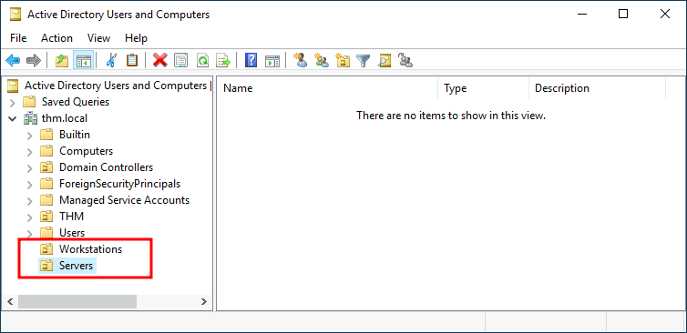

## 3.1 Types d'objets

| Objet | Classe LDAP | Particularité |
|---|---|---|
| Utilisateur | `user` | Personne ou compte de service |
| Ordinateur | `computer` | Machine jointe ; compte `NOM$` au mot de passe renouvelé automatiquement |
| Groupe | `group` | Groupe de sécurité ou de distribution |
| Unité d'organisation | `organizationalUnit` | Conteneur : GPO et délégation |
| GPO | `groupPolicyContainer` | Partie annuaire d'une stratégie de groupe (l'autre partie est dans SYSVOL) |
| gMSA | `msDS-GroupManagedServiceAccount` | Compte de service dont AD génère et renouvelle le mot de passe (240 caractères) |

Par défaut, les nouveaux ordinateurs arrivent dans le conteneur `Computers` et les utilisateurs dans `Users`. Ce ne sont pas des OU : on ne peut pas y lier de GPO. On crée donc des OU (Postes, Serveurs, Utilisateurs par service) et on y range les objets.



## 3.2 Le SID : l'identité réelle d'un objet

Windows ne raisonne jamais sur un nom mais sur un **SID** (*Security Identifier*), unique et attribué à la création. Renommer un compte ne change rien à ses droits ; supprimer puis recréer un compte du même nom crée une nouvelle identité.

```text
S-1-5-21-3623811015-3361044348-30300820-1104
│ │ │  └────── SID du domaine ──────────┘ └─ RID
│ │ └─ autorité (5 = NT Authority)
│ └─── révision (toujours 1)
└───── « S » = SID
```


| RID / SID connu | Identité |
|---|---|
| `-500` | Administrateur intégré |
| `-501` | Invité |
| `-502` | `krbtgt` |
| `-512` | Domain Admins |
| `-513` | Domain Users |
| `-519` | Enterprise Admins |
| `S-1-5-11` | Authenticated Users |
| `S-1-5-18` | SYSTEM (Local System) |

## 3.3 Attributs critiques pour la sécurité

| Attribut | Contenu | Pourquoi le surveiller |
|---|---|---|
| `sAMAccountName` | Nom de connexion (format court) | Identité de logon |
| `objectSid` | SID | Identité réelle |
| `memberOf` / `member` | Appartenances aux groupes | Chemin vers les privilèges |
| `adminCount` | `1` si l'objet est ou a été protégé par AdminSDHolder | Ne se remet **pas** à 0 seul : signale d'anciens comptes privilégiés |
| `userAccountControl` | Drapeaux du compte (désactivé, mot de passe sans expiration, pré-authentification non requise, délégation…) | Plusieurs drapeaux affaiblissent le compte |
| `servicePrincipalName` | SPN du compte | Un SPN sur un compte utilisateur expose son mot de passe à une attaque hors ligne (Ch.15) |
| `msDS-AllowedToDelegateTo` | Délégation contrainte | Ce compte peut agir au nom d'autres utilisateurs |
| `msDS-KeyCredentialLink` | Clés Windows Hello for Business | Attribut sensible : son écriture doit être réservée |
| `pwdLastSet` | Dernier changement de mot de passe | Mots de passe jamais renouvelés |
| `lastLogonTimestamp` | Dernière connexion (répliquée avec ~14 jours de retard) | Comptes inactifs |

## 3.4 Groupes : portées et imbrication

| Portée | Peut contenir | Utilisable sur | Usage |
|---|---|---|---|
| **Domain Local** | Comptes et groupes de toute la forêt (et domaines approuvés) | Ressources de son domaine | Porter les droits sur une ressource |
| **Global** | Comptes et groupes de son domaine | Toute la forêt | Regrouper par rôle métier |
| **Universal** | Comptes et groupes de toute la forêt | Toute la forêt | Groupes transverses ; répliqués dans le GC |

La bonne pratique d'imbrication est **AGDLP** (ou IGDLA) : les comptes (**A**ccounts) vont dans des groupes **G**lobaux par rôle, eux-mêmes membres de groupes **D**omain **L**ocal qui portent les **P**ermissions sur la ressource. On change ainsi les droits d'un rôle en un seul endroit.

**Groupes privilégiés intégrés** — à garder presque vides et surveiller :

| Groupe | Pouvoir |
|---|---|
| Domain Admins | Administration complète du domaine, y compris les DC |
| Enterprise Admins | Administration de toute la forêt |
| Schema Admins | Modification du schéma |
| Administrators (built-in) | Administration des DC |
| Account Operators | Création et modification de la plupart des comptes |
| Server Operators | Administration des DC (services, partages, sauvegarde) |
| Backup Operators | Lecture de tout fichier en ignorant les ACL, y compris sur les DC (donc NTDS.dit) |
| Print Operators | Chargement de pilotes sur les DC |
| DnsAdmins | Configuration du service DNS des DC, avec un risque d'exécution de code sur ces DC |
| Group Policy Creator Owners | Création de GPO |

Ces groupes « d'opérateurs » sont souvent oubliés alors qu'ils mènent au contrôle du domaine : ils doivent être traités comme Tier 0.

## 3.5 Trusts : relations de confiance

Un **trust** permet aux comptes d'un domaine de s'authentifier pour accéder aux ressources d'un autre. Le vocabulaire de la direction est contre-intuitif : si le domaine A **fait confiance** à B, ce sont les utilisateurs de **B** qui accèdent aux ressources de **A**.

```text
Domaine A (ressources) ──fait confiance à──▶ Domaine B (comptes)
Utilisateurs de B ──────accèdent à─────────▶ ressources de A
```


| Type | Entre | Direction | Transitif |
|---|---|---|---|
| **Parent-Child** | Domaine et sous-domaine | Bidirectionnel | Oui (automatique) |
| **Tree-Root** | Racines de deux arbres d'une forêt | Bidirectionnel | Oui (automatique) |
| **Shortcut** | Deux domaines d'une même forêt | Un ou deux sens | Oui |
| **External** | Un domaine et un domaine d'une autre forêt | Un ou deux sens | Non |
| **Forest** | Deux forêts | Un ou deux sens | Oui, au sein de chaque forêt |

**Ce que les trusts changent pour la sécurité :**

- **dans une forêt**, les domaines se font confiance par construction : un domaine enfant compromis permet d'atteindre la racine (abus de l'historique de SID). C'est la raison pour laquelle la forêt, et non le domaine, est la frontière de sécurité ;
- **entre forêts**, le **SID filtering** (activé par défaut) écarte les SID étrangers présentés par l'autre forêt ; l'assouplir rouvre des chemins ;
- la **délégation Kerberos** non contrainte à travers un trust peut exposer les identités de l'autre côté ;
- un trust oublié vers un domaine non maintenu est une porte dérobée.

**Audit :** lister les trusts (`Get-ADTrust -Filter *`), et pour chacun vérifier direction, transitivité, SID filtering et justification métier.

---
