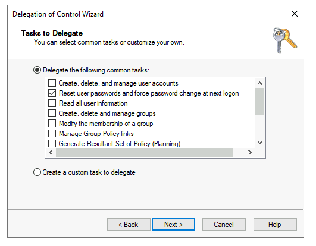
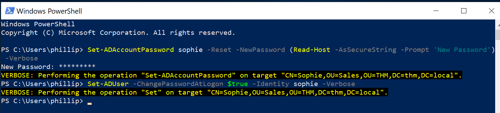
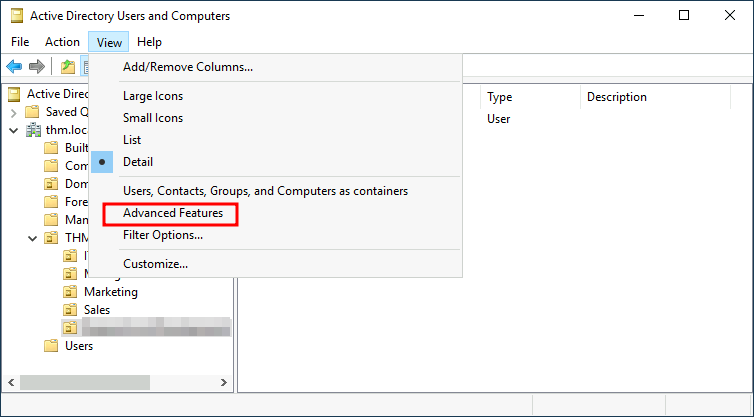

*L'authentification dit **qui** vous êtes ; l'autorisation dit **ce que vous avez le droit de faire**. Dans AD, cette seconde question est tranchée par les ACL posées sur chaque objet de l'annuaire — un sujet peu visible et pourtant central : beaucoup de faiblesses d'un domaine tiennent à une permission mal placée plutôt qu'à une faille logicielle.*

## 4.0 Les notions centrales en un coup d'œil

Avant d'entrer dans le détail, les briques sur lesquelles repose toute la sécurité Windows et AD :

| Notion | Ce que c'est | En une phrase |
|---|---|---|
| **SID** | Identifiant unique d'un utilisateur, groupe, machine ou domaine (`S-1-5-21-…-RID`) | Windows raisonne sur le SID, jamais sur le nom affiché |
| **Access token** (jeton d'accès) | « Badge » créé à l'ouverture de session : SID de l'utilisateur, SID de ses groupes, privilèges, niveau d'intégrité | Hérité par tous les processus de la session |
| **Security descriptor** | Fiche de sécurité d'un objet : Owner, Primary Group, DACL, SACL | Décrit qui possède l'objet, qui y accède, ce qu'on audite |
| **ACE / ACL / DACL / SACL** | Les règles d'accès et d'audit posées sur un objet | Voir le tableau ci-dessous |
| **LSA** | Autorité de sécurité locale : fournit identités (SID) et secrets à l'authentification, applique la politique | La fonction |
| **LSASS** (`lsass.exe`) | Processus qui exécute la LSA : vérifie chaque connexion, crée les jetons, gère les changements de mot de passe et le cache des tickets Kerberos | Le processus — d'où sa sensibilité (Ch.7) |
| **SAM** | Base locale des comptes et de leurs secrets (`C:\Windows\System32\config\SAM`, `HKLM\SAM`), chiffrée par une clé rangée dans la ruche SYSTEM | Comptes **locaux** uniquement |
| **NTDS.dit** | Base AD sur les DC | Comptes **du domaine** |

```text
Utilisateur → authentification (LSASS) → jeton → processus → accès à un objet → DACL → Allow / Deny
                                                                              → SACL → événement d'audit
```


**Récapitulatif ACE, ACL, DACL, SACL, descripteur :**

| Terme | Définition courte | À quoi ça sert | Où c'est stocké |
|---|---|---|---|
| **ACE** (*Access Control Entry*) | **Une ligne de règle** : *qui* (SID) → *quels droits* → *Allow* ou *Deny* (ou *Audit*) | Brique élémentaire des permissions | Dans une ACL |
| **ACL** (*Access Control List*) | **La liste** d'ACE d'un objet ; terme générique | Définit le comportement global d'accès | Dans le security descriptor |
| **DACL** (*Discretionary ACL*) | L'ACL des **autorisations** | *Qui a le droit de faire quoi ?* | Champ DACL du descripteur |
| **SACL** (*System ACL*) | L'ACL d'**audit** | *Quels accès journaliser (succès / échec) ?* | Champ SACL du descripteur |
| **Security descriptor** | Owner + Primary Group + DACL + SACL | Toute la sécurité d'un objet | `nTSecurityDescriptor` (objet AD), métadonnées NTFS (fichier), registre (service, clé) |

> **ACE = une règle. ACL = une liste de règles. DACL = l'ACL qui décide. SACL = l'ACL qui trace.**
> Une ACE est à une ACL ce qu'une ligne est à un tableau. Une ACE est **explicite** (posée sur l'objet) ou **héritée** (venue du parent).

## 4.1 Le principe : un jeton face à un descripteur

Le modèle est celui de Windows (cours Windows en profondeur, Ch.17), appliqué aux objets de l'annuaire :

```text
Ouverture de session → jeton d'accès (SID de l'utilisateur + SID de ses groupes)
                    ↓
Demande d'accès à un objet AD (lire, modifier un attribut…)
                    ↓
Le DC compare les SID du jeton aux ACE de la DACL de l'objet
                    ↓
Accès accordé ou refusé — et événement d'audit si la SACL le prévoit
```


## 4.2 Le security descriptor d'un objet AD

Chaque objet (utilisateur, groupe, OU, GPO, le domaine lui-même) porte un **security descriptor**, stocké dans l'attribut `nTSecurityDescriptor` :

| Composant | Rôle |
|---|---|
| **Owner** | Propriétaire de l'objet : il peut toujours modifier la DACL. |
| **Group** | Groupe principal (sans effet pratique sous Windows). |
| **DACL** (*Discretionary ACL*) | Les **autorisations** : qui peut faire quoi. |
| **SACL** (*System ACL*) | L'**audit** : quels accès journaliser, en succès ou en échec. |

```text
Security descriptor de l'utilisateur « m.laurent »
├── Owner : Domain Admins
├── DACL
│   ├── ACE Allow — SELF                 — modifier ses informations personnelles
│   ├── ACE Allow — Helpdesk-Lyon        — réinitialiser le mot de passe (héritée de l'OU)
│   ├── ACE Allow — Authenticated Users  — lire les propriétés générales
│   └── ACE Allow — Domain Admins        — contrôle total
└── SACL
    └── ACE d'audit — Everyone — écriture de propriétés — succès
```


## 4.3 Anatomie d'une ACE

Une ACE est une règle unique. Dans AD, elle peut viser un **attribut** ou un **type d'objet** précis, ce qui la rend plus fine que sur un fichier :

| Champ | Contenu |
|---|---|
| **Type** | Allow, Deny, ou Audit (SACL) ; variantes « objet » pour les ACE ciblées |
| **Trustee** | Le SID concerné (utilisateur, groupe, ordinateur) |
| **Access mask** | Les droits accordés ou refusés |
| **Object type** (GUID, facultatif) | L'attribut, le jeu de propriétés ou le droit étendu visé |
| **Inherited object type** (GUID, facultatif) | Le type d'objet enfant concerné par l'héritage (ex. seulement les `user`) |
| **Flags** | Propagation aux enfants, ACE héritée ou explicite |

Cette granularité permet une délégation précise — « le helpdesk de Lyon peut réinitialiser les mots de passe des utilisateurs de l'OU Lyon, rien d'autre » — mais rend aussi les erreurs difficiles à voir sans outil.

## 4.4 Les familles de droits

| Famille | Exemples | Remarque |
|---|---|---|
| **Droits sur les propriétés** | Lire / écrire une propriété ou un jeu de propriétés | Les jeux regroupent des attributs (informations personnelles, informations de connexion…) |
| **Droits sur les enfants** | Créer / supprimer des objets enfants, lister le contenu | Portent sur les conteneurs et OU |
| **Droits standard** | Supprimer, lire les permissions, modifier les permissions, changer le propriétaire | Les deux derniers donnent la maîtrise de la DACL elle-même |
| **Droits étendus et écritures validées** | Réinitialiser un mot de passe, droits de réplication du domaine, ajout de soi-même à un groupe | Opérations spéciales identifiées par un GUID |
| **Droits génériques** | Contrôle total, écriture générique, lecture générique | Raccourcis qui regroupent plusieurs droits ci-dessus |

> **À retenir.** Tout droit qui permet de **modifier la DACL**, de **changer le propriétaire** ou d'**écrire largement** sur un objet sensible équivaut en pratique au contrôle de cet objet. Les droits de réplication posés sur la racine du domaine équivalent, eux, à l'accès aux secrets de tous les comptes : ils doivent être réservés aux contrôleurs de domaine.

## 4.5 Comment le DC évalue une DACL

Les ACE sont rangées dans un **ordre canonique**, et l'évaluation s'arrête dès que tous les droits demandés sont tranchés :

```text
1. ACE Deny explicites
2. ACE Allow explicites
3. ACE Deny héritées (du parent le plus proche au plus lointain)
4. ACE Allow héritées
```


Conséquences pratiques :

- **Deny l'emporte sur Allow à niveau égal**, mais une ACE **Allow explicite** l'emporte sur une ACE **Deny héritée** ;
- **DACL vide** : personne n'a accès ; **DACL absente** (NULL) : tout le monde a accès — à ne jamais laisser ;
- l'accès effectif d'un utilisateur est la somme des ACE qui concernent **tous** les SID de son jeton (lui-même et chacun de ses groupes, y compris imbriqués) — d'où l'intérêt de raisonner par groupes.

## 4.6 L'héritage

Une ACE posée sur une OU peut se propager aux objets qu'elle contient, selon ses flags :

| Flag | Effet |
|---|---|
| Container Inherit | S'applique aux conteneurs enfants (sous-OU) |
| Object Inherit / type d'objet hérité | S'applique aux objets enfants, éventuellement d'un seul type |
| Inherit Only | Ne s'applique pas à l'objet lui-même, seulement à ses enfants |
| No Propagate | Ne descend que d'un niveau |
| Inherited | Marque une ACE reçue du parent (non modifiable sur l'enfant) |

L'héritage est ce qui rend la délégation par OU efficace, et aussi ce qui diffuse une erreur : une permission trop large posée en haut de l'arborescence s'applique à des milliers d'objets. On peut désactiver l'héritage sur un objet, mais cela crée une exception à documenter.

## 4.7 La délégation de contrôle

La délégation consiste à donner à un groupe un droit précis sur une OU sans le rendre administrateur — par exemple, au support, le droit de réinitialiser les mots de passe. L'**Assistant Délégation de contrôle** (clic droit sur l'OU dans ADUC) ne fait rien d'autre qu'écrire des ACE héritables sur l'OU.



Le compte délégué peut ensuite agir sur les objets de l'OU, et seulement sur eux :



Bonnes pratiques :

- déléguer à des **groupes**, jamais à des comptes nominatifs ;
- déléguer la **tâche minimale** (réinitialisation de mot de passe plutôt que contrôle total) ;
- documenter chaque délégation, car l'assistant ne sait pas la retirer : il faut supprimer les ACE à la main ;
- ne jamais déléguer sur une OU qui contient des comptes ou machines Tier 0.

Pour voir les permissions dans la console, activer **Affichage → Fonctionnalités avancées** dans ADUC : l'onglet *Sécurité* apparaît alors dans les propriétés des objets.



## 4.8 AdminSDHolder et les groupes protégés

Les comptes et groupes les plus sensibles (Domain Admins, Enterprise Admins, Schema Admins, Administrators, opérateurs…) sont des **groupes protégés**. Pour éviter qu'une délégation posée sur une OU ne s'applique à eux, AD les traite à part :

```text
CN=AdminSDHolder,CN=System,DC=meridian,DC=local   ← modèle de permissions
        │
        │  processus SDProp, sur le PDC Emulator, toutes les 60 minutes
        ▼
Membres (directs ou imbriqués) des groupes protégés
   → leur DACL est remplacée par celle d'AdminSDHolder
   → l'héritage est désactivé
   → adminCount = 1
```


Deux conséquences à connaître :

- **côté défense**, les comptes privilégiés échappent aux délégations d'OU, ce qui est le but ;
- **côté vigilance**, la DACL d'AdminSDHolder devient un point unique : toute ACE ajoutée dessus est recopiée sur tous les comptes privilégiés à l'heure suivante. Elle doit être surveillée comme un objet Tier 0. Et un compte retiré d'un groupe protégé garde `adminCount = 1` et une DACL figée : il faut réactiver l'héritage à la main.

## 4.9 Auditer les permissions : SACL et outils

**Journalisation.** Une SACL sur les objets sensibles, combinée à la sous-catégorie d'audit *Directory Service Changes / Access*, produit :

| Event ID | Signification | À surveiller sur |
|---|---|---|
| **5136** | Objet de l'annuaire modifié (dont `nTSecurityDescriptor`) | AdminSDHolder, racine du domaine, OU Tier 0, GPO |
| **4662** | Opération effectuée sur un objet (dont droits étendus) | Usage des droits de réplication hors DC |
| **4670** | Permissions d'un objet modifiées | Objets sensibles |
| **4728 / 4732 / 4756** | Membre ajouté à un groupe | Groupes privilégiés |

**Lecture des permissions :**

```powershell
# DACL d'une OU (module ActiveDirectory : lecteur AD:)
(Get-Acl "AD:OU=Lyon,DC=meridian,DC=local").Access |
    Select-Object IdentityReference, ActiveDirectoryRights, AccessControlType, IsInherited

# Équivalent en ligne de commande
dsacls "OU=Lyon,DC=meridian,DC=local"
```


**Outils d'audit à l'échelle** : PingCastle (contrôles de délégations et de permissions dangereuses), BloodHound en usage défensif (Ch.14), Purple Knight. La méthode : partir des objets Tier 0 (domaine, AdminSDHolder, DC, groupes privilégiés, GPO liées aux DC) et vérifier que **seuls** des principaux Tier 0 y ont un droit d'écriture.

> **À retenir.** Le Ch.16 revient sur l'abus des ACL du point de vue de l'attaquant ; ce chapitre donne la grille pour les lire. Une revue régulière des permissions sur les objets Tier 0 est l'une des mesures les plus rentables d'un durcissement AD.

## 4.10 Lire un descripteur au format SDDL

Windows sait exporter un security descriptor sous forme de texte, le **SDDL** (*Security Descriptor Definition Language*). On le croise partout : permissions d'un service (`sc sdshow <service>`), sortie de `Get-Acl … | Select Sddl`, objets AD.

```text
O:BAG:SYD:(A;;CCLCSWRPLORC;;;AU)(A;;CCDCLCSWRPWPDTLOCRSDRCWDWO;;;BA)
│   │    │  └── une ACE entre parenthèses ──┘
│   │    └── D: = début de la DACL (S: = SACL)
│   └── G: = groupe principal (SY = SYSTEM)
└── O: = propriétaire (BA = Administrators)
```


Une ACE se lit en six champs séparés par `;` :

```text
(A ; ; CCLCSWRPLORC ; ; ; AU)
 │  │   │            │ │  └─ trustee : à qui s'applique la règle
 │  │   │            │ └──── GUID d'objet hérité (vide ici)
 │  │   │            └────── GUID d'objet (vide ici ; sert dans AD pour viser un attribut)
 │  │   └─────────────────── droits
 │  └─────────────────────── flags d'héritage (vide ici)
 └────────────────────────── type : A = Allow, D = Deny, AU = Audit (dans une SACL)
```


| Abréviation | Trustee |
|---|---|
| `SY` | SYSTEM |
| `BA` | Built-in Administrators |
| `AU` | Authenticated Users |
| `BU` | Built-in Users |
| `WD` | Everyone (*World*) |
| `DA` / `EA` | Domain Admins / Enterprise Admins |

| Code (service) | Droit | Signification |
|---|---|---|
| `CC` | SERVICE_QUERY_CONFIG | Lire la configuration du service |
| `LC` | SERVICE_QUERY_STATUS | Lire l'état (démarré, arrêté…) |
| `SW` | SERVICE_ENUMERATE_DEPENDENTS | Lister les services dépendants |
| `RP` | SERVICE_START | Démarrer le service |
| `WP` | SERVICE_STOP | Arrêter le service |
| `LO` | SERVICE_INTERROGATE | Demander au service de rafraîchir son état |
| `DC` | SERVICE_CHANGE_CONFIG | Modifier la configuration (droit sensible) |
| `RC` | READ_CONTROL | Lire le descripteur |
| `WD` / `WO` | WRITE_DAC / WRITE_OWNER | Modifier la DACL / le propriétaire (droits sensibles) |
| `SD` | DELETE | Supprimer |

Dans l'exemple, *Authenticated Users* peut lire la configuration et l'état du service et le démarrer — un profil normal ; seuls Administrators et SYSTEM ont les droits d'écriture. Si un groupe large (`AU`, `BU`, `WD`) apparaissait avec `DC`, `WD` ou `WO`, la configuration serait à corriger.

Les **flags d'héritage**, sous leur forme `icacls` (fichiers) :

| Code | Signification |
|---|---|
| `(OI)` | *Object Inherit* : s'applique aux fichiers du dossier |
| `(CI)` | *Container Inherit* : s'applique aux sous-dossiers |
| `(IO)` | *Inherit Only* : seulement par héritage, pas sur l'objet courant |
| `(NP)` | *No Propagate* : ne descend que d'un niveau |
| `(I)` | Permission héritée (non définie explicitement) |

---
