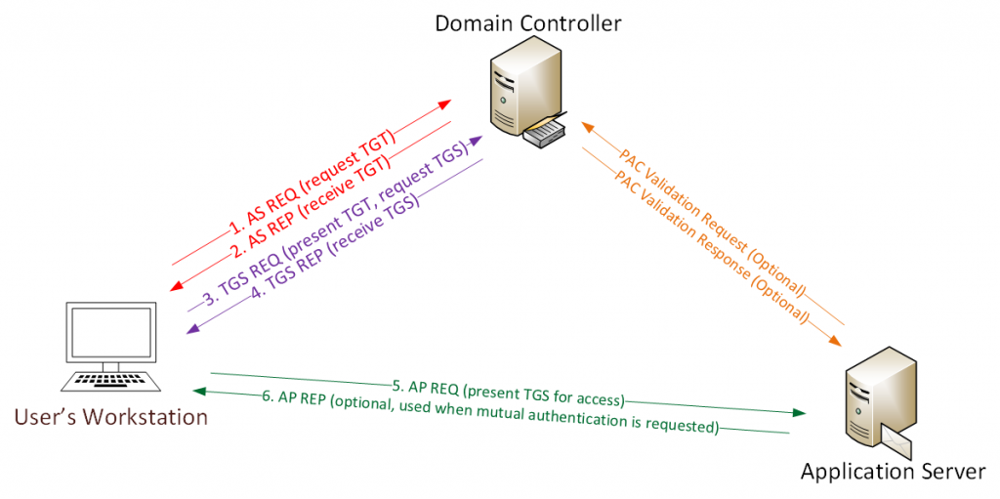
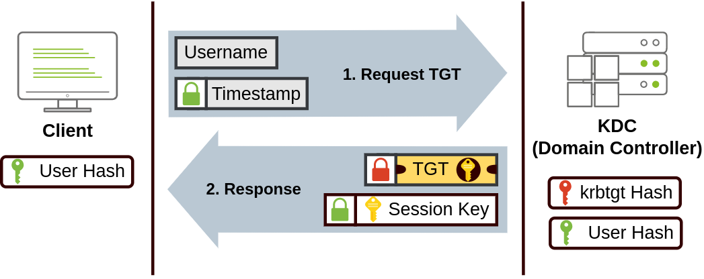
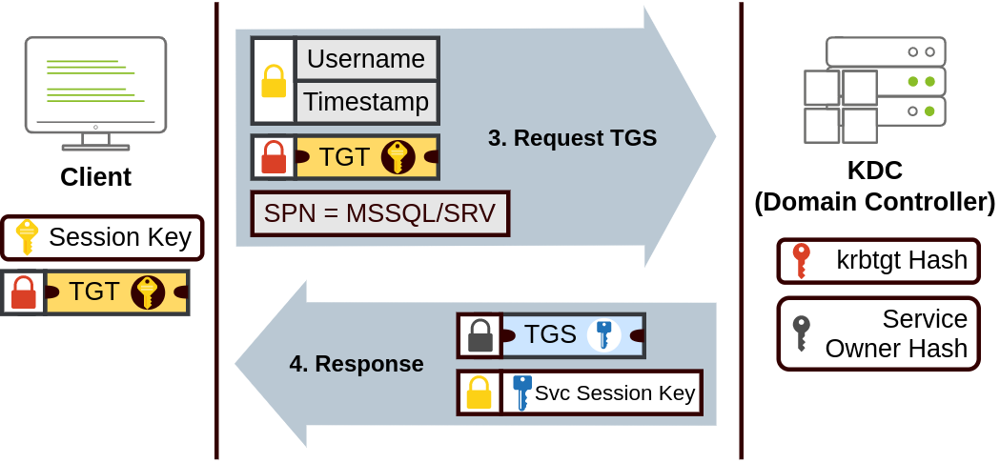
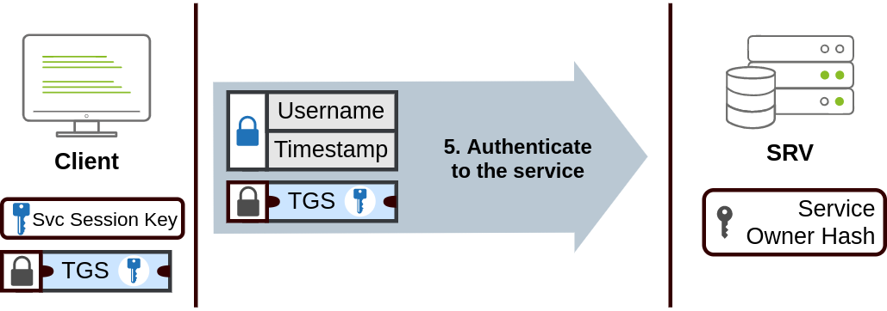

## 6.0 Kerberos expliqué simplement

**L'image du parc d'attractions.** On ne paie pas à chaque manège. À l'entrée, on montre sa carte d'identité au guichet principal et on reçoit un **bracelet journalier** : c'est le **TGT**. Ensuite, devant chaque manège, on montre son bracelet à un guichet intermédiaire, qui remet un **ticket pour ce manège précis** : c'est le **ticket de service**. Le manège vérifie le ticket et laisse monter. La carte d'identité, elle, n'a servi qu'une fois, à l'entrée.

| Dans le parc | Dans Kerberos |
|---|---|
| Carte d'identité | Mot de passe (en réalité, une clé qui en est dérivée) |
| Guichet principal et guichet intermédiaire | Le **KDC**, sur le contrôleur de domaine |
| Bracelet journalier | **TGT**, valable environ 10 heures |
| Ticket pour un manège | **Ticket de service**, pour un service désigné par son **SPN** |
| Le manège | Le serveur (partage de fichiers, base SQL, site intranet…) |
| Le tampon secret du parc sur les bracelets | La clé du compte **`krbtgt`**, qui chiffre tous les TGT |

**Le déroulé, comme on l'expliquerait à l'oral :**

1. Le matin, j'ouvre ma session. Mon poste prouve au KDC que je connais mon mot de passe, sans l'envoyer, et reçoit un **TGT**.
2. J'ouvre un partage réseau. Mon poste présente le TGT au KDC et demande un ticket pour ce service. Le KDC le fabrique et me le remet.
3. Mon poste présente ce ticket au serveur de fichiers, qui le vérifie avec sa propre clé et m'ouvre l'accès, avec les droits correspondant à mes groupes (inscrits dans le ticket).
4. Pour le service suivant, je recommence à l'étape 2 : je ne retape jamais mon mot de passe. C'est le **Single Sign-On**.

**Pourquoi des tickets ?**

- **Sécurité** : le mot de passe ne circule jamais sur le réseau ;
- **Confort** : une seule saisie pour toute la journée ;
- **Centralisation** : un tiers de confiance unique, le KDC, que tous les services croient ;
- **Authentification mutuelle** : le client peut aussi vérifier qu'il parle au bon serveur.

**Ce qui doit fonctionner pour que Kerberos marche :** un **DNS** correct (trouver le KDC et nommer le service), des **horloges synchronisées** (5 minutes d'écart au plus), et un **SPN** unique et correct pour chaque service. Sinon, Windows retombe sur NTLM (Ch.5).

> **Réponse d'entretien.** « À l'ouverture de session, l'utilisateur obtient un TGT auprès du contrôleur de domaine. Quand il veut accéder à une ressource, il présente ce TGT au KDC et demande un ticket pour le service, identifié par son SPN. Il remet ce ticket au serveur, qui le vérifie. Le mot de passe n'est donc jamais renvoyé à chaque ressource : c'est le SSO. Tout repose sur le secret du compte `krbtgt`, qui doit être protégé comme le cœur du domaine. »

## 6.1 Le flux complet en cinq messages

| Message | De → vers | Contenu | Protégé par |
|---|---|---|---|
| **AS-REQ** | Client → KDC | Identité + horodatage chiffré avec la clé de l'utilisateur (pré-authentification) | Clé dérivée du mot de passe |
| **AS-REP** | KDC → Client | TGT + clé de session | TGT : clé de `krbtgt` ; clé de session : clé de l'utilisateur |
| **TGS-REQ** | Client → KDC | TGT + SPN du service visé | Clé de session |
| **TGS-REP** | KDC → Client | Ticket de service + clé de session de service | Ticket : clé du compte de service |
| **AP-REQ** | Client → Serveur | Ticket de service + authentifiant | Clé de session de service |
| *(AP-REP)* | Serveur → Client | Preuve du serveur, si l'authentification mutuelle est demandée | Clé de session de service |

**Le flux complet** — du poste utilisateur au serveur applicatif, en passant par le DC (AS-REQ/REP et TGS-REQ/REP vers le KDC, puis AP-REQ/REP vers le service) :

**Étape 1 — obtenir le TGT (AS-REQ / AS-REP).** Le client envoie son nom et un timestamp chiffré avec le hash de son mot de passe (pré-authentification). Le KDC, qui connaît le hash de l'utilisateur, le vérifie et renvoie deux choses : le **TGT** (chiffré avec la clé du compte `krbtgt`, illisible par le client) et une **Session Key** (que le client, lui, peut déchiffrer et qui servira pour les demandes suivantes).

**Étape 2 — obtenir un ticket de service (TGS-REQ / TGS-REP).** Pour accéder à une ressource (partage, base, site), le client renvoie son TGT au KDC avec le **SPN** du service visé (ex. `MSSQL/SRV`). Le KDC fabrique un **TGS**, chiffré avec le hash du compte propriétaire du service, et une **Service Session Key**.

**Étape 3 — accéder au service (AP-REQ / AP-REP).** Le client présente le TGS au serveur. Le serveur le déchiffre avec le hash de son propre compte de service, valide l'identité du client et ouvre l'accès.

> **Pourquoi ce découpage ?** Le mot de passe ne circule jamais après l'authentification initiale (sécurité) ; une fois le TGT obtenu, l'utilisateur n'a plus à ressaisir ses identifiants pour chaque service (SSO, efficacité) ; et tout passe par le KDC, tiers de confiance unique (centralisation). Le point faible structurel : le compte `krbtgt` chiffre **tous** les TGT — compromettre son hash permet de forger n'importe quel ticket (Golden Ticket, Ch.17).

## 6.2 Les composants

Les composants : **KDC** (Key Distribution Center — hébergé sur chaque DC), **TGT** (valide 10h, renouvelable 7j, chiffré par krbtgt), **TGS** (spécifique à un service/SPN, chiffré par le hash du compte de service), **PAC** (Privilege Attribute Certificate — contient le SID de l'utilisateur et ses groupes, inclus dans le ticket), **pré-authentification** (empêche de demander des TGT sans connaître le mot de passe — si désactivée : AS-REP Roasting).

## 6.3 Les SPN

Les **SPN** (Service Principal Name) : identifient un service de manière unique (format service/hostname:port — MSSQLSvc/sql01.meridian.local:1433). Tout utilisateur du domaine peut demander un ticket pour n'importe quel SPN. Si le ticket est chiffré avec le hash d'un compte de service dont le mot de passe est faible → crack offline = **Kerberoasting**.

## 6.4 La délégation

La **délégation Kerberos** : **Unconstrained** (le service reçoit le TGT complet de l'utilisateur → très dangereux, l'attaquant qui compromet le service récupère tous les TGT des utilisateurs qui s'y connectent), **Constrained** (S4U2Proxy — le service ne peut déléguer que vers des services listés dans msDS-AllowedToDelegateTo), **RBCD** (Resource-Based Constrained Delegation — c'est la ressource cible qui définit qui peut déléguer vers elle via msDS-AllowedToActOnBehalfOfOtherIdentity → abus si l'attaquant contrôle un compte machine).

## 6.5 Le compte krbtgt

Le **compte krbtgt** chiffre tous les TGT. Compromettre son hash = forger n'importe quel TGT = **Golden Ticket**. Si le krbtgt n'a jamais été roté (vérifier : Get-ADUser krbtgt -Properties PasswordLastSet), c'est un red flag majeur.

## 6.6 Diagnostiquer et observer Kerberos

**Les commandes utiles :**

| Commande | Utilité |
|---|---|
| `klist` | Afficher les tickets de la session |
| `klist purge` | Vider le cache de tickets (force une nouvelle demande) |
| `setspn -L <compte>` | Lister les SPN d'un compte |
| `setspn -X` | Rechercher les SPN dupliqués |
| `nltest /dsgetdc:<domaine>` | Trouver un contrôleur de domaine |
| `w32tm /query /status` | Vérifier la synchronisation horaire |

**Les événements (journal Security des DC) :**

| Event ID | Signification |
|---|---|
| **4768** | Demande de TGT (AS) |
| **4769** | Demande de ticket de service (TGS) — le champ *Ticket Encryption Type* indique AES ou RC4 |
| **4770** | Renouvellement d'un ticket |
| **4771** | Échec de pré-authentification (mauvais mot de passe, horloge) |
| **4776** | Validation NTLM — signe d'un repli hors de Kerberos |

**Pourquoi Kerberos échoue — à vérifier dans l'ordre :** la résolution DNS du DC et du service ; l'écart d'horloge (plus de 5 minutes → `KRB_AP_ERR_SKEW`) ; le SPN du service (absent, erroné ou dupliqué) ; l'accès par IP ou par un alias non déclaré ; la connectivité vers le DC (port 88). Une fois la cause corrigée, `klist purge` puis nouvel essai.

**Kerberos et NTLM côte à côte :**

| Kerberos | NTLM |
|---|---|
| Tickets délivrés par un tiers de confiance (KDC), SSO | Défi-réponse avec chaque serveur |
| Authentification mutuelle possible | Le client n'authentifie pas le serveur |
| Dépend du DNS, des SPN et de l'horloge | Fonctionne par IP, hors domaine : d'où les replis |
| Protocole à privilégier | À réduire et surveiller (Ch.24) |

---
