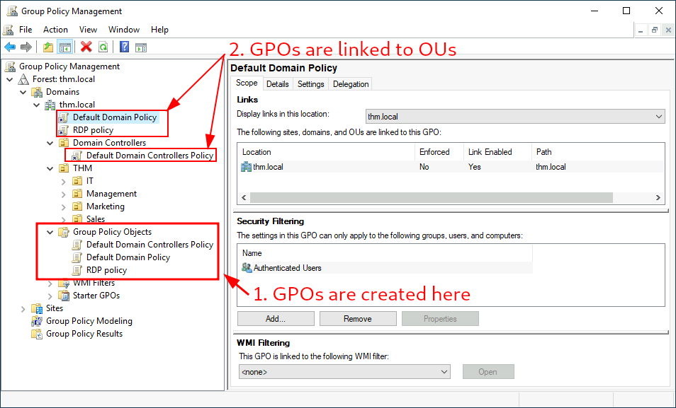
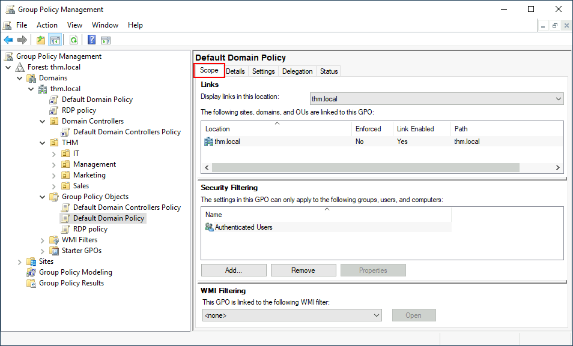
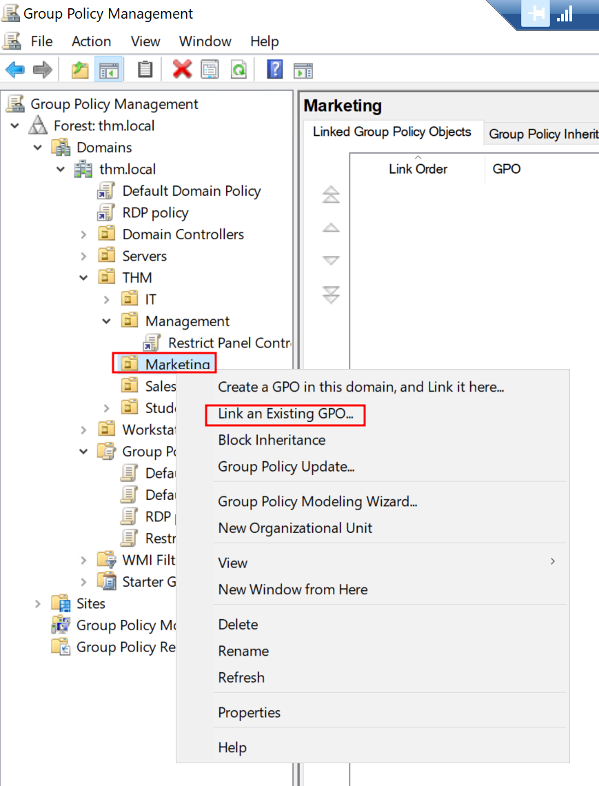
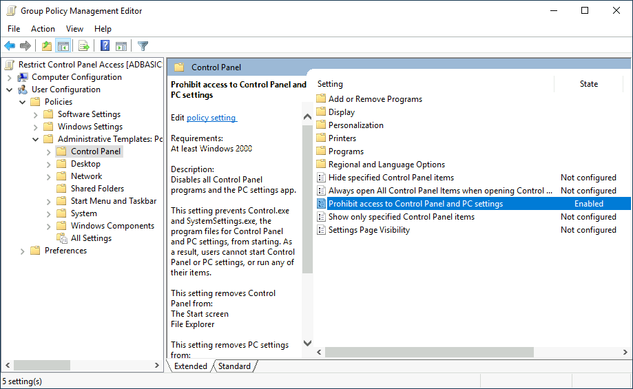
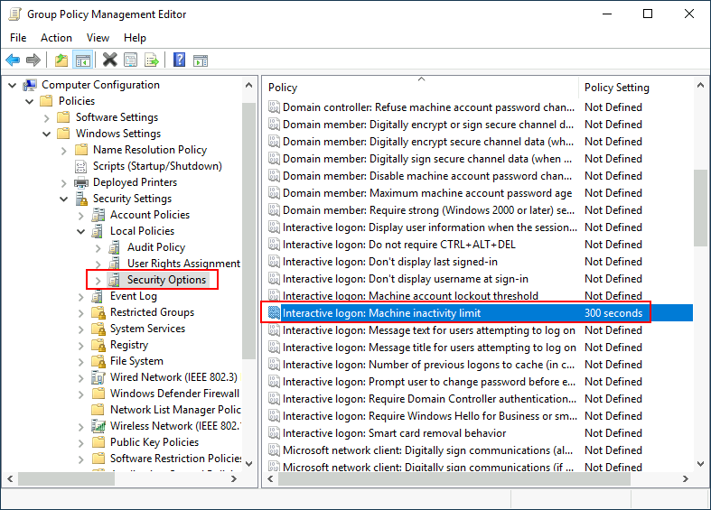

## 9.1 Ce qu'est une GPO

Une **GPO** (*Group Policy Object*) est un ensemble de paramètres appliqués aux utilisateurs et ordinateurs d'un site, d'un domaine ou d'une OU : politique de mots de passe, écran de verrouillage, pare-feu, journalisation, restrictions logicielles, scripts, déploiement de logiciels… C'est le levier qui permet de configurer des milliers de postes depuis un seul point.

Une GPO a deux moitiés :

| Partie | Emplacement | Contenu |
|---|---|---|
| **GPC** (*Group Policy Container*) | Objet `groupPolicyContainer` dans l'annuaire | Métadonnées, version, liens |
| **GPT** (*Group Policy Template*) | `\\meridian.local\SYSVOL\meridian.local\Policies\{GUID}` | Les paramètres eux-mêmes (fichiers) |

Sur chaque DC, SYSVOL est le dossier `C:\Windows\SYSVOL\sysvol\`, partagé sur le réseau et répliqué entre contrôleurs.

Chaque GPO contient une **configuration ordinateur** (appliquée au démarrage puis périodiquement) et une **configuration utilisateur** (appliquée à l'ouverture de session).

## 9.2 Créer, lier, cibler

On crée les GPO dans le dossier *Group Policy Objects* de la console GPMC, puis on les **lie** à un site, au domaine ou à une OU. Une même GPO peut être liée à plusieurs endroits.



Le ciblage se règle à trois niveaux :

| Mécanisme | Effet |
|---|---|
| **Lien** | Détermine le périmètre (site, domaine, OU et ses sous-OU) |
| **Filtrage de sécurité** | Restreint l'application à certains groupes (par défaut : *Authenticated Users*) |
| **Filtre WMI** | Condition sur la machine (version de Windows, type de poste…) |

L'onglet *Étendue* (*Scope*) d'une GPO réunit les trois : ses liens, son filtrage de sécurité et son filtre WMI.





**Deux exemples courants.** Le lien suit la moitié de la GPO qui est utilisée : un paramètre *utilisateur* s'applique aux comptes rangés dans l'OU liée, un paramètre *ordinateur* aux machines.

| Besoin | Paramètre | Lien |
|---|---|---|
| Interdire le Panneau de configuration aux utilisateurs hors IT | Configuration utilisateur › Modèles d'administration › Panneau de configuration › *Interdire l'accès au Panneau de configuration et à l'application Paramètres du PC* | Les OU des services métiers, pas celle de l'IT |
| Verrouiller la session après 5 minutes d'inactivité | Configuration ordinateur › Paramètres Windows › Paramètres de sécurité › Stratégies locales › Options de sécurité › *Ouverture de session interactive : limite d'inactivité de l'ordinateur* = 300 secondes | La racine du domaine, pour tous les postes et serveurs |





Après `gpupdate /force` sur le poste (ou au prochain rafraîchissement), un utilisateur de l'OU qui ouvre le Panneau de configuration reçoit un message « opération annulée en raison de restrictions » : la GPO s'applique.

## 9.3 Ordre d'application : LSDOU

```text
Local → Site → Domaine → OU parente → OU enfant
                                  (le dernier appliqué l'emporte)
```


- en cas de conflit, le paramètre appliqué **en dernier** gagne : l'OU la plus proche de l'objet l'emporte ;
- **Enforced** (« appliqué ») sur un lien : la GPO ne peut plus être écrasée plus bas ;
- **Block Inheritance** sur une OU : les GPO des niveaux supérieurs ne s'appliquent plus (sauf celles marquées *Enforced*) ;
- la **politique de mots de passe** du domaine ne se règle que dans une GPO liée **au domaine** ; pour des politiques différenciées, on utilise les **FGPP** (Ch.24).

## 9.4 Distribution et diagnostic

Les GPO sont répliquées entre DC via SYSVOL ; les clients les rafraîchissent toutes les **90 minutes** environ (avec un décalage aléatoire jusqu'à 30 minutes), les DC toutes les 5 minutes.

| Commande | Usage |
|---|---|
| `gpupdate /force` | Forcer l'application immédiate |
| `gpresult /r` | Voir les GPO appliquées à l'utilisateur et à la machine |
| `gpresult /h rapport.html` | Rapport détaillé (paramètres gagnants, GPO refusées et pourquoi) |
| `Get-GPResultantSetOfPolicy` | Équivalent PowerShell |

**Une GPO ne s'applique pas ?** Vérifier dans l'ordre : l'objet est-il dans la bonne OU (et pas dans le conteneur `Computers`) ; le lien est-il activé ; le filtrage de sécurité inclut-il l'objet ; un filtre WMI l'exclut-il ; un *Block Inheritance* ou une GPO plus prioritaire l'écrase-t-elle ; la réplication SYSVOL est-elle saine ; le poste joint-il un DC (DNS) ?

## 9.5 Les GPO de sécurité essentielles

| Domaine | Paramètres clés |
|---|---|
| Comptes | Longueur et historique des mots de passe, verrouillage |
| Audit | *Advanced Audit Policy* (Ch.12), journalisation PowerShell |
| Protocoles anciens | Désactiver LLMNR, NBT-NS, SMBv1, WDigest ; restreindre NTLM (Ch.24) |
| Signature | SMB signing, LDAP signing et channel binding |
| Exécution | AppLocker ou WDAC, règles ASR |
| Postes | Pare-feu Windows, verrouillage de session, BitLocker, LAPS |
| Droits d'ouverture de session | Interdire aux comptes Tier 0 de se connecter aux postes et serveurs (*Deny log on…*) |

## 9.6 Les GPO, un objet sensible

Parce qu'une GPO exécute des paramètres — et éventuellement des scripts — sur tout ce qui lui est lié, **pouvoir modifier une GPO revient à contrôler les machines de son périmètre**. Une GPO liée aux contrôleurs de domaine est donc un objet Tier 0.

Points de contrôle :

- qui peut **créer**, **modifier** et **lier** des GPO (onglet *Délégation* de GPMC) ;
- les permissions sur les dossiers de SYSVOL ;
- le contenu de SYSVOL et NETLOGON, lisibles par tous les utilisateurs du domaine : aucun secret ne doit y figurer (scripts avec mots de passe, anciennes préférences de stratégie contenant des mots de passe — Ch.7) ;
- la journalisation des modifications (événement 5136 sur les objets GPO).

---
