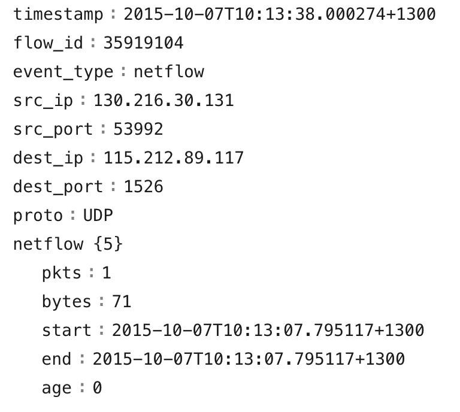

Source : [Hack The Box Academy - Network Log Analysis](https://academy.hackthebox.com/course/preview/network-log-analysis)

## Analyse générique des logs — NetFlow

- **NetFlow** est une technologie de télémétrie réseau développée initialement par Cisco.
- Elle collecte des **métadonnées sur les communications IP** traversant un équipement réseau.
- Des technologies similaires existent selon les constructeurs :

```text
NetFlow
sFlow
IPFIX
```


L’objectif reste le même :

```text
Network Traffic
→ Flow Metadata
→ Collector / Analyzer
→ Visibility
```


> **IPFIX** est le standard ouvert largement dérivé de NetFlow v9.

## Principe de NetFlow

NetFlow ne capture pas directement le contenu complet des paquets comme un PCAP.

Il résume les communications sous forme de **flows**.

```text
Packets
→ Grouped into Flow
→ Metadata Exported
```


Un flow représente un ensemble de paquets partageant certains attributs communs entre une source et une destination.

## Attributs d’un Flow

Les informations collectées peuvent inclure :

- Source IP ;
- Destination IP ;
- Source Port ;
- Destination Port ;
- IP Protocol ;
- interface réseau ;
- IPv4 / IPv6.

Pour TCP / UDP :

```text
Source IP
Destination IP
Source Port
Destination Port
Protocol
```


correspond approximativement au **5-tuple** :

```text
src_ip
dst_ip
src_port
dst_port
protocol
```


Selon la version / implémentation, d’autres champs peuvent également exister :

- timestamps ;
- byte count ;
- packet count ;
- TCP flags ;
- ToS / DSCP ;
- ingress / egress interface ;
- AS information.

## NetFlow ≠ Packet Capture

Différence importante :

```text
PCAP
→ Packet headers + payload
→ Deep packet analysis

NetFlow
→ Flow metadata
→ Communication summary
```


Exemple :

```text
10.0.10.5:51524
→ 192.168.1.20:443
TCP
150 packets
120 KB
Duration: 42 sec
```


NetFlow permet de savoir :

- **qui communique avec qui** ;
- sur quel port ;
- avec quel protocole ;
- pendant combien de temps ;
- avec quel volume.

Mais généralement pas :

```text
HTTP content
Transferred files
Credentials
Application payload
```


## Fonctionnement

Un équipement compatible NetFlow :

```text
Router / Switch
→ observes traffic
→ maintains flow records
→ exports records
→ NetFlow Collector
→ Analysis / Visualization
```


Les équipements peuvent être configurés via :

- CLI ;
- interface web ;
- système centralisé de gestion réseau.

Les enregistrements sont généralement exportés dans un format machine/binaire vers un :

```text
NetFlow Collector
ou
NetFlow Analyzer
```


qui les convertit en données lisibles et exploitables.



## Stateful : le cache des flows

NetFlow fonctionne de manière **stateful** :

- l’exporter maintient un **flow cache** ;
- il associe les paquets aux flows existants ;
- puis exporte un résumé lorsque le flow expire ou selon certains timers.

```text
Packet
→ Match existing Flow?
├─ Yes → update counters
└─ No  → create Flow Entry
```


> Ce n’est pas « stateful » exactement au même sens qu’un **stateful firewall** ; il s’agit surtout d’un suivi d’état des flows pour produire les statistiques.

## Fin d’un Flow

Un flow peut être exporté lorsqu’il :

- expire après inactivité ;
- atteint un timeout actif ;
- rencontre certaines conditions de fin ;
- est exporté périodiquement selon l’implémentation.

```text
Flow Active
→ Counters Updated
→ Flow Ends / Timeout
→ Record Exported
```


## Avantages de NetFlow

### Billing & Accounting

Les opérateurs / ISP peuvent utiliser les données pour :

- mesurer les volumes ;
- accounting ;
- billing ;
- analyse d’utilisation.

### Network Design & Optimization

NetFlow permet d’identifier :

- les chemins les plus utilisés ;
- les gros consommateurs de bande passante ;
- les périodes de saturation ;
- les besoins en capacité.

```text
Flow Data
→ Traffic Patterns
→ Capacity Planning
```


### Network Monitoring

Permet de surveiller :

- ports les plus utilisés ;
- protocoles ;
- principales sources/destinations ;
- volumes inhabituels ;
- nouveaux comportements.

### QoS

Peut aider à évaluer :

- qualité de service ;
- latence indirectement via certains outils complémentaires ;
- volumes par classe de trafic ;
- congestion ;
- comportement des applications.

### Security Analysis

Pour un SOC :

```text
NetFlow
→ Network Visibility
→ Baseline
→ Anomaly Detection
→ Investigation
```


Très utile pour répondre à :

```text
Who talked to whom?
When?
How often?
How much data?
Which port/protocol?
```


## Détection d’anomalies

### Traffic Spike

```text
Normal:
10 MB/hour

Observed:
4 GB in 10 minutes
```


→ possible :

- exfiltration ;
- backup légitime ;
- transfert massif ;
- malware activity.

## Détection de fuite / exfiltration

Exemple :

```text
Internal Host
→ Rare External IP
→ 443
→ 8 GB outbound
```


Peut être suspect si :

- destination inconnue ;
- volume inhabituel ;
- horaire atypique ;
- host sensible.

```text
High Outbound Volume
+
Rare Destination
+
Sensitive Host
→ Possible Exfiltration
```


## Accès non autorisé

NetFlow peut montrer :

```text
Workstation
→ Database Server
→ TCP/1433
```


alors que ce poste ne devrait jamais communiquer directement avec la base.

```text
Unexpected Source
+
Restricted Destination
→ Investigate
```


## Nouveaux équipements / IP inconnues

Permet d’identifier :

```text
New Internal IP
→ Starts Communicating
```


ou :

```text
Known Host
→ First-Time External Destination
```


Cela peut révéler :

- rogue device ;
- Shadow IT ;
- nouveau serveur ;
- équipement compromis ;
- activité inhabituelle.

## First-Seen Connections

Une connexion jamais observée auparavant peut être très intéressante.

Exemple :

```text
Domain Controller
→ First connection
→ Unknown External IP
```


→ priorité élevée.

Concept :

```text
Baseline
+
First-Seen Communication
→ Anomaly
```


## Port Scanning

NetFlow est particulièrement adapté pour détecter :

```text
One Source
→ Many Destination Ports
```


Exemple :

```text
10.0.10.5
→ 10.0.10.20:22
→ 10.0.10.20:80
→ 10.0.10.20:135
→ 10.0.10.20:445
→ 10.0.10.20:3389
```


→ possible **vertical scan**.

Ou :

```text
10.0.10.5
→ HOST-A:445
→ HOST-B:445
→ HOST-C:445
→ HOST-D:445
```


→ possible **horizontal scan** / reconnaissance SMB.

## Lateral Movement

NetFlow peut aider à détecter des connexions internes inhabituelles :

```text
Workstation A
→ Workstation B:445

Workstation A
→ Server C:3389

Workstation A
→ Server D:5985
```


Ports intéressants :

```text
445   → SMB
3389  → RDP
5985  → WinRM HTTP
5986  → WinRM HTTPS
22    → SSH
```


```text
New East-West Connections
+
Administrative Ports
→ Possible Lateral Movement
```


## C2 — Command & Control

Un beacon C2 peut produire des flows périodiques :

```text
10:00 → External IP
10:05 → External IP
10:10 → External IP
10:15 → External IP
```


Pattern :

```text
Same Source
+
Same Destination
+
Regular Interval
+
Small Similar Transfers
→ Possible Beaconing
```


Même avec du trafic chiffré :

```text
HTTPS Payload Invisible
≠ Network Pattern Invisible
```


NetFlow reste donc utile même lorsque le contenu n’est pas inspectable.

## Limites de NetFlow

NetFlow offre une excellente visibilité sur les **relations réseau**, mais moins de contexte applicatif.

Il ne permet généralement pas de connaître :

- contenu du payload ;
- commande exacte exécutée ;
- fichier transféré ;
- URL complète HTTPS ;
- utilisateur responsable.

Il doit donc être corrélé avec :

```text
NetFlow
+
DNS Logs
+
Firewall
+
Proxy
+
EDR
+
Authentication Logs
+
PCAP
→ Full Investigation Context
```


## NetFlow vs PCAP

| NetFlow | PCAP |
|---|---|
| Métadonnées | Paquets complets |
| Faible stockage relatif | Très volumineux |
| Longue rétention possible | Rétention souvent plus courte |
| Très bon pour patterns | Très bon pour contenu détaillé |
| Who/Where/When/How much | What exactly happened |

```text
NetFlow
→ Breadth

PCAP
→ Depth
```


## Exemple SOC

```text
Host:
10.0.20.15

Destination:
185.x.x.x

Port:
443

Duration:
1 minute

Bytes Out:
12 KB

Frequency:
Every 5 minutes
```


Analyse :

```text
Periodic
+
Rare External Destination
+
Consistent Flow Size
→ Possible C2 Beacon
```


Puis corréler :

```text
NetFlow
→ Destination IP

DNS
→ Domain

EDR
→ Process

Proxy
→ URL

Threat Intel
→ Reputation
```


## Vue d’ensemble (NetFlow)

```text
Network Traffic
      ↓
NetFlow Exporter
      ↓
Flow Records
      ↓
Collector / Analyzer
      ↓
Baseline + Correlation
      ↓
Detect
├─ Scanning
├─ Lateral Movement
├─ C2
├─ Exfiltration
├─ Unauthorized Access
└─ New / Rare Communications
```


Le point important est que **NetFlow ne cherche pas à enregistrer le contenu de chaque paquet** : il fournit une vue compacte des **communications réseau**, ce qui le rend particulièrement utile pour détecter des anomalies, reconstruire des relations entre systèmes et identifier rapidement des comportements comme du `scanning`, du `lateral movement`, du `C2` ou de l’`exfiltration`.
