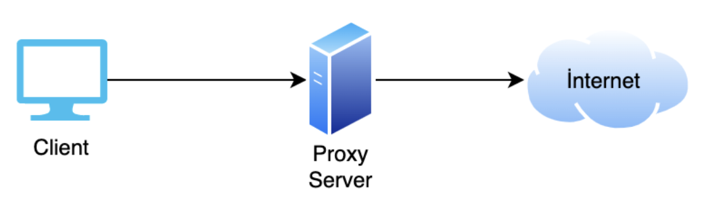

Source : [Hack The Box Academy - Network Log Analysis](https://academy.hackthebox.com/course/preview/network-log-analysis)

## Analyse des logs Proxy

- Un **proxy** agit comme intermédiaire entre un endpoint et Internet.

```text
Client
→ Proxy
→ Internet
```




Objectifs fréquents :

- contrôle centralisé des accès web ;
- application de politiques ;
- filtrage URL / catégories ;
- amélioration de la sécurité ;
- parfois optimisation/cache selon la solution.

Exemples de solutions :

```text
Cisco Umbrella
Forcepoint Web Security Gateway
Check Point URL Filtering
Fortinet Secure Web Gateway
```


## Types de proxy

### Transparent Proxy

- La destination peut voir la véritable IP source du client.

```text
Client IP
→ Proxy
→ Destination sees Client IP
```


### Anonymous Proxy

- La destination voit l’IP du proxy au lieu de celle du client.

```text
Client
→ Proxy
→ Destination sees Proxy IP
```


→ l’IP réelle du poste n’est pas directement exposée au serveur cible.

## Fonctionnement général

Le proxy contrôle notamment l’accès à :

- HTTP ;
- HTTPS ;
- FTP ;
- autres services supportés.

```text
Request
→ Proxy Policy
→ URL / Domain Classification
→ Allow / Block
```


Une politique peut se baser sur :

- catégorie du domaine ;
- réputation ;
- groupe utilisateur ;
- type de poste ;
- URL ;
- destination ;
- profil de sécurité.

### Implicit Deny

Pour certains systèmes très contraints :

```text
Allowed Destinations
→ explicit allow

Everything Else
→ deny
```


Cette logique réduit fortement l’exposition réseau.

Exemple :

```text
Server
→ Only update/vendor URLs allowed
→ All other web destinations blocked
```


## Exemple de Proxy Log

```text
srcip=192.168.209.142
srcport=34280
dstip=54.20.21.189
dstport=443
service="HTTPS"
hostname="android.prod.cloud.netflix.com"
profile="Wifi-Guest"
action="blocked"
url="https://android.prod.cloud.netflix.com/"
sentbyte=517
rcvdbyte=0
direction="outgoing"
urlsource="Local URLfilter Block"
```


Interprétation :

```text
192.168.209.142
→ requests android.prod.cloud.netflix.com
→ HTTPS
→ policy/profile Wifi-Guest
→ URL found in block list
→ request blocked
```


## Champs principaux

### Temps / type de log

```text
date
→ date

time
→ heure

type
→ type principal de log

subtype
→ sous-type

eventtype
→ type d’événement précis

level
→ niveau / sévérité
```


### Source

```text
srcip
→ Source IP

srcport
→ Source Port

srcintfrole
→ rôle de l’interface source
```


Selon le produit, on peut aussi retrouver :

- username ;
- hostname ;
- endpoint group ;
- policy profile.

### Destination

```text
dstip
→ Destination IP

dstport
→ Destination Port

dstintfrole
→ rôle de l’interface destination
```


### Web / Application Context

```text
service
→ service utilisé

hostname
→ domaine demandé

url
→ URL complète

profile
→ profil / politique appliquée

urlsource
→ source de classification / blocage
```


### Résultat

```text
action
→ allow / pass / blocked / deny
```


Exemple :

```text
action="blocked"
```


→ la requête a été bloquée par le proxy.

### Direction et volume

```text
sentbyte
→ bytes envoyés

rcvdbyte
→ bytes reçus

direction
→ outgoing / incoming
```


Ces champs peuvent aider à détecter :

- downloads ;
- uploads ;
- exfiltration ;
- communications inhabituelles.

## Valeur SOC des Proxy Logs

Les proxy logs permettent de répondre à :

```text
Which user / host?
→ Requested what domain / URL?
→ Was it allowed?
→ Was it blocked?
→ How often?
→ How much data?
```


Ils sont particulièrement utiles pour investiguer :

- navigation vers domaines suspects ;
- malware ;
- C2 ;
- tunneling ;
- downloads malveillants ;
- exfiltration web.

## Connexions vers des URLs suspectes

Exemple :

```text
Internal Host
→ suspicious-domain.example
→ action=blocked
```


Même si la requête est bloquée :

```text
Blocked
≠ benign endpoint
```


Le simple fait qu’un serveur ou endpoint ait tenté cette connexion peut indiquer :

- malware ;
- script compromis ;
- application détournée ;
- configuration malveillante.

### Domaine bloqué ≠ incident terminé

Exemple :

```text
Server
→ suspicious proxy / domain
→ blocked
```


Questions à poursuivre :

```text
Why did the server make the request?
Which process initiated it?
Was it attempted before?
Were any requests allowed?
Were other hosts involved?
```


Poursuivre alors avec :

```text
EDR / XDR
→ identify initiating process
→ inspect endpoint activity
```


## Analyse Forcepoint

Exemple :

```text
src=10.80.18.50
suser=Test_User
dst=104.26.11.18
dhost=sentry-proxy.cargox.cc
dpt=443
app=https
act=blocked
requestMethod=POST
```


Interprétation :

```text
Test_User
→ POST request
→ sentry-proxy.cargox.cc
→ HTTPS
→ blocked
```


Policy :

```text
Block_Risk_Category_Policy(Servers)
```


→ la destination a été bloquée selon une catégorie considérée risquée.

## Catégories URL

Les solutions proxy peuvent attribuer des catégories aux domaines :

```text
News
Social Media
Malware
Suspicious Content
Gambling
Adult Content
Cloud Storage
```


Dans l’exemple du cours :

```text
Category 194
→ Extended Protection Suspicious Content
```


La catégorie aide au triage, mais :

```text
Category
≠ proof of compromise
```


Elle sert surtout de contexte supplémentaire.

## Détection d’un endpoint infecté

Pattern :

```text
Endpoint
→ Repeated requests
→ Suspicious Domain
→ Blocked / Allowed
```


Si un poste continue à contacter une destination malveillante :

```text
Repeated Proxy Requests
+
Suspicious Domain
+
Unexpected Process
→ Possible Infection
```


## Corrélation avec EDR/XDR

Un proxy montre généralement la connexion web, mais pas forcément le processus responsable.

Il faut corréler :

```text
Proxy
→ Host / User / URL

EDR
→ Process / Parent / Command Line
```


Exemple :

```text
Proxy
→ HOST-A contacted evil.example

EDR
→ powershell.exe initiated connection
```


→ bien plus significatif.

### Corrélation avec DNS

```text
Proxy
→ URL / hostname

DNS
→ resolution history

EDR
→ process

Firewall
→ network connection
```


```text
Domain
→ Resolved IP
→ Connection
→ Process
```


→ permet de reconstruire l’activité réseau de manière plus complète.

## Tunneling

Les proxy logs peuvent aider à détecter des activités de tunneling.

Exemples possibles :

```text
HTTP Tunneling
HTTPS Tunneling
Proxy Chaining
```


Pattern potentiel :

```text
Internal Host
→ external proxy-like domain
→ repeated encrypted traffic
→ unusual POST activity
```


→ possible tunneling / proxy abuse.

## POST Requests

Les requêtes HTTP `POST` sont intéressantes car elles peuvent transporter des données vers l’extérieur.

```text
POST
→ Client sends data
→ Server
```


Mais :

```text
POST
≠ exfiltration
```


Elles sont normales pour :

- APIs ;
- login forms ;
- applications web ;
- telemetry.

Elles deviennent intéressantes avec :

```text
Suspicious Domain
+
Large sentbyte
+
Unexpected Host
+
Repeated POST
→ Possible Exfiltration / C2
```


## HTTPS et limites de visibilité

Avec HTTPS :

```text
Client
→ TLS
→ Destination
```


Sans **TLS inspection**, le proxy peut parfois voir seulement :

- destination IP ;
- hostname ;
- metadata ;
- SNI selon contexte ;
- volume.

Avec inspection TLS :

```text
Proxy
→ decrypt / inspect
→ re-encrypt
```


→ davantage de visibilité applicative.

La visibilité exacte dépend fortement de la configuration et du produit.

## Analyse par utilisateur

Un champ utilisateur est très précieux :

```text
suser=Test_User
```


Il permet de corréler :

```text
User
→ Host
→ URL
→ Action
```


Exemple :

```text
Test_User
→ suspicious-domain
→ blocked
```


Puis rechercher :

- autres URLs visitées ;
- autres hosts utilisés ;
- authentifications associées ;
- activité EDR du compte.

## Analyse temporelle

Toujours filtrer avec la fenêtre d’incident :

```text
Incident Time Window
+
User
+
Host
+
Domain
→ Reduced Noise
```


Exemple :

```text
14:00–14:30
→ all proxy requests from HOST-A
```


Puis reconstruire :

```text
14:02 → suspicious domain
14:03 → payload URL
14:04 → second C2 domain
14:06 → POST request
```


## C2 via Proxy

Un C2 peut utiliser HTTP/HTTPS et donc apparaître dans les proxy logs.

Pattern possible :

```text
Same Host
→ Same Rare Domain
→ Regular Requests
→ Similar Byte Counts
→ Long Duration
```


```text
Periodic Web Requests
→ Possible C2 Beaconing
```


## Exfiltration (proxy)

Proxy logs peuvent révéler :

```text
Internal Host
→ External Domain
→ Large sentbyte
```


Exemple :

```text
sentbyte=500000000
rcvdbyte=5000
```


→ beaucoup plus de données envoyées que reçues.

Pattern :

```text
Large Outbound Data
+
Rare Destination
+
POST / Upload
→ Possible Exfiltration
```


## Détection de domaines suspects

Chercher notamment :

- domaine nouvellement observé ;
- faible réputation ;
- catégorie risquée ;
- typosquatting ;
- domain age récent ;
- destination jamais vue ;
- domaine utilisé par malware connu.

```text
Rare / New Domain
+
Incident Context
→ Investigate
```


## Proxy vs Firewall

Les deux apportent un contexte différent :

```text
Firewall
→ IP / Port / Action

Proxy
→ User / URL / Domain / Web Category
```


Exemple :

```text
Firewall:
10.0.0.5 → 185.x.x.x:443

Proxy:
user=jdoe
url=https://evil.example/payload.exe
```


→ le proxy fournit un contexte applicatif bien plus précis pour le trafic web.

### Proxy vs DNS

```text
DNS
→ Which domain was resolved?

Proxy
→ Which URL was requested?
```


Donc :

```text
DNS
+
Proxy
→ Domain + URL Context
```


## Workflow SOC (proxy)

```text
Suspicious Proxy Event
        ↓
Identify User / Host
        ↓
Check Domain / URL
        ↓
Check Action
        ↓
Was it blocked or allowed?
        ↓
Check frequency / volume
        ↓
Correlate DNS / Firewall
        ↓
Correlate EDR/XDR
        ↓
Identify initiating process
        ↓
Determine Infection / C2 / Exfiltration
```


## Patterns SOC importants (proxy)

### Suspicious URL

```text
Known Bad Domain
+
action=allowed
→ High Priority
```


### Blocked Request from Server

```text
Server
+
Suspicious Domain
+
action=blocked
→ Investigate Endpoint Anyway
```


### C2

```text
Rare Domain
+
Periodic Requests
+
Same Host
→ Possible Beacon
```


### Exfiltration

```text
POST
+
Large sentbyte
+
Unknown Destination
→ Possible Data Exfiltration
```


### Proxy / Tunneling Abuse

```text
Internal Host
→ External Proxy-like Domain
→ Repeated Traffic
→ Unexpected for Asset
→ Investigate
```


## Vue d’ensemble (proxy)

```text
Proxy Log
│
├─ Timestamp
├─ Source IP / User
├─ Destination IP / Port
├─ Hostname
├─ URL
├─ Method
├─ Profile / Policy
├─ Category
├─ Action
├─ Sent / Received Bytes
└─ Direction
```


La valeur principale des proxy logs est qu’ils donnent une **visibilité applicative sur le trafic web** : contrairement à un simple firewall log qui montre surtout `IP + port`, ils peuvent permettre d’identifier **le domaine, l’URL, l’utilisateur, la méthode HTTP, la catégorie et la politique appliquée**. Ils deviennent particulièrement puissants lorsqu’ils sont corrélés avec `DNS`, `Firewall`, `EDR/XDR` et la timeline de l’incident.
