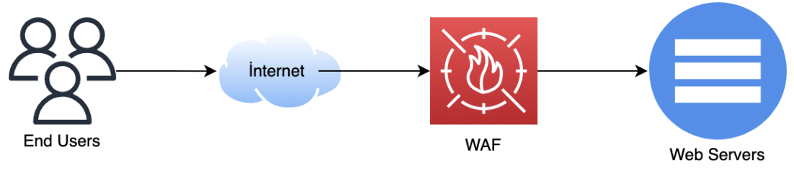

Source : [Hack The Box Academy - Network Log Analysis](https://academy.hackthebox.com/course/preview/network-log-analysis)

## Analyse des logs WAF

- Un **WAF — Web Application Firewall** protège les applications web en inspectant les requêtes HTTP/HTTPS.
- Il apporte une visibilité applicative que les simples logs firewall ou IDS/IPS ne fournissent pas toujours.

```text
Internet
→ WAF
→ Web Server
```


Le WAF peut :

- inspecter les requêtes web ;
- détecter des signatures d’attaque ;
- appliquer des policies ;
- bloquer ou autoriser les requêtes ;
- générer des alertes détaillées.

## Pourquoi utiliser un WAF ?

Un firewall réseau classique voit surtout :

```text
Source IP
Destination IP
Port
Protocol
```


Un WAF peut analyser :

```text
HTTP Method
Host
URL
Parameters
Headers
User-Agent
Request Body
Attack Pattern
```


Il est donc particulièrement adapté aux attaques :

```text
SQL Injection
XSS
Code Injection
Directory Traversal
Web Exploitation
```


## HTTPS et SSL/TLS Offload

Avec HTTPS :

```text
Client
→ TLS encrypted traffic
→ Web Server
```


le contenu HTTP est chiffré.

Pour analyser réellement les requêtes, le WAF peut effectuer une **terminaison TLS / SSL Offload** :

```text
Client
→ HTTPS
→ WAF
→ Decrypt
→ Inspect HTTP Request
→ Forward to Web Server
```




Objectifs :

- rendre le payload visible ;
- appliquer les signatures web ;
- détecter / bloquer les attaques ;
- décharger éventuellement le serveur web des opérations TLS.

> Sans terminaison/déchiffrement TLS à un endroit où le WAF peut inspecter le contenu, sa visibilité sur les requêtes HTTPS est fortement limitée.

## Position du WAF

Dans une architecture où tout le trafic public destiné à l’application passe par le WAF :

```text
Internet
→ WAF
→ Web Application
```


le WAF devient une source importante pour retrouver :

- requêtes entrantes ;
- attaques détectées ;
- attaques bloquées ;
- IP sources ;
- URLs ciblées ;
- méthodes HTTP ;
- signatures déclenchées.

Exemples de solutions :

```text
F5 BIG-IP
Citrix
Imperva
FortiWeb
Cloudflare
Akamai
AWS WAF
```


## Exemple de log WAF

```text
src=19.6.150.138
src_port=56334
dst=172.16.10.10
dst_port=443

service=https/tls1.2
http_method=get

http_host="app.letsdefend.io"

sub_type="SQL Injection"
severity_level=High

action=Alert

signature_id="030000136"
```


Interprétation :

```text
19.6.150.138
→ HTTPS request
→ app.letsdefend.io
→ SQL Injection signature triggered
→ Severity = High
→ Action = Alert
```


## Champs principaux (WAF)

### Temps

```text
date
time
timezone
```


À normaliser lors de la construction d’une timeline.

### Type de détection

```text
type
→ type général du log

main_type
→ mécanisme/type de détection

sub_type
→ activité détectée
```


Exemple :

```text
main_type="Signature Detection"
sub_type="SQL Injection"
```


### Severity

```text
severity_level
```


Exemples :

```text
Low
Medium
High
Critical
```


Elle sert à prioriser les événements, mais :

```text
High Severity
≠ Successful Exploitation
```


Il faut toujours vérifier le contexte.

### Source / Destination

```text
src
→ Source IP

src_port
→ Source Port

dst
→ Destination IP

dst_port
→ Destination Port
```


Permet de répondre à :

```text
Who sent the request?
→ Which web application?
→ On which service?
```


### HTTP Method

```text
http_method
```


Exemples :

```text
GET
POST
PUT
DELETE
OPTIONS
```


#### GET

```text
GET
→ retrieve a resource
```


#### POST

```text
POST
→ submit data / trigger processing
```


#### PUT

```text
PUT
→ create or replace a resource
```


#### DELETE

```text
DELETE
→ request deletion of a resource
```


#### OPTIONS

```text
OPTIONS
→ query supported communication options / methods
```


> `PUT` et `DELETE` ne sont pas malveillants par nature, mais peuvent être intéressants s’ils sont inhabituels pour l’application concernée.

### URL / Host

```text
http_host
→ hostname requested

http_url
→ URL / request URI
```


Exemple :

```text
http_host="app.letsdefend.io"

http_url="?v=(SELECT ...)"
```


Ici, le paramètre contient une expression ressemblant à une tentative de :

```text
SQL Injection
```


### User-Agent

```text
http_agent
```


Exemple :

```text
Mozilla/5.0 ...
```


Peut aider à identifier :

- browser ;
- scanner ;
- script ;
- outil automatisé ;
- anomalie.

Mais :

```text
User-Agent
→ easily spoofed
```


Il ne doit donc jamais être considéré seul.

### Signature

```text
signature_id
signature_subclass
attack_type
msg
```


Exemple :

```text
signature_id="030000136"

signature_subclass="SQL Injection"

attack_type="SQL Injection"
```


Workflow :

```text
Request
→ Signature Match
→ WAF Event
```


### Action

Champ essentiel :

```text
action
```


Exemples selon produit :

```text
Alert
Block
Deny
Pass
```


Dans l’exemple :

```text
action=Alert
```


signifie que le WAF a détecté l’activité mais est en **monitoring / alert-only mode** pour cette policy.

```text
Detection
→ Alert
→ Request may continue to backend
```


Donc :

```text
action=Alert
≠ blocked
```


### Policy

```text
policy="Alert_Policy"
```


indique quelle policy WAF a traité la requête.

Cela permet de comprendre :

```text
Why was this request only alerted?
Why was another request blocked?
```


## Analyse d’une alerte SQL Injection

Workflow :

```text
WAF Alert
→ Identify Source
→ Identify Target
→ Inspect URL / Parameters
→ Check Signature
→ Check Action
→ Check Backend Response
→ Correlate with Web Server Logs
```


### Détection ≠ exploitation réussie

Une signature SQLi déclenchée signifie :

```text
Request matched SQLi pattern
```


mais pas forcément :

```text
Database compromised
```


Il faut vérifier :

- endpoint ciblé ;
- paramètre vulnérable ;
- technologie utilisée ;
- réponse HTTP ;
- web server logs ;
- application logs ;
- database logs ;
- activité post-exploitation.

```text
WAF Detection
→ Attack Attempt

Application Evidence
→ Successful or Failed?
```


## HTTP Response Codes

Les réponses du serveur web permettent d’ajouter du contexte.

### 2xx — Success

```text
200 OK
→ Request processed successfully at HTTP level
```


> ⚠️ `HTTP 200` ne prouve pas qu’une attaque a réussi. Cela indique simplement que l’application a retourné une réponse HTTP considérée comme réussie.

Une application peut retourner `200` même pour :

- page d’erreur custom ;
- requête invalide ;
- payload non exploité.

### 3xx — Redirection

```text
301
→ Permanent Redirect
```


### 4xx — Client Error

```text
403
→ Forbidden

404
→ Not Found
```


### 5xx — Server Error

```text
503
→ Service Unavailable
```


Catégories :

```text
1xx → Informational
2xx → Successful
3xx → Redirection
4xx → Client Error
5xx → Server Error
```


## Corrélation avec les logs Web Server

Si le WAF n’a pas bloqué la requête :

```text
WAF
action=Alert
        ↓
Web Server Logs
        ↓
Did request reach backend?
        ↓
What response?
```


Sources possibles :

```text
IIS
Apache
Nginx
Application Logs
```


Exemple :

```text
WAF
→ SQLi detected

Nginx
→ request received

Application
→ SQL error

Database
→ suspicious query
```


→ signal beaucoup plus fort.

## Vérifier la vulnérabilité réellement applicable

Une signature peut détecter une tentative contre une technologie que la cible n’utilise pas.

Exemple :

```text
Attacker
→ PHP-specific exploit

Target
→ ASP.NET application
```


Interprétation :

```text
Attack Attempt
→ Technique not applicable
→ Exploitation likely unsuccessful
```


Cela ne signifie pas que la source est bénigne :

```text
Scanning Activity
→ still suspicious
```


## Reconnaissance / Vulnerability Scanning

Une source peut générer :

```text
SQLi
XSS
Directory Traversal
PHP exploit
Apache exploit
WordPress exploit
```


sur une courte période.

```text
Same Source IP
+
Many Web Signatures
+
Multiple URLs
→ Possible Automated Vulnerability Scan
```


## SQL Injection

Pattern :

```text
Parameter
→ SQL syntax
→ WAF signature
```


Exemples de tokens intéressants :

```text
SELECT
UNION
OR 1=1
CASE WHEN
SLEEP()
```


Mais :

```text
SQL-looking string
≠ exploitation automatically successful
```


## XSS

WAF peut détecter des patterns comme :

```text
<script>
javascript:
onerror=
onload=
```


```text
HTTP Parameter
→ Script Payload
→ XSS Signature
```


## Directory Traversal

Exemples :

```text
../
..\
%2e%2e%2f
```


Objectif possible :

```text
Request arbitrary files
→ outside intended web directory
```


## Code / Command Injection

Exemples de patterns pouvant être détectés :

```text
;
&&
|
$(...)
```


ou autres chaînes associées à l’exécution de commandes selon le contexte.

## Méthodes HTTP inhabituelles

Une requête :

```text
PUT
DELETE
```


peut être intéressante lorsque l’application ne devrait normalement utiliser que :

```text
GET
POST
```


Exemple :

```text
Internet Source
→ PUT /shell.php
```


→ priorité élevée si l’application permet réellement l’écriture.

## Top Requesting IPs

Les WAF logs permettent d’identifier :

```text
Which IP sends the most requests?
```


Un volume très élevé peut correspondre à :

- crawler ;
- scanner ;
- brute force ;
- DoS ;
- reconnaissance automatisée.

```text
One IP
→ Thousands of requests
→ Short time window
→ Investigate
```


## Most Requested URLs

Permet de repérer :

- endpoints populaires ;
- URLs fortement ciblées ;
- pages d’authentification attaquées ;
- endpoints vulnérables recherchés.

Exemple :

```text
/login
/admin
/wp-login.php
/api/auth
```


## Réputation de la Source IP

Pour une alerte WAF, vérifier également :

```text
Source IP
→ Threat Intelligence / Reputation
```


Puis corréler avec :

```text
Firewall
IDS / IPS
Proxy
DNS
```


Exemple :

```text
WAF
→ SQLi from 19.6.150.138

IDS
→ exploit scan from same IP

Firewall
→ repeated accepted connections
```


→ signal renforcé.

### Corrélation avec IDS/IPS

```text
IDS
→ Port / vulnerability scan

WAF
→ SQLi / XSS attempts

Same Source
→ Same Target
```


Peut indiquer :

```text
Reconnaissance
→ Web Exploitation Attempts
```


### Corrélation avec Web Server / EDR

Exemple :

```text
WAF
→ command injection attempt

Web Server
→ HTTP 200

EDR
→ child process spawned by web server
```


Exemple :

```text
w3wp.exe / apache / nginx
        ↓
cmd.exe / powershell.exe
```


→ signal critique pouvant indiquer une exploitation réussie.

## False Positives (WAF)

Les WAF peuvent générer des **False Positives**.

Exemples :

- paramètres contenant naturellement du SQL ;
- application transmettant du code ;
- API complexes ;
- données encodées ;
- scanners internes autorisés.

Donc :

```text
Signature Hit
→ Investigate
≠ Automatically Malicious
```


## Bloquer la source

Bloquer les sources qui scannent dès le premier équipement de sécurité de la passerelle peut être utile, mais il faut vérifier :

- source partagée ;
- NAT ;
- CDN ;
- cloud provider ;
- legitimate scanner ;
- volumétrie ;
- fréquence ;
- policy de l’organisation.

```text
Malicious Source
→ Validate
→ Block / Rate Limit / Challenge
```


Le WAF peut également appliquer :

- temporary block ;
- rate limiting ;
- CAPTCHA / challenge ;
- virtual patching.

## WAF vs Firewall vs IDS/IPS

```text
Firewall
→ IP / Port / Session / Policy

IDS/IPS
→ Network Attack Pattern

WAF
→ HTTP / HTTPS Application-Layer Request
```


Exemple :

```text
Firewall
→ TCP/443 allowed

IDS
→ suspicious HTTP exploit pattern

WAF
→ exact URI + parameter + SQLi signature
```


Ils sont donc complémentaires.

## Patterns SOC importants (WAF)

### SQL Injection

```text
WAF
→ SQLi Signature
+
action=Alert
+
Backend HTTP response
→ Investigate Application
```


### Automated Scanner

```text
Same Source IP
+
Many URLs
+
Multiple Attack Signatures
→ Vulnerability Scan
```


### Successful Web Exploitation

```text
WAF Alert
+
Request reached backend
+
Web Server anomaly
+
EDR suspicious child process
→ Possible Successful Compromise
```


### Suspicious Method

```text
PUT / DELETE
+
Unexpected Endpoint
+
External Source
→ Investigate
```


## Vue d’ensemble (WAF)

```text
WAF Log
│
├─ Timestamp
├─ Source IP / Port
├─ Destination IP / Port
├─ Host
├─ URL
├─ HTTP Method
├─ User-Agent
├─ Signature
├─ Attack Type
├─ Severity
├─ Policy
└─ Action
```


Workflow SOC :

```text
WAF Alert
      ↓
Identify Source / Target
      ↓
Inspect HTTP Method + URL
      ↓
Identify Signature / Attack Type
      ↓
Check WAF Action
      ↓
Blocked or only Alerted?
      ↓
Check Web Server Response
      ↓
Verify Vulnerability Applicability
      ↓
Correlate IDS / Firewall / Application / EDR
      ↓
Attack Attempt or Successful Exploitation?
```


Le point essentiel est que le WAF apporte une **visibilité Layer 7 sur les requêtes web**. Une alerte indique qu’un payload ou comportement a correspondu à une règle de détection, mais pour déterminer si l’attaque a réellement réussi, il faut corréler **l’action du WAF, la réponse HTTP, les logs du serveur/application et l’activité observée sur l’endpoint**.
