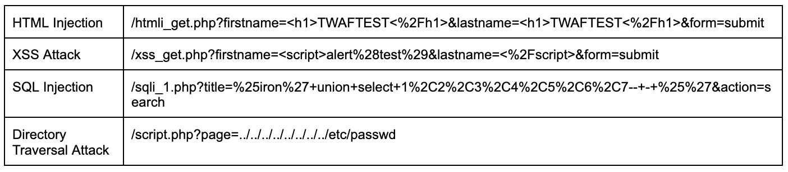
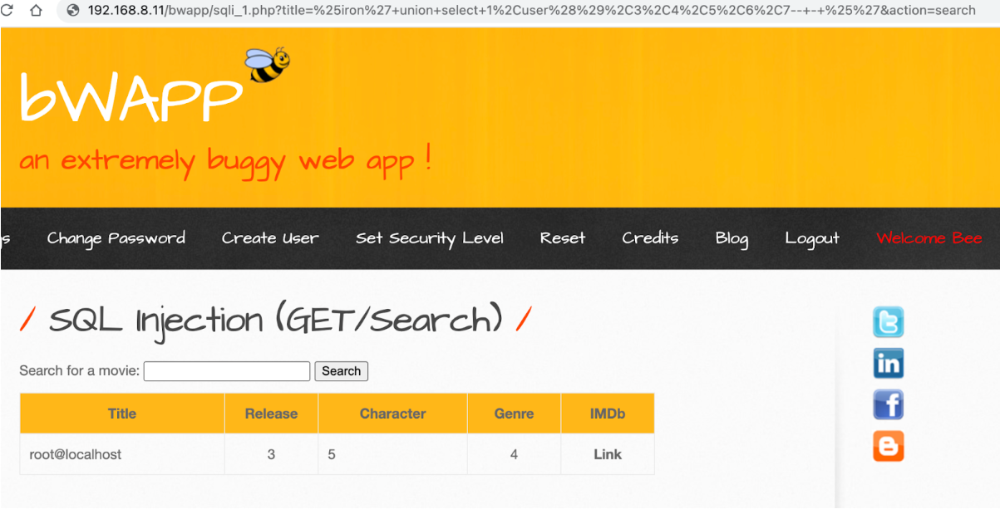

Source : [Hack The Box Academy - Network Log Analysis](https://academy.hackthebox.com/course/preview/network-log-analysis)

## Analyse des logs Web

- Les **web server logs** enregistrent les requêtes reçues par un serveur web.
- Serveurs courants :

```text
Microsoft IIS
Apache
Nginx
```


Même si leur format diffère, on retrouve généralement :

```text
Source IP
Timestamp
HTTP Method
Requested URI / URL
HTTP Version
Status Code
Response Size
Referer
User-Agent
```


Ils sont particulièrement utiles pour détecter :

- SQL Injection ;
- XSS ;
- Code / Command Injection ;
- Directory Traversal ;
- reconnaissance / scanning ;
- méthodes HTTP inhabituelles.

## Exemple de Web Log

```text
71.16.45.142 - - 12/Dec/2021:09:24:42 +0200
"GET /?id=SELECT+*+FROM+users HTTP/1.1"
200 486 "-"
"curl/7.72.0"
```


Décomposition :

```text
Source IP     → 71.16.45.142
Timestamp     → 12/Dec/2021 09:24:42 +0200
Method        → GET
URI           → /?id=SELECT+*+FROM+users
HTTP Version  → HTTP/1.1
Status        → 200
Response Size → 486 bytes
User-Agent    → curl/7.72.0
```


## HTTP Methods (web logs)

### GET

```text
GET
→ Retrieve resource / data
```


Exemple :

```text
GET /products?id=5
```


### POST

```text
POST
→ Submit data to server
```


Utilisé notamment pour :

- formulaires ;
- authentification ;
- upload ;
- API.

### PUT

```text
PUT
→ Create / Replace resource
```


Peut être intéressant en investigation si l’application ne devrait normalement pas permettre l’écriture.

### DELETE

```text
DELETE
→ Delete resource
```


Une utilisation depuis Internet peut être suspecte selon l’application.

### OPTIONS

```text
OPTIONS
→ Query allowed communication options / methods
```


Peut être utilisé légitimement, notamment avec CORS, mais également durant de la reconnaissance.

### Corps POST / PUT

Les web servers ne journalisent généralement pas par défaut le **request body** des requêtes POST/PUT.

```text
Web Log
→ Method + URI + Metadata

POST Body
→ Often not logged
```


Conséquence :

```text
POST /login
```


peut être visible sans que les données envoyées soient enregistrées.

Pour davantage de visibilité :

```text
WAF
Application Logs
Reverse Proxy
EDR
```


peuvent être nécessaires.

## Requested URL / URI

Le champ URI est essentiel car il peut contenir directement le payload.

Exemple :

```text
/?id=SELECT+*+FROM+users
```


peut indiquer une tentative de :

```text
SQL Injection
```


Rechercher notamment :

```text
UNION SELECT
OR 1=1
<script>
../
..\
%2e%2e
cmd=
exec=
```




### URL Encoding

Les payloads sont souvent **URL-encoded**.

Exemple :

```text
%27 → '
%20 ou + → espace
%2C → ,
%28 → (
%29 → )
%25 → %
```


Donc :

```text
Encoded URL
→ Decode
→ Analyze Payload
```


### Exemple SQL Injection

Requête :

```text
/bwapp/sqli_1.php?title=%25iron%27+union+select+1%2Cuser%28%29%2C3...
```


Après décodage :

```text
/bwapp/sqli_1.php?
title=%iron' union select 1,user(),3,4,5,6,7-- - %'
```


Indicators :

```text
UNION
SELECT
user()
--
```


→ pattern typique de SQL Injection.

## HTTP Status Codes (web logs)

Les status codes indiquent le résultat HTTP de la requête.

### 2xx — Success

```text
200 OK
```


→ requête traitée avec succès au niveau HTTP.

### 3xx — Redirection

```text
301
→ Permanent Redirect
```


### 4xx — Client Error

```text
403 → Forbidden
404 → Not Found
```


### 5xx — Server Error

```text
500 → Internal Server Error
503 → Service Unavailable
```


Catégories :

```text
1xx → Informational
2xx → Successful
3xx → Redirection
4xx → Client Error
5xx → Server Error
```


### ⚠️ Status Code ≠ succès de l’attaque

Ne pas lire directement :

```text
200 → Attack Successful
404 / 500 → Attack Failed
```


Plus précisément :

```text
200
→ HTTP request processed successfully
≠ exploit succeeded
```


Une application peut retourner `200` pour :

- page d’erreur custom ;
- requête rejetée au niveau applicatif ;
- tentative SQLi sans impact.

Inversement :

```text
500
→ server-side error
```


peut parfois justement indiquer qu’un payload a provoqué une erreur intéressante.

Donc :

```text
Attack Payload
+
HTTP Status
+
Response Body
+
Application / DB Logs
→ Determine Actual Impact
```


## User-Agent (web logs)

Le champ User-Agent indique le client **déclaré**.

Exemples :

```text
curl/7.72.0
Mozilla/5.0
Chrome/...
Nikto
```


Peut aider à distinguer :

- navigateur ;
- script ;
- scanner ;
- outil automatisé.

Mais :

```text
User-Agent
→ trivially spoofable
```


Donc :

```text
Mozilla/Chrome
≠ necessarily real human user
```


et :

```text
curl
≠ necessarily malicious
```


### Détection de scanners

User-Agents pouvant être associés à des outils automatisés :

```text
Nikto
Nmap
Nessus
curl
python-requests
```


Mais la détection doit également considérer :

- fréquence ;
- nombre d’URLs ;
- variété des payloads ;
- pattern temporel ;
- source IP.

```text
Many URLs
+
Many Methods
+
Many Attack Patterns
+
Short Time Window
→ Possible Automated Scan
```


## SQL Injection (web logs)

Patterns fréquents :

```text
UNION SELECT
SELECT ... FROM
OR 1=1
SLEEP()
CASE WHEN
information_schema
```


Exemple :

```text
?id=1' UNION SELECT username,password FROM users--
```


Workflow :

```text
Web Log
→ Decode URL
→ Identify SQL Tokens
→ Check Status
→ Check Response
→ Correlate DB / App Logs
```


## XSS (web logs)

Patterns possibles :

```text
<script>
javascript:
onerror=
onload=

```


Exemple :

```text
?q=<script>alert(1)</script>
```


## Directory Traversal (web logs)

Patterns :

```text
../
..\
%2e%2e%2f
```


Exemple :

```text
../../../../etc/passwd
```


Objectif :

```text
Escape intended directory
→ Access arbitrary file
```


## Code / Command Injection (web logs)

Patterns possibles :

```text
;
&&
|
$(...)
`command`
```


Exemple conceptuel :

```text
?host=127.0.0.1;whoami
```


## Suspicious HTTP Methods

Chercher des méthodes qui ne correspondent pas au comportement normal de l’application.

Exemple :

```text
Normal:
GET / POST

Observed:
PUT /shell.php
```


→ à investiguer.

Autre exemple :

```text
DELETE /api/users/1
```


sur une API qui ne devrait jamais permettre DELETE publiquement.

## Top Requesting IPs (web logs)

Les web logs permettent d’identifier :

```text
Which IP generates the most requests?
```


Un volume élevé peut correspondre à :

- bot ;
- crawler ;
- scanner ;
- brute force ;
- DoS ;
- activité légitime importante.

```text
Source IP
+
Request Rate
+
Requested URLs
→ Context
```


## Most Requested URLs (web logs)

Permet d’identifier les endpoints particulièrement ciblés.

Exemples :

```text
/login
/admin
/wp-login.php
/api/login
/.env
/phpmyadmin
```


Peut révéler :

- reconnaissance ;
- brute force ;
- exploitation ciblée ;
- recherche de fichiers sensibles.

## Exemple d’analyse SQL Injection

Log :

```text
192.168.8.54 - -
29/Jun/2022:07:42:48 +0300
"GET /bwapp/sqli_1.php?title=...union+select... HTTP/1.1"
200 13539
...
```


Indicateurs :

```text
Source:
192.168.8.54

Attack Pattern:
UNION SELECT

Target:
sqli_1.php

HTTP Status:
200
```


Le résultat affiché par l’application confirme que la requête a permis d’obtenir :

```text
root@localhost
```




Dans cet exemple précis :

```text
SQL Injection Attempt
+
HTTP 200
+
Database Information Returned
→ Successful SQL Injection
```


C’est la **preuve dans la réponse applicative**, et non le seul `200`, qui confirme ici l’exploitation.

## Web Server derrière WAF / IDS / Firewall

Si le serveur est derrière plusieurs contrôles :

```text
Internet
→ Firewall
→ IDS/IPS
→ WAF
→ Web Server
```


et qu’une requête malveillante apparaît dans le web log :

```text
Web Server Log
→ Request reached backend
```


Cela signifie qu’elle n’a pas été stoppée avant ce point.

Mais cela ne prouve toujours pas :

```text
Exploit Successful
```


Il faut poursuivre avec :

- application logs ;
- database logs ;
- EDR ;
- file system changes ;
- process creation.

## Corrélation WAF + Web Logs

Exemple :

```text
WAF
→ SQLi signature
→ action=Alert

Web Server
→ same request recorded

Application
→ database error / sensitive output
```


→ permet de reconstruire :

```text
Attack Attempt
→ Reached Backend
→ Application Impact
```


### Corrélation IDS/IPS + Web Logs

```text
IDS
→ exploit signature

Web Log
→ malicious request

Same Source
+
Same Timestamp
+
Same Target
→ Stronger Evidence
```


### Corrélation avec EDR (web logs)

Particulièrement importante pour les **command injection / RCE**.

Exemple :

```text
Web Log
→ suspicious command injection

EDR
→ web server process spawns cmd.exe
```


```text
w3wp.exe
apache.exe
nginx
php-cgi
        ↓
cmd.exe / powershell.exe
```


→ signal critique d’exploitation potentiellement réussie.

## Brute Force Web

Pattern :

```text
Same Source
→ POST /login
→ POST /login
→ POST /login
→ POST /login
```


Corréler :

- username ;
- status code ;
- response size ;
- session ;
- application logs.

```text
Many Login Attempts
+
Short Time Window
→ Possible Brute Force
```


## Response Size

Le nombre de bytes retournés peut aussi fournir du contexte.

Exemple :

```text
Normal Failed Login:
200 + 1,200 bytes

Successful Login:
302 + 300 bytes
```


ou :

```text
SQLi Error:
500 + 5,000 bytes
```


Des différences de taille peuvent aider à identifier des changements de comportement.

## Referer

De nombreux formats de web logs contiennent également :

```text
Referer
```


Il indique la page à partir de laquelle la requête semble provenir.

Utile pour :

- navigation ;
- reconstruction de session ;
- identification de certaines campagnes.

Mais :

```text
Referer
→ spoofable
```


## Timeline d’une attaque web

```text
10:01
GET /
→ reconnaissance

10:02
GET /admin
→ 404

10:03
GET /login
→ 200

10:04
GET /?id=' UNION SELECT...
→ SQLi attempt

10:05
POST /login
→ authentication activity

10:07
GET /shell.php
→ 200
```


Permet de reconstruire une progression possible :

```text
Reconnaissance
→ Vulnerability Discovery
→ Exploitation
→ Post-Exploitation
```


## Web Logs vs WAF Logs

```text
WAF Logs
→ security inspection
→ signature / policy / block decision

Web Logs
→ requests reaching the web server
→ server response
```


Donc :

```text
WAF
+
Web Server Logs
→ Better Web Attack Analysis
```


## Patterns SOC importants (web logs)

### SQL Injection

```text
UNION / SELECT / SQL syntax
+
Target Parameter
+
Response Analysis
→ SQLi Investigation
```


### Automated Scanning

```text
Same IP
+
Many URLs
+
Many 404
+
Suspicious User-Agent
→ Possible Scanner
```


### Directory Traversal

```text
../ / encoded traversal
+
Sensitive File Request
→ Investigate
```


### Suspicious PUT

```text
PUT
+
Executable / Script Extension
+
Public Web Path
→ High Priority
```


### Possible RCE

```text
Web Attack Payload
+
HTTP Request reached backend
+
Web Process spawns shell
→ Critical
```


## Vue d’ensemble (web logs)

```text
Web Log
│
├─ Source IP
├─ Timestamp
├─ HTTP Method
├─ URI / URL
├─ HTTP Version
├─ Status Code
├─ Response Size
├─ Referer
└─ User-Agent
```


Workflow SOC :

```text
Web Log
      ↓
Identify Source
      ↓
Decode URI
      ↓
Inspect Method + Payload
      ↓
Check Status Code
      ↓
Check Response Size / Context
      ↓
Correlate WAF / IDS
      ↓
Correlate Application / DB / EDR
      ↓
Attempt or Successful Exploitation?
```


Le point essentiel est que les web logs permettent de voir **exactement quelles requêtes ont atteint le serveur web**. L’URI et les paramètres révèlent souvent directement les payloads d’attaque, mais le status code seul ne permet pas de déterminer si l’exploitation a réussi : il faut corréler **la réponse, l’application et les événements système observés après la requête**.
