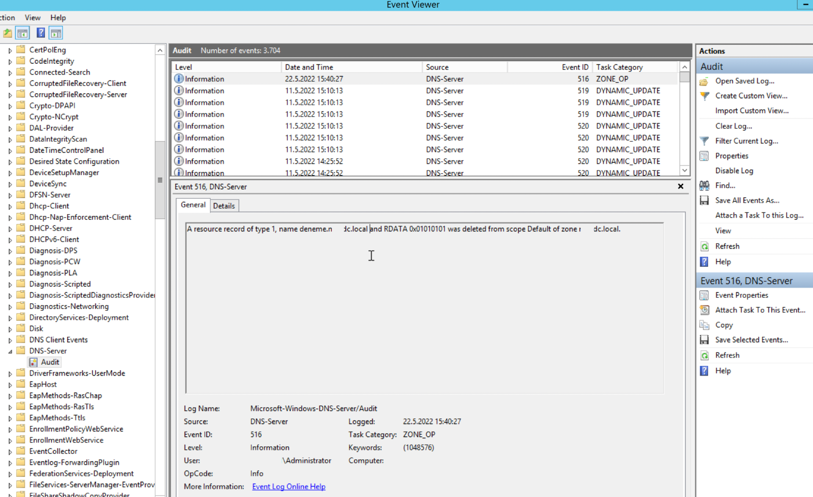
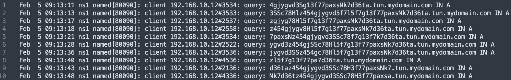

Source : [Hack The Box Academy - Network Log Analysis](https://academy.hackthebox.com/course/preview/network-log-analysis)

## Analyse des logs DNS

- **DNS — Domain Name System** traduit principalement les noms de domaine en adresses IP.

```text
google.com
→ DNS Resolution
→ IP Address
→ Network Connection
```


Pour un SOC, les DNS logs permettent surtout de savoir :

```text
Which host?
→ Queried which domain?
→ When?
→ Which record type?
→ What was the result?
```


Ils sont utiles pour détecter :

- communication avec des domaines malveillants ;
- C2 ;
- DNS tunneling ;
- exfiltration ;
- accès à des services inhabituels ;
- requêtes vers des domaines récemment/rarement observés ;
- contournement du DNS d’entreprise via DoH / DoT.

## Deux types de logs DNS

Du point de vue SOC :

```text
DNS Logs
│
├─ DNS Server Audit / Administrative Events
│  → modifications de configuration / records
│
└─ DNS Query Logs
   → domaines réellement interrogés
```


## DNS Server Audit Events

Sur un serveur DNS Windows :

```text
Applications and Services Logs
→ Microsoft
→ Windows
→ DNS-Server
→ Audit
```


Ces événements permettent de surveiller certaines opérations administratives :

- ajout d’un record ;
- modification ;
- suppression ;
- changement de zone / configuration.

Exemple du cours :

```text
Event ID 516
→ DNS record deleted
```




L’événement peut permettre de retrouver :

- record concerné ;
- zone DNS ;
- serveur ;
- acteur ayant effectué la modification.

### Intérêt sécurité des changements DNS

Une modification DNS non autorisée peut permettre :

```text
Legitimate Domain
→ Malicious IP
→ Traffic Redirected
```


ou :

```text
Record Creation
→ Malicious Infrastructure
```


À surveiller notamment :

- nouveaux records inattendus ;
- suppression de records critiques ;
- modification d’un record vers une IP inconnue ;
- changements effectués par un compte inhabituel.

## DNS Query Logs

Les query logs enregistrent les requêtes DNS reçues ou observées.

Ils ne sont pas nécessairement activés partout par défaut et leur collecte peut générer un volume important.

Sources possibles :

```text
Microsoft DNS
BIND
dnsmasq
Zeek
DNS Resolver
Network Sensor
Security Appliance
```


Deux approches principales :

```text
Client
→ DNS Server
→ DNS Query Logging
```


ou :

```text
Client → DNS Server
        ↑
   Network Sensor
      (Zeek)
```


### Exemple de DNS Query

```text
{
  "source_ip": "192.168.4.76",
  "source_port": 36844,
  "destination_ip": "192.168.4.1",
  "destination_port": 53,
  "protocol": "udp",
  "query": "testmyids.com",
  "qtype_name": "A"
}
```


Informations principales :

```text
Timestamp
Source IP / Port
DNS Server
Protocol
Query
Query Type
Response / Result
```


### Query Type

Le type de requête indique le record demandé.

Principaux types :

```text
A      → IPv4 address
AAAA   → IPv6 address
CNAME  → Alias
MX     → Mail server
NS     → Name server
TXT    → Text data
PTR    → Reverse DNS
```


Exemple :

```text
query="example.com"
qtype=A
```


→ recherche de l’adresse IPv4 de `example.com`.

### BIND : emplacement des query logs

On rencontre souvent :

```text
/var/log/querylog
```


> ⚠️ Ce chemin n’est pas un emplacement universel par défaut.

Avec BIND, le fichier dépend de la configuration `logging` définie dans `named.conf` et de la distribution.

```text
BIND
→ logging configuration
→ custom channel / file / syslog
```


Il faut donc vérifier la configuration du serveur concerné plutôt que supposer un chemin fixe.

## IOC — Indicator of Compromise

Un **IOC** est un artefact observable associé à une activité malveillante ou à une compromission.

Exemples :

```text
Malicious IP
Domain
URL
File Hash
Registry Artifact
Filename
```


Dans les DNS logs :

```text
Threat Intel IOC
→ malicious-domain.example

Search DNS Logs
→ Which hosts queried it?
```


Cela permet d’identifier rapidement les endpoints potentiellement concernés.

> Un IOC hit reste un signal à investiguer, pas une preuve suffisante de compromission à lui seul.

## Domain Reputation / Category

Lors d’une analyse DNS, examiner :

- réputation ;
- catégorie ;
- first seen ;
- fréquence ;
- asset source ;
- contexte métier.

```text
DNS Query
+
Rare Domain
+
Bad Reputation
+
Compromised Host
→ Strong Signal
```


### First-Seen Domains

Une requête vers un domaine jamais observé auparavant peut être intéressante.

```text
Known Server
→ First-Time Domain
→ Investigate
```


Particulièrement pour :

- serveurs ;
- appliances ;
- databases ;
- équipements réseau.

Ces systèmes ont souvent un comportement DNS relativement stable.

```text
Stable Asset
+
New Destination
→ Higher Analytical Value
```


## Exemple : serveur Oracle

Logs :

```text
192.168.10.3
→ login.microsoftonline.com

192.168.10.3
→ onedrive.live.com
```


Les domaines Microsoft sont légitimes.

Mais :

```text
Legitimate Domain
≠ Legitimate Activity
```


Si `192.168.10.3` est un serveur Oracle ne devant normalement pas utiliser OneDrive :

```text
Oracle DB Server
+
OneDrive / Microsoft Cloud Query
+
No Business Justification
→ Suspicious
```


Possibilités :

- malware ;
- data staging ;
- exfiltration ;
- outil administrateur inattendu ;
- changement légitime de configuration.

### Asset Context

Le contexte de l’asset est essentiel :

```text
User Workstation
→ onedrive.live.com
→ probablement normal

Database Server
→ onedrive.live.com
→ beaucoup plus intéressant
```


Il faut connaître :

- rôle de l’hôte ;
- destinations autorisées ;
- baseline ;
- logiciels installés ;
- comportement habituel.

## Domain IOC Detection

Workflow :

```text
Threat Intelligence
→ malicious.example

DNS Search
→ Hosts querying domain

Affected Hosts
→ EDR / Proxy / Firewall investigation
```


Corrélation :

```text
DNS
→ domain queried

Proxy
→ URL requested

Firewall / NetFlow
→ connection established

EDR
→ initiating process
```


## DNS Tunneling

Le DNS peut être détourné comme canal **C2** ou d’**exfiltration**.

Principe :

```text
Compromised Host
→ Encoded Data
→ DNS Subdomain
→ Attacker-controlled DNS
```


Exemple conceptuel :

```text
aGVsbG8x.attacker.com
aGVsbG8y.attacker.com
aGVsbG8z.attacker.com
```


Les données sont transportées dans les labels DNS.

### Indicators de DNS Tunneling

Chercher :

- subdomains très longs ;
- forte entropie ;
- nombreux labels aléatoires ;
- grand nombre de requêtes ;
- domaine parent identique ;
- fréquence régulière ;
- types de records inhabituels ;
- volume DNS anormal.

```text
Random-looking Subdomains
+
Same Parent Domain
+
High Frequency
→ Possible DNS Tunneling
```


Exemple du cours :

```text
192.168.10.12
→ random1.example.com
→ a8fj3k.example.com
→ p92ks0.example.com
→ ...
```


sur une courte période.



→ nécessite une investigation endpoint.

### Long Domains / Subdomains

Une longueur inhabituelle peut être un signal :

```text
normal.example.com

vs

ajd83jd92jd82jd92jd92jd9.example.com
```


Mais :

```text
Long Domain
≠ DNS Tunneling
```


Certains services légitimes utilisent :

- tracking IDs ;
- CDN ;
- cloud services ;
- telemetry ;
- validation tokens.

Il faut donc combiner :

```text
Length
+
Entropy
+
Frequency
+
Asset Context
+
Destination Reputation
```


## NXDOMAIN

`NXDOMAIN` signifie que le nom demandé n’existe pas.

Un volume important peut révéler :

- typo / mauvaise configuration ;
- malware ;
- Domain Generation Algorithm ;
- scanning ;
- infrastructure C2 indisponible.

```text
Host
→ abc123.example
→ NXDOMAIN

→ ksd921.example
→ NXDOMAIN

→ md82ks.example
→ NXDOMAIN
```


Pattern :

```text
Many Random Domains
+
Many NXDOMAIN
→ Possible DGA Malware
```


### DGA — Domain Generation Algorithm

Certains malwares génèrent automatiquement de nombreux domaines :

```text
Malware
→ Generate Domains
→ Query One After Another
→ Find Active C2
```


Exemple :

```text
ajskd92.com
pqow81.net
mxz19.org
```


Donc :

```text
High NXDOMAIN Rate
+
Random-looking Domains
+
Same Host
→ Possible DGA
```


## SolarWinds / SUNBURST

Avec **SUNBURST**, les DNS logs pouvaient révéler des domaines liés à l’infrastructure malveillante.

Principe analytique :

```text
Known Malicious Domain
→ Search Historical DNS
→ Identify Hosts
→ Reconstruct Timeline
```


Les DNS logs sont particulièrement utiles pour la **retro-hunting** après découverte de nouveaux IOC.

## DNS over HTTPS — DoH

DoH transporte les requêtes DNS via :

```text
HTTPS
→ TCP/443
```


Au lieu de :

```text
DNS classique
→ UDP/TCP 53
```


Conséquence :

```text
Endpoint
→ External DoH Resolver
→ DNS Query hidden inside HTTPS
```


Cela peut permettre de contourner :

- DNS resolver interne ;
- DNS logging centralisé ;
- DNS filtering.

## DNS over TLS — DoT

DoT transporte DNS dans TLS, généralement :

```text
TCP/853
```


```text
Endpoint
→ External DoT Resolver
→ TCP/853
```


Une organisation qui impose son propre DNS peut considérer une utilisation externe de DoH/DoT comme suspecte.

### ⚠️ Détecter DoH / DoT

Les query logs DNS internes ne suffisent pas toujours.

Si un endpoint utilise directement un resolver DoH externe :

```text
Endpoint
→ HTTPS/443
→ DoH Provider
```


le resolver DNS interne peut **ne rien voir du tout**.

Il faut donc corréler avec :

```text
Firewall
Proxy
NetFlow
EDR
TLS Metadata
```


## Cloud Storage / Data Exfiltration

Rechercher également l’accès à des services tels que :

```text
Google Drive
OneDrive
Dropbox
```


dans un contexte de fuite de données.

Mais :

```text
DNS Query to OneDrive
≠ Data Exfiltration
```


DNS prouve essentiellement :

```text
Host showed interest in / resolved domain
```


Pour prouver un transfert :

```text
DNS
+
Proxy
+
NetFlow / Firewall
+
EDR
→ Better Evidence
```


## Corrélation DNS + Proxy

```text
DNS
→ evil.example resolved

Proxy
→ https://evil.example/payload.exe

EDR
→ powershell.exe initiated request
```


→ permet de relier :

```text
Name Resolution
→ Web Request
→ Process
```


### Corrélation DNS + NetFlow

```text
DNS
→ evil.example → 185.x.x.x

NetFlow
→ HOST-A → 185.x.x.x:443
```


Permet de relier :

```text
Domain
→ IP
→ Network Connection
```


### Corrélation DNS + EDR

Pour une activité de tunneling :

```text
DNS
→ thousands of encoded subdomains

EDR
→ suspicious.exe
→ initiates DNS traffic
```


→ beaucoup plus significatif.

Le processus initiateur permet de distinguer :

```text
browser.exe
vs
unknown.exe
```


## Patterns SOC importants (DNS)

### Malicious Domain

```text
DNS Query
+
Known IOC Domain
→ Identify Source Host
→ Investigate
```


### DGA

```text
Many Random Domains
+
High NXDOMAIN Ratio
+
Same Source
→ Possible DGA Malware
```


### DNS Tunneling

```text
Long / High-Entropy Subdomains
+
Same Parent Domain
+
High Query Volume
→ Possible DNS Tunneling
```


### Unexpected Cloud Service

```text
Server
+
OneDrive / Google Drive DNS Queries
+
No Business Need
→ Investigate
```


### DoH / DoT

```text
Endpoint
→ External DNS Resolver
→ DoH/443 or DoT/853
+
Policy Violation
→ Possible DNS Visibility Bypass
```


## Vue d’ensemble (DNS)

```text
DNS Analysis
│
├─ DNS Server Audit
│  ├─ Record Created
│  ├─ Record Modified
│  └─ Record Deleted
│
└─ DNS Queries
   ├─ Timestamp
   ├─ Source IP
   ├─ DNS Server
   ├─ Query
   ├─ Query Type
   └─ Response / Result
```


Workflow SOC :

```text
DNS Event
      ↓
Identify Source Host
      ↓
Inspect Queried Domain
      ↓
Reputation / Category / First-Seen?
      ↓
Check Query Pattern
      ↓
NXDOMAIN / DGA / Tunneling?
      ↓
Check Asset Role
      ↓
Correlate Proxy / Firewall / NetFlow / EDR
      ↓
Determine Intent & Impact
```


Le point essentiel est que les DNS logs donnent une excellente visibilité sur **l’intention de communication d’un système** avant même la connexion réseau elle-même. Ils sont particulièrement efficaces pour le `IOC hunting`, la détection de `DGA`, de `DNS tunneling` et de destinations inhabituelles, mais une requête DNS seule ne prouve généralement ni qu’une connexion a ensuite été établie, ni qu’une exfiltration ou une compromission a réellement eu lieu.
