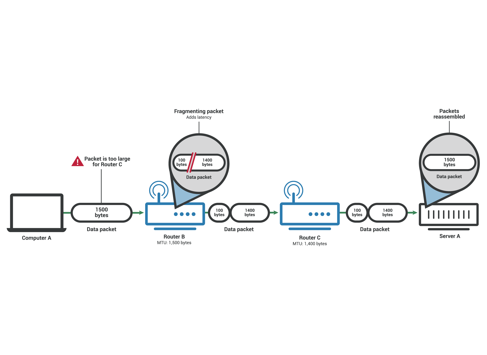
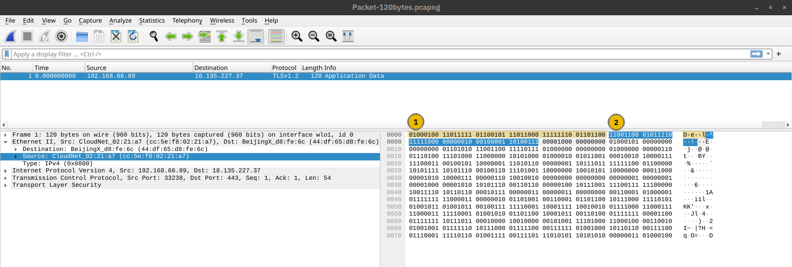
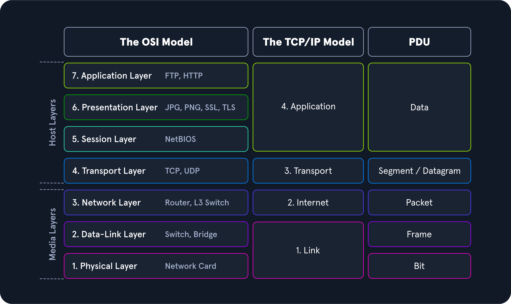
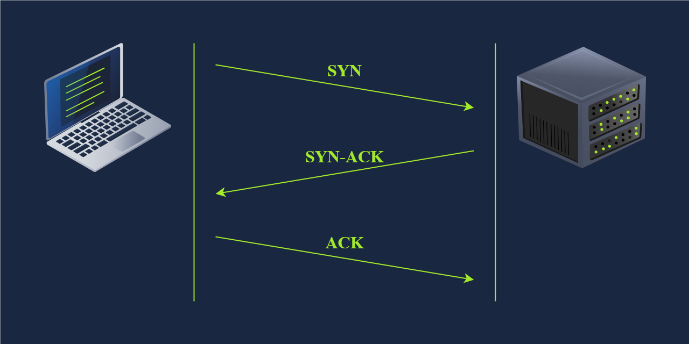
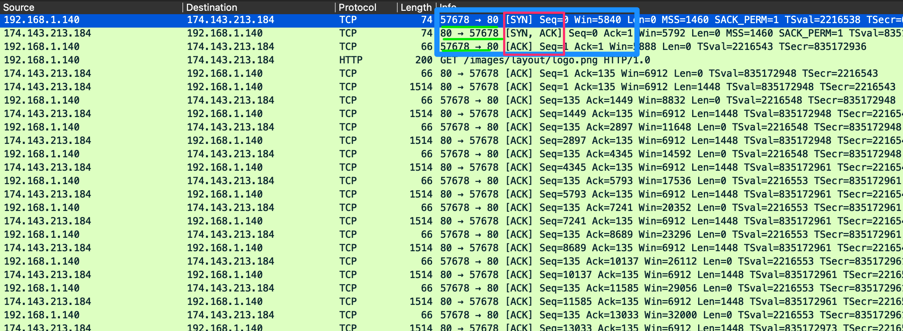
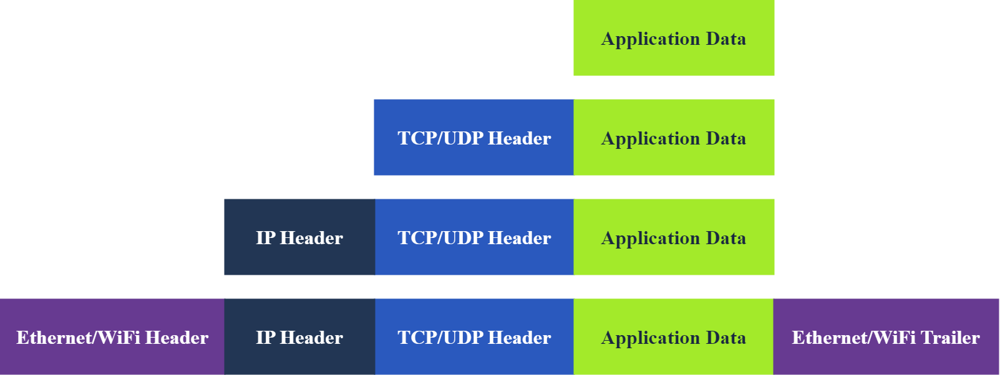

## Concepts généraux [TTL, Checksum, Loopback, Table routage, Adressage…]

<details markdown="1">
<summary>🔸 Réseau</summary>

> Ensemble d'appareils interconnectés qui peuvent communiquer entre-eux.

<details markdown="1">
<summary>▫️ Types de réseaux</summary>

<details markdown="1">
<summary>• LAN (Local Area Network)</summary>

> Connecte des appareils sur une courte distance, comme home, école, entreprise.

</details>

<details markdown="1">
<summary>• WAN (Wide Area Network)</summary>

> Couvre large zone géographique et peu couvrir plusieurs LAN.

</details>

<details markdown="1">
<summary>• Fonctionnement entre LAN & WAN</summary>

> LAN peuvent se connecter aux WAN pour accroître la portée. Il se connecte au WAN du FAI.

</details>

</details>

</details>

<details markdown="1">
<summary>🔸 Table de routage</summary>

> Une table qui indique à une machine **par où envoyer les paquets IP** en fonction de leur destination.

> > > - **Contenu typique :** adresses de destination, masque, passerelle (gateway), interface de sortie, métrique (priorité).
> > > - **Exemple (Linux `ip route show`):**
            
> > > ```
> > > default via 192.168.1.1 dev eth0
> > > 192.168.1.0/24 dev eth0 proto kernel scope link src 192.168.1.10
            
> > > ```
            
> > > → Tout le trafic inconnu (`default`) part vers la gateway 192.168.1.1.
            
> > > - **Table ARP** = Relation entre une adresse IP et une adresse MAC
> > > - **Table CAM** = Relation entre une adresse MAC et un numéro de port
> > > - ARP : Protocole qui permet de traduire une **adresse IP → adresse MAC** (nécessaire pour l’envoi sur un réseau Ethernet).
> > > - **Fonctionnement :**
> > > 1. La machine veut joindre `192.168.1.20`.
> > > 2. Elle envoie une requête ARP : “Qui a 192.168.1.20 ?”
> > > 3. La machine qui possède cette IP répond avec sa MAC.
> > > - Table ARP
> > > - **Qu’est-ce que c’est ?**
                
> > > Cache local qui associe les adresses IP connues aux adresses MAC correspondantes.
                
> > > - **Commande pour voir la table :**
> > > - Linux : `arp -n` ou `ip neigh`
> > > - Windows : `arp -a`
> > > - **Exemple :**
                
> > > ```
> > > 192.168.1.1   00:14:22:01:23:45   eth0
> > > 192.168.1.20  00:16:3e:11:22:33   eth0
                
> > > ```
                
</details>

<details markdown="1">
<summary>🔸 Loopback</summary>

> Interface virtuelle qui renvoie directement vers la machine elle-même.

> > > - **Adresse la plus connue :** `127.0.0.1` (ou `::1` en IPv6).
> > > - **Utilité :** tester des services locaux, communication interne sans passer par le réseau physique.
</details>

<details markdown="1">
<summary>🔸 Gateway (Passerelle par défaut)</summary>

> Equipement réseau par lequel une machine envoie le trafic destiné à **réseau externe**.

> > > - **Exemple :**
> > > - PC : IP `192.168.1.10`
<details markdown="1">
<summary>• Gateway (routeur Internet)</summary>

> `192.168.1.1`

                
> > > > → Tout ce qui n’est pas dans le LAN est envoyé à `192.168.1.1`.
                
        
</details>

</details>

<details markdown="1">
<summary>🔸 Adressage (L2</summary>

> MAC,L3:IP,L4:Port, multiplexage)

<details markdown="1">
<summary>▫️ Adressage à chaque couche</summary>

> > > > - L2 : MAC (48 bits, unique par interface, gravée en usine) - Portée locale (un seul segment du réseau, pas de routage)
> > > > - L3 : IP (32 bits en IPv4, 128 bits en IPv6) - portée globale (routage entre réseau)
> > > > - L4 : Port 16 bits, 0-65535) - Identifie application sur la machine
</details>

<details markdown="1">
<summary>▫️ Plusieurs niveaux d’adressage</summary>

> > > > - MAC : communication sur lien physique direct (switch, même VLAN). Switch utilise table CAM pour aiguiller trames.
> > > > - IP : routage entre réseaux différents. Routeurs lisent IP dest et consultent table de routage.
<details markdown="1">
<summary>• Port</summary>

> multiplexage applicatif. Une même IP peut héberger web (80), SSH (22), DNS (53), simultanément

> > > > > - TTL : Indique nombre maximal de routeurs pas lesquels paquet peut transiter avant abandon.
> > > > > - Permet de limiter la durée de vie d’un paquet sur le réseau en empêchant qu’il tourne indéfiniment. A chaque passage sur routeur TTL décrémenté de 1.
</details>

</details>

<details markdown="1">
<summary>▫️ Quand TTL atteint 0</summary>

<details markdown="1">
<summary>• Routeur jette le paquet et renvoie un ICMP Time Exceeded à l’émetteur.</summary>

</details>

</details>

<details markdown="1">
<summary>▫️ TTL initial dépend de l’OS</summary>

> 64 Linux/macOS, 128 Windows, 255 (équipements réseau Cisco)

> > > > - traceroute : exploite ça : envoie paquets avec TTL croissant pour découvrir chemin
        
</details>

<details markdown="1">
<summary>▫️ Estimer le nombre de hops “retour”</summary>

        
</details>

<details markdown="1">
<summary>▫️ Si ping affiche ttl=117. Ce TTL correspond au chemin retour.</summary>

        
> > > > Les systèmes initient souvent TTL à une valeur “standard” :
        
> > > > - **64** (Linux/Unix/Mac très souvent)
> > > > - **128** (Windows souvent, certains serveurs / stacks)
> > > > - **255** (routeurs/équipements réseau)
        
> > > > Ici, tu reçois `ttl=117` :
        
> > > > - si l’initial TTL était **128**, alors hops ≈ **128 − 117 = 11**
> > > > - si l’initial TTL était **64**, impossible (tu ne peux pas recevoir 117 > 64)
        
> > > > Donc, suggère que **rép part avec TTL initial de 128**, donc **environ 11 routeurs sur chemin retour**.
        
> > > > - MTU : Taille maximale d’un paquet en une seule trame sans fragmentation (1500 Ethernet)
</details>

<details markdown="1">
<summary>▫️ Mesure représentant le paquet de données le plus volumineux que peut accepter un appareil connecté au réseau.</summary>

</details>

<details markdown="1">
<summary>▫️ Les paquets de données qui dépassent MTU sont fragmentés en plus petites partiespour pouvoir passer, réassemblés une fois arrivés à destination.</summary>

        
> > > > 
        
</details>

<details markdown="1">
<summary>▫️ Flag Don’t Fragment</summary>

> Option indicant que le paquet ne peut pas être fragmenté et donc peut potentiellement être rejetté. Reçoit msg icmp pour dire que trop gros.

</details>

<details markdown="1">
<summary>▫️ PMTUd</summary>

> Path MTU Discovery : Technique permettant de déterminer MTU de tous appareils, routeurs et commutateurs sur un chemin réseau.

<details markdown="1">
<summary>• IPv4</summary>

> Autorise fragmentation et inclut flag DF dans en-tête. PMTUd envoie paqeuts de test le long du chemin avec flag DF activé, si dispositif rejette, renvoie msg ICMP avec son MTU. Dispositif de source abaisse sont MTU et envoie d’autre paquets de tests jusqu’à que ce soit OK.

</details>

<details markdown="1">
<summary>• IPv6</summary>

> N’autorise pas fragmentation et donc n’a pas de flag DF. PMTUd en IPv6 envoie paquets de tests de plus en plus petits jusqu’à ce qu’ils puissent parcourir tout le chemin réseau.

> > > > > - MSS : Taille maximum de segment, utilisé par TCP au niveau de la couche 4? S’intéresse qu’à la taille du payload dans paquet. Calculé en soustrayant longueur des en-têtes TCP et des en-têtes IP du MTU. Paquets MSS sont tjrs rejetés si dépassent.
</details>

</details>

</details>

<details markdown="1">
<summary>🔸 Fragmentation IP (Lien avec MTU)</summary>

<details markdown="1">
<summary>▫️ Si paquet IP trop gros pour le lien (MTU = 1500 Ethernet), il est fragmenté en plusieurs paquets plus petits</summary>

</details>

<details markdown="1">
<summary>▫️ Chaque fragment a même ID, mais offset différent</summary>

</details>

<details markdown="1">
<summary>▫️ Réassemblage se fait uniquement à destination (pas sur routeurs intermédiaires)</summary>

</details>

<details markdown="1">
<summary>▫️ Flag "Don't Fragment" (DF)</summary>

> si activé et paquet trop gros, le routeur envoie ICMP "Fragmentation Needed" et détruit le paquet (utilisé par PMTUD - Path MTU Discovery).

</details>

</details>

<details markdown="1">
<summary>🔸 Checksum</summary>

> Somme de contrôle

<details markdown="1">
<summary>▫️ IP checksum</summary>

> Vérifie uniquement intégrité du header IP (pas les données)

</details>

<details markdown="1">
<summary>▫️ TCP/UDP checksum</summary>

> vérifie header + données

</details>

<details markdown="1">
<summary>▫️ FCS Ethernet vérifie toute la trame</summary>

</details>

<details markdown="1">
<summary>▫️ Si checksum invalide, paquet est silencieusement détruit (aucune notif)</summary>

</details>

</details>

<details markdown="1">
<summary>🔸 VLSM</summary>

> Permettre d’utiliser des masques de taille variable pour optimiser l’usage des adresses lorsque besoin différents par sous-réseau (un avec 100 hôtes, un avec 50…)

</details>

## Modèle OSI

> Modèle conceptuel décrit théoriquement la communication des réseaux.

<details markdown="1">
<summary>🔸 1. Physique</summary>

> Connexion physique entre appareils transmet signal

> > > - Responsable de la transmission des courants de bits bruts sur un medium physique. Traite de la connexion physique entre les appareils.
> > > - Ex : Câble Ethernet, fibre optique
</details>

<details markdown="1">
<summary>🔸 2. Liaison</summary>

> Envoi donnée entre deux nœuds même segment réseau

<details markdown="1">
<summary>▫️ Décrit un accord entre différents systèmes d’un même segment de réseau pour communiquer. Garantir que les trames de données sont transmises.</summary>

<details markdown="1">
<summary>• Segment de réseau</summary>

> groupe d’appareils utilisant un support/canal partagé pour transfert d’info

> > > > > - Ex : Switches, MAC pour identifier appareils…
</details>

</details>

<details markdown="1">
<summary>▫️ Deux adresses MAC dans chaque trame</summary>

        
> > > > 
        
> > > > L'adresse de liaison de données de destination (adresse MAC) surlignée en jaune
> > > > L'adresse de liaison de données source (adresse MAC) est surlignée en bleu
> > > > Les bits restants montrent les données envoyées
        
</details>

</details>

<details markdown="1">
<summary>🔸 3. Réseau</summary>

> Envoie de données entre différents réseaux

> > > - Gère le transfert de paquets, y compris le routage des paquets via routeurs pour atteindre destination. Responsable de l'adresse logique et de la détermination du chemin.
> > > - Ex : Routeurs, Protocole IP, ICMP, VPN, IPSec. Entreprise, bureaux repartis dans plusieurs villes, 3 : chargée de co différents bureaux entre eux
</details>

<details markdown="1">
<summary>🔸 4. Transport</summary>

> Communication entre applis en cours sur différents hôtes

> > > - Services de communication pour apps. Responsable de la livraison de données, contrôle de flux et vérif des erreurs. Navigateur Web est connecté au serveur Web TryHackMe via la couche Transport.
> > > - Ex : TCP/UDP
> > > - TCP offre une transmission fiable et orientée connexion avec une récupération d'erreur, tandis que UDP fournit une communication plus rapide et sans connexion sans livraison garantie.
</details>

<details markdown="1">
<summary>🔸 5. Session</summary>

> Etabli, maintien, synchro des communications entre appli exécutées sur différents hôtes

> > > - Gère sessions entre applications. Établit, maintient et met fin aux connexions, permettant aux appareils de contenir des communications continues appelées sessions.
<details markdown="1">
<summary>• Etablir une session = Initier communication entre appli & négocier paramètres pour session.</summary>

> > > > - Ex : NFS, RPC
</details>

</details>

<details markdown="1">
<summary>🔸 6. Présentation</summary>

> Garantit données transmises sous forme compréhensible par couche Application

<details markdown="1">
<summary>▫️ Agit comme traducteur entre la couche d'application et le format réseau. Comprend le chiffrement et le déchiffrement des données, compression des données et la conversion des formats de données</summary>

> > > > - Ex : Codage (ASCII ou Unicode), compression et chiffrement données.
</details>

</details>

<details markdown="1">
<summary>🔸 7. Application</summary>

> Services réseau appli des users finaux

<details markdown="1">
<summary>▫️ Fournit des services réseau directement aux applications d'utilisateur final. Partage des ressources, accès à des fichiers à distance et d'autres services réseau, sert d'interface entre le réseau et le logiciel d'application.</summary>

</details>

<details markdown="1">
<summary>▫️ Navigateur utilise HTTP pour demander fichier, soumettre formulaire, ou DL fichier</summary>

> > > > - Ex : HTTP pour la navigation Web, FTP, SMTP pour la transmission de messagerie., DNS, POP3…
    
> > > > | Numéro de couche | Fonction principale | Proto/Equips | PDU | Exemple concret |
> > > > | --- | --- | --- | --- | --- |
> > > > | 7 - Application | Fournir des services et des interfaces aux applications | HTTP, FTP, DNS, POP3, SMTP , IMAP | Data | Navigateur génère requête `GET / HTTP/1.1` |
> > > > | 6 - Présentation | Codage, cryptage et compression des données | Formats de fichiers Unicode, MIME , JPEG, MPEG, SSL/TLS, ASCII | Data | Conversion requête format transmissible, chiffrement TLS si HTTPS |
> > > > | 5 - Session | Établir, maintenir et synchroniser des sessions | NFS, RPC, Netbios, SOCKS | Data | Etablissement session SSL/TLS, gestion tokens d’authent |
> > > > | 4 - Transport | Communication de bout en bout et segmentation des données | Protocole UDP, TCP | Segment (TCP) / Datagram (UDP) | Ajout `header TCP` : ports source (ex:54321), port dest (ex:443), numéros de séquences, flags SYN, window size |
> > > > | 3 - Réseau | Adressage logique et routage entre réseaux | IP, ICMP, IPSec. Routeur, L3 Switch | Paquet (Packet) | Ajout `header IP` : IP source, IP dest, TTL, protocole=6 (TCP) |
> > > > | 2 - Liaison de données (Data Link) | Transfert de données fiable entre nœuds adjacents | Ethernet (802.3), Wi-Fi (802.11). Switch, Bridget, NIC | Trame (Frame) | Ajout `header Ethernet` : MAC Source, MAC dest, EtherType 0x0800 (IPv4), trailer FCS (checksum) |
> > > > | 1 - Physique | Supports de transmission de données physiques | Signaux électriques, optiques et sans fil. Câbles, hub… | Bit | Conversion trame en signaux élect transmis sur le câble ou ondes WIFi |
</details>

</details>

<details markdown="1">
<summary>🔸 Vocabulaire</summary>

<details markdown="1">
<summary>▫️ Header</summary>

> en-tête ajouté par une couche (contient metadata de contrôle)

</details>

<details markdown="1">
<summary>▫️ Trailer</summary>

> remoque ajoutée à la fin (ex : FCS en couche 2)

</details>

<details markdown="1">
<summary>▫️ Payload</summary>

> données utilses transportées

> > > > - Exemple : Envoyer un fichier
> > > > - Couche d'application initie la demande de transfert de fichiers > couche de présentation chiffre fichier pour assurer sa sécurité pendant la transmission. La couche session établit une session de communication avec dispositif de réception > couche de transport, le fichier est décomposé en segments pour assurer transmission sans erreur. La couche de réseau prend le relais pour déterminer la meilleure voie pour transférer les données sur le réseau > la couche de liaison de données encapsule les données dans les frames, en les préparant pour la livraison de nœud à nœud. Enfin, la couche physique gère la transmission réelle des bits sur le milieu physique, terminant le processus.
            
> > > > 
            
</details>

</details>

## Modèle TCP/IP

> Modèle de représentation adapté à une implémentation pratique.

<details markdown="1">
<summary>🔸 Couche Liaison</summary>

> Responsable de la gestion des aspects physiques du hardware réseau et des médias. Couche 2.

> > > - Ex : Ethernet, Wi-Fi.
</details>

<details markdown="1">
<summary>🔸 Couche Internet</summary>

> Gère l'adresse logique des appareils et le routage des paquets sur les réseaux.  Couche 3 Réseau ici appelé Couche Internet.

> > > - Ex : IP, ICMP, garantissant que les données atteignent destination prévue en déterminant des chemins logiques.
</details>

<details markdown="1">
<summary>🔸 Couche Transport</summary>

> Services de communication. Couche 4.

> > > - Ex : TCP, UDP. Garantit que les paquets de données sont livrés de manière séquentielle et sans erreur.
</details>

<details markdown="1">
<summary>🔸 Couche d'Application</summary>

> Contient protocoles qui offrent services de communication de données spécifiques aux applications. Regroupe couche Application, Présentation, Session.

> > > - Ex : HTTP, FTP, SMTP.
</details>

<details markdown="1">
<summary>🔸 Exemple de fonctionnement</summary>

> > > - La couche d'application, navigateur utilise HTTP pour demander page Web. Cette demande se déplace ensuite vers la couche de transport, où TCP garantit que données sont transférées de manière fiable. Couche Internet entre en jeu ensuite, IP prenant en charge le acheminant les paquets de données de notre appareil vers le serveur Web. Enfin, sur la couche d'interface réseau, les données sont transmises physiquement sur le réseau, terminant la connexion qui nous permet de visualiser le site Web.
            
> > > 
            
> > > | Couche TCP/IP | Équivalent OSI | Rôle | Protocoles |
> > > | --- | --- | --- | --- |
> > > | **1. Accès réseau (Link)** | Physique + Liaison | Accès au medium physique et encapsulation locale | Ethernet, Wi-Fi, ARP |
> > > | **2. Internet** | Réseau | Routage inter-réseaux, adressage IP | IP, ICMP, ARP (parfois classé ici) |
> > > | **3. Transport** | Transport | Livraison end-to-end, ports | TCP, UDP |
> > > | **4. Application** | Session + Présentation + Application | Services utilisateur | HTTP, DNS, SMTP, FTP, SSH |
        
<details markdown="1">
<summary>▫️ Notion Protocole IP</summary>

        
> > > > - **TCP** est le protocole IP numéro **6**.
> > > > - **UDP** est le protocole IP numéro **17**.
> > > > - **ICMP** (le Ping) est le protocole IP numéro **1**.
> > > > - **ESP** est le protocole IP numéro **50**.
</details>

</details>

## UDP & TCP

> Protocole de communication

> > - UDP : Protocole sans connexion, aucune garantie de réception.
<details markdown="1">
<summary>▫️ Fonctionne au niveau de la couche 4 Transport</summary>

> > > - Sans garantit de livraison
> > > - Meilleure vitesse
> > > - TCP : Protocole orienté connexion, assure livraison.
</details>

<details markdown="1">
<summary>▫️ Fonctionne au niveau de la couche 4 Transport</summary>

</details>

<details markdown="1">
<summary>▫️ Chaque octet de données possède numéro de séquence</summary>

> > > - Permet identifier paquet perdus ou dupliqués
<details markdown="1">
<summary>• Récepteur, accuse réception grâce numéro d’accusé réception spécifiant dernier octet reçu</summary>

</details>

</details>

<details markdown="1">
<summary>▫️ Three way handshake</summary>

> > > 1. SYN : Client initie co en envoyant paquet SYN au serveur. Paquet contient numéro de séquence initial choisi au hasard par client.
> > > 2. SYN-ACK : Serveur rép avec paquet SYN-ACK, ajoute le numéro de séquence initial choisi aléatoirement par le serveur.
> > > 3. ACK : Négociation terminée qd client envoie paquet ACK pour accuser réception du SYN-ACK.
        
> > > 
        
> > > 
        
</details>

<details markdown="1">
<summary>▫️ Fin propre d’une session</summary>

> FIN,ACK → FIN,ACK → ACK

            
> > > 
            
        
> > > **Flags TCP :** L'état de la connexion.
        
> > > - `[S]` = SYN (Début)
> > > - `[.]` = ACK (Acquittement)
> > > - `[P]` = PUSH (Envoi de données)
> > > - `[F]` = FIN (Fin)
> > > - `[R]` = RST (Reset/Coupure brutale - **Souvent suspect !**)
</details>

<details markdown="1">
<summary>🔸 Port</summary>

> Permet d’identifier le processus d’initiation.

</details>

## PDU & Header/Payload

<details markdown="1">
<summary>🔸 Pour Ethernet, le payload = ce que transporte Ethernet (souvent paquet IP)</summary>

</details>

<details markdown="1">
<summary>🔸 Pour IP, le payload = ce que transporte IP (TCP,UDP, ICMP…)</summary>

</details>

<details markdown="1">
<summary>🔸 Pour TCP, le payload = données applicatives (HTTP, SMB, DNS…)</summary>

</details>

## Encapsulation

> Processus chaque couche ajoute en-tête (header) autour des données de la précédentes, à unité de données reçue et envoie unité “encapsulée” à couche inférieure

    
> > Permet à chaque couche de se concentrer sur fonction prévue
    
<details markdown="1">
<summary>🔸 PDU (Protocol Data Unit)</summary>

> Nom du paquet à une couche donnée

</details>

<details markdown="1">
<summary>🔸 Données d’application > Couche Transport ajoute en-tête TCP ou UDP pour créer segment TCP ou datagram UDP > Couche Réseau ajoute header IP pour paquet IP pouvant acheminer sur internet > Ajoute header & trailer pour trame Wifi ou Ethernet à la couche Liaison</summary>

        
> > > 
        
> > > 
        
    
</details>

<details markdown="1">
<summary>🔸 Encapsulation (envoi)</summary>

    
> > > 1. Couche 5-6-7 : L’app produit données (ex : requête HTTP), possible formatage/chiffrement applicatif, remise couche transport
> > > 2. Couche 4 (TCP/UDP) : Création segment/datagramme (ports sources/dest, num séquence/ACK si TCP), ajout header TCP/UDP, calcul checksum
> > > 3. Couche 3 (IP) : Création paquet IP (IP source/dest, TTL, protocole = TCP/UDP, choix next-hop via table routage, ajout header IP
> > > 4. Couche 2 (Ethernet/Wi-Fi) : Création trame (MAC source/dest = hôte/routeur next-hop, EtherType) ajouter header L2, calcul FCS, ajout trailer
> > > 5. Couche 1 (Physique) : Conversion en signaux bits et émission sur média (câble/ondes)
    
> > > 
    
</details>

<details markdown="1">
<summary>🔸 Contenu de chaque couches détaillés</summary>

> > > - **Couche 7-6-5 Application :** Données d’application : `Data`
<details markdown="1">
<summary>• Commence qd user saisit données qu’il souhaite envoyer (par exemple mail)</summary>

</details>

<details markdown="1">
<summary>• Application formate données et commence envoie selon protocole utilisé > couche en dessous, couche Transport</summary>

</details>

<details markdown="1">
<summary>• Données</summary>

> `GET / HTTP/1.1\r\nHost: [example.com](http://example.com/)\r\n\r\n`

> > > > - PDU : Donnée (data)
> > > > - **Couche 4 Transport** : On ajoute le **Port** (ex: 80) ➔ On obtient un `Segments` (TCP) / `Datagram` (UDP) (gère la fiabilité et flux).
> > > > - PDU : Segments TCP / Datagram UDP
</details>

<details markdown="1">
<summary>• Header TCP ajouté (20-60 octets)</summary>

> > > > - **Port source** : 54321 (port éphémère client)
> > > > - **Port destination** : 443 (HTTPS)
> > > > - **Numéro de séquence** (Sequence Number) : identifie l'ordre des segments
> > > > - **Numéro d'accusé** (Acknowledgment Number) : confirme les données reçues
> > > > - **Flags** : SYN, ACK, FIN, PSH, RST, URG (contrôle de connexion)
> > > > - **Window Size** : taille de la fenêtre de réception (contrôle de flux)
> > > > - **Checksum** : détection d'erreurs
> > > > - **Options** : MSS (Maximum Segment Size), Window Scaling, Timestamps...
            
> > > > **Résultat** : [Header TCP | Données HTTP]
            
> > > > - **Couche 3 (Réseau/Internet)** : On ajoute l'**IP** ➔ On obtient un **`Paquet`**. (IP, gère le chemin à travers Internet).
> > > > - PDU : Paquet IP)
</details>

<details markdown="1">
<summary>• Header IP ajouté</summary>

> > > > - **Version** : 4 (IPv4) ou 6 (IPv6)
> > > > - **IHL (Internet Header Length)** : taille du header IP
> > > > - **DSCP/ToS** : qualité de service, priorité
> > > > - **Longueur totale** : taille totale du paquet
> > > > - **Identification, Flags, Fragment Offset** : gestion de la fragmentation
> > > > - **TTL (Time To Live)** : nombre de sauts max (décrementé à chaque routeur, paquet détruit si 0)
> > > > - **Protocole** : 6 = TCP, 17 = UDP, 1 = ICMP
> > > > - **Checksum** : vérification d'intégrité du header IP
> > > > - **IP source** : `192.168.1.10`
> > > > - **IP destination** : `93.184.216.34`
> > > > - **Résultat** : [Header IP | Header TCP | Données HTTP]
</details>

<details markdown="1">
<summary>• Ajoute en-tête IP au segment TCP ou datagram UDP reçu.</summary>

</details>

<details markdown="1">
<summary>• Paquet IP envoyé à la couche Liaison de données</summary>

> > > > - **Couche 2 (Liaison)** :  On ajoute l'**adresse MAC** (via ARP) ➔ On obtient une `Trames` (Ethernet, gère saut physique d'une machine à l'autre).
> > > > - PDU : Trame (Frame)
> > > > - **Header Ethernet ajouté** (14 octets) + **Trailer** (4 octets) :
> > > > - **Préambule** (7 octets) : synchronisation (non compté dans la trame)
> > > > - **SFD (Start Frame Delimiter)** (1 octet) : début de trame
> > > > - **MAC destination** : `AA:BB:CC:DD:EE:FF` (adresse MAC du routeur/passerelle si destination distante)
> > > > - **MAC source** : `11:22:33:44:55:66` (adresse MAC de la NIC émettrice)
> > > > - **EtherType** : `0x0800` (IPv4), `0x0806` (ARP), `0x86DD` (IPv6)
> > > > - **Payload** : paquet IP complet
> > > > - **FCS (Frame Check Sequence)** : checksum CRC-32 pour détection d'erreurs (4 octets, trailer)
            
> > > > **Taille trame Ethernet** : 64 à 1518 octets (sans VLAN tagging)
            
> > > > **Résultat** : [Header Ethernet | Header IP | Header TCP | Données HTTP | FCS]
            
</details>

<details markdown="1">
<summary>• Ethernet ou Wifi reçoit paquet IP > Ajoute header + trailer créant Trame (ou frame)</summary>

> > > > - **Couche 1 (Physique) :** `Bits` ****(Conversion trame en signaux)
> > > > - **PDU** : **Bits**
> > > > - **Action** : conversion de la trame en signaux :
> > > > - **Électrique** : tension sur câble cuivre (RJ45, Cat5e/Cat6)
> > > > - **Optique** : impulsions lumineuses sur fibre optique
> > > > - **Radio** : ondes électromagnétiques (Wi-Fi, 2.4GHz/5GHz)
> > > > - **Encodage** : Manchester, NRZ, 4B/5B, etc.
> > > > - **Vitesse** : 10 Mbps (Ethernet), 100 Mbps (Fast Ethernet), 1 Gbps (Gigabit Ethernet), 10 Gbps...
            
> > > > **Résultat** : Suite de 0 et 1 transmis physiquement
            
</details>

</details>

<details markdown="1">
<summary>🔸 Le processus doit être inversé à la réception jusqu'à ce que les données d'application soient extraites.</summary>

    
</details>

<details markdown="1">
<summary>🔸 Décapsulation (réception)</summary>

    
> > > Processus inverse côté destinataire : 
    
> > > 1. Couche 1 : Réception des bits, reconstruction de la trame
> > > 2. Couche 2 : Vérification FCS (si erreur → trame rejetée). Lecure MAC destination (si correspond → traiter, sinon → ignorer), retrait header IP.
> > > 3. Couche 3 : vérification checksup IP, lecture IP desi (si correspond → traiter, sinon → router), décrementation TTL, retrait header IP.
> > > 4. Couche 4 : Vérification checksum TCP, lecture port dest (identifie l’app), gestion des ACK/retransmissions, retrait header TCP
> > > 5. Couche 5-6-7 : remise des données à l’app (ex : navigateur affiche la page)
    
</details>

<details markdown="1">
<summary>🔸 Concepts importants</summary>

    
> > > - MTU : Taille maximale du paquet IP (couche 3) qu’un lien peut transporter
> > > - MSS : Taille maximale du segmtent TCP (couche 4) sans les headers
</details>

<details markdown="1">
<summary>🔸 Overhead</summary>

> Headers ajoutent du poids: Pour 1460 octets de données HTTP, on envoie réellement 1518 octets sur Ethernet (58 octets de headers)

<details markdown="1">
<summary>▫️ Calcul</summary>

> Ethernet (14) + IP (20) + TCP (20) + FCS (4) = 58 octets

</details>

</details>

<details markdown="1">
<summary>🔸 Jumbo Frames</summary>

> Trames Ethernet > 1518 octets (jusqu'à 9000 octets), réduit l’overhead, améliore perf, nécessite support matériel sur tout le chemin

> > > - La vie d’un paquet
        
> > > Based on what we have studied so far, we can explain a *simplified version* of the packet’s life. Let’s consider the scenario where you search for a room on TryHackMe.
        
> > > 1. On the TryHackMe search page, you enter your search query and hit enter.
> > > 2. Your web browser, using HTTPS, prepares an HTTP request and pushes it to the layer below it, the transport layer.
> > > 3. The TCP layer needs to establish a connection via a three-way handshake between your browser and the TryHackMe web server. After establishing the TCP connection, it can send the HTTP request containing the search query. Each TCP segment created is sent to the layer below it, the Internet layer.
> > > 4. The IP layer adds the source IP address, i.e., your computer, and the destination IP address, i.e., the IP address of the TryHackMe web server. For this packet to reach the router, your laptop delivers it to the layer below it, the link layer.
> > > 5. Depending on the protocol, The link layer adds the proper link layer header and trailer, and the packet is sent to the router.
> > > 6. The router removes the link layer header and trailer, inspects the IP destination, among other fields, and routes the packet to the proper link. Each router repeats this process until it reaches the router of the target server.
        
> > > The steps will then be reversed as the packet reaches the router of the destination network. As we cover additional protocols, we will revisit this exercise and create a more in-depth version.
        
</details>

## Donnée et protocole

> Règles standardisées

<details markdown="1">
<summary>🔸 Protocoles</summary>

> Règles standardisées qui déterminent le formatage et le traitement des données pour faciliter la communication entre les appareils d'un réseau.

</details>

<details markdown="1">
<summary>🔸 Transmission</summary>

> Process d'envoi de donnée d'un appareil à un autre.

<details markdown="1">
<summary>▫️ Types</summary>

<details markdown="1">
<summary>• Analogique</summary>

> Utilise des signaux continus pour représenter des informations, comme émissions radio.

</details>

<details markdown="1">
<summary>• Numérique</summary>

> Utilise des signaux discrets (bits) pour encoder des données.

</details>

</details>

<details markdown="1">
<summary>▫️ Modes</summary>

<details markdown="1">
<summary>• Simplex</summary>

> Communication unidirectionnelle uniquement, comme clavier à un ordinateur.

</details>

<details markdown="1">
<summary>• Half-duplex</summary>

> Communication bidirectionnelle mais pas simultanément. Talkies-walkies.

</details>

<details markdown="1">
<summary>• Full-duplex</summary>

> Prend en charge communication bidirectionnelle simultanément, comme appels téléphoniques.

</details>

</details>

<details markdown="1">
<summary>▫️ Médias</summary>

<details markdown="1">
<summary>• Supports câblés</summary>

> > > > > - Paire torsadés : Couramment utilisés dans réseaux Ethernet et les connexions de LAN.
> > > > > - Câbles coaxiaux : Pour télévision par câble et "early" ethernet et les câbles à fibre optique.
</details>

<details markdown="1">
<summary>• Sans-fil</summary>

> > > > > - Ondes radio : Réseaux Wi-Fi et cellulaires.
> > > > > - Micro-ondes : Communications par satellite.
> > > > > - Infrarouge : Communication à courte portée comme les télécommandes.
</details>

</details>

</details>

## Composants d'un réseau

> Switches, Routeurs, NIC…

<details markdown="1">
<summary>🔸 End devices</summary>

> Hôte, tout appareil qui finit par envoyer ou recevoir des données dans un réseau.

</details>

<details markdown="1">
<summary>🔸 Intermediary devices</summary>

> Rôle unique de faciliter le flux de données entre les appareils finaux. Comprennent le routeur, commutateurs, modems et point d'accès qui jouent des rôles pour assurer transmission de données.

</details>

<details markdown="1">
<summary>🔸 NIC ou Carte réseaux</summary>

> Composant matériel installé dans appareil qui permet la connexion, fournit l'interface physique entre l'appareil et les supports de réseau. Chaque NIC a une MAC unique.

</details>

<details markdown="1">
<summary>🔸 Routeurs</summary>

> Dispositif intermédiaire qui joue un rôle dans le transfert des paquets de données entre les réseaux et diriger le trafic internet. Couche 3. Lisent informations d'adressages réseaux dans les paquets de données pour déterminer leurs destination. Utilise table de routage et protocoles de routages comme OSPF ou BGP pour trouver le chemin le plus efficace pour le parcours des données.

</details>

<details markdown="1">
<summary>🔸 Switches (Ou commutateurs)</summary>

> Travail principal étant de connecter plusieurs appareils dans le même réseau, généralement un LAN. Couche 2. Utilisent adresses MAC pour transférer données uniquement au destinataire prévu.

> > > - MAC : Identifiant unique attribué à la carte réseau d'un appareil
    
> > > Identifiant unique attribué à la carte réseau d'un appareil, ce qui lui permet d'être reconnu sur un réseau local. Couche 2. Mesure 48 bits de long et représentée en hexadécimal, apparaissant comme six paires (par exemple, 00: 1A: 2B: 3C: 4D: 5E).
    
</details>

<details markdown="1">
<summary>🔸 Structure</summary>

> 24 premiers bits représentent le Organizationally Unique Identifier (OUI) assigné au fabricant, tandis que les 24 restants sont spécifiques à l'appareil individuel.

</details>

<details markdown="1">
<summary>🔸 Les routeurs utilisent les adresses IP pour déterminer le chemin optimal pour les données pour atteindre sa destination prévue sur les réseaux interconnectés. Contrairement aux MAC qui sont liées en permanences à la NIC, IP sont plus flexibles. Et peuvent changer et sont affectés en fonction de la topologie et des politiques du réseau.</summary>

        
> > > 
        
</details>

## Architecture [VLAN, DMZ, P2P, C-S]

<details markdown="1">
<summary>🔸 VLAN</summary>

> Segmenter des portions du réseau

</details>

<details markdown="1">
<summary>🔸 Trafic filtering</summary>

> > > - ACL : Liste composé d’un ensemble de règle, conçues pour fournir niveau de contrôle sur l’accès à un réseau ou à un système. Détermine qui peut accèder à quelles ressources et quelles opérations peuvent être effectuées sur ces ressources
</details>

<details markdown="1">
<summary>🔸 Zone-Pair</summary>

> Paires de zones politique directionnelle et dynamique qui applique le trafic dans une seule direction pour chaque VLAN. DMZ → LAN ou LAN → DMZ

    
> > > | Architecture | Centralisé | Scalabilité | Management | Cas d'usage |
> > > | --- | --- | --- | --- | --- |
> > > | P2P | Décentralisé (ou partiellement) | Haute | Complex (pas de contrôlé centralisé) | Partage de fichier, blockchain |
> > > | Client-server | Centralisé | Moderate | Easier | Website, email |
> > > | Hybrid | Partially central | Highted than C.S | More complex management | Messaging apps, video conferencing |
> > > | Cloud | Centralisé par un fournisseur | High | Easier | Cloud storage, SaaS, PaaS |
> > > | SDN | Centralized control plane | High | Moderate (needs specialized tools) | Datacenters, large enterprise |
    
</details>

<details markdown="1">
<summary>🔸 P2P</summary>

    
> > > Dans réseau P2P chaque nœud, qu'il s'agisse d'un ordinateur ou de tout autre appareil, agit à la fois comme un client et un serveur. Permet aux noeuds de communiquer directement entre eux, partageant des ressources telles que les fichiers, le traitement de l'alimentation ou la bande passante, sans avoir besoin d'un serveur central.
    
</details>

<details markdown="1">
<summary>🔸 Client-server architecture</summary>

    
> > > Clients qui sont des appareils utilisateur envoient des demandes, telles qu'un navigateur Web demandant une page web, les serveurs répondent à ces demandes, comme serveur web hébergeant la page web. Ce modèle implique généralement des serveurs centralisés où résident les données et les applications, avec plusieurs clients se connectant à ces serveur.
    
</details>

## Réseau sans-fil / Wireless Network [WEP, WPA, EAP-TLS, PEAP…]

<details markdown="1">
<summary>🔸 Le sans-fil repose sur la radiofréquence (RF) pour transmettre des données</summary>

</details>

<details markdown="1">
<summary>🔸 Protocole de chiffrement</summary>

> > > - WEP : Non secure, obsolète
<details markdown="1">
<summary>▫️ WPA2/3</summary>

> Recommandé

</details>

</details>

<details markdown="1">
<summary>🔸 Chaque appareil possède un adaptateur sans fil qui</summary>

<details markdown="1">
<summary>▫️ Convertit données en signaux RF et les envoies “dans l”air”</summary>

</details>

<details markdown="1">
<summary>▫️ Reçoit des signaux RF et reconvertit données en format exploitable</summary>

</details>

</details>

<details markdown="1">
<summary>🔸 Portée selon la techno</summary>

> WiFi (LAN) : Petite & WWAN : Télécom mobile

    
</details>

<details markdown="1">
<summary>🔸 Communication WiFi et rôle du WAP</summary>

    
</details>

<details markdown="1">
<summary>🔸 Bandes de fréquences</summary>

> En WiFi : 2,4 GHz, 5 GHz

</details>

<details markdown="1">
<summary>🔸 Proccessus d’émission</summary>

<details markdown="1">
<summary>▫️ Device contacte le WAP (Wireless Access Point type Routeur) pour demander permission > Accord du WAP > Device transmet data forme de signaux RF > Les autres adaptateurs WiFi reçoivent signaux</summary>

</details>

<details markdown="1">
<summary>▫️ WAP = Passerelle vers réseau filaire</summary>

    
</details>

</details>

<details markdown="1">
<summary>🔸 WiFi Connection : IEEE 802.11, SSID…</summary>

> IEEE 802.11, SSID…

    
</details>

<details markdown="1">
<summary>🔸 Pour se connecter</summary>

<details markdown="1">
<summary>▫️ Paramêtres requis</summary>

> SSID (Service Set Identifier / nom du réseau) + MDP

</details>

<details markdown="1">
<summary>▫️ Protocole utilisé</summary>

> IEEE 802.11 (définit détails tech de communication WiFi)

</details>

</details>

<details markdown="1">
<summary>🔸 Association request</summary>

<details markdown="1">
<summary>▫️ Lorsque device veut rejoindre WiFi, envoie association request au WAP via 802.11</summary>

</details>

<details markdown="1">
<summary>▫️ Cette frame contient</summary>

            
            
> > > > | Champ | Description |
> > > > | --- | --- |
> > > > | MAC address | Identifiant unique de l’adaptateur WiFi |
> > > > | SSID | Nom du réseau (Service Set Identifier) |
> > > > | Supported data rates | Liste des débits supportés |
> > > > | Supported channels | Liste des canaux / fréquences supportés |
> > > > | Supported security protocols | Liste des protocoles supportés (ex : WPA2/WPA3) |
</details>

</details>

<details markdown="1">
<summary>🔸 Ensuite</summary>

<details markdown="1">
<summary>▫️ Device utilise ces infos pour conf son adaptateur et se co au WAP</summary>

</details>

<details markdown="1">
<summary>▫️ Une fois co</summary>

> Communication avec WAP et autres équipements

    
</details>

</details>

<details markdown="1">
<summary>🔸 WEP : Challenge-Response Handshake & CRC</summary>

> Challenge-Response Handshake & CRC

    
</details>

<details markdown="1">
<summary>🔸 Objectif</summary>

> Etablir connexion “sécurisée” entre WAP et client avec le protocole WEP, via échange de paquets d’authent.

    
> > > | Step | Who | Description |
> > > | --- | --- | --- |
> > > | 1 | Client | Envoie **association request** au WAP (demande d’accès) |
> > > | 2 | WAP | Répond **association response** incluant une **challenge string** |
> > > | 3 | Client | Calcule réponse (challenge + **shared secret key**) et la renvoie |
> > > | 4 | WAP | Calcule réponse attendue (même shared secret key) + renvoie **authentication response** |
    
</details>

<details markdown="1">
<summary>🔸 CRC dans WEP (intégrité / retransmission)</summary>

    
</details>

<details markdown="1">
<summary>🔸 Certains paquets peuvent être perdus → WEP intègre un CRC Checksum</summary>

</details>

<details markdown="1">
<summary>🔸 CRC (Cyclic Redundancy Check)</summary>

<details markdown="1">
<summary>▫️ Mécanisme de détection d’erreur contre la corruption de données</summary>

</details>

<details markdown="1">
<summary>▫️ Un CRC est calculé pour chaque paquet à partir des données du paquet</summary>

</details>

<details markdown="1">
<summary>▫️ A la réception</summary>

> CRC est recalculé et comparé à l’original :

<details markdown="1">
<summary>• Si identitique</summary>

> transmission OK,

</details>

<details markdown="1">
<summary>• Sinon</summary>

> données corrompues → Retransmission.

</details>

</details>

</details>

<details markdown="1">
<summary>🔸 Présente une faille majeure</summary>

> Permet de déchiffrer paquet sans connaître clé de chiffrement

<details markdown="1">
<summary>▫️ Valeur CRC calculée à l’aide des données en clair du paquet plutôt que des données chiffrées.</summary>

</details>

<details markdown="1">
<summary>▫️ Dans WEP, valeur CRC incluse dans en-tête du paquet avec données chiffrées.</summary>

> > > > - Cela peut permettre de déterminer les données en clair d’un paquet même si les données sont chiffrées.
    
</details>

</details>

<details markdown="1">
<summary>🔸 Security Feature</summary>

    
</details>

<details markdown="1">
<summary>🔸 Chiffrement</summary>

> Possibilité d’utiliser viers algo de chiffrement pour protéger la confidentialité des données :

> > > - WEP : WIred Equivalent Privacy
<details markdown="1">
<summary>▫️ WPA2</summary>

> WiFi Protected Access 2

</details>

<details markdown="1">
<summary>▫️ WPA3</summary>

> WiFi Protected Access 3

</details>

</details>

<details markdown="1">
<summary>🔸 Access Control</summary>

> Réseaux peuvent être configurés de sorte d’éxiger mdp ou identifiant unique (comme MAC) pour identifier appareils autorisés

</details>

<details markdown="1">
<summary>🔸 Firewall</summary>

> Routeurs WiFi disposent souvent d’un FW intégré qui peut bloquer trafic entrant/sortant.

    
</details>

<details markdown="1">
<summary>🔸 Protocoles de chiffrement : WEP & WPA</summary>

> WEP & WPA

    
</details>

<details markdown="1">
<summary>🔸 WEP (Obsolète) et WPA sécurisent les données transmises</summary>

</details>

<details markdown="1">
<summary>🔸 WPA peut utiliser différents algo, dont AES</summary>

</details>

<details markdown="1">
<summary>🔸 Ciffrement par clé 40-bit ou 104-bit tandis que WPA avec AES 128-bit</summary>

    
</details>

<details markdown="1">
<summary>🔸 WEP</summary>

    
</details>

<details markdown="1">
<summary>🔸 Ciffrement par clé 40-bit ou 104-bit tandis que WPA avec AES 128-bit</summary>

> > > - Considéré comme non secure, vulnérable à diverses attaques permettant de déchiffrer data. Moins compatible avec appareils/OS récents. Utilise RC4 (vuln).
</details>

<details markdown="1">
<summary>🔸 Utilise shared key (même clé pour chiffrement + auth)</summary>

</details>

<details markdown="1">
<summary>🔸 Versions</summary>

> WEP-40, WEP-64, WEP-104

</details>

<details markdown="1">
<summary>🔸 Découpage de la clé</summary>

> IV (Initialization Vector) + Secret Key

> > > - IV : Valeur incluse dans en-tête pour contribbuer à l’unicité de la clé
<details markdown="1">
<summary>▫️ Secret key</summary>

> Bits “random” utilisés pour chiffrer

</details>

<details markdown="1">
<summary>▫️ IV étant plus petit, peut être brute force puis utrilisé pour déchiffrer data du paquet</summary>

    
</details>

</details>

<details markdown="1">
<summary>🔸 WPA</summary>

    
</details>

<details markdown="1">
<summary>🔸 WPA offre un haut niveau de sécurité et n’est pas sensible aux mêmes attaques que WEP</summary>

</details>

<details markdown="1">
<summary>🔸 Chiffrement par clé de 128 avec AES.</summary>

</details>

<details markdown="1">
<summary>🔸 Authentification plus secure</summary>

<details markdown="1">
<summary>▫️ PSK (Pre-Shared Key) ou serveur d’auth 802.1X</summary>

</details>

</details>

<details markdown="1">
<summary>🔸 Implémenter au minimum WPA2 voire WPA3</summary>

    
</details>

<details markdown="1">
<summary>🔸 Protocoles d’authentification : LEAP & PEAP</summary>

> LEAP & PEAP

    
</details>

<details markdown="1">
<summary>🔸 LEAP et PEAP</summary>

> protocoles d’authent pour sécuriser WiFI

</details>

<details markdown="1">
<summary>🔸 Souvent utilisés avec WEP/WPA pour ajouter couche de sécu</summary>

</details>

<details markdown="1">
<summary>🔸 Basés sur EAP (Extensible Authentication Protocol)</summary>

</details>

<details markdown="1">
<summary>🔸 Différence clé</summary>

<details markdown="1">
<summary>▫️ LEAP</summary>

> shared key (même clé pour chiffrement + auth) → Si compro, accès facilité

</details>

<details markdown="1">
<summary>▫️ PEAP</summary>

> Utilise tunneled TLS:

<details markdown="1">
<summary>• Co sécurisée via certificat, tunnel chiffré protégeant authn plus robuste contre attaques.</summary>

    
</details>

</details>

</details>

<details markdown="1">
<summary>🔸 TACACS+ (Radius amélioré ?)</summary>

    
</details>

<details markdown="1">
<summary>🔸 Protocole pour authetifier / autoriser accès aux équipements réseau</summary>

</details>

<details markdown="1">
<summary>🔸 Quand WAP envoie requête d’auth à un serveur TACACS+, probable que requête soit entièrement chiffrée.</summary>

</details>

<details markdown="1">
<summary>🔸 Requête contient généralement</summary>

> Identifiants users, infos de session.

</details>

<details markdown="1">
<summary>🔸 Méthodes possibles</summary>

> SSL/TLS ou IPSec (selon config et capacités WAP/serveur)

    
</details>

<details markdown="1">
<summary>🔸 Disassociation Attack</summary>

    
</details>

<details markdown="1">
<summary>🔸 Attaque visant à intérrompre communication WAP ↔ clients en envoyant des disassociation frames à clients</summary>

</details>

<details markdown="1">
<summary>🔸 Effet</summary>

> Client est déco et doit se reco

    
</details>

<details markdown="1">
<summary>🔸 Wireless Hardening</summary>

    
</details>

<details markdown="1">
<summary>🔸 Mesures proposées</summary>

<details markdown="1">
<summary>▫️ Disabling broadcasting (SSID caché)</summary>

<details markdown="1">
<summary>• Rend réseau plus difficile à découvrir et rejoindre</summary>

</details>

<details markdown="1">
<summary>• SSID broadcast → Inclus dans les beacons frames régulières</summary>

</details>

<details markdown="1">
<summary>• Broadcast désactivé → plus de bacon frams → réseau non visible pour devices non déjà co</summary>

> > > > > - WPA : WiFi Protected Acces (chiffrement + auth solides)
</details>

<details markdown="1">
<summary>• WPA fournit chiffrement + auth, protège contre accès non autorisé et interception</summary>

</details>

<details markdown="1">
<summary>• Deux versions</summary>

> > > > > - WPA-Personal
> > > > > - WPA-Enterprise : avec serveur d’auth centralisé (RADIUS, TACACS+)
> > > > > - MAC Filtering
</details>

</details>

<details markdown="1">
<summary>▫️ Déployer EAP-TLS (protocole pour auth et chiffrer communication + utilise certificats et PKI)</summary>

<details markdown="1">
<summary>• Utilise **certificats numériques** et **PKI** pour vérifier l’identité des clients et établir des connexions sécurisées.</summary>

</details>

<details markdown="1">
<summary>• Objectif</summary>

> renforcer authentification + chiffrement contre accès non autorisé et interception de données sensibles.

    
</details>

</details>

</details>

## Binaire et adressage IP

<details markdown="1">
<summary>🔸 Subnetting & CIDR</summary>

> /24 : 24 premiers bits sont adresse réseau, le reste pour les machines

<details markdown="1">
<summary>▫️ Tout ce qui est à 1 dans masque = Partie réseau</summary>

</details>

<details markdown="1">
<summary>▫️ Tout ce qui est à 0 = Partie hôte</summary>

        
</details>

<details markdown="1">
<summary>▫️ Calcul rapide</summary>

        
</details>

<details markdown="1">
<summary>▫️ On raisonne en puissance de 2. Rappel</summary>

> $2⁰=1, 2¹=2, ..., 2⁵=32, ..., 2⁸=256$.

<details markdown="1">
<summary>• Classique</summary>

> Réseau /24 laisse 8 bits pour hôtes (32 - 24 = 8). 2⁸ = 256 adresse en théorie. Pratique 254.

</details>

<details markdown="1">
<summary>• Découpe</summary>

> Si je passe d’un masque /24 à /25, j’ajoute 1 bit à la partie réseau. Donc on elève un bit de dispo pour la partie hôte, on passe à 7 bits, 2⁷ = 128.

</details>

<details markdown="1">
<summary>• Lien point à point</summary>

> En entreprise, pour relier deux routeurs directement entre eux, souvent masque /30.

        
</details>

</details>

<details markdown="1">
<summary>▫️ Adresses obligatoire</summary>

        
</details>

<details markdown="1">
<summary>▫️ L’adresse réseau</summary>

> Tous les bits hôtes à 0 (ex : 192.168.1.0), elle identifie le réseau lui-même.

</details>

<details markdown="1">
<summary>▫️ L’adresse de broadcast</summary>

> Tous les bits hôtes à 1 (ex : 192.168.1.255) Pour crier à tout le monde.

</details>

<details markdown="1">
<summary>▫️ ATTENTION</summary>

> La Gateway n’est pas une adresse réservée.

        
</details>

<details markdown="1">
<summary>▫️ Problèmes fréquents</summary>

        
</details>

<details markdown="1">
<summary>▫️ Problème</summary>

> PDG (192.168.1.200 /25) n’arrive pas à accèder au serveur de fichiers (192.168.1.10 /24), pourtant branché sur le même switch.

<details markdown="1">
<summary>• Serveur /24</summary>

> Pour lui, réseau va de .1 à .254, il voit IP du PDG (.200) et tente de parler en direct via ARP

</details>

<details markdown="1">
<summary>• PDG /25</summary>

> Masque coupe en deux 0-127 et 128-255, comme est en .200, dans partie haute, veut parler au serveur .10, regarde sa table et voit qu’il n’est pas dans son sous-réseau 128-255.

</details>

<details markdown="1">
<summary>• Résultat</summary>

> PDG n’essaie pas de faire ARP vers le serveur.

    
</details>

</details>

</details>

<details markdown="1">
<summary>🔸 Base bianaire & Conversion décimal ↔ binaire</summary>

    
</details>

<details markdown="1">
<summary>🔸 Adresse IPv4 = 32 bits = 4 octets</summary>

> > > - 1 octet = 8 bits = valeurs possibles de 0 à 255
</details>

<details markdown="1">
<summary>🔸 Conversion décimal → binaire (pour un octet)</summary>

<details markdown="1">
<summary>▫️ Chaque position binaire représente une puissance de 2</summary>

        
> > > > ```powershell
> > > > Position :  7    6    5    4    3    2    1    0
> > > > Valeur   : 128  64   32   16    8    4    2    1
> > > > ```
        
</details>

<details markdown="1">
<summary>▫️ Convertir 192 en binaire = 192 = 11000000</summary>

> > > > - 192 ≥ 128 ? Oui → bit 7 = **1**, reste = 192 - 128 = 64
> > > > - 64 ≥ 64 ? Oui → bit 6 = **1**, reste = 64 - 64 = 0
> > > > - 0 ≥ 32 ? Non → bit 5 = **0**
> > > > - 0 ≥ 16 ? Non → bit 4 = **0**
> > > > - 0 ≥ 8 ? Non → bit 3 = **0**
> > > > - 0 ≥ 4 ? Non → bit 2 = **0**
> > > > - 0 ≥ 2 ? Non → bit 1 = **0**
> > > > - 0 ≥ 1 ? Non → bit 0 = **0**
</details>

<details markdown="1">
<summary>▫️ Convertir 168 en binaire = 10101000</summary>

</details>

</details>

<details markdown="1">
<summary>🔸 Conversion binaire → décimal</summary>

<details markdown="1">
<summary>▫️ Additionne les puissances de 2 pour chaque bit à 1</summary>

> > > > - 11000000 = 128 + 64 = 192
            
> > > > ```powershell
> > > > Position :  7    6    5    4    3    2    1    0
> > > > Valeur   : 128  64   32   16    8    4    2    1
            
> > > > Les deux bits a 1 étant ceux les plus à gauche, on calcule que le résultat sera 192 en additionnant
> > > > ```
            
> > > > - 10101000 = 128 + 32 + 8 = 168
<details markdown="1">
<summary>• Bit 7 (128)</summary>

> 1 → 128

</details>

<details markdown="1">
<summary>• Bit 6 (64)</summary>

> 0 → 0

</details>

<details markdown="1">
<summary>• Bit 5 (32)</summary>

> 1 → 32

</details>

<details markdown="1">
<summary>• Bit 4 (16)</summary>

> 0 → 0

</details>

<details markdown="1">
<summary>• Bit 3 (8)</summary>

> 1 → 8

</details>

<details markdown="1">
<summary>• Bit 2-0</summary>

> 0 → 0

    
</details>

</details>

</details>

<details markdown="1">
<summary>🔸 Opérateur ET logique (AND)</summary>

    
</details>

<details markdown="1">
<summary>🔸 L’opération ET compare bit à bit</summary>

> > > - 1 ET 1 = 1
> > > - 1 ET 0 = 0
> > > - 0 ET 1 = 0
> > > - 0 ET 0 = 0
<details markdown="1">
<summary>▫️ Résultat = 1 seulement si les deux bits sont à 1</summary>

</details>

</details>

<details markdown="1">
<summary>🔸 Calcul adresse réseau</summary>

> 192.168.1.10/24 = 192.168.1.0

        
> > > ```powershell
> > > IP      : 192.168.1.10     = 11000000.10101000.00000001.00001010
> > > Masque  : 255.255.255.0    = 11111111.11111111.11111111.00000000
> > > ---------------------------------------- (ET)
> > > Réseau  : 192.168.1.0      = 11000000.10101000.00000001.00000000
> > > ```
        
> > > ```powershell
> > > IP      : 172.16.50.75/20     = 10101100.00010000.00110010.01001011
> > > Masque  : 255.255.240.0    = 11111111.11111111.11110000.00000000
> > > ---------------------------------------- (ET)
> > > Réseau  : 172.16.49.0      = 10101100.00010000.00110000.00000000
> > > ```
        
<details markdown="1">
<summary>▫️ Détail octer par octet</summary>

<details markdown="1">
<summary>• Octet 1</summary>

> 192

                
> > > > > ```powershell
> > > > > 11000000 (192)
> > > > > 11111111 (255)
> > > > > -------- (ET)
> > > > > 11000000 (192)
> > > > > ```
                
</details>

<details markdown="1">
<summary>• Octet 2</summary>

> 168

                
> > > > > ```powershell
> > > > > 10101000 (168)
> > > > > 11111111 (255)
> > > > > -------- (ET)
> > > > > 10101000 (168)
> > > > > ```
                
</details>

<details markdown="1">
<summary>• Octet 3</summary>

> 1

                
> > > > > ```powershell
> > > > > 00000001 (1)
> > > > > 11111111 (255)
> > > > > -------- (ET)
> > > > > 00000001 (1)
> > > > > ```
                
</details>

<details markdown="1">
<summary>• Octet 4</summary>

> 0

                
> > > > > ```powershell
> > > > > 00001010 (10)
> > > > > 00000000 (0)
> > > > > -------- (ET)
> > > > > 00000000 (0)
> > > > > ```
                
    
</details>

</details>

</details>

<details markdown="1">
<summary>🔸 Structure adresse IP & masque sous-réseau</summary>

    
</details>

<details markdown="1">
<summary>🔸 Masque définit la frontière entre partie réseau et partie hôte</summary>

> > > - Exemple : 192.168.1.10/24
        
> > > ```powershell
> > > IP    : 11000000.10101000.00000001.00001010
> > > Masque: 11111111.11111111.11111111.00000000
> > > |<-- Réseau (24 bits) --> |< Hôte (8 bits) >|
                
<details markdown="1">
<summary>▫️ Partie réseau 192.168.1 (premier 24 bits)</summary>

</details>

<details markdown="1">
<summary>▫️ Partie hôte</summary>

> 10 (dernier 8 bits)

> > > > ```
        
> > > > - **169.254.0.0/16** : APIPA (Automatic Private IP Addressing) - attribuée automatiquement si pas de DHCP
    
</details>

</details>

<details markdown="1">
<summary>🔸 Calcul du nombre d’hôte dans un réseau</summary>

    
</details>

<details markdown="1">
<summary>🔸 Formule</summary>

> 2^n - 2 où n = nombre de bits hôte

<details markdown="1">
<summary>▫️ On soustrait 2 car</summary>

<details markdown="1">
<summary>• Adresse réseau (tous bits hôte à 0)</summary>

> non assignable à un hôte

</details>

<details markdown="1">
<summary>• Adresse broadcast (ous les bits hôte à 1)</summary>

> npn assignable à un hôte

> > > > > - Exemple :
> > > > > - 192.168.1.0/24
            
> > > > > ```powershell
</details>

<details markdown="1">
<summary>• Masque</summary>

> 255.255.255.0 = 24 bits réseau, 8 bits hôtes

</details>

<details markdown="1">
<summary>• Nombre hôtes</summary>

> 2⁸ - 2 = 256 - 2 = 254 hôtes

</details>

<details markdown="1">
<summary>• Plage utilisatble 192.168.1.1 à 192.168.1.254</summary>

> > > > > ```
            
> > > > > - 172.16.48.0/20
            
> > > > > ```powershell
</details>

<details markdown="1">
<summary>• Masque</summary>

> 255.255.240.0 = 12 bits hôtes

</details>

<details markdown="1">
<summary>• Nombre hôtes</summary>

> 2¹² - 2 = 4096 - 2 = 4094 hôtes

> > > > > Dernière IP utilisable = 172.16.63.254
> > > > > ```
            
> > > > > - 10.0.0.0/16
            
> > > > > ```powershell
</details>

<details markdown="1">
<summary>• Masque 255.255.0.0 = 16 bits résea, 16 bits hôtes</summary>

</details>

<details markdown="1">
<summary>• Nombre hôtes</summary>

> 2¹⁶ - 2 = 65536 - 2 = 65 534 hôtes

</details>

<details markdown="1">
<summary>• Plage utilisable = 10.0.0.1 à 10.0.255.254</summary>

> > > > > ```
            
> > > > > - 172.16.0.0/12
            
> > > > > ```powershell
</details>

<details markdown="1">
<summary>• Masque</summary>

> 255.240.0.0 = 12 bits réseau, 20 bits hôte

</details>

<details markdown="1">
<summary>• Nombre hôtes</summary>

> 2^20 - 2 = 1 048 576 - 2 = 1 048 574 hôtes

> > > > > ```
            
> > > > > - 192.168.1.0/30 (souvent pour liaison point à point
            
> > > > > ```powershell
> > > > > Masque : 255.255.255.252 = 30 bits réseau, 2 bits hôte
> > > > > Nombre d'hôtes : 2^2 - 2 = 4 - 2 = 2 hôtes
> > > > > Exemple : réseau 192.168.1.0, broadcast 192.168.1.3, hôtes utilisables : 192.168.1.1 et 192.168.1.2
> > > > > ```
            
    
</details>

</details>

</details>

<details markdown="1">
<summary>🔸 Calculer plage IP (172.16.50.75/20)</summary>

    
> > > 1. **Trouve le masque**
        
> > > /20 = **255.255.240.0**
        
> > > L’**octet intéressant** est le **3e** (car 240 est dans le 3e octet).
        
> > > 2. **Calcule l’incrément (block size)**
        
> > > Incrément = **256 − 240 = 16**
        
> > > 👉Les sous-réseaux du 3e octet commencent à : 0, 16, 32, 48, 64, 80, …
        
> > > 3. **Trouve le bloc qui contient ton IP**
        
> > > IP = **172.16.50.75** → 3e octet = **50**
        
> > > 50 est dans le bloc **48–63** (car 48 + 16 = 64)
        
    
> > > ➡️ **Adresse réseau** = **172.16.48.0** 
    
> > > ➡️ **Broadcast** = fin du bloc = **172.16.63.255**
    
> > > ➡️ **Dernière IP utilisable** = **172.16.63.254**
    
> > > ➡️ **Première IP utilisable** = **172.16.48.1** 
    
> > > 1. **Nombre d’hôtes utilisables**
        
> > > Bits hôte = 32 − 20 = **12**
        
> > > Hôtes utilisables = 2¹² − 2 = **4094** 
        
    
> > > ---
    
> > > ## Application à ton cas : 172.16.50.75/20
    
> > > - **Réseau** : `172.16.48.0` ✅
> > > - **Broadcast** : `172.16.63.255`
> > > - **Hôtes utilisables** : `4094` ✅
> > > - **Première IP** : `172.16.48.1` ✅
> > > - **Dernière IP** : `172.16.63.254`
    
> > > ---
    
> > > ## Mini mémo (quand ça tombe dans le 3e octet)
    
> > > Pour des CIDR entre /17 et /24, l’incrément du 3e octet est :
    
> > > - /17 → 128
> > > - /18 → 64
> > > - /19 → 32
> > > - **/20 → 16**
> > > - /21 → 8
> > > - /22 → 4
> > > - /23 → 2
> > > - /24 → 1
    
</details>

<details markdown="1">
<summary>🔸 Conversion masque décimal ↔ CIDR</summary>

    
> > > | CIDR | Masque décimal | Bits hôte | Nombre d’hôtes utilisables |
> > > | --- | --- | --- | --- |
> > > | /8 | 255.0.0.0 | 24 | 16 777 214 |
> > > | /16 | 255.255.0.0 | 16 | 65 534 |
> > > | /24 | 255.255.255.0 | 8 | 254 |
> > > | /25 | 255.255.255.128 | 7 | 126 |
> > > | /26 | 255.255.255.192 | 6 | 62 |
> > > | /27 | 255.255.255.224 | 5 | 30 |
> > > | /28 | 255.255.255.240 | 4 | 14 |
> > > | /29 | 255.255.255.248 | 3 | 6 |
> > > | /30 | 255.255.255.252 | 2 | 2 |
> > > | /31 | 255.255.255.254 | 1 | 2 (RFC 3021) |
> > > | /32 | 255.255.255.255 | 0 | 1 (hôte seul) |
    
</details>

<details markdown="1">
<summary>🔸 Subnetting - Découper réseau en sous-réseau / Incrément</summary>

    
> > > Scénario : Réseau `192.168.1.0/24` et veut créer 4 sous-réseau
    
> > > 1. **Combien de bits emprunter ?**
> > > - 4 sous-réseaux → 2^n ≥ 4 → n = 2 bits
<details markdown="1">
<summary>▫️ Nouveau masque</summary>

> /24 + 2 = **/26**

</details>

</details>

<details markdown="1">
<summary>🔸 Créer 4 sous-réseau = Il faut 4 valeurs possibles pour l’identifiant de sous-réseau. En binaire, si empruntes n bits sur partie hôte, obtient 2^n sous-réseaux. Donc</summary>

> > > - 2^n ≥ 4
<details markdown="1">
<summary>• Il faut le résultat d’une puissance supérieure ou égale au nombre de sous-réseaux souhaité.</summary>

</details>

<details markdown="1">
<summary>• Pour 5 SR 2^n ≥ 5</summary>

> n= 3 (car 2³ = 8), 6 SR 2^n ≥ 6 : n= 3 (car2³ = 8)…

> > > > - n = 2 (car 2² = 4). On emprunte 2 bits
> > > > 1. **Nouveau masque : /26**
</details>

<details markdown="1">
<summary>▫️ On avait /24 on ajoute les 2 bits réseau /24 + 2 = /26</summary>

</details>

<details markdown="1">
<summary>▫️ Interprétation</summary>

> > > > - Bits réseau = 26
<details markdown="1">
<summary>• Bits hôte restants = 32 - 26 = 6 bits</summary>

</details>

<details markdown="1">
<summary>• Taille d’un sous-réseau = 2⁶ = 64 adresses. Hôtes utilisables = 64 - 2 = 62.</summary>

> > > > > 2. **Block size (l’incrément) : 64**
</details>

</details>

<details markdown="1">
<summary>▫️ Pour trouver sous-réseaux rapidement, regardes octet où le masque “coupe”</summary>

> > > > - /26 correspond à 255.255.255.192
</details>

<details markdown="1">
<summary>▫️ L’incrément = 255 - 192 = 64, donc sous-réseaux commencent tous les 64 dans dernier octet. 0, 64, 128, 192…</summary>

        
> > > > | Sous-réseau | Adresse réseau | Première IP | Dernière IP | Broadcast |
> > > > | --- | --- | --- | --- | --- |
> > > > | 1 | 192.168.1.0/26 | 192.168.1.1 | 192.168.1.62 | 192.168.1.63 |
> > > > | 2 | 192.168.1.64/26 | 192.168.1.65 | 192.168.1.126 | 192.168.1.127 |
> > > > | 3 | 192.168.1.128/26 | 192.168.1.129 | 192.168.1.190 | 192.168.1.191 |
> > > > | 4 | 192.168.1.192/26 | 192.168.1.193 | 192.168.1.254 | 192.168.1.255 |
> > > > - Exemples détaillés
        
> > > > **/24** → **8 bits hôte**.
        
> > > > Si tu veux **S sous-réseaux** :
        
> > > > 1. Trouve le plus petit **n** tel que **2^n ≥ S**
> > > > 2. Nouveau masque = **/24 + n**
> > > > 3. Bits hôte restants = **8 − n**
> > > > 4. Taille d’un sous-réseau = **2^(8−n)** adresses
> > > > 5. Hôtes utilisables (IPv4 classique) = **2^(8−n) − 2**
> > > > 6. Incrément (block size) dans le dernier octet = **2^(8−n)** (même valeur que la taille)
        
> > > > ---
        
> > > > # Exemple A — Créer 4 sous-réseaux
        
> > > > **S = 4**
        
> > > > 2^n ≥ 4 → **n = 2**
        
> > > > Nouveau masque : **/24 + 2 = /26**
        
> > > > Bits hôte restants : **8 − 2 = 6**
        
> > > > Taille : 2^6 = **64 adresses** → **62 hôtes**
        
> > > > Incrément = 64 → réseaux :
        
> > > > - 192.168.1.0/26
> > > > - 192.168.1.64/26
> > > > - 192.168.1.128/26
> > > > - 192.168.1.192/26
        
> > > > ---
        
> > > > # Exemple B — Créer 5 sous-réseaux
        
> > > > **S = 5**
        
> > > > 2^n ≥ 5 → **n = 3** (car 2^2=4 insuffisant, 2^3=8 ok)
        
> > > > Nouveau masque : **/27**
        
> > > > Bits hôte restants : **8 − 3 = 5**
        
> > > > Taille : 2^5 = **32 adresses** → **30 hôtes**
        
> > > > Incrément = 32 → tu obtiens **8 sous-réseaux possibles**, tu en utilises 5 :
        
> > > > 1. 192.168.1.0/27
> > > > 2. 192.168.1.32/27
> > > > 3. 192.168.1.64/27
> > > > 4. 192.168.1.96/27
> > > > 5. 192.168.1.128/27
            
> > > > (… et il en reste : .160/27, .192/27, .224/27)
            
        
> > > > 👉 Point important : **on ne peut pas faire “exactement 5”** en puissance de 2. On fait **8 possibles**, on en prend 5.
        
> > > > ---
        
> > > > # Exemple C — Créer 6 sous-réseaux
        
> > > > **S = 6**
        
> > > > 2^n ≥ 6 → **n = 3** (2^3=8)
        
> > > > Donc **même résultat que pour 5** : **/27**, 32 adresses par sous-réseau.
        
> > > > Incrément = 32 → tu en utilises 6 :
        
> > > > - .0/27
> > > > - .32/27
> > > > - .64/27
> > > > - .96/27
> > > > - .128/27
> > > > - .160/27
            
> > > > (il en reste : .192/27, .224/27)
            
        
> > > > ---
        
> > > > # Exemple D — Créer 7 sous-réseaux
        
> > > > Toujours **n = 3** (8 possibles) → **/27**
        
> > > > Tu en utilises 7 et il en reste 1.
        
> > > > ---
        
> > > > # Exemple E — Créer 8 sous-réseaux
        
> > > > **S = 8**
        
> > > > 2^n ≥ 8 → **n = 3**
        
> > > > Donc **/27**, et là tu utilises les 8 :
        
> > > > - .0/27, .32/27, .64/27, .96/27, .128/27, .160/27, .192/27, .224/27
</details>

</details>

<details markdown="1">
<summary>🔸 Scénario</summary>

> Réseau `10.0.0.0/22` et on veut créer **8 sous-réseaux**.

        
> > > ## 0) Comprendre le réseau de départ (/22) **(nouveau point important)**
        
> > > - `/22` = **22 bits réseau**, donc **10 bits hôte** (32 − 22 = 10)
<details markdown="1">
<summary>▫️ Masque /22 = **255.255.252.0**</summary>

</details>

<details markdown="1">
<summary>▫️ L’**octet intéressant** est le **3e** (252), donc l’incrément se calcule là</summary>

> > > > - **block size (3e octet)** = 256 − 252 = **4**
</details>

<details markdown="1">
<summary>▫️ Donc `10.0.0.0/22` couvre **4 réseaux /24** (car 3e octet va de 0 à 3)</summary>

> > > > - `10.0.0.0/24`
> > > > - `10.0.1.0/24`
> > > > - `10.0.2.0/24`
> > > > - `10.0.3.0/24`
        
> > > > 👉 C’est LA clé : ton /22 “contient” **4 x /24**.
        
> > > > ---
        
> > > > ## 1) Combien de bits emprunter ?
        
> > > > - 8 sous-réseaux → `2^n ≥ 8` → **n = 3 bits**
</details>

<details markdown="1">
<summary>▫️ Nouveau masque</summary>

> `/22 + 3 = /25`

        
> > > > > Rappel : emprunter **n bits** sur la partie hôte donne `2^n` sous-réseaux.
> > > > > 
        
> > > > ---
        
> > > > ## 2) Nouveau masque : **/25**
        
</details>

<details markdown="1">
<summary>▫️ Bits réseau = **25**</summary>

</details>

<details markdown="1">
<summary>▫️ Bits hôte restants = 32 − 25 = **7 bits**</summary>

</details>

<details markdown="1">
<summary>▫️ Taille d’un sous-réseau = `2^7 = 128` adresses</summary>

</details>

<details markdown="1">
<summary>▫️ Hôtes utilisables (IPv4 classique) = `128 − 2 = 126`</summary>

        
> > > > **Masque /25** : `255.255.255.128`
        
</details>

<details markdown="1">
<summary>▫️ (Nouveau point “sous le capot” : où sont les bits empruntés ?)</summary>

> où sont les bits empruntés ?)

        
> > > > Entre /22 et /25, tu ajoutes **3 bits réseau** :
        
> > > > - /22 : réseau = 16 bits (1er+2e octet) + **6 bits** du 3e octet
> > > > - il reste donc **2 bits** “libres” dans le 3e octet + 8 bits du 4e = 10 bits hôte
</details>

<details markdown="1">
<summary>▫️ en passant à /25, tu “récupères”</summary>

> > > > - **les 2 derniers bits du 3e octet**
> > > > - **+ 1 bit du 4e octet**
                
> > > > → d’où le fait que le masque devienne `255.255.255.128` (3e octet complet + 1 bit dans le 4e)
                
        
> > > > ---
        
> > > > ## 3) Block size (incrément) : **128** (mais avec un pattern)
        
</details>

<details markdown="1">
<summary>▫️ Comme le masque /25 “coupe” dans le **4e octet**, l’incrément dans chaque /24 est</summary>

> > > > - `256 − 128 = 128`
        
> > > > Donc **dans un même /24**, tu as toujours :
        
> > > > - `... .0/25`
> > > > - `... .128/25`
        
> > > > 👉 Et comme ton /22 contient **4 /24**, tu répètes ce pattern sur `10.0.0.x`, `10.0.1.x`, `10.0.2.x`, `10.0.3.x`.
        
> > > > ---
        
> > > > ## 4) Liste des 8 sous-réseaux (pattern : .0 puis .128, puis 3e octet +1)
        
> > > > | Sous-réseau | Adresse réseau | Première IP | Dernière IP | Broadcast |
> > > > | --- | --- | --- | --- | --- |
> > > > | 1 | 10.0.0.0/25 | 10.0.0.1 | 10.0.0.126 | 10.0.0.127 |
> > > > | 2 | 10.0.0.128/25 | 10.0.0.129 | 10.0.0.254 | 10.0.0.255 |
> > > > | 3 | 10.0.1.0/25 | 10.0.1.1 | 10.0.1.126 | 10.0.1.127 |
> > > > | 4 | 10.0.1.128/25 | 10.0.1.129 | 10.0.1.254 | 10.0.1.255 |
> > > > | 5 | 10.0.2.0/25 | 10.0.2.1 | 10.0.2.126 | 10.0.2.127 |
> > > > | 6 | 10.0.2.128/25 | 10.0.2.129 | 10.0.2.254 | 10.0.2.255 |
> > > > | 7 | 10.0.3.0/25 | 10.0.3.1 | 10.0.3.126 | 10.0.3.127 |
> > > > | 8 | 10.0.3.128/25 | 10.0.3.129 | 10.0.3.254 | 10.0.3.255 |
        
> > > > ✅ Donc, **le 4e sous-réseau** (si on numérote dans cet ordre) est bien celui de la ligne 4.
        
> > > > ---
        
> > > > ## Mémo mental (ultra simple pour ce cas)
        
> > > > 1. `/22` → ça couvre `10.0.0.*` à `10.0.3.*` (**4 /24**)
> > > > 2. `/25` → dans chaque /24 : **.0** et **.128**
> > > > 3. Donc : `0/.0`, `0/.128`, `1/.0`, `1/.128`, `2/.0`, `2/.128`, `3/.0`, `3/.128`
</details>

</details>

<details markdown="1">
<summary>🔸 Vérification binaire (sous-réseau 2)</summary>

    
> > > ```powershell
> > > 192.168.1.64  = 11000000.10101000.00000001.01000000
> > > Masque /26    = 11111111.11111111.11111111.11000000
> > > ^^
> > > (bits réseau empruntés)
> > > ```
    
> > > **Vérification binaire (sous-réseau 2) :**
    
> > > ```powershell
> > > 192.168.1.64  = 11000000.10101000.00000001.01000000
> > > Masque /26    = 11111111.11111111.11111111.11000000
> > > ^^
> > > (bits réseau empruntés)
> > > ```
    
> > > Les 2 bits empruntés peuvent prendre 4 combinaisons :
    
> > > - 00 → sous-réseau 1 (192.168.1.0)
> > > - 01 → sous-réseau 2 (192.168.1.64)
> > > - 10 → sous-réseau 3 (192.168.1.128)
> > > - 11 → sous-réseau 4 (192.168.1.192)
    
</details>

<details markdown="1">
<summary>🔸 VLSM (Variable Length Subnet Mask)</summary>

    
> > > - Permettre d’utiliser des masques de taille variable pour optimiser l’usage des adresses lorsque besoin différents par sous-réseau (un avec 100 hôtes, un avec 50…)
</details>

<details markdown="1">
<summary>🔸 Scénario</summary>

> réseau 10.0.0.0/24, besoins :

<details markdown="1">
<summary>▫️ SR A</summary>

> 100 hôtes

</details>

<details markdown="1">
<summary>▫️ SR B</summary>

> 50 hôtes

</details>

<details markdown="1">
<summary>▫️ SR C</summary>

> 10 hôtes

> > > > 1. Tri par taille d’écroissante : A (100) > B (50) > C (10)
> > > > 2. Sous-réseau A (100 hôtes)
</details>

<details markdown="1">
<summary>▫️ Besoin</summary>

> 2^n - 2 > 100 → n = 7 (2⁷ - 2 = 126)

</details>

<details markdown="1">
<summary>▫️ Masque</summary>

> .24 + (8 - 7) = /25

</details>

<details markdown="1">
<summary>▫️ Réseau</summary>

> 10.0.0.0/25 (hôtes 10.0.0.1 à 10.0.0.126 broadcast .127)

> > > > 3.  Sous-réseau B (50 hôtes) 
</details>

<details markdown="1">
<summary>▫️ Besoin</summary>

> 2^n - 2 > 50 → n = 6 (2⁶ -2 = 62)

</details>

<details markdown="1">
<summary>▫️ Masque</summary>

> 24 + (8 - 6) = /26

</details>

<details markdown="1">
<summary>▫️ Réseau</summary>

> 10.0.0.128/26 (hôtes 10.0.0.129 à 10.0.0.190 broadcast .191)

> > > > 4. Sous-réseau C (10 hôtes)
</details>

<details markdown="1">
<summary>▫️ Besoin</summary>

> 2^n - 2 > 10 → n = 4 (2⁴ - 2 = 14)

</details>

<details markdown="1">
<summary>▫️ Masque</summary>

> /24 + (8 - 4) = /28

</details>

<details markdown="1">
<summary>▫️ Réseau</summary>

> 10.0.0.192/28 (hôtes 10.0.0.193 à 10.0.0.206 broadcast .207)

</details>

</details>

<details markdown="1">
<summary>🔸 Résultat</summary>

> On a utilisé 10.0.0.0 à 10.0.0.209 (208 adresses sur 256) il reste 10.0.0.208 à 10.0.0.255 pour expansion future.

</details>
