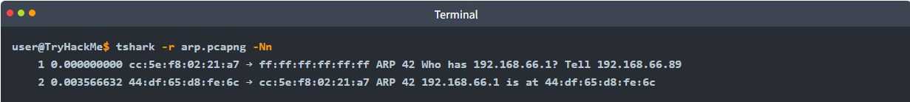
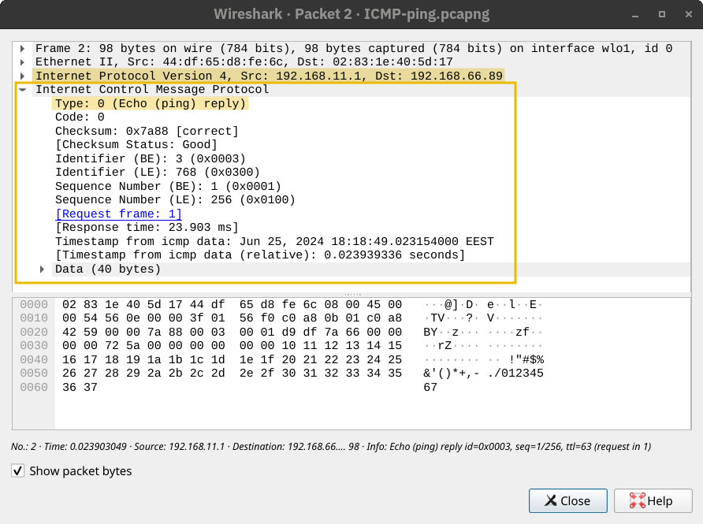
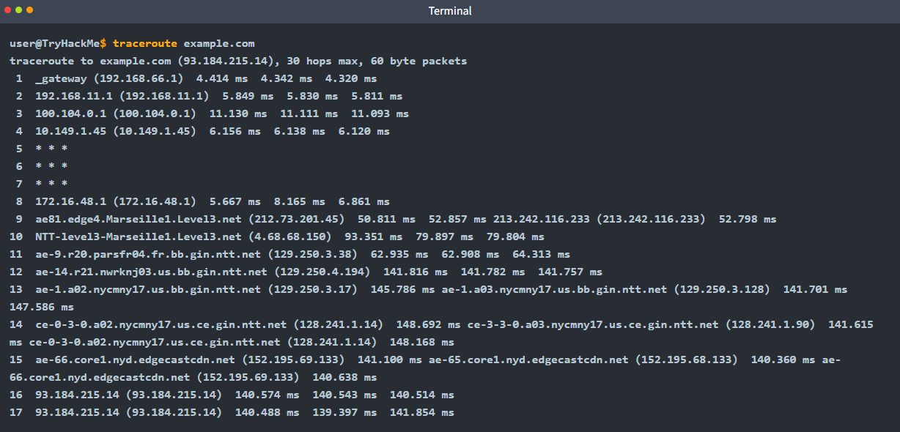

## DHCP

> Attribue conf réseau automatiquement (IP, DNS. Passerelle..) 4 étapes (DORA)

> > 1. **`D`**iscover : Le Client crie "Y a-t-il un serveur DHCP ici ? J'ai besoin d'une IP !".
> > 2. **`O`**ffer : Le Serveur répond "Oui, je te propose l'IP `192.168.1.50`".
> > 3. **`R`**equest : Le Client répond "Ok, je prends la `.50` !".
> > 4. **`A`**cknowledge : Le Serveur conclut "C'est noté, elle est à toi pour 24h (Bail)".

🔸 Fonctionnement

> Série d'interactions entre le client et le serveur, process appelé DORA :

> > > 1. Discover : Quand appareil se connecte au réseau, diffuse un message DHCP Discover pour trouver les serveur DHCP dispo.
> > > 2. Offer : DHCP serveur reçoit le message de Discover et répond avec un message DHCP Offer, proposant un bail d'adresse IP au client.
> > > 3. Request : Client reçoit l'offre et répond avec un message DHCP Request, indiquant qu'il accepte.
> > > 4. DCHPACK (Acknowledge) : DHCP serveur envoie un message DHCPACK, confirmant que le client a bien l'adresse IP assignée avec un bail (pour durée). Le client peut désormais utiliser l'adresse IP pour communiquer sur le réseau.

🔸 L'adresse IP assignée par le serveur DHCP n'est pas permanente, le bail a durée de vie limitée dans le temps.

    
> > > 
    
> > > 
    
> > > - ARP : Protocole permet de trouver adresse MAC d’un autre périphérique sur Ethernet
> > > - ARP joue un rôle crucial permettant de mapper les adresse IP aux adresses MAC, permettant aux appareils de trouver l'adresse MAC associée à une IP connue dans le même réseau.

▫️ MAC utilisées pour fournir des trames de données au bon appareil physique. Lorsqu'un appareil envoie des données, il encapsule les information dans une frame contenant l'adresse MAC de destination. Les switches utilisent ensuite cette adresse pour transférer la trame vers le port approprié.

🔸 Contexte

> > > - Couche 2

▫️ Quand hôte doit communiquer avec un hôte du même réseau Ethernet/Wifi, doit envoyer paquet IP avec frame de la couche liaison de donnée

▫️ Même s’il connait l’IP, il doit chercher la target MAC adresse pour envoyer le bon en-tête de donnée

▫️ Paquet IP avec frame Ethernet, header contient, Destination MAC, Source MAC, Type

        
> > > > 
        
> > > > - Ex :

▫️ Adresse IP .89 souhaite communiquer avec .1

▫️ Envoie requête ARP demandant à l’hôte possédant adresse .1 de rép

▫️ Requête ARP envoyée à adresse MAC du demandeur à adresse MAC de diffusion

▫️ Réponse ARP, hôte avec IP .1 a rép avec sa MAC

        
> > > > 
        
> > > > 
        

🔸 Requête/Réponse ARP n’est pas encapsulée dans paquet UDP ou IP, mais dans trame Ethernet

    
> > > 
    

🔸 Deux ordinateurs, ordinateur A (adresse IP de 192.168.1.2) l'ordinateur B (192.168.1.5), connecté au même commutateur réseau. L'ordinateur A a l'adresse MAC 00

> 1A: 2B: 3C: 4D: 5E, tandis que l'adresse MAC de l'ordinateur B est 00: 1A: 2B: 3C: 4d: 5f. Lorsque l'ordinateur A souhaite envoyer des données à l'ordinateur B, il utilise d'abord le protocole ARP pour découvrir l'adresse MAC de l'ordinateur B associée à son adresse IP. Après avoir obtenu ces informations, l'ordinateur A envoie une trame de données avec l'adresse MAC de destination définie sur 00: 1A: 2B: 3C: 4D: 5F. Le commutateur reçoit cette trame et le transmet au port spécifique où l'ordinateur B est connecté, garantissant que les données atteignent le bon appareil. Ceci est illustré dans le diagramme suivant.

## ICMP

> Dépannage réseaux

    
> > Sert aux équipements à communiquer pour : Remonter des erreurs, transmettre info d’état
    

🔸 Version

> ICMPv4 (IPv4) ou ICMPv6 (IPv6)

🔸 ICMP Requests

> Envoyé pour demander info ou déclencher action.

    
> > > | Request Type | Description |
> > > | --- | --- |
> > > | Echo Request | Teste si équipement joignable. Attendu : Echo Reply. Exemple : `tracert` (Windows) / `traceroute` (Linux) envoient toujours des echo requests. |
> > > | Timestamp Request | Détermine heure sur équipement distant. |
> > > | Address Mask Request | Demande masque sous-réseau équipement. |

🔸 ICMP Messages

> Peut être un request ou reply, supporte aussi messages d’erreur.

    
> > > | Message Type | Description |
> > > | --- | --- |
> > > | Echo reply | Rép à echo request. |
> > > | Destination unreachable | Envoyé quand équipement peut pas délivrer paquet à destination. |
> > > | Redirect | Routeur informe qu’il faut utiliser autre routeur pour envoyer paquets. |
> > > | time exceeded | Envoyé quand paquet met trop longtemps à arriver. |
> > > | Parameter problem | Problème dans l’en-tête d’un paquet. |
> > > | Source quench | Envoyé quand équipement reçoit trop paquets trop vite (utilisé pour ralentir le flux). |

🔸 Ping

> Test connectivité + mesure temps d’aller-retour (RTT). Si réponse nous atteint.

▫️ Envoie requête d’ECHO ICMP (Type ICMP 8)>Extrémité réceptrice réponse ECHO (0)

        
> > > > 
        
> > > > Requête ECHO
        
> > > > 
        
> > > > Réponse ECHO
        

🔸 Traceroute

> Découvre itinéraire de l’hôte vers la cible

> > > - TTL : Indique nombre maximal de routeurs pas lesquels paquet peut transiter avant abandon.
        
> > > 
        

## IP Addresses

> Etiquette numérique attribuée aux appareils connectés à un réseau.

> > - Etiquette numérique attribuée à chaque appareil connectée à un réseau. Couche 3. Permettent aux périphériques de localiser et de communiquer entre eux sur divers réseaux.

▫️ IPv4 constituées d'un espace d'adressage 32 bits, formaté comme quatre nombres décimaux séparés par des points, tels que 192.168.1.1

• Format

> 32 bits (4 octets) en décimal

                
> > > > 
                

▫️ IPv6

> Développé pour prévenir l'épuisement des IPv4, espace d'adressage 128 bits, sont formatés en huit groupes de quatre chiffres hexadécimaux, 2001: 0db8: 85a3: 0000: 0000: 8a2e: 0370: 7334.

• Format

> 128 bits (16 octets) en Hexadécimal

• Types

> > > > - Unicast : Une interface spécifique (1 vers 1)
> > > > - Multicast : Plusieurs interfaces reçoivent le paquet. Remplace Broadcast qui n’existe plus en v6
> > > > - Anycast : Plusieurs interfaces possibles, seule la plus proche répond (Load balancing)
                
> > > > 
                
> > > > - NAT : Translate IP Privée pour IP Publique
    
> > > > Adresses IP pour acheminer données d'un appareil à un autre. IPv4 offre un nombre fin d'adresse IP. Solution à ce problème est le NAT, permet à plusieurs appareils sur un réseau privé de partager une seule adresse IP publique.
    

🔸 IP Publique

> Adresse qui sont un identifiant unique assigné par le FAI. Appareils équipés de ces IP sont accessibles à partir de n'importe où sur internet. Garantissent que les appareils peuvent s'identifier de manière unique sur internet.

🔸 IP Privée

> Désignées pour être utilisées sur les LAN. Ne sont pas routables sur internet. RFC 1918, les gammes d'adresses privées communes IPv4 comprennent 10.0.0.0 à 10.255.255.255, 172.16.0.0 à 172.31.255.255 et 192.168.0.0 à 192.168.255.255. Réseaux privés fonctionnent indépendamment d'internet tout en facilitant la communication interne.

🔸 Fonctionnement

▫️ Réseau domestique avec plusieurs appareils, chacun a une IP privée. Routeur domestique a deux interfaces critiques, interface LAN qui se connecte au réseau privé avec 192.168.1.1, et interface WAN connecté au réseau du FAI avec IP publique 203.0.113.50.

▫️ NAT commence quand appareil envoie demande pour visiter un site Web, request paquet, originaire de l'IP Privée 192.168.1.10, est envoyé au routeur. Fonction NAT du routeur modifie l'IP source dans l'en-tête de paquet de l'IP privé à l'IP publique du routeur, 203.0.113.50. Ce paquet se déplace sur internet pour atteindre serveur web.

▫️ Réception du paquet par le serveur web, renvoie une réponse à l'IP publique du routeur, à mesure que la réponse arrive, la table NAT du routeur garde une trace des mappage IP, identifie que 203.0.113.50

> 4444 correspond à l'ordinateur 192.168.1.10:5555 (les ports sont dynamiques).

▫️ Routeur traduit ensuite l'IP publique à l'IP privée de l'ordi et transmet la réponse en terminant le cycle de communication.

> > > > - *Pasted image 20250928131255.png*

▫️ Types de NAT

• NAT Statique

> Implique cartographie un à un, où chaque IP privée correspond directement à une adresse IP publique

• NAT Dynamique

> Attribue IP publique à partir d'un pool d'adresses dispo à une IP privée au besoin en fonction de la demande

> > > > > - PAT : Forme la plus courante dans les réseaux domestiques. Plusieurs IP privées partagent une seule IP publique, différenciant les connexion en utilisant des numéros de port unique. Méthode largement utilisée, permet à plusieurs appareils de partager une seule adresse IP publique pour l'accès internet.

## Routing

> Déterminer comment transmettre paquet du réseau 1 au réseau

> > - la manière naturelle d'acheminer les paquets vers l'hôte de destination

🔸 Internet composé de millions de routeurs/appareils. Chaque routeur sur chemin doit envoyer paquets via lien approprié. Besoin d’algorithme de routage pour que routeur détermine quel lien utiliser.

▫️ BGP (Border Gateway Protocol)

> Principal proto de routage utilisé sur internet. Permet à différents réseaux (comme ceux FAI) d’échanger info de routage > établir chemins pour transport de données. Garantir que données acheminées efficacement.

▫️ RIP (Routing Information Protocol)

> Protocole simple souvent utilisé dans petits réseaux. Routeurs exécutant RIP partagent info sur réseaux qu’ils peuvent atteindre + nmbr de sauts (routeurs) nécessaires pour y parvenir. Chaque routeur construit table routage, choisi itinéraire avec moins de sauts pour atteindre desti.

▫️ OSPF (Open Shortest Path First)

> Partage info sur topologie du réseau + calcule chemins plus efficaces pour transmi de data. Routeurs échanges MAJ sur état de leurs liens co. Chaque routeur dispose carte complète réseau > Détermine meilleurs itinéraires.

▫️ EIGRP (Enhanced Interior Gateway Routing Protocol)

> Propriétaire Cisco, combien aspects différents algo de routage. Permet aux routeurs partage d’info sur réseaux qu’ils peuvent atteindre + coût (bande passante ou délai) associé à itinéraires. Routeurs utilisent infos pour choisir plus effice.

## VoIP

> Transmettre voix via internet

    
> > Méthode pour transmettre la voix et les communications multimédias via internet.
    
> > Ports VoIP courants 
    

🔸 TCP/5060 et TCP/5061

> utilisés pour SIP

🔸 TCP/1720

> parfois utilisé pour H.323

🔸 SIP est présenté comme plus répandu que H.323.

> > > - SIP : Proto pour initier, maintenir et terminer sessions temps réel

🔸 Protocole de signalisation pour

> Initier, maintenir, modifier et terminer sessions temps réel (vidéo, voix, messagerie…) entre deux (ou plus) endpoints sur internet.

🔸 Fonctionne par requests / methods

    
> > > **Méthodes SIP courantes**
    
> > > | Method | Description |
> > > | --- | --- |
> > > | INVITE | Initie une session / invite un endpoint. |
> > > | ACK | Confirme la réception d’un INVITE. |
> > > | BYE | Termine une session. |
> > > | CANCEL | Annule un INVITE en attente. |
> > > | REGISTER | Enregistre un user agent (UA) auprès d’un serveur SIP. |
> > > | OPTIONS | Demande les capacités d’un serveur SIP ou UA (ex : types de médias supportés). |

🔸 Pemet d’énumérer users existants pour attaques. Dispo users, info sur capacités/services…

    

🔸 Fichier SEPxxxx.cnf

    

🔸 Possible de trouver fichier SEPxxxx.cnf (xxxx = identifiant unique).

🔸 Fichier de conf utilisé par Cisco Unified Communications Manager (ex Cisco CallManager) pour définir paramètres.

🔸 Contient

> Modèle tél, version firmware, paramêtres réseau, autres détails.

