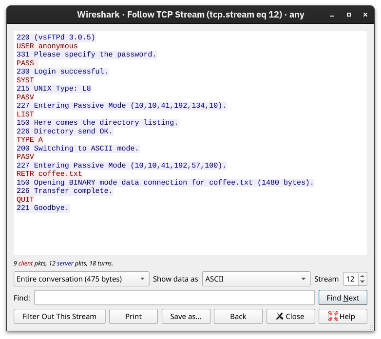
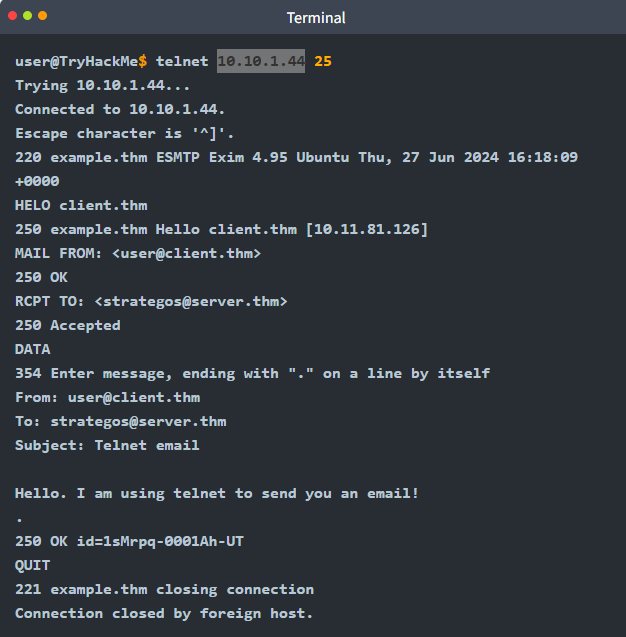
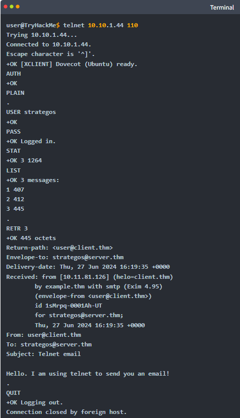
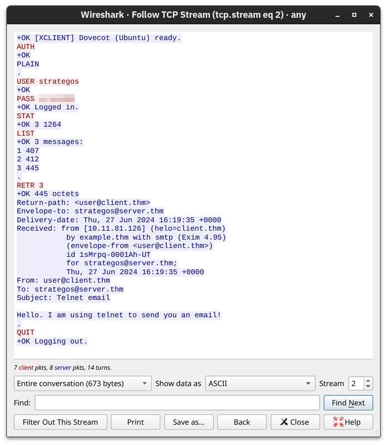
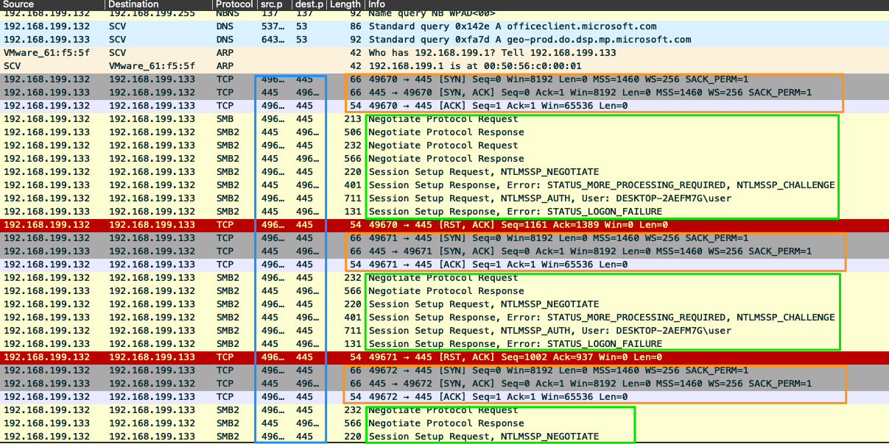

> - DNS : Mappe adresse IP à nom lisible, permet comm des équipements vers internet.
> - Résumé
> 1. **Cache Local :** Ton OS (Windows/Linux) regarde d'abord dans sa poche (son cache DNS ou le fichier `/etc/hosts`). S'il l'a, c'est fini.
> 2. **Le Resolver :** S'il ne l'a pas, il crie à travers le réseau vers le serveur DNS configuré (souvent ta Box ou le 8.8.8.8 de Google).
> 3. **La Récursion :** Si ta Box ne sait pas, elle va demander aux chefs :
<details markdown="1">
<summary>• Aux serveurs **Racines** (.)</summary>

> *"Qui gère .com ?"*

</details>

<details markdown="1">
<summary>• Aux serveurs **TLD** (.com)</summary>

> *"Qui gère banque.com ?"*

</details>

<details markdown="1">
<summary>• Au serveur **Authoritative** (celui de la banque)</summary>

> *"Quelle est l'IP de www ?"*

> > 4. **Réponse :** L'IP revient à ton PC.
        
> > > Note Hacker : C'est ici qu'on fait du DNS Spoofing. Si je suis sur ton réseau local, je peux répondre à ton PC avant le vrai serveur DNS et dire : "L'IP de la banque, c'est MOI (ma machine Kali)".
> > > 
    
> > Le système DNS est comme le répertoire d'Internet, comme une BDD. Il aide à trouver le bon numéro (adresse IP) pour un nom donnée (un domaine tel que [google.com](http://google.com/)). Sans DNS, nous aurions besoin de mémoriser des adresses IP longues et souvent complexes pour chaque site Web que nous visitons. Opère sur la couche 7 Application. Port 53 TCP & UDP.
    
</details>

<details markdown="1">
<summary>🔸 DNS Hierarchy ou hiérarchie de domaine</summary>

> Le DNS est organisé comme un arbre, commence par la racine et se ramifiant en différentes couches :

    
> > | Couche | Description |
> > | --- | --- |
> > | Root Servers | Le haut de la hiérarchie DNS |
> > | TLD | Comme .com, .org, .net, ou country codes .uk, .fr |
> > | Second-level domains | Pour exemple, tryhackme(.com)  |
> > | Sous-domain ou hostname | [admin.tryhackme.com](http://admin.tryhackme.com)  : Permet créer nom plus long et sur des sujets spécifiques. |
    
</details>

<details markdown="1">
<summary>🔸 Résolution DNS</summary>

    
> > | Etape | Description |
> > | --- | --- |
> > | Step 1 | On écrit [www.google.com](http://www.google.com/) dans notre navigateur |
> > | Step 2 | Notre ordinateur va check dans le cache du DNS local pour voir si il connait déjà l'adresse IP |
> > | Step 3 | Si pas trouvé localement, il questionne un serveur DNS récursif, généralement fournit par notre FAI ou un tier comme le service DNS de Google. |
> > | Step 4 | Le serveur DNS récursif va contacter un root serveur (serveur racine) qui va pointer vers le serveur TLD approprié (comme .com) |
> > | Step 5 | TLD serveur va redirige la demande au serveur de nom faisant autorité pour [google.com](http://google.com/) |
> > | Step 6 | Le serveur de nom faisant autorité va répondre avec l'adresse IP de [google.com](http://google.com/) |
> > | Step 7 | Le serveur récursif va retourner l'adresse IP vers l'ordinateur qui peut maintenant se connecter sur le serveur web directement. |
</details>

<details markdown="1">
<summary>🔸 Requête DNS</summary>

> > 1. Lorsque requête nom de domaine, PC va check dans cache local pour voir si adresse déjà visité, si non, requête au serveur récursif DNS.
> > 1. Sur Linux va dans /etc/hosts avant de contacter serveur DNS (qui sont dans /etc/resolv.conf)
> > 2. Serveur récursif DNS généralement fournit par FAI, mais peut être conf manuellement. Ce serveur a un cache local, si adresse trouvée localement, résultat renvoyé à l’ordi et se termine. Sinon, recherche pour trouver réponse avec serveur DNS root d’internet.
> > 3. Serveur DNS root consiste à rediriger vers bon serveur TLD server. Par exemple demande www.tryhackme.com, serveur root reconnaîtra TLD .com et renverra vers bon serveur TLD qui gère les adresses .com
> > 4. Serveur TLD détient enregistrements indiquant où trouver serveur faisant autorité pour répondre à la requête DNS.  Serveur d’autorité aussi connu sous le nom de serveur de nom. Serveur de nom pour tryhackme est kip/ns/cloudflare.com… Multiple serveur de noms pour un nom de domaine utile pour backup.
> > 5. Serveur DNS d’autorité est le serveur responsable de stocker les enregistrements DNS pour des nom de domaine particulier. En fonction du record type, l’enregistrement DNS est retourné au serveur DNS récursif, où une copie local sera placé en cache pour les futures requêtes puis transmis au client original. Enregistrements DNS livrés avec TTL, valeur représenté en seconde, stocké localement jusqu’à qu’elle soit recherchée à nouveau. 
    
</details>

<details markdown="1">
<summary>🔸 DNS Record types</summary>

    
> > | Field | Description |
> > | --- | --- |
> > | A | Résoud IPv4 |
> > | AAAA  | IPv6 |
> > | CNAME  | Résoud un autre nom de domaine. TryHackMe shop a le sous-domaine [store.tryhackme.com](http://store.tryhackme.com) qui retourne un enregistrement CNAME shop.shopify.com. |
> > | MX  | Renvoient adresse des serveurs qui traitent les mails pour le domaine questionné. MX record réponse pour [tryhackme.com](http://tryhackme.com) sera alt1.aspmx.l.google.com.  |
> > | TXT  | Champ de texte libre qui permette de stocker tout type de donnée de texte |
</details>

## WHOIS

> Ajoute information “registrant” lié nom de domain

<details markdown="1">
<summary>🔸 Service/protocole (aujourd’hui souvent via **RDAP**) qui donne des infos d’enregistrement du domaine (registrar, dates, parfois contacts si pas masqués).</summary>

</details>

## HTTP

> Défini communication entre navigateur et web servers

    
> > HyperText Transfert Protocol, protocole qui est utilisé à chaque consultation de page web.
    
<details markdown="1">
<summary>🔸 Requêtes et réponses</summary>

<details markdown="1">
<summary>▫️ URL (Uniform Resource Locator)</summary>

> Instruction pour accéder à une ressource sur internet.

</details>

<details markdown="1">
<summary>▫️ Faire une requête</summary>

<details markdown="1">
<summary>• Possible juste en une ligne GET / HTTP/1.1</summary>

</details>

<details markdown="1">
<summary>• Header HTTP = requête avec données, contient données à donner au serveur web avec qui on communique.</summary>

            
> > > > > ```jsx
> > > > > GET / HTTP/1.1 : Envoie la méthode GET), demande la page and dit au serveur web qu'on utilise protocole et version.
            
> > > > > Host: tryhackme.com 
> > > > > User-Agent: Mozilla/5.0 Firefox/87.0
> > > > > Referer: https://tryhackme.com/
> > > > > ```
            
</details>

</details>

<details markdown="1">
<summary>▫️ Réponse</summary>

            
> > > > ```jsx
> > > > HTTP/1.1 200 OK
            
> > > > Server: nginx/1.15.8
> > > > Date: Fri, 09 Apr 2021 13:34:03 GMT
> > > > Content-Type: text/html
> > > > Content-Length: 98
            
> > > > <html>
> > > > <head>
> > > > <title>TryHackMe</title>
> > > > </head>
> > > > <body>
> > > > Welcome To TryHackMe.com
> > > > </body>
> > > > </html>
> > > > ```
            
</details>

</details>

<details markdown="1">
<summary>🔸 Méthode HTTP</summary>

> Ce que le client demande au serveur d’effectuer

        
        
> > > | **Méthode** | **Description & Usage Analyste** |
> > > | --- | --- |
> > > | **GET** | Demande une ressource (ex: afficher fichier HTML) |
> > > | **HEAD** | Comme GET, mais demande **uniquement les en-têtes**, sans le contenu. *Usage :* Reconnaissance (voir version du serveur) ou vérifier si un lien est mort. |
> > > | **POST** | Envoie des données au serveur (ex: formulaire de connexion, poster tweet). |
> > > | **PUT** | Crée ou met à jour  ressource à une URI précise. *Différence POST :* PUT cible un fichier précis, POST cible le dossier qui le gère. |
> > > | **DELETE** | Supprime la ressource. *Alerte :* Souvent bloqué sur les serveurs publics. Si tu vois ça, c'est suspect. |
> > > | **OPTIONS** | Demande au serveur "Quelles méthodes acceptes-tu ?". *Usage :* Souvent utilisé par les scanners de vulnérabilités. |
> > > | **TRACE** | Le serveur renvoie la requête reçue (Echo). Utile pour le debug, mais risque de faille XSS (Cross-Site Tracing). |
> > > | **CONNECT** | Utilisé pour créer un tunnel (souvent pour le HTTPS via un Proxy). |
</details>

<details markdown="1">
<summary>🔸 HTTP status codes</summary>

<details markdown="1">
<summary>▫️ 200 - 299</summary>

> Success

</details>

<details markdown="1">
<summary>▫️ 300 -399</summary>

> Redirection

</details>

<details markdown="1">
<summary>▫️ 400 - 499</summary>

> Clients errors : Informe client qu’il y a une erreur dans sa requête

<details markdown="1">
<summary>• 403 (Forbidden) = Problème d'Autorisation</summary>

> Intéressant car indique que ressource existe même s’il faut des droits spécifiques

</details>

</details>

<details markdown="1">
<summary>▫️ 500 - 599</summary>

> Servers errors :

</details>

</details>

<details markdown="1">
<summary>🔸 Headers</summary>

<details markdown="1">
<summary>▫️ Eléments de données additionnels envoyés au serveur web pour faire des requêtes</summary>

</details>

<details markdown="1">
<summary>▫️ En-têtes de requêtes courantes</summary>

<details markdown="1">
<summary>• Host</summary>

> Certains serveurs web hébergent de multiples sites web. Donc en précisant host headers permet de recevoir celui choisi sinon page par défaut.

</details>

<details markdown="1">
<summary>• User-agent</summary>

> Notre moteur de recherche et version number, indique au web server pour avoir le bon format et bons éléments HTML, JavaScript et CSS valables que sur certains navigateurs.

</details>

<details markdown="1">
<summary>• Content-Length</summary>

> Taille de contenue permet de s’assurer qu’il n’y pas de perte de données

</details>

<details markdown="1">
<summary>• Cookie</summary>

> Donnée envoyée au server pour aider à la mémorisation de nos informations.

</details>

</details>

<details markdown="1">
<summary>▫️ En-têtes de réponses courantes</summary>

<details markdown="1">
<summary>• Set-cookie</summary>

> Informations stockées qui sont renvoyés au serveur web à chaque requêtes/

</details>

<details markdown="1">
<summary>• Cache-control</summary>

> Combien de temps faut il stocker le contenu avant de devoir faire à nouveau la requête.

</details>

<details markdown="1">
<summary>• Content-type</summary>

> Dit au client quels types de données est retournées, HTML, PDF…

</details>

</details>

</details>

<details markdown="1">
<summary>🔸 Cookie</summary>

<details markdown="1">
<summary>▫️ Petite pièce de donnée qui est stocké dans l’ordinateur. Save quand reçoit une en-tête Set-cookie d’un server web. À chaque nouvelle requête, renvoit données du cookie au serveur web. Les cookies peuvent être utilisés pour rappeler au serveur web votre identité, certains paramètres personnels du site web ou si vous avez déjà visité le site.</summary>

</details>

</details>

## Ports / Socket

> Permet d’identifier le processus d’initiation. IP:Port

<details markdown="1">
<summary>🔸 Nombre attribué à des processus ou des services spécifiques sur un réseau pour aider les appareils à trier correctement et à diriger correctement le trafic réseau. Couche 4 et fonctionne avec protocoles TCP et UDP. Facilitent le fonctionnement simultané de plusieurs services réseau sur une seule adresse IP en différenciant le trafic destiné à différentes appli.</summary>

</details>

<details markdown="1">
<summary>🔸 Création</summary>

> Lorsque app client initie connexion, il spécifie le numéro de port de destination correspondant au service souhaité.

> > > - **0-1023 - Port connus** : Réservés aux services et protocoles communs et universellement reconnus, comme standardise et géré par l'Internet Assigned Numbers Authority (IANA).
<details markdown="1">
<summary>▫️ HTTP = 80, HTTPS = 443, SSH = 22, DNS = 53.</summary>

</details>

</details>

<details markdown="1">
<summary>🔸 1024-49151 - Port enregistré</summary>

> Pas aussi strictement réglementés que les ports connu mais toujours enregistrés et affectés à des services spécifiques, pour des applications, par l'IANA. Couramment utilisés pour les services externes.

> > > - Ex : Services de BDD, tels que Microsoft SQL Server, port 1433.
> > > - Sociétés de logiciels enregistrent fréquemment un port pour leurs app pour s'assurer que leur logiciel utilise systématiquement le même port sur n'importe quel système.
</details>

<details markdown="1">
<summary>🔸 49152 - 65535 - Ports dynamiques / privés</summary>

> Généralement utilisés par les app clients pour envoyer / recevoir des données de serveurs. Peuvent être sélectionnés au hasard par l'OS du client selon besoin pour chaque session. Port fermés une fois l'interaction terminée.

</details>

<details markdown="1">
<summary>🔸 Socket</summary>

> Combinaison IP:PORT (ex: 192.168.1.10:443)

> > > - FTP : Transférer des fichiers (20 / 21)
</details>

<details markdown="1">
<summary>🔸 Basé sur un modèle client-serveur, qui utilise deux canaux de communication entre le client et le serveur. FTPS version qui ajoute du TLS.</summary>

</details>

<details markdown="1">
<summary>🔸 Control connection</summary>

> client FTP envoie une requête de connexion au serveur FTP sur le port FTP (21). > Data connection, après l’authentification, la connexion est utilisée pour envoyer de la donnée

</details>

<details markdown="1">
<summary>🔸 Type de connexions</summary>

<details markdown="1">
<summary>▫️ Active mode</summary>

> 1 : Le client FTP se connecte au serveur FTP via le port TCP 21 pour établir une connexion de commande > 2 : Le serveur FTP se connecte au client FTP via le port TCP 20 pour établir une connexion de données. Pas viable si FW.

</details>

<details markdown="1">
<summary>▫️ Passive mode</summary>

> Client envoie la commande PASV au serveur via le canal de commande, le serveur lui attribue un port aléatoire, dès réception du port, le client établit une connexion à ce numéro afin que le serveur puisse initier le transfert de données vers le client

    
</details>

</details>

<details markdown="1">
<summary>🔸 Manipulations :</summary>

    
</details>

<details markdown="1">
<summary>🔸 Commandes</summary>

> ftp xx.xx.xx.xx

<details markdown="1">
<summary>▫️ USER</summary>

> Mettre username

</details>

<details markdown="1">
<summary>▫️ PASS</summary>

> MDP

</details>

<details markdown="1">
<summary>▫️ RETR</summary>

> DL fichier from FTP server to the client

</details>

<details markdown="1">
<summary>▫️ STOR</summary>

> Upload from the client to the FTP server

</details>

</details>

<details markdown="1">
<summary>🔸 Connexion au serveur > Connexion en tant qu’anonymous > no password > ls (lister fichiers) > type ascii > get coffee.txt pour récup file</summary>

    
> > > 
    
</details>

<details markdown="1">
<summary>🔸 Wireshark examiner échange</summary>

<details markdown="1">
<summary>▫️ Client message red > Servers responses blue</summary>

    
> > > > 
    
</details>

</details>

## SMTP

> Envoyer mail. Défini communication client mail > mail server & mail server vers autre

<details markdown="1">
<summary>🔸 Utilisé pour transférer email d’un client SMTP vers un serveur SMTP. Pas confondre avec POP3 qui télécharge email d’un serveur vers un client. SMTPS couche SSL/TLS.</summary>

</details>

<details markdown="1">
<summary>🔸 2 modèles</summary>

<details markdown="1">
<summary>▫️ SMTP End-to-End</summary>

> Modèle utilisé entre organisations. Le côté expéditeur initie une connexion SMTP au serveur SMTP destinataire

</details>

<details markdown="1">
<summary>▫️ SMTP Store-and-Forward</summary>

> Dans une orga. Serveur SMTP va garder une copie dans lui-même jusqu’à ce que la copie soit transmise au destinataire.

</details>

</details>

<details markdown="1">
<summary>🔸 Composants SMTP</summary>

<details markdown="1">
<summary>▫️ Mail User Agent (MUA)</summary>

> Client mail, qui envoi mail. MUA se connecte Mail Submission Agent (MSA) pour envoyer mail

> > > > - MSA : Reçoit le mail, check si pas d’erreur avant transfert au Mail Transfer Agent (MTA) serveur
</details>

<details markdown="1">
<summary>▫️ MTA va envoyer le mail au MTA du destinataire. MTA peut aussi faire office de MSA.</summary>

</details>

<details markdown="1">
<summary>▫️ Setup classique devrait avoir MTA serveur fonctionne aussi en tant que MDA</summary>

</details>

<details markdown="1">
<summary>▫️ Le destinataire récupérera ses e-mails auprès du MDA via son client de messagerie.</summary>

> > > > - MTA : Va transférer le mail de l’UA au destinataire via internet
        
</details>

<details markdown="1">
<summary>▫️ Workflow :</summary>

        
> > > > - EHLO client.thm
</details>

</details>

<details markdown="1">
<summary>🔸 MAIL FROM</summary>

> Adresse émettrice

</details>

<details markdown="1">
<summary>🔸 RCPT TO</summary>

> Adresse de réception

</details>

<details markdown="1">
<summary>🔸 DATA</summary>

> Indique que client va commencer à envoyer contenu

> > > - . : Indique fin
    
> > > 
    
> > > - Wireshark
    
> > > 
    
</details>

## POP3

> Recevoir email. Permet comm du client vers mail server et récup mail

<details markdown="1">
<summary>🔸 POP3 récupère mail d'un agent de distribution de courrier (MDA) vers un agent utilisateur de courrier (MUA).</summary>

</details>

<details markdown="1">
<summary>🔸 Port 110. Minimise espace de stockage serveur (/=/ IMAP)</summary>

</details>

<details markdown="1">
<summary>🔸 Composant et fonctionnement</summary>

<details markdown="1">
<summary>▫️ Client mail établit la connexion vers le serveur mail > Le client mail télécharge les mails en file d’attente du serveur > Tous mails save sur l’appareil qui a initié la connexion > Le serveur mail supprime tous les copies du mails.</summary>

</details>

</details>

<details markdown="1">
<summary>🔸 Limitation</summary>

> Mail stocké localement, téléchargé sur l’appareil log puis les supprime. Transmission en clear text.

    
</details>

<details markdown="1">
<summary>🔸 Workflow :</summary>

    
</details>

<details markdown="1">
<summary>🔸 Commandes</summary>

<details markdown="1">
<summary>▫️ USER <username>identifie l'utilisateur</summary>

</details>

<details markdown="1">
<summary>▫️ PASS <password>fournit le mot de passe de l'utilisateur</summary>

</details>

<details markdown="1">
<summary>▫️ STAT demande le nombre de messages et la taille totale</summary>

</details>

<details markdown="1">
<summary>▫️ LIST répertorie tous les messages et leurs tailles</summary>

</details>

<details markdown="1">
<summary>▫️ RETR <message_number>récupère le message spécifié</summary>

</details>

<details markdown="1">
<summary>▫️ DELE <message_number>marque un message pour suppression</summary>

</details>

<details markdown="1">
<summary>▫️ QUIT termine la session POP3 en appliquant les modifications, telles que les suppressions</summary>

            
> > > > 
            
> > > > - Wireshark
            
> > > > 
            
</details>

</details>

## IMAP

> Synchro mails pour plusieurs appareils

> > - Protocole de réception de mail. Les protocoles standardisent les processus techniques permettant aux ordinateurs et aux serveurs de se connecter entre eux, qu'ils utilisent ou non le même matériel ou logiciel.
> > - Plus sophistiqué que le POP3, IMAP permet de garder les mails synchronisés entre les appareils. Si mail ouvert sur téléphone, synchro sur le client du PC.
<details markdown="1">
<summary>🔸 Synchronise msg lus, déplacés ou supp.</summary>

    
</details>

<details markdown="1">
<summary>🔸 Workflow :</summary>

    
</details>

<details markdown="1">
<summary>🔸 Commandes</summary>

<details markdown="1">
<summary>▫️ LOGIN <username> <password>authentifie l'utilisateur</summary>

</details>

<details markdown="1">
<summary>▫️ SELECT <mailbox>sélectionne le dossier de boîte aux lettres avec lequel travailler</summary>

</details>

<details markdown="1">
<summary>▫️ FETCH <mail_number> <data_item_name>Exemple fetch 3 body[]pour récupérer le message numéro 3, l'en-tête et le corps.</summary>

</details>

<details markdown="1">
<summary>▫️ MOVE <sequence_set> <mailbox>déplace les messages spécifiés vers une autre boîte aux lettres</summary>

</details>

<details markdown="1">
<summary>▫️ COPY <sequence_set> <data_item_name>copie les messages spécifiés dans une autre boîte aux lettres</summary>

</details>

<details markdown="1">
<summary>▫️ LOGOUT se déconnecte</summary>

        
> > > > 
        
> > > > - Wireshark
        
> > > > 
        
> > > > - SMB : Partage de fichiers, d’imprimantes et authent (445)
    
> > > > Protocole environnement Windows.
    
</details>

</details>

<details markdown="1">
<summary>🔸 Ports</summary>

> 445 / 139

        
> > > 
        

</details>
