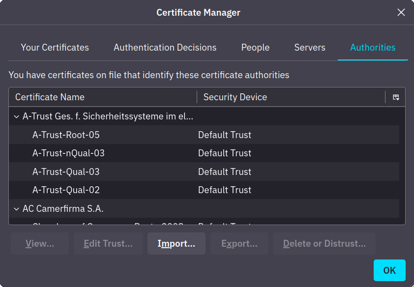

> - TLS : Connexion sécurisée entre client et serveur sur réseau non sec

🔸 Première étape pour serv/client qui a besoin de s’identifier.

🔸 Avoir certificat TLS signé.

▫️ Admin créé Certificat Signing Request (CSR) > soumet Certificate Authority (CA)

▫️ CA vérifie CSR puis émet certificat numérique.

▫️ Une fois Certificat (signé) reçu, p-ê utilisé pour identifier serv/client auprès d’autres personnes, peuvent confirmer validité de signature.

▫️ Pour hôte confirmer validité, certificat de l’autorité besoin d’être installé sur hôte.

▫️ Autorité “trust” installé sur navigateur

        
> > > 
        

🔸 Généralement payer taxe pour avoir certificat signé, sinon Let’s Encrypt

🔸 Créer certif autosigné, cependant, peut pas prouver authenticité server car n’a pas de third party pour confirmer

## HTTPS

> Chiffre trafic

> > - **Négociation (Client Hello / Server Hello) :** Ils se mettent d'accord sur la version de TLS (1.2 ou 1.3) et les algorithmes de chiffrement à utiliser.
> > - **L'Authentification (Asymétrique) :** Le serveur envoie son **Certificat** (sa Carte d'Identité). Ton navigateur vérifie la signature (comme le Secure Boot vérifie le Kernel). *"Ok, tu es bien la banque"*.
> > - **L'Échange de Clés (Key Exchange) :**

▫️ Ton PC génère une "clé de session" (temporaire).

▫️ Il la chiffre avec la **Clé Publique** du serveur et l'envoie.

▫️ Seul le serveur (qui a la **Clé Privée**) peut la déchiffrer.

> > > - **Le passage en Symétrique :** Maintenant, les deux ont la même clé secrète ("clé de session"). Ils abandonnent la crypto asymétrique (trop lente) et utilisent cette clé unique pour chiffrer tout le reste de la conversation à très haute vitesse (AES).
    
> > > HTTPS est une modification de HTTP qui utilise TLS ou SSL.
    
> > > 1. Client et serveur échangent  messages **hello** pour convenir des paramètres de connexion.
> > > 2. Client et serveur échangent les paramètres crypto pour établir un **premaster secret**.
> > > 3. Client et serveur échangent des **certificats X.509** et des informations cryptographiques permettant l’**authentification** au sein de la session.
> > > 4. À partir du premaster secret et des valeurs aléatoires échangées, ils génèrent un **master secret**.
> > > 5. Le client et le serveur appliquent les **paramètres de sécurité négociés** à la couche **record** du protocole TLS.
> > > 6. Le client et le serveur **vérifient** que leur pair a calculé les mêmes paramètres de sécurité et que le **handshake** s’est déroulé sans altération par un attaquant.

🔸 Utilisation courante cryptographie asymétrique consiste échanger clés pour un chiffrement symétrique.

▫️ Mécanisme d’échange de clés

            

• Le Problème

            
> > > > > Tu es "Alice" (le Navigateur). Tu veux envoyer un message secret à "Bob" (le Serveur de la Banque).
> > > > > Mais vous êtes dans une pièce remplie d'espions (Internet/Hackers) qui voient tout ce qui passe de main en main.
            
> > > > > Tu ne peux pas crier le code secret à travers la pièce, sinon les espions l'auront aussi.
            

• La Solution : L'Échange Hybride

> L'Échange Hybride

            
> > > > > Voici exactement ce qui se passe lors de l'échange de clés (étape 3 du schéma précédent), décomposé au ralenti.
            

• 1. La préparation (Côté Serveur)

            
> > > > > Bob (la Banque) possède deux objets mathématiques liés entre eux :
            

• Une **Clé Publique** 🔓 (Imagine un cadenas ouvert). Il en a des millions d'exemplaires et les distribue à tout le monde. N'importe qui peut le fermer (clic !), mais personne ne peut le rouvrir.

• Une **Clé Privée** 🗝️ (La petite clé en métal). Il est le **seul** au monde à l'avoir. Elle sert à rouvrir les cadenas.

            

• 2. L'envoi du Cadenas (Server Hello)

            
> > > > > Tu te connectes à la banque.
> > > > > La banque te dit : *"Coucou ! Pour me parler en sécurité, voici mon **Cadenas Ouvert** (Clé Publique)."*
> > > > > Les espions voient passer le cadenas. Ils s'en fichent, un cadenas ouvert ne permet pas de déchiffrer quoi que ce soit.
            

• 3. La création du Secret (Côté Client)

            
> > > > > Ton navigateur (Toi) va générer le secret final.
> > > > > Il crée une chaîne de caractères aléatoire (ex: `X9sP2m...`). On appelle ça le **Secret Pré-Maître**.
> > > > > C'est ça, la future **Clé Symétrique**. C'est le code qui servira à chiffrer toute la conversation.
            
> > > > > Pour l'instant, ce secret est juste dans ta tête (ta RAM). Personne ne l'a vu.
            

• 4. L'Emballage (L'Asymétrique entre en jeu)

            
> > > > > Tu prends ce secret, tu le mets dans une petite boîte, et **tu le verrouilles avec le Cadenas Ouvert de la Banque**. 📦🔒
> > > > > *Clac !* C'est verrouillé.
            
> > > > > À partir de cette seconde précise :
            

• Même toi, tu ne peux plus rouvrir la boîte (tu n'as pas la clé en métal).

• Les espions voient passer une boîte verrouillée. Impossible de l'ouvrir sans la clé privée.

            

• 5. La Livraison et l'Ouverture

            
> > > > > Tu envoies la boîte verrouillée à la Banque.
> > > > > La Banque la reçoit. Elle sort sa **Clé Privée** (qu'elle n'a jamais envoyée sur le réseau !), elle ouvre la boîte, et elle récupère le secret `X9sP2m...`.
            

• 6. Le Changement de mode (Passage au Symétrique)

            
> > > > > Maintenant :
            

• Tu as le code `X9sP2m...` (tu l'as créé).

• La Banque a le code `X9sP2m...` (elle l'a reçu dans la boîte blindée).

• Les espions n'ont rien (ils ont juste vu un cadenas ouvert et une boîte fermée).

            
> > > > > Puisque vous avez le même code, vous jetez les cadenas et vous commencez à utiliser ce code pour tout chiffrer très vite (AES).
            
> > > > > ---
            

• Résumé en une phrase

            
> > > > > La cryptographie **Asymétrique** (Lente/Complexe) sert uniquement de **camion blindé** 🚛 pour transporter la **Clé Symétrique** (Rapide/Légère) 🏎️ de chez toi vers le serveur. Une fois le camion arrivé, on sort la voiture de course.
            

▫️ Le but est d’utiliser **l’asymétrique au début**, juste pour **échanger une clé symétrique**, puis **faire tout le reste en symétrique** (comme HTTPS).

> > > > - **La métaphore du cadenas (excellente) :**
> > > > 1. Tu veux envoyer une **clé secrète** à ton ami (le serveur)
> > > > 2. Tu n’as **pas envie que quelqu’un puisse l’intercepter**
> > > > 3. Ton ami t’envoie **un cadenas (sa clé publique)**
> > > > 4. Tu mets la clé secrète dans une **boîte verrouillée avec son cadenas** (tu chiffres avec sa clé publique)
> > > > 5. Tu envoies la boîte → **seul ton ami peut l’ouvrir avec sa clé privée**
> > > > 6. Maintenant que vous avez tous les deux la **même clé**, vous pouvez **parler en secret avec un chiffrement symétrique**

▫️ Dans le monde réel

> HTTPS

• Quand tu te connectes à un site en HTTPS

> > > > > 1. Le **navigateur récupère le certificat** (qui contient la clé publique du serveur)
> > > > > 2. Il **génère une clé symétrique aléatoire**
> > > > > 3. Il chiffre cette clé avec la **clé publique du serveur**
> > > > > 4. Le serveur la reçoit, la déchiffre avec sa **clé privée**
> > > > > 5. Les deux côtés ont maintenant la **même clé symétrique**, utilisée pour chiffrer tout le reste de la communication

▫️ Certificats garantissent que la clé pub appartient bien au bon domaine.

🔸 HTTP

> Trafic en clair

▫️ Tout trafic est envoyé en clair.

▫️ Navigateur demande page HTTP

• Etablit TCP three-way handshake avec serveur

• Communique en utilisant protocol HTTP comme GET /HTTP/1.1

> > > > > - Wireshark
> > > > > - 1 : 3 packets handshaker
> > > > > - 2 : HTTP communication
> > > > > - 3 : TCP connection terminaison
            
> > > > > 
            
> > > > > - HTTP over TLS

▫️ Demander page HTTPS

• Etablir TCP three-way handshake vers serv

• Etablir TLS session

• Communicate using HTTP protocol, ex

> GET /HTTP/1.1

> > > > > - Wireshark
> > > > > - 1 : TCP session
> > > > > - 2 : Packets négociants TLS protocol
> > > > > - 3 : HTTP application data sont échangés (écrit Application Data car ne sait pas si c’est HTTP ou autre proto)
                    
> > > > > 
                    

• Si tentative suivre stream, trafic sera chiffré donc illisible

            
> > > > > 
            

🔸 Getting the Encryption Key

▫️ Add TLS to HTTP, chiffre et rend illisible

▫️ Si on possède clé privé, on peut voir content

## SMTPS, POP3S, IMAPS

> Ajoute TLS

🔸 Comme pour HTTPS, ajoute TLS, même principe

> > > - SSH : Sécurise authentification
> > > - ssh username@hostname / Port 22

🔸 Secure authentification

> En plus couple login mdp. Supporte public key & 2FA

🔸 Confidentialité

> OpenSSH end-to-end encryption, protège eavesdropping & MITM, notifie nouvelle clé de serveur

🔸 Intégrité

> Crypto garantit

🔸 Tunneling

> Peut créer “tunnel” à l’image d’un VPN-like

## OpenPGP

> Standard pour signature/chiffrement mail.

🔸 Norme / Standard ouvert pour la signature et le chiffrement de fichiers et de mail. GnuGPG implémentation open-source.

🔸 Utilisé pour mail, besoin de générer une paire de clés, clé privée et clé publique.

▫️ La clé privée de l’émetteur est utilisée pour signer pendant que la clé publique du destinataire est utilisée pour le chiffrement.

▫️ Du point de vue du destinataire, la clé publique de l’émetteur est utilisée pour check la signature, pendant que la clé privée du destinataire est utilisée pour le déchiffrement.

## SFTP

> SSH & FTPS : TLS

🔸 SFTP

> SSH File Transfer Protocol : Sécurise transfert de fichier

🔸 FTPS

> File Transfer Protocol Secure : Utilise TLS, comme HTTPS

▫️ Port 990, requière certificat

