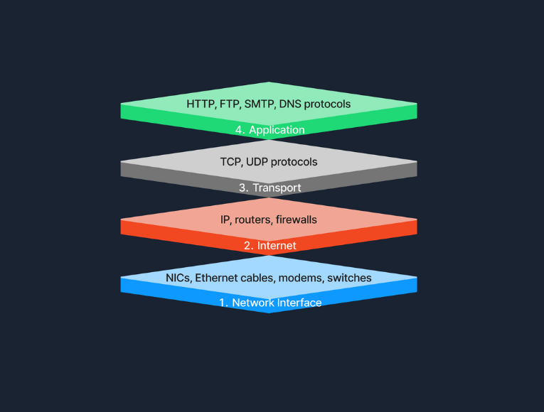

## 2.1 Pourquoi des couches

Les couches séparent les responsabilités : chacune rend un service à la couche du dessus et masque sa complexité. On peut changer de support physique (câble → Wi-Fi) sans toucher à HTTP, ou remplacer une application sans modifier le routage.

## 2.2 Le modèle OSI (7 couches)

Le modèle **OSI** est une référence conceptuelle : il décrit en théorie ce qui se passe à chaque étape d'une communication.

| Couche | Rôle | Protocoles / équipements | PDU | Exemple concret |
|---|---|---|---|---|
| **7 — Application** | Services réseau offerts aux applications | HTTP, FTP, DNS, SMTP, POP3, IMAP | Données | Le navigateur génère `GET / HTTP/1.1` |
| **6 — Présentation** | Codage, compression, chiffrement : rendre les données compréhensibles | ASCII, Unicode, MIME, JPEG, TLS | Données | Conversion du format, chiffrement TLS si HTTPS |
| **5 — Session** | Établir, maintenir, synchroniser et clore les échanges | RPC, NFS, NetBIOS, SOCKS | Données | Ouverture et reprise d'une session |
| **4 — Transport** | Communication de bout en bout entre applications, segmentation, fiabilité | TCP, UDP | Segment (TCP) / datagramme (UDP) | En-tête TCP : port source 54321, port destination 443, numéros de séquence |
| **3 — Réseau** | Adressage logique et routage entre réseaux | IP, ICMP, IPsec ; routeur, switch L3 | Paquet | En-tête IP : IP source, IP destination, TTL, protocole = 6 |
| **2 — Liaison** | Transfert entre nœuds voisins d'un même segment | Ethernet (802.3), Wi-Fi (802.11) ; switch, carte réseau | Trame | En-tête Ethernet : MAC source et destination, EtherType ; FCS en fin de trame |
| **1 — Physique** | Transmission des bits sur le support | Câbles, fibre, ondes ; hub | Bit | Signaux électriques, lumineux ou radio |

Quelques précisions utiles :

- la **couche 2** travaille sur un **segment** : un groupe d'appareils qui partagent le même support (un switch, un VLAN). Chaque trame porte deux adresses MAC, destination et source :

- la **couche 3** relie des réseaux distincts : c'est elle qui permet à une entreprise d'interconnecter ses bureaux répartis dans plusieurs villes ;
- la **couche 4** distingue les applications d'une même machine grâce aux **ports**.

**Moyen mnémotechnique** (de 1 à 7) : *Pour Le Réseau, Tout Se Passe Automatiquement* — Physique, Liaison, Réseau, Transport, Session, Présentation, Application.

## 2.3 Le modèle TCP/IP (4 couches)

Le modèle **TCP/IP** décrit ce qui est réellement implémenté. Il fusionne certaines couches OSI :

| Couche TCP/IP | Équivalent OSI | Rôle | Protocoles |
|---|---|---|---|
| **Accès réseau** (*Link*) | 1 + 2 | Accès au support, trames locales | Ethernet, Wi-Fi, ARP |
| **Internet** | 3 | Adressage IP, routage | IP, ICMP |
| **Transport** | 4 | Livraison de bout en bout, ports | TCP, UDP |
| **Application** | 5 + 6 + 7 | Services aux utilisateurs | HTTP, DNS, SMTP, FTP, SSH |

**En pratique** : un navigateur demande une page en HTTP (application) ; TCP garantit que les données arrivent complètes et dans l'ordre (transport) ; IP achemine les paquets jusqu'au serveur (internet) ; Ethernet ou le Wi-Fi les transmet physiquement (accès réseau).

## 2.4 Le champ « protocole » d'IP

L'en-tête IP indique quel protocole il transporte. Les valeurs à connaître :

| Numéro | Protocole |
|---|---|
| 1 | ICMP (ping) |
| 6 | TCP |
| 17 | UDP |
| 50 | ESP (IPsec) |

---
