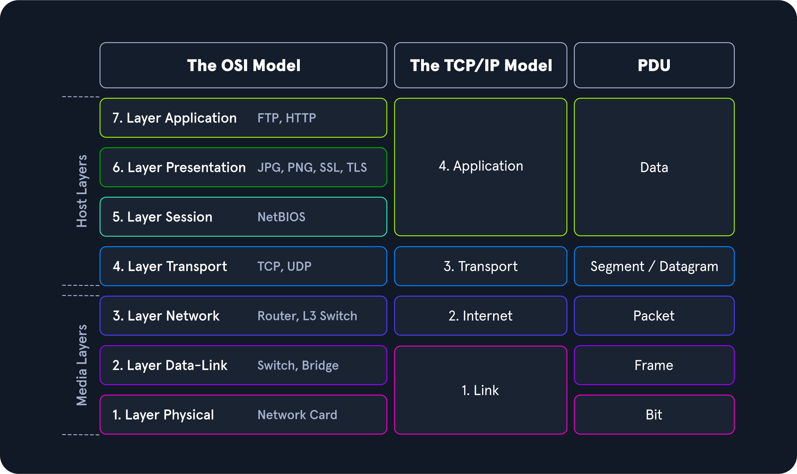

## 3.1 Le principe

À l'émission, chaque couche ajoute son **en-tête** (et parfois un **trailer** en fin) autour des données reçues de la couche du dessus, puis transmet le tout à la couche du dessous : c'est l'**encapsulation**. À la réception, chaque couche lit et retire son en-tête : c'est la **décapsulation**.

| Terme | Définition |
|---|---|
| **Header** (en-tête) | Informations de contrôle ajoutées par une couche (adresses, ports, numéros…) |
| **Trailer** | Informations ajoutées en fin d'unité (ex. le FCS d'Ethernet) |
| **Payload** (charge utile) | Ce que la couche transporte : pour Ethernet, un paquet IP ; pour IP, un segment TCP ou UDP ; pour TCP, les données applicatives (HTTP, SMB, DNS…) |
| **PDU** (*Protocol Data Unit*) | Nom de l'unité de données à une couche donnée : données, segment/datagramme, paquet, trame, bits |

La même encapsulation vue dans Wireshark, couche par couche :

## 3.2 L'encapsulation pas à pas (envoi d'une requête HTTPS)

| Couche | Ce qui est ajouté | Résultat |
|---|---|---|
| **7-5 Application** | La requête : `GET / HTTP/1.1\r\nHost: example.com\r\n\r\n` (chiffrée par TLS en HTTPS) | Données |
| **4 Transport** | En-tête TCP (20 à 60 octets) : port source éphémère (54321), port destination (443), numéro de séquence, numéro d'acquittement, flags, fenêtre, checksum, options (MSS…) | `[TCP │ données]` = segment |
| **3 Réseau** | En-tête IP : version, longueur, identification et fragmentation, **TTL**, protocole (6 = TCP), checksum de l'en-tête, IP source (192.168.1.10), IP destination (93.184.216.34) | `[IP │ TCP │ données]` = paquet |
| **2 Liaison** | En-tête Ethernet (14 octets) : MAC destination (celle de la **passerelle** si la destination est hors du réseau local, obtenue par ARP), MAC source, EtherType (0x0800 IPv4, 0x0806 ARP, 0x86DD IPv6) ; trailer FCS (CRC-32, 4 octets) | `[Ethernet │ IP │ TCP │ données │ FCS]` = trame |
| **1 Physique** | Conversion en signaux électriques, lumineux ou radio | Bits |

**À la réception**, le chemin est inversé :

1. **Couche 1** : réception des bits, reconstruction de la trame.
2. **Couche 2** : vérification du FCS (trame rejetée si erreur), lecture de la MAC destination (traitée si elle correspond, ignorée sinon), retrait de l'en-tête Ethernet.
3. **Couche 3** : vérification du checksum IP, lecture de l'IP destination (traitée ou routée), retrait de l'en-tête IP.
4. **Couche 4** : vérification du checksum TCP, lecture du port destination (identifie l'application), gestion des acquittements, retrait de l'en-tête TCP.
5. **Couches 5-7** : remise des données à l'application (le navigateur affiche la page).

## 3.3 L'adressage à chaque couche

| Couche | Adresse | Taille | Portée |
|---|---|---|---|
| 2 | **MAC** | 48 bits, gravée sur la carte | Le segment local : non routée |
| 3 | **IP** | 32 bits (IPv4) / 128 bits (IPv6) | Globale : routée entre réseaux |
| 4 | **Port** | 16 bits (0-65535) | Identifie l'application sur la machine |

Une même IP peut ainsi héberger simultanément un serveur web (80/443), SSH (22) et DNS (53) : c'est le **multiplexage** par les ports. Point clé : **la MAC change à chaque saut** (chaque routeur réécrit l'en-tête Ethernet), **l'IP reste la même de bout en bout** (sauf NAT).

## 3.4 Les champs à connaître

**TTL (*Time To Live*).** Nombre maximal de routeurs qu'un paquet peut traverser. Chaque routeur le décrémente de 1 ; à 0, le paquet est détruit et un message ICMP *Time Exceeded* est renvoyé à l'émetteur. Cela empêche un paquet de tourner indéfiniment, et c'est ce qu'exploite `traceroute` (Ch.9).

| Système | TTL initial habituel |
|---|---|
| Linux, macOS | 64 |
| Windows | 128 |
| Équipements réseau (Cisco) | 255 |

> **Estimer la distance.** Un `ping` qui revient avec `ttl=117` vient très probablement d'un système Windows (TTL initial 128), situé à environ 128 − 117 = **11 routeurs** sur le chemin du retour. Un TTL initial de 64 est impossible : on ne peut pas recevoir une valeur supérieure.

**MTU, MSS et fragmentation.**

| Notion | Définition |
|---|---|
| **MTU** (*Maximum Transmission Unit*) | Taille maximale d'un paquet IP qu'un lien transporte sans fragmentation : 1 500 octets sur Ethernet |
| **MSS** (*Maximum Segment Size*) | Taille maximale des données d'un segment TCP : MTU − en-têtes IP et TCP (1 500 − 20 − 20 = 1 460) |
| **Fragmentation** | Un paquet plus grand que le MTU d'un lien est découpé ; les fragments partagent le même identifiant, avec des *offsets* différents, et ne sont réassemblés qu'à destination |
| **Flag DF** (*Don't Fragment*) | Interdit la fragmentation : un routeur qui ne peut pas faire passer le paquet le détruit et renvoie ICMP *Fragmentation Needed* |
| **PMTUD** (*Path MTU Discovery*) | Découvrir le plus petit MTU du chemin : en IPv4, envoi de paquets avec DF et ajustement selon les messages ICMP ; en IPv6 (pas de fragmentation par les routeurs), envoi de paquets de plus en plus petits |

**Checksums.**

| Contrôle | Couvre |
|---|---|
| Checksum IP | L'en-tête IP seulement |
| Checksum TCP / UDP | En-tête et données |
| FCS Ethernet | Toute la trame |

Une unité dont le contrôle est faux est **détruite sans notification**.

**Le coût des en-têtes (*overhead*).** Pour 1 460 octets de données HTTP, on envoie 1 518 octets sur Ethernet : Ethernet (14) + IP (20) + TCP (20) + FCS (4) = 58 octets d'en-têtes. Les **jumbo frames** (jusqu'à 9 000 octets) réduisent ce coût, à condition que tout le chemin les supporte.

---
