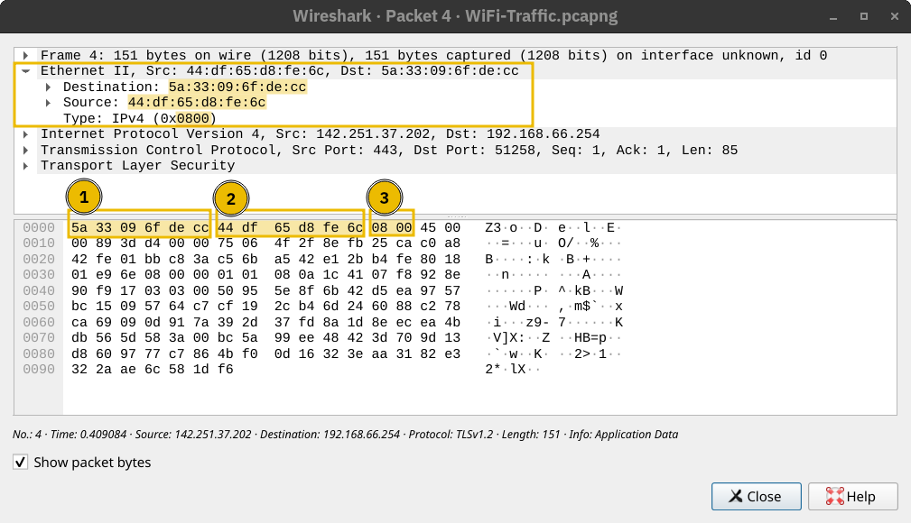
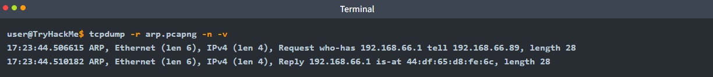
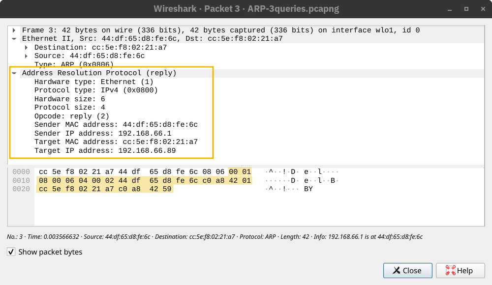

## 8.1 ARP : trouver la MAC d'une IP

Pour envoyer une trame sur le réseau local, il faut l'**adresse MAC** du destinataire (ou de la passerelle). **ARP** (*Address Resolution Protocol*) la trouve à partir de l'IP :

```text
1. 192.168.1.89 veut joindre 192.168.1.1 et consulte son cache ARP : absent.
2. Requête ARP en broadcast (MAC ff:ff:ff:ff:ff:ff) : « Qui a 192.168.1.1 ? Répondez à 192.168.1.89. »
3. Seule la machine qui possède 192.168.1.1 répond, en unicast : « 192.168.1.1 est à 00:14:22:01:23:45. »
4. L'émetteur met la correspondance en cache et envoie sa trame.
```







ARP n'est **pas** transporté dans IP ni UDP : il voyage directement dans une trame Ethernet (EtherType `0x0806`).



| Table | Associe | Tenue par |
|---|---|---|
| **Table ARP** | IP ↔ MAC | Chaque hôte (`arp -a`, `ip neigh`) |
| **Table CAM** | MAC ↔ port physique | Le switch |
| **Table de routage** | Réseau de destination ↔ passerelle et interface | Hôtes et routeurs (`ip route`, `route print`) |

> ARP ne vérifie rien : n'importe quelle machine peut répondre. Une fausse réponse (ARP spoofing) permet de détourner le trafic d'un segment ; d'où l'intérêt des protections de type *Dynamic ARP Inspection* sur les switchs et de la segmentation.

## 8.2 La table de routage et la passerelle

La **table de routage** indique, pour chaque destination, par où envoyer le paquet : réseau et masque, passerelle (*next hop*), interface de sortie, métrique.

```text
$ ip route show
default via 192.168.1.1 dev eth0                                  ← route par défaut
192.168.1.0/24 dev eth0 proto kernel scope link src 192.168.1.10  ← réseau local, en direct
```


La **passerelle par défaut** est le routeur à qui l'on confie tout ce qui n'est pas local. La route la plus précise (masque le plus long) l'emporte toujours.

## 8.3 Ce qui se passe quand la destination n'est pas locale

Le poste `192.168.1.10/24` veut joindre `8.8.8.8` :

1. **Calcul du masque** : `8.8.8.8 ET 255.255.255.0 = 8.8.8.0`, différent de `192.168.1.0` → destination distante.
2. **Table de routage** : aucune route précise ne correspond → route par défaut, passerelle `192.168.1.1`.
3. **ARP pour la passerelle** : le poste cherche la MAC de `192.168.1.1` dans son cache, ou la demande en broadcast.
4. **Encapsulation** : trame avec MAC source = poste, **MAC destination = passerelle** ; paquet avec IP source = poste, **IP destination = 8.8.8.8**.
5. **Le routeur** reçoit la trame, la décapsule, lit l'IP de destination, consulte sa propre table, fait ARP vers le saut suivant et **réencapsule avec de nouvelles adresses MAC**. Chaque routeur répète l'opération jusqu'à la destination.

> **Réponse d'entretien.** « Le système calcule IP destination ET masque pour savoir si la destination est locale. Si elle ne l'est pas, il consulte sa table de routage et trouve la passerelle par défaut, obtient sa MAC par ARP, puis encapsule le paquet — IP de destination finale — dans une trame adressée à la MAC de la passerelle. Chaque routeur décapsule, consulte sa table et réencapsule avec les MAC du saut suivant. »

## 8.4 Les protocoles de routage

Les routeurs construisent leur table soit à la main (routes **statiques**), soit en échangeant des informations (routage **dynamique**) :

| Protocole | Type | Principe | Usage |
|---|---|---|---|
| **RIP** | Vecteur de distance | Partage les réseaux joignables et le nombre de sauts ; choisit le moins de sauts | Petits réseaux, historique |
| **OSPF** | État de liens | Chaque routeur a une carte complète du réseau et calcule le plus court chemin | Réseaux d'entreprise |
| **EIGRP** | Hybride (Cisco) | Coût basé sur la bande passante et le délai | Réseaux Cisco |
| **BGP** | Vecteur de chemin, entre systèmes autonomes | Échange de routes entre opérateurs et grands réseaux | Le routage d'Internet |

---
